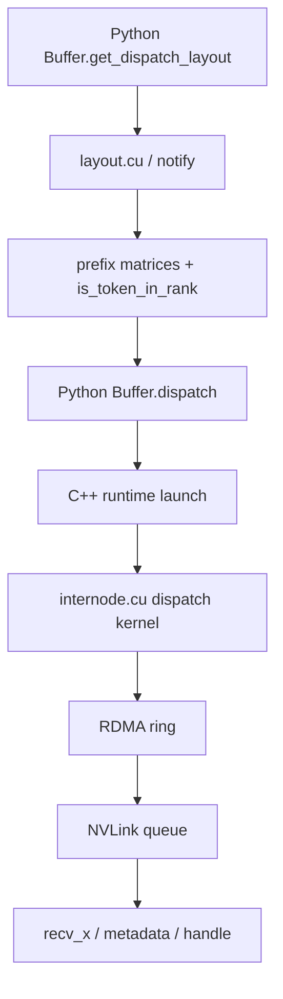
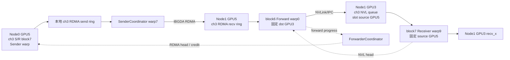

# DeepEP V1 通信机制全景深度解析（碎片恢复整合版）

> 本文根据 `碎片文档.txt` 中残留的 Markdown 片段、问答、代码摘录和后续纠错记录恢复，并以当前工作区 DeepEP V1（Legacy）源码重新核对。
>
> 核对版本：commit `f99f06868616c6fa96f83ff1caa5f0231f9ee3bc`。
>
> 重点覆盖：V1 normal（非 low-latency）的 channel、SM/block、warp、lane/thread 分工，跨节点 RDMA→NVLink 两级转发，四 meta、环形队列与 credit；同时完整补充 V1 low-latency、NVSHMEM、IBGDA、Python API、流程图和可改造 demo。

---

## 0. 恢复说明、阅读方法与重要纠正

### 0.1 这不是简单重写

碎片文档里保留下来的不是一篇完整文章，而是原文的多轮编辑轨迹：

- 原章节号和段落，例如“3.5 四 meta”“3.5.3 与配图上半部分的对应关系”；
- 逐行代码解释；
- `recv_buffer(2) + 5`、channel 3 藏在哪里等具体追问；
- 20 SM、10 channel、72 字节 meta 的数字示例；
- 后续对早期错误的纠正，例如整个 RDMA buffer 都来自对称堆；
- 原文常用的“关键澄清”“★”“一句话总结”和 ASCII 图。

本文尽量保留这种风格，但把分散片段按完整通信链重排。凡是碎片前后矛盾的地方，以当前源码为准。

### 0.2 本文中的三个标记

| 标记 | 含义 |
|---|---|
| **[碎片恢复]** | 内容和例子来自碎片文档原有段落 |
| **[源码补全]** | 碎片中缺失，但可由当前 V1 源码直接确认 |
| **[关键纠正]** | 旧片段中的说法后来被推翻，或需要更严谨地表述 |

### 0.3 最重要的六个纠正

1. **IBGDA 不等于 low-latency。** V1 normal 跨节点 kernel 也直接调用 IBGDA API；normal/LL 是两套上层协议。
2. **源码变量 `sm_id` 实际取自 `blockIdx.x`。** “20 SM”是通常的一 block 驻留一 SM 的资源模型，不是 CUDA 提供了固定物理 SM 编号。
3. **normal dispatch 是偶数 block Forward，奇数 block Sender+Receiver。** combine 另有一套角色和相反的奇偶映射，不可混用。
4. **SEND/RECV 之间的“0 SM”只描述网络在飞期间没有常驻通信 kernel。** SEND 和 RECV phase 本身仍运行 CUDA kernel、占用 SM。
5. **72 字节 meta 是一次逻辑 RDMA put 的长度，不应笼统称为“72 字节原子到达”。** 可见性和顺序要按 WQE、QP、fence、tail 发布协议理解。
6. **send/recv 不是同一物理地址。** 它们是每个 PE 对称堆中相同布局的不同逻辑分区；远端 put 由“远端 PE + 对称地址/偏移 + rkey”定位到远端物理显存。

### 0.4 推荐阅读路线

如果你是新手，建议按下面顺序：

```text
第 1～3 章：先懂 MoE、两级拓扑、normal 与 LL
        ↓
第 4～10 章：重点理解 normal 的 channel、SM、warp、lane、meta 和完整案例
        ↓
第 11 章：再看 combine 为什么不是 dispatch 简单倒放
        ↓
第 12～13 章：理解 low-latency 与 IBGDA/NVSHMEM
        ↓
第 14～17 章：API、demo、调试和 FAQ
```

---

## 1. DeepEP 到底在解决什么问题

### 1.1 MoE 中的 Dispatch 与 Combine

设每张 GPU 上有一批 token：

```text
x          : [num_tokens, hidden]
topk_idx   : [num_tokens, num_topk]
topk_weight: [num_tokens, num_topk]
```

门控网络为每个 token 选择若干 expert。expert 分布在不同 GPU，甚至不同节点，因此需要两次 all-to-all 风格的数据重排：

```text
原 token 所在 GPU
    │
    ├── Dispatch：按 top-k expert 把 token 发到 expert 所在 GPU
    │
    ▼
各 GPU 的 local experts 做 grouped GEMM
    │
    ├── Combine：把 expert 输出送回 token 原始 GPU并按权重规约
    │
    ▼
原 token 顺序的输出
```

Dispatch 不是简单复制一次。一个 token 如果 top-k expert 位于多个 rank，逻辑上会有多个目的地；但 DeepEP 会尽量让跨节点 payload 只发一份，再在目标节点内部 fan-out，从而减少 IB 流量。

### 1.2 V1 有两条不同的通信路径

| 项目 | V1 normal / SM | V1 low-latency |
|---|---|---|
| 主要场景 | 训练、prefill、大 token 批量 | decode、小批量、追求端到端时延 |
| 跨节点拓扑 | RDMA 到同号 GPU，再 NVLink 转发 | 所有可见 rank 间直接 RDMA |
| buffer | 动态 prefix + 有界 ring queue | 固定 expert-major 容量 + ping-pong |
| 通信 kernel | 常驻一段时间，显式占 `num_sms` | SEND 与 RECV 可拆开，中间让网络后台飞 |
| normal 五种 warp 角色 | 有 | 没有 |
| `return_recv_hook` | 无 | 有 |
| 代价 | 协议复杂，但吞吐高、显存更节省 | 固定预留更耗显存，适合小消息低时延 |

> **一句话总结**：normal 追求“让很多 token 持续流过多条 channel”；LL 追求“尽快 issue，释放计算资源，稍后再 receive”。

### 1.3 “用了 IBGDA”为什么不代表 LL

normal 的 SenderCoordinator、head/tail 更新也会调用：

```cpp
nvshmemi_ibgda_put_nbi_warp(...);
nvshmemi_ibgda_amo_nonfetch_add(...);
```

这只说明底层传输由 GPU 直接构造 RDMA WQE。normal 仍然有：

- channel；
- RDMA ring buffer；
- Forwarder；
- NVLink queue；
- Coordinator；
- 四 meta；
- 持续轮询和 credit。

LL 则是 [`internode_ll.cu`](csrc/kernels/legacy/internode_ll.cu) 中另一套固定布局协议。

---

## 2. 代码地图：从 Python 到 CUDA kernel

| 层次 | 文件 | 重点 |
|---|---|---|
| Python V1 API | [`deep_ep/buffers/legacy.py`](deep_ep/buffers/legacy.py) | `Buffer`、layout、dispatch、combine、LL API |
| normal 跨节点 | [`csrc/kernels/legacy/internode.cu`](csrc/kernels/legacy/internode.cu) | 五种 dispatch warp 角色、combine、ring queue |
| normal 单节点 | [`csrc/kernels/legacy/intranode.cu`](csrc/kernels/legacy/intranode.cu) | 纯 NVLink/IPC dispatch 与 combine |
| LL 跨 rank | [`csrc/kernels/legacy/internode_ll.cu`](csrc/kernels/legacy/internode_ll.cu) | 固定布局、SEND/RECV、FP8、LogFMT |
| buffer 布局 | [`csrc/kernels/legacy/buffer.cuh`](csrc/kernels/legacy/buffer.cuh) | `SymBuffer`、`AsymBuffer` |
| IBGDA device | [`csrc/kernels/legacy/ibgda_device.cuh`](csrc/kernels/legacy/ibgda_device.cuh) | lkey/rkey、WQE、doorbell、AMO |
| 通用工具 | [`csrc/kernels/legacy/utils.cuh`](csrc/kernels/legacy/utils.cuh) | `get_channel_task_range` 等 |
| 官方 normal 文档 | [`docs/implementation-v1-sm.md`](docs/implementation-v1-sm.md) | V1 SM 方案说明 |
| 官方 LL 文档 | [`docs/implementation-v1-low-latency.md`](docs/implementation-v1-low-latency.md) | V1 LL 说明 |
| 官方 Legacy 示例 | [`docs/legacy.md`](docs/legacy.md) | 安装、配置、Python 示例 |
| 测试 | [`tests/legacy/test_internode.py`](tests/legacy/test_internode.py) | normal 多节点正确性/性能 |
| LL 测试 | [`tests/legacy/test_low_latency.py`](tests/legacy/test_low_latency.py) | hook、FP8、zero-copy、shrink |

典型 normal 调用链：



---

## 3. Rank 与两级拓扑：先把“同号 GPU 中转”想清楚

### 3.1 normal 中的 rank 分解

V1 normal 的跨节点实现固定按最多 8 个 NVLink peer 建模：

```cpp
rdma_rank = rank / LEGACY_NUM_MAX_NVL_PEERS;
nvl_rank  = rank % LEGACY_NUM_MAX_NVL_PEERS;
```

在“每节点 8 GPU”的常见部署里：

```text
global rank = node_id * 8 + local_gpu_id
rdma_rank   = node_id
nvl_rank    = local_gpu_id
```

例如：

| global rank | node | local GPU / nvl rank |
|---:|---:|---:|
| 5 | 0 | 5 |
| 11 | 1 | 3 |
| 13 | 1 | 5 |

### 3.2 为什么源 GPU5 先到目标节点 GPU5

假设 Node0 GPU5 的 token 要去 Node1 GPU3 的 expert。normal 的跨节点路径不是直接 RDMA 到 GPU3，而是：

```text
Node0 GPU5
   │ RDMA，保持 nvl_rank=5
   ▼
Node1 GPU5      ← 同号 GPU，充当 scale-out/scale-up 边界点
   │ NVLink / IPC
   ▼
Node1 GPU3
```

对应全局 rank：

```text
rank 5 --RDMA--> rank 13 --NVLink--> rank 11
```

这样做的价值：

1. 同一源 token 如果在 Node1 上命中 GPU3、GPU6 两个 expert，跨节点 payload 可只到 Node1 GPU5 一次；
2. 到达后由 `SourceMeta` 位图决定在 Node1 内 fan-out 到 GPU3、GPU6；
3. 每个 GPU 的 NIC/QP 和节点内 NVLink 转发职责稳定映射，便于构造多 channel 流水线。

### 3.3 LL 为什么不需要 Forwarder

LL 要求参与的 rank 都能通过 RDMA 直接可见。它为每个本地 expert、每个来源 rank预留固定槽位，因此可以：

```text
源 rank --IBGDA put--> 目标 expert rank 的固定槽位
```

没有 normal 的“目标节点同号 GPU → 目标 GPU”第二跳，自然也没有 normal 的五种 warp 角色。

---

## 4. NVSHMEM 对称内存、SymBuffer 与 send/recv

### 4.1 “对称”不等于所有 GPU 共用一块物理显存

每个 PE 都有自己的物理显存。对称分配保证的是：

- 每个 PE 按相同顺序分配相同大小的对象；
- 对象在对称堆中的偏移和远端寻址规则一致；
- NVSHMEM/IBGDA 可以由“对称地址 + 目标 PE”推导远端地址和 rkey。

因此更准确的图是：

```text
PE 0 physical HBM                  PE 1 physical HBM
┌────────────────────┐             ┌────────────────────┐
│ symmetric heap     │             │ symmetric heap     │
│ offset X: object A │             │ offset X: object A │
└────────────────────┘             └────────────────────┘
       不同物理内存                    不同物理内存
       相同对称布局                    相同对称布局
```

不要把它理解为 CPU 多进程映射同一页物理共享内存。

### 4.2 `SymBuffer` 怎样划分 channel、send 与 recv

源码核心位于 [`buffer.cuh`](csrc/kernels/legacy/buffer.cuh)：

```cpp
template <typename dtype_t, bool kDecoupled = true>
struct SymBuffer {
    SymBuffer(void*& gbl_ptr,
              int num_elems, int num_ranks,
              int sm_id = 0, int num_sms = 1) {
        num_bytes = num_elems * sizeof(dtype_t);
        int64_t per_channel_bytes = num_bytes * num_ranks;
        total_bytes = per_channel_bytes * num_sms *
                      (static_cast<int>(kDecoupled) + 1);

        send_ptr = static_cast<uint8_t*>(gbl_ptr)
                 + per_channel_bytes * sm_id;
        recv_ptr = static_cast<uint8_t*>(gbl_ptr)
                 + per_channel_bytes * (sm_id + num_sms);
        gbl_ptr = static_cast<uint8_t*>(gbl_ptr) + total_bytes;
    }
};
```

这里参数名仍叫 `sm_id/num_sms`，在 normal dispatch 的调用处传入的其实是 `channel_id/num_channels`。

若 `kDecoupled=true`，整个逻辑布局是：

```text
[ch0 send][ch1 send]...[chC-1 send]
[ch0 recv][ch1 recv]...[chC-1 recv]
```

每个 channel 段内部再按 rank slot 排列：

```text
channel c send: [to rank0][to rank1]...[to rankR-1]
channel c recv: [from rank0][from rank1]...[from rankR-1]
```

### 4.3 channel 3 为什么没出现在 `recv_buffer(2)[5]` 中

**[碎片恢复：原文反复追问的核心问题]**

假设：

- `num_channels = 10`；
- 每个 rank 的 meta slot 为 18 个 `int`，即 72 字节；
- 现在运行的是 channel 3；
- Forwarder 读取来源节点 2、目标 GPU5 的 meta。

构造时已经计算：

```text
per_channel_bytes = 72 * num_rdma_ranks
recv_ptr = base + per_channel_bytes * (3 + 10)
```

之后：

```cpp
rdma_channel_meta.recv_buffer(2) + 5
```

三个维度分别是：

| 维度 | 在哪里体现 | 含义 |
|---|---|---|
| channel 3 | 已烤进 `recv_ptr` | 选择 channel 3 的 recv 大段 |
| `recv_buffer(2)` | 函数参数 | 选择“来自 rdma rank 2”的 72B slot |
| `+ 5` | slot 内偏移 | 选择目标 NVLink rank/GPU5 的 start meta |

> **一句话**：channel 不在最后的数组下标里，因为它早在 `SymBuffer(..., channel_id, num_channels)` 构造时就变成了基指针偏移。

### 4.4 send/recv 为什么要分成两段

同一个节点会同时：

```text
我发给节点 k：本地写 outgoing 数据
节点 k 发给我：远端 put 写 incoming 数据
```

如果只有一段并按 rank k 索引，两种方向可能撞同一槽位。分段后：

```text
我发给 k       → send_buffer(k)
k 发给我       → recv_buffer(k)
```

生产者/消费者关系：

| 区域 | 谁写 | 谁读 |
|---|---|---|
| 本 PE send | 本地 Sender/Coordinator | 本机 NIC 作为 RDMA 源 DMA 读 |
| 本 PE recv | 远端 NIC put | 本地 Forwarder/Receiver |

### 4.5 为什么 send 区也在对称堆

**[关键纠正]** 不是因为远端代码需要直接读本 PE 的 send 区，而是当前 IBGDA fast path 需要为本地源地址取得 lkey。

逻辑链：

```text
send_buffer local address
        │
        ├─ ibgda_get_lkey_and_rkey(laddr, ...)
        │      通过 laddr - heap_base 查注册 key 表
        ▼
WQE data segment = {local address, lkey, byte_count}
        │
        ▼
NIC 使用 lkey DMA 读 GPU 源显存
```

理论上，另行注册的非对称 GPU 内存也可以成为 GPUDirect RDMA 源；但那需要独立的注册和 key 查找路径。DeepEP V1 当前 fast path 直接依赖 NVSHMEM 对称堆的 key 表，因此不能把 `send_buffer` 随意换成普通 `cudaMalloc` 指针。

### 4.6 head/tail 为什么可以 `kDecoupled=false`

`SymBuffer<T, false>` 只有一段 `buffer()`：

```text
tail：发送方发布，接收方读取
head：接收方归还 credit，发送方读取
```

同一个计数器方向固定，不需要同时存 outgoing payload 与 incoming payload，因此无需为 head/tail 再做 send/recv 双份布局。

---

## 5. Normal Dispatch 的 layout：通信之前先算什么

### 5.1 `get_dispatch_layout` 输出

Python API：

```python
num_tokens_per_rank,
num_tokens_per_rdma_rank,
num_tokens_per_expert,
is_token_in_rank,
event = buffer.get_dispatch_layout(topk_idx, num_experts, ...)
```

它回答四类问题：

| 张量 | 回答的问题 |
|---|---|
| `num_tokens_per_rank` | 每个最终 GPU rank 接收多少 token |
| `num_tokens_per_rdma_rank` | 每个目标节点接收多少去重后的 token |
| `num_tokens_per_expert` | 每个 expert 有多少 token |
| `is_token_in_rank[t, r]` | token t 是否命中 rank r 上至少一个 expert |

### 5.2 为什么还需要 prefix matrix

normal 不是先把全部 token 排好再统一发送，而是多 channel、多个来源并行推进。为了让接收端不做全局原子抢位置，需要预先知道每一段在最终输出中的连续区间：

```text
channel prefix：这个 channel 结束时累计有多少
rank prefix   ：前面的来源 rank 累计有多少
```

因此最终位置通常可以由几个 prefix 加局部序号直接计算。

### 5.3 prefix 的层级

可把 normal dispatch 的索引理解为四层：

```text
目标 GPU / expert
  └─ 来源 rdma rank（节点）
      └─ channel
          └─ channel 内序号
```

四 meta 正是把其中关键的起止 prefix 从 Sender 传给 Forwarder。

---

## 6. Channel：一张卡上的不同 channel 到底怎样划 token

### 6.1 channel 数量来自 `num_sms / 2`

dispatch kernel 的关键代码：

```cpp
const auto num_sms = static_cast<int>(gridDim.x);
const auto sm_id = static_cast<int>(blockIdx.x);
const auto num_channels = num_sms / 2;
const auto channel_id = sm_id / 2;
const bool is_forwarder = sm_id % 2 == 0;
```

所以：

```text
num_sms = 20 → num_channels = 10

channel 0 = block 0 + block 1
channel 1 = block 2 + block 3
...
channel 9 = block 18 + block 19
```

★ “20 SM、10 channel”是 DeepSeek-V3 论文和常见 V1 配置中的典型值。代码本质公式是 `C = num_sms / 2`，配置改变时数字也会改变。

### 6.2 token 按连续区间分给 channel

源码 [`utils.cuh`](csrc/kernels/legacy/utils.cuh)：

```cpp
void get_channel_task_range(int num_tokens,
                            int num_channels,
                            int channel_id,
                            int& start,
                            int& end) {
    int per = ceil_div(num_tokens, num_channels);
    start = min(per * channel_id, num_tokens);
    end   = min(start + per, num_tokens);
}
```

设 `T=103`、`C=10`，则 `ceil_div(103,10)=11`：

| channel | token 区间 |
|---:|---|
| 0 | `[0, 11)` |
| 1 | `[11, 22)` |
| 2 | `[22, 33)` |
| … | … |
| 8 | `[88, 99)` |
| 9 | `[99, 103)` |

因此答案是：**一张卡的不同 channel 一般处理不同的本地 token 连续子区间。**

### 6.3 channel 不按目的节点或目的 GPU划分

一个常见误解：

```text
错误：channel 0 专门发 Node0，channel 1 专门发 Node1
错误：channel 3 专门负责 GPU3
```

实际是：

```text
channel c 先取得一段 token index
       │
       └─ 对这段内每个 token，再看它命中哪些目标节点/GPU
```

所以每个 channel 都有完整功能：

- 可以发往所有目标 RDMA rank；
- 可以接收所有来源 RDMA rank；
- 可以转发到 8 个本地 NVL rank；
- 可以从 8 个本地 Forward GPU 的 NVLink queue 接收。

### 6.4 top-k fan-out 不会让一个 token 属于多个 channel

channel 由本地 `token_idx` 决定。一旦 token t 落在 channel 3，它的所有 top-k 路由都由 channel 3 处理：

```text
token 37 → channel 3
  ├─ expert on Node1 GPU3
  ├─ expert on Node1 GPU6
  └─ expert on Node2 GPU2
```

它可以产生多个目的地，但不会因为多个目的地而重新分到 channel 4/5。

### 6.5 channel 内再由 7 个 Sender warp 分片

对常见 `kNumDispatchRDMASenderWarps=7`：

```cpp
if ((token_idx - token_start_idx) % 7 != warp_id)
    continue;
```

即：

```text
channel 内 offset 0,7,14,... → Sender warp 0
channel 内 offset 1,8,15,... → Sender warp 1
...
channel 内 offset 6,13,20,...→ Sender warp 6
```

两层切分：

```text
全部本地 token
  └─ 第一层：按连续区间分给 channel
      └─ 第二层：channel 内按 offset % 7 分给 Sender warp
```

### 6.6 每个节点下每张卡都有很多 channel 吗

是。每个参与 normal kernel 的 GPU 都 launch 自己的 grid，因此每张 GPU 都有 `C` 个逻辑 channel。

但“GPU0 的 channel3”和“GPU5 的 channel3”不是一支共享 CUDA 执行单元，它们是各 GPU 上布局与 QP 编号一致的本地流水线：

```text
Node0 GPU0: ch0..ch9
Node0 GPU1: ch0..ch9
...
Node0 GPU7: ch0..ch9

Node1 GPU0: ch0..ch9
...
Node1 GPU7: ch0..ch9
```

同号 channel 跨边界对应的原因：

- 两端 `SymBuffer` 都用同一个 `channel_id` 算偏移；
- IBGDA put 选择相应 channel/QP；
- Forwarder 把 channel c 的 RDMA 数据写进目标 GPU 的 channel c NVL queue；
- 目标 GPU 的 channel c Receiver 消费。

> **一句话总结**：channel 是端到端的平行流水线编号，不是 token 的目的地编号。

---

## 7. Normal Dispatch：两个 block、五种 warp 角色、lane 分工

### 7.1 先纠正“SM”的叫法

代码：

```cpp
sm_id = blockIdx.x;
```

后文沿用项目语境称“SM0/SM1”，但更精确地应读成“block0/block1；在 launch bounds 与资源占用约束下通常各自驻留一个 SM”。不要把 `sm_id=6` 理解成 CUDA 保证跑在物理编号为 6 的 SM。

### 7.2 每个 channel 的两个 block

| block | 奇偶 | dispatch 职责 |
|---|---|---|
| `2*c` | 偶数 | Forward block：RDMA recv → NVLink forward |
| `2*c+1` | 奇数 | S/R block：本地 RDMA send + NVLink receive |

典型 20 block：

```text
GPU 上的 normal dispatch
├─ ch0: block0 Forward + block1 Sender/Receiver
├─ ch1: block2 Forward + block3 Sender/Receiver
├─ ...
└─ ch9: block18 Forward + block19 Sender/Receiver
```

### 7.3 五种角色总表

dispatch 定义：

```cpp
enum class WarpRole {
    kRDMASender,
    kRDMASenderCoordinator,
    kRDMAAndNVLForwarder,
    kForwarderCoordinator,
    kNVLReceivers
};
```

常见 16 warp/block 映射：

| block | warp | 角色 | 数量 | 主要方向 |
|---|---:|---|---:|---|
| 偶数 Forward | 0～7 | `kRDMAAndNVLForwarder` | 8 | RDMA recv → 某个目标 GPU 的 NVL queue |
| 偶数 Forward | 8 | 有效 `kForwarderCoordinator` | 1 | 汇总 8 个 Forwarder 进度、归还 RDMA credit |
| 偶数 Forward | 9～15 | extra coordinator | 7 | `target_rank > 0`，直接 return |
| 奇数 S/R | 0～6 | `kRDMASender` | 7 | 本地 token → RDMA send ring |
| 奇数 S/R | 7 | `kRDMASenderCoordinator` | 1 | 合并连续完成区间、issue put、发布 tail |
| 奇数 S/R | 8～15 | `kNVLReceivers` | 8 | 消费来自 8 个本地 Forward GPU 的 NVL queue |

### 7.4 Forward warp 怎样对应目标 GPU

源码：

```cpp
target_rank = (warp_id + channel_id) % 8;
```

channel 3 的 Forward block：

| warp | 目标 nvl rank |
|---:|---:|
| 0 | 3 |
| 1 | 4 |
| 2 | 5 |
| 3 | 6 |
| 4 | 7 |
| 5 | 0 |
| 6 | 1 |
| 7 | 2 |

循环移位的作用是让不同 channel 的 warp 编号与目标 GPU 关系打散，减轻完全相同的访问相位。

### 7.5 NVLReceiver warp 怎样对应来源 Forward GPU

奇数 S/R block：

```cpp
source_nvl_rank =
    (warp_id + channel_id - kNumDispatchRDMASenderWarps) % 8;
```

当 channel 3、Sender warp 数为 7：

| warp | 来源 nvl rank |
|---:|---:|
| 8 | 4 |
| 9 | 5 |
| 10 | 6 |
| 11 | 7 |
| 12 | 0 |
| 13 | 1 |
| 14 | 2 |
| 15 | 3 |

因此在 Node1 GPU3 上，channel3 的 warp9 正好负责消费“由 Node1 GPU5 Forward 写来的 queue”。

### 7.6 `kRDMASender` 内的 32 lane 做什么

#### 阶段 A：写 18 个 meta

一个 warp 合作构造目标节点的 18 个 `int`：

```text
lane  0..7  → 8 个目标 GPU 的 channel start prefix
lane  8..15 → 8 个目标 GPU 的 channel end prefix
lane 16     → 本 channel 在该目标节点的 node-level start prefix
lane 17     → 本 channel 在该目标节点的 node-level end prefix
lane 18..31 → 该阶段无 meta 写入
```

每 lane 写一个 `int`，所以无需单线程串行写 18 个字段。

#### 阶段 B：每 lane 代表一个目标 RDMA rank

在 token 循环里，若 `kNumRDMARanks <= 32`：

```text
lane j 加载 token 是否命中目标节点 j 的 8-bit GPU mask
lane j 维护该目标节点的 logical tail
lane j 检查目标节点 j 的 remote head / credit
```

注意：lane 的语义随代码阶段变化。不要把 lane5 永久记成 GPU5；meta 阶段 lane5 是目标 GPU5 的一个字段，payload 阶段 lane5 可能代表目标节点5。

#### 阶段 C：整个 warp 搬一条 token message

确定某个目标节点需要该 token 后，32 lane 协作复制：

```text
hidden
+ FP8 scales（可选）
+ SourceMeta
+ topk_idx
+ topk_weights
```

`SourceMeta`：

```cpp
struct SourceMeta {
    int src_rdma_rank;
    int is_token_in_nvl_rank_bits;
};
```

第二个 `int` 是 8-bit 目标 GPU 位图，使目标节点只接收一份跨节点 payload，再按位图 NVLink fan-out。

### 7.7 `kRDMASenderCoordinator` 内的 lane 分工

warp7 不重新遍历 token payload。它主要：

1. 观察 7 个 Sender warp 的完成窗口；
2. 找到可以连续提交的 tail；
3. lane j 对应目标 RDMA rank j 的控制状态；
4. 合作发起 `nvshmemi_ibgda_put_nbi_warp`；
5. 在 payload 对远端可见的发布协议之后推进远端 tail。

为什么需要 coordinator：如果 7 个 Sender warp 完成顺序是 `0,2,1,4,3`，消费者只能安全看到连续前缀。Coordinator 把乱序完成压缩为单调连续进度。

### 7.8 `kRDMAAndNVLForwarder` 内的 lane 分工

一个 Forward warp 固定一个 `dst_nvl_rank`，例如 channel3 warp0 固定目标 GPU3。

meta 轮询阶段：

```text
lane j → 来源 rdma rank j
```

每个有效 lane j 轮询：

```cpp
meta_0 = recv_buffer(j)[dst_nvl_rank];
meta_1 = recv_buffer(j)[8 + dst_nvl_rank];
meta_2 = recv_buffer(j)[16];
meta_3 = recv_buffer(j)[17];
```

得到：

- 来源节点 j 在本 channel 有多少 token；
- 其中多少要去当前固定目标 GPU；
- 它们写最终输出时的 prefix；
- RDMA queue 应从哪个逻辑位置开始读。

payload 阶段中，warp 用 `SourceMeta` 的目标位判断本 token 是否要转发给当前 GPU；需要时通过 TMA/warp 协作写目标 GPU 的 NVLink queue。

### 7.9 `kForwarderCoordinator` 内的 lane 分工

只有 Forward block warp8 有效；warp9～15 在分支开头直接退出：

```cpp
if (target_rank > 0)
    return;
```

有效 Coordinator：

```text
lane j → 来源 rdma rank j
```

它读取 8 个目标 GPU Forward warp 对来源 j 的消费 head，并取仍活跃消费者中的最小值：

```text
GPU0 forward consumed 100
GPU1 forward consumed 104
GPU2 forward consumed  98
...
安全可归还 head = min(...) = 98
```

为什么必须取最小值：RDMA ring 中同一条源消息可能还要被多个目标 GPU 的 Forward warp检查。只有所有相关消费者都越过该位置，发送端才能复用槽位。

### 7.10 `kNVLReceivers` 内的 lane 分工

一个 NVLReceiver warp 固定一个来源 Forward GPU。它：

1. 从对应 NVL prefix 获取各来源 rdma rank 的起止范围；
2. 轮询该 NVLink queue 的 tail；
3. 32 lane 协作搬 hidden/scales/top-k；
4. 根据 prefix 与局部序号写最终 `recv_x`、`recv_src_meta`；
5. 消费后推进 head，归还 NVLink queue credit。

★ `kNVLReceivers` 读的是 NVLink/IPC queue，不是 RDMA `recv_buffer`。RDMA `recv_buffer` 由偶数 Forward block 消费。

### 7.11 Channel 3 的完整 warp 表

```text
channel 3
├─ block 6（偶数，Forward）
│  ├─ warp0..7 → dst GPU 3,4,5,6,7,0,1,2
│  ├─ warp8    → 有效 ForwarderCoordinator
│  └─ warp9..15→ return
│
└─ block 7（奇数，Sender/Receiver）
   ├─ warp0..6 → 7 个 RDMASender，按 offset%7 分 token
   ├─ warp7    → RDMASenderCoordinator
   └─ warp8..15→ 从 Forward GPU 4,5,6,7,0,1,2,3 接收
```

---

## 8. 四 meta：72 字节“数据目录”的完整生命周期

### 8.1 18-int 布局

`LEGACY_NUM_MAX_NVL_PEERS=8`：

```text
int meta[18] = 72 bytes

meta[0..7]   : 每个目标 GPU 的 channel start prefix
meta[8..15]  : 每个目标 GPU 的 channel end prefix
meta[16]     : 本 channel 对目标节点的 start prefix
meta[17]     : 本 channel 对目标节点的 end prefix
```

对一个固定 Forward warp（固定目标 GPU d），它只取四个值：

```text
meta_0 = meta[d]
meta_1 = meta[8+d]
meta_2 = meta[16]
meta_3 = meta[17]
```

所以“四 meta”不是网络只传 4 个 int，而是 72B 目录中，每个 Forward warp读取与自己有关的四个字段。

### 8.2 为什么编码为 `-value-1`

初始化的 meta 通常是非负/零状态，而发布后的合法 prefix 可能为 0。若直接写 `-value`：

```text
value=0 → encoded=0
```

无法区分“未到”与“合法零”。使用：

```text
encoded = -value - 1
decoded = -encoded - 1
```

则：

```text
0 → -1
1 → -2
100 → -101
```

Forwarder 只要看到四项都 `<0`，就知道目录已发布。

### 8.3 数字例子：来源节点2、channel3、目标 GPU5

假设 prefix：

```text
目标 GPU5：
  channel0 累计结束 40
  channel1 累计结束 70
  channel2 累计结束 100
  channel3 累计结束 130

目标节点整体：
  channel2 累计结束 800
  channel3 累计结束 1000
```

channel3 写入：

```text
meta_0 = -(100)-1  = -101   → GPU5 start
meta_1 = -(130)-1  = -131   → GPU5 end
meta_2 = -(800)-1  = -801   → node start
meta_3 = -(1000)-1 = -1001  → node end
```

Forwarder 解码：

```text
GPU5 应转发数量 = 130 - 100 = 30
本 channel RDMA 消息数 = 1000 - 800 = 200
```

这意味着它需要扫描 200 条到达 Node 的去重消息，其中只把命中 GPU5 位图的 30 条写到 GPU5 NVL queue。

### 8.4 Sender 写、远端 Forwarder 读

发送端远程目标地址使用：

```cpp
rdma_channel_meta.recv_buffer(rdma_rank)
```

这里下标是**发送方自己的 rdma rank**，因为接收端的 recv slot 是“from source rank”。本地源地址使用：

```cpp
rdma_channel_meta.send_buffer(dst_rdma_rank)
```

完整语义：

```text
源节点 S：send_buffer(D) 里准备“发给 D”的 72B
      │
      │ put(remote recv_buffer(S), dst_pe=D的同号GPU)
      ▼
目标节点 D：recv_buffer(S) 里看到“来自 S”的 72B
```

send 下标和 recv 下标不相等也完全正常：一个是“to D”，一个是“from S”。

### 8.5 channel 如何在两端对应

```text
发送端 channel3：
  local src = ch3 send region, slot D
  remote dst= ch3 recv region, slot S
  QP/channel id = 3

接收端 channel3：
  Forward block6 构造 ch3 recv_ptr
  读取 slot S
```

没有显式把数字 3 写进 payload；channel3 由指针偏移、QP 选择和两端 block 映射共同保持。

### 8.6 72B 是否“一次原子到达”

**[关键纠正]** 不能笼统这样保证。

准确说法：

- 上层代码发起一次长度为 72B 的逻辑 `put_nbi_warp`；
- IBGDA 可能根据注册 chunk、WQE 限制等拆分底层工作请求；
- 普通 RDMA write 对任意 72B 不提供“接收 GPU 只可能看到全旧或全新”的通用事务原子性承诺；
- 正确性依赖本实现的写入/发布顺序、QP ordering、system-scope load/store、tail/flag 等协议；
- 不能把“同一 QP 有序”扩展成“任意跨 QP、任意字段天然原子”。

### 8.7 meta 到了是否代表 token 全部到了

不代表。meta 是目录，payload 的实际可消费进度由 ring tail/发布协议决定：

```text
meta ready → 我知道预计范围和地址
tail advance→ 对应 payload 已按协议发布，可开始消费
```

把 meta 当作“数据全部到齐”会绕过 queue 的安全边界。

---

## 9. 完整案例：Node0 GPU5 → Node1 GPU5 → Node1 GPU3

这是理解“边界点 GPU5 的 Forward 怎样和 Node1 各卡 SendReceive SM 交互”的核心案例。

### 9.1 假设

```text
每节点 8 GPU
num_sms=20 → 10 channels
源：Node0 GPU5，global rank 5，rdma rank 0，nvl rank 5
目标 expert：Node1 GPU3，global rank 11，rdma rank 1，nvl rank 3
目标节点边界点：Node1 GPU5，global rank 13
token t 位于源 GPU 本地 channel3 的 token 区间
```

### 9.2 第一步：layout 决定路由与 prefix

`is_token_in_rank[t, rank11]=true`，因此对目标 rdma rank1 的 8-bit mask 中 GPU3 位为 1：

```text
is_token_in_nvl_rank_bits = 00001000b
```

若 token 同时命中 Node1 GPU6，则位图为：

```text
01001000b
```

跨节点 payload 仍只需发到 Node1 一次。

### 9.3 第二步：Node0 GPU5 channel3 的 Sender 写 RDMA ring

channel3 对应 S/R block7。token 在 channel 内的 offset 决定由 warp0～6 哪一个处理。

该 Sender warp：

1. lane1 看到目标节点1的 mask 非零；
2. 等待 Node1 对应 RDMA ring 有 credit；
3. 32 lanes 合作写 message；
4. `SourceMeta.src_rdma_rank=0`；
5. `SourceMeta.bits` 含 GPU3；
6. 标记本 Sender 的完成窗口。

### 9.4 第三步：SenderCoordinator issue RDMA

block7 warp7 观察 7 个 Sender 的连续完成前缀，构造：

```text
local source:
  Node0 GPU5, channel3 send_buffer(dst_rdma_rank=1)

remote destination:
  Node1 GPU5, channel3 recv_buffer(src_rdma_rank=0)

dst PE:
  translate_dst_rdma_rank(dst_node=1, nvl_rank=5)
  → global rank 13
```

注意目标 PE 是 Node1 GPU5，不是最终 expert GPU3。

### 9.5 第四步：Node1 GPU5 channel3 Forward block 接收

Node1 GPU5 的 block6 是 channel3 Forward block。

目标 GPU3 的 Forward warp满足：

```text
(warp_id + channel_id) % 8 = 3
(warp_id + 3) % 8 = 3
warp_id = 0
```

所以 warp0：

- lane0 轮询来源 rdma rank0 的四 meta；
- 观察 RDMA tail；
- 从 channel3 recv data slot0 读消息；
- 检查 `SourceMeta.bits & (1 << 3)`；
- 命中后写 Node1 GPU3 的 channel3 NVLink queue。

### 9.6 第五步：跨 GPU 的 queue 放在哪里

逻辑上：

```text
producer = Node1 GPU5 Forward warp0
consumer = Node1 GPU3 channel3 NVLReceiver warp9
```

物理布局的要点：

- payload、prefix、tail 通常布置在目标/consumer GPU3 可本地读取的位置；
- head 布置在 Forward/producer GPU5 可本地观察的位置；
- 双方通过 IPC 映射后的 `buffer_ptrs[]` 得到对端地址；
- producer release 发布 tail；consumer acquire/volatile 观察 tail；
- consumer 完成后更新 head，producer据此复用 NVL ring 槽位。

这不是 GPU5 block6 与 GPU3 block7 共享 CUDA shared memory。跨 GPU 不可能共享一个 block 的 shared memory，交互介质是 GPU global memory + IPC/NVLink + system-scope 顺序。

### 9.7 第六步：Node1 GPU3 的 Receiver 消费

Node1 GPU3 上同样运行 channel3 S/R block7。

要从来源 Forward GPU5 接收：

```text
(warp_id + 3 - 7) % 8 = 5
warp_id = 9
```

因此 warp9：

1. 读取“source nvl rank5 → local GPU3”的 channel3 prefix；
2. 等待 NVL tail；
3. 合作读取 payload；
4. 用 prefix 和局部序号写最终 `recv_x`；
5. 写 `recv_src_meta` 等 handle 信息；
6. 推进 head，归还 NVL credit。

### 9.8 第七步：credit 沿相反方向回传

```text
GPU3 Receiver 消费
    │ 更新 NVL head
    ▼
GPU5 Forwarder 可复用 NVL queue slot
    │ 更新自身 forward_channel_head
    ▼
GPU5 ForwarderCoordinator 取所有目标 GPU 的安全最小值
    │ 通过 RDMA AMO/控制更新归还 RDMA head
    ▼
Node0 GPU5 Sender 观察到 remote head 前进
    │
    └─ 可复用 RDMA ring slot
```

### 9.9 完整链路图



### 9.10 Node1 GPU5 如何与 Node1 各卡“不同 channel”交互

严格答案：**同 channel 对同 channel，不跨 channel 搬运。**

```text
Node1 GPU5 Forward ch0 → Node1 GPU0..7 的 NVL queue ch0
Node1 GPU5 Forward ch1 → Node1 GPU0..7 的 NVL queue ch1
...
Node1 GPU5 Forward ch9 → Node1 GPU0..7 的 NVL queue ch9
```

目标 GPU3 上：

```text
S/R block1  消费 ch0
S/R block3  消费 ch1
...
S/R block19 消费 ch9
```

所有 channel 最终写同一个逻辑 `recv_x`，但 prefix 为每个来源/channel 划定不重叠区间，因此无需用一个全局原子计数器争抢位置。

> **一句话总结**：Node1 GPU5 不是一个 Forward SM 串行服务所有卡；它在每个 channel 上各有一条 Forward 流水线，每条流水线有 8 个目标 warp，与 Node1 每张目标 GPU 的同号 channel Receiver 一一配对。

---

## 10. Ring Buffer、head/tail 与三种同步边界

### 10.1 逻辑索引与物理槽位

```text
logical tail 单调递增
physical slot = logical_index % capacity
```

生产者写前必须满足：

```text
tail - remote_head < capacity
```

否则会覆盖消费者尚未读完的数据。

### 10.2 tail 表示“数据生产到哪里”

```text
Sender 写 payload
  → 按协议发布/保证可见性
  → SenderCoordinator 推进 RDMA tail
  → Forwarder 才消费
```

### 10.3 head 表示“数据消费到哪里”

```text
Forwarder 消费 RDMA message
  → 8 个 Forward warp报告进度
  → Coordinator 取安全最小 head
  → 归还给远端 Sender
```

### 10.4 Coordinator 不是互相直接发消息

碎片中曾问：`kForwarderCoordinator` 如何通知 `kRDMASenderCoordinator`？

答案不是跨 GPU 函数调用，也不是 shared memory：

```text
tail：发送侧发布 → 接收 Forwarder 读取
head：接收侧归还 → 发送 Sender 读取
```

两端通过对称全局内存中的单调计数器和 IBGDA AMO/put 间接协作。

### 10.5 三种同步边界

| 边界 | 常用机制 | 能同步谁 |
|---|---|---|
| warp 内 | `__syncwarp`、shuffle、ballot | 同一 warp 32 lanes |
| block 内 | named barrier、shared state | 同一 block 内多个 warp |
| block/GPU/节点间 | global memory、system-scope load/store、NVLink、RDMA、head/tail | 跨 block、跨 GPU、跨节点 |

不能用 `__syncthreads()` 同步两个 channel block，更不能同步两张 GPU。

### 10.6 Backpressure 怎样逐级传播

```text
最终 GPU grouped GEMM 尚未直接产生 backpressure
但 Receiver 若消费慢
  → NVL head 不前进
  → Forwarder 的 NVL queue 满
  → Forwarder 无法继续处理 RDMA ring
  → RDMA safe head 不前进
  → 源 Sender 发现 ring 无 credit
  → 源端暂停写入
```

这就是双层有界队列能够自我限流、又可能在协议错误时死锁的原因。

---

## 11. Normal Combine：不要把 Dispatch 的奇偶分工原样倒放

### 11.1 语义上是逆向，kernel 角色不是简单镜像

Combine 要做：

```text
expert 输出所在 GPU
  → 节点内聚合/转发
  → 跨节点 RDMA
  → 原 token GPU
  → 按 topk weight 规约
```

但源码另定义：

```cpp
enum class WarpRole {
    kNVLSender,
    kNVLAndRDMAForwarder,
    kRDMAReceiver,
    kCoordinator
};
```

而且：

```cpp
const bool is_forwarder_sm = sm_id % 2 == 1;
```

即 combine 的 forwarder block 是奇数，与 dispatch 偶数 Forward 不同。

### 11.2 Combine 的 handle 从哪里来

normal dispatch 返回的 handle 包含：

- `is_token_in_rank`；
- RDMA/NVL channel prefix；
- 全局 rank prefix；
- `recv_src_meta`；
- `send_rdma_head`、`send_nvl_head`。

它记录“token 从哪来、经过哪个 queue 位置、最终位于哪里”。Combine 利用它沿层次结构回送并规约，避免重新做一次昂贵路由统计。

### 11.3 为什么可以提前规约

若一个原 token 的多个 expert 输出当前位于同一目标节点，可在节点内先部分相加，再跨 IB 发送较少数据。V1 combine 的角色拆分正是围绕“NVL send → NVL/RDMA forward and accumulate → RDMA receive and accumulate”组织。

### 11.4 Cached mode 的直觉

首次 dispatch 产生的 prefix、src metadata 和 head 信息可用于后续对应 combine，或在路由布局可复用时减少重复工作。使用 cached handle 时必须保证：

- token 数与布局约束匹配；
- handle 生命周期覆盖异步通信；
- 所有 rank 以一致顺序调用；
- 不要把尚未完成的双缓冲/queue 内容提前复用。

---

## 12. V1 Low-Latency：固定布局、SEND/RECV 与 Hook

### 12.1 为什么 LL 不使用 normal channel 协议

decode 每步 token 少。如果仍启动 normal 的：

```text
layout → 多 channel 常驻轮询 → RDMA ring → Forward → NVL ring → Receiver
```

协议固定成本可能大于真正 payload。LL 选择：

```text
按 expert 和来源 rank 预留最大槽位
→ SEND 直接 issue RDMA
→ 网络后台飞
→ RECV 轮询 count/flag 并整理
```

### 12.2 expert-major 固定布局

概念上：

```text
local expert e
  ├─ slots from rank0: max_tokens_per_rank
  ├─ slots from rank1: max_tokens_per_rank
  ├─ ...
  └─ slots from rankR-1: max_tokens_per_rank
```

优点：目标偏移可直接算，无需 normal 的全局 prefix 协议。

代价：真实 token 很少时也要为最大容量预留显存，且 valid count 在 GPU 上异步产生。

### 12.3 ping-pong 双缓冲

LL 只有两套复用 buffer。每次调用切换 parity：

```text
iteration 0 → buffer A
iteration 1 → buffer B
iteration 2 → buffer A（必须保证 iteration0 已不再使用）
```

Python docstring 明确警告：同一时刻不能长期持有超过两次 LL 调用返回的复用张量。

### 12.4 SEND phase 做什么

以 dispatch 为例：

1. 根据 `topk_idx` 判断每个 token 的目标 expert/rank；
2. 计算固定目标 slot；
3. 可选在线 BF16→FP8，并生成 scale；
4. 写/issue RDMA payload；
5. 在 payload 之后发布 count/flag；
6. 若 `return_recv_hook=True`，返回 hook，不启动 RECV phase。

SEND phase 本身有 CUDA kernel，因此会占用 SM。

### 12.5 背景 RDMA 与“0 SM”的准确含义

```text
时间 ───────────────────────────────────────────────>

通信 stream: [SEND kernel issue] ....网络/NIC在飞.... [RECV kernel]
计算 stream:                    [独立 GEMM/attention]

             占 SM             网络飞行间隔可 0 常驻通信 SM   占 SM
```

所以：

- “issue 后释放 SM”是对的；
- “从 API 开始到接收结束整个过程 0 SM”是错的；
- NIC 后台搬运不等于数据已经可以被计算 kernel 使用；
- 必须执行 hook/RECV，并满足 stream/event 同步后才能消费输出。

### 12.6 RECV phase 做什么

Dispatch RECV：

- 等待每个来源/专家的 count 或完成标志；
- 读取有效槽位；
- 形成 `packed_recv_x` 与 `packed_recv_count`；
- 生成 combine 所需 `src_info/layout_range`。

Combine RECV：

- 等待远端 expert 输出；
- 根据 `topk_idx/topk_weights` 找到返回分支；
- BF16/LogFMT 解码；
- 对同一原 token 做加权累加；
- 写 `[num_tokens, hidden]` 的 `combined_x`。

### 12.7 FP8 scale 布局

LL dispatch 的 `use_fp8=True` 返回：

```python
(packed_recv_x_fp8, packed_recv_scales)
```

scale 不是每个元素一个，通常按 hidden channel 分组。阅读 kernel 时必须同时核对：

- hidden 对齐；
- 每个 scale 覆盖的通道数；
- scale token stride；
- `round_scale` 与 `use_ue8m0` 的组合约束。

### 12.8 Combine 的 LogFMT 与 zero-copy

`use_logfmt=True`：内部使用动态 per-64-channel 的 10-bit LogFMT 路径，旨在降低 combine 传输量/转换成本。

`zero_copy=True`：要求 GEMM 结果已直接写入下一次 LL combine 的 RDMA buffer：

```python
rdma_out = buffer.get_next_low_latency_combine_buffer(handle)
# grouped GEMM output 直接写 rdma_out
combined_x, event, hook = buffer.low_latency_combine(
    rdma_out, topk_idx, topk_weights, handle,
    zero_copy=True,
)
```

当前实现不允许 `zero_copy and use_logfmt` 同时启用，因为在线格式转换仍需要独立读写路径。

### 12.9 shrink / rank mask

LL 可以更新 mask，临时跳过某个 rank。用途包括弹性缩容或故障隔离实验，但所有参与 rank 必须对调用顺序和 mask 状态形成一致认识；否则一端等待被屏蔽 rank、另一端不发送，最终会 timeout。

---

## 13. IBGDA 深入：lkey、rkey、WQE、QP 与顺序

### 13.1 IBGDA 做了什么

传统 host-driven RDMA：

```text
GPU kernel → CPU/driver → NIC doorbell
```

IBGDA 目标：

```text
GPU thread/warp 直接准备 WQE
  → 写 queue/doorbell record
  → NIC 读取 GPU memory
  → 执行 RDMA write/atomic
```

减少 CPU 参与和 launch 间隙，适合细粒度 EP 通信。

### 13.2 lkey 与 rkey

| key | 用途 |
|---|---|
| lkey | NIC 读取/写入本地注册内存的权限与映射 |
| rkey | 远端 NIC 访问目标 PE 注册内存的权限与映射 |

RDMA write WQE 的关键字段可以抽象为：

```text
local data segment: {laddr, lkey, bytes}
remote segment    : {raddr, rkey}
```

### 13.3 为什么地址会按 registration chunk 拆

对称堆可能按 granularity 注册成多个 chunk。一次 put 若跨 chunk 边界，需要为每段重新取得 lkey/rkey。因此：

```text
上层一次 put(72B)
≠ 必然只有一个底层 WQE
≠ 任意 72B 事务原子
```

### 13.4 channel 与 QP

normal 中 `channel_id` 既决定 buffer 偏移，也参与 QP 选择。源码断言大意是：

```cpp
num_rc_per_pe == num_channels || num_rc_per_pe >= num_sms
```

这说明部署可能有不同 QP 配置映射。不要把 channel、QP、CUDA stream 混为一谈：

| 名词 | 是什么 |
|---|---|
| channel | 软件数据分片与 ring 流水线 |
| QP | RNIC 的可靠连接发送/接收状态 |
| CUDA stream | kernel launch 与依赖顺序队列 |
| SM/block | GPU 执行资源/工作单元 |

### 13.5 同一 QP ordering 能保证什么

一般可以利用同一 RC QP 上 WQE 的有序执行建立“payload 先、tail 后”的发布关系，但仍需满足具体操作、fence 和可见性要求。不能做三种过度推导：

```text
错误 1：同一 QP 有序 → 72B 任意字段原子可见
错误 2：QP A 与 QP B 之间天然全序
错误 3：NIC 完成 → 任意 GPU cache 立即以任意 load 方式可见
```

DeepEP 配合 system-scope acquire/release/volatile load、barrier 和 head/tail 协议建立消费者可见性。

---

## 14. Normal Python Demo：从 layout 到 combine

下面是教学骨架，API 与当前 V1 `legacy.py` 对齐；实际运行前需按集群配置初始化 NCCL/NVSHMEM、网络接口和进程组。

```python
import torch
import torch.distributed as dist
import deep_ep


def build_normal_buffer(group, hidden: int):
    num_ranks = group.size()
    dispatch_cfg = deep_ep.Buffer.get_dispatch_config(num_ranks)
    combine_cfg = deep_ep.Buffer.get_combine_config(num_ranks)

    # BF16 每元素 2 bytes；如果使用特殊输入布局，应按实际 payload 计算。
    hidden_bytes = hidden * 2

    num_nvl_bytes = max(
        dispatch_cfg.get_nvl_buffer_size_hint(hidden_bytes, num_ranks),
        combine_cfg.get_nvl_buffer_size_hint(hidden_bytes, num_ranks),
    )
    num_rdma_bytes = max(
        dispatch_cfg.get_rdma_buffer_size_hint(hidden_bytes, num_ranks),
        combine_cfg.get_rdma_buffer_size_hint(hidden_bytes, num_ranks),
    )

    return deep_ep.Buffer(
        group,
        num_nvl_bytes=num_nvl_bytes,
        num_rdma_bytes=num_rdma_bytes,
        low_latency_mode=False,
    ), dispatch_cfg, combine_cfg


def normal_moe_step(buffer, dispatch_cfg, combine_cfg,
                    x, topk_idx, topk_weights, num_experts,
                    local_expert_fn):
    # 1. 路由布局：统计 rank/node/expert count，生成 token membership。
    (num_tokens_per_rank,
     num_tokens_per_rdma_rank,
     num_tokens_per_expert,
     is_token_in_rank,
     layout_event) = buffer.get_dispatch_layout(
        topk_idx,
        num_experts,
        async_finish=True,
    )

    # 2. normal dispatch。previous_event 建立 layout → dispatch 依赖。
    (recv_x,
     recv_topk_idx,
     recv_topk_weights,
     num_recv_tokens_per_expert,
     handle,
     dispatch_event) = buffer.dispatch(
        x,
        topk_idx=topk_idx,
        topk_weights=topk_weights,
        num_tokens_per_rank=num_tokens_per_rank,
        num_tokens_per_rdma_rank=num_tokens_per_rdma_rank,
        num_tokens_per_expert=num_tokens_per_expert,
        is_token_in_rank=is_token_in_rank,
        config=dispatch_cfg,
        previous_event=layout_event,
        async_finish=True,
        allocate_on_comm_stream=True,
    )

    # 在计算 stream 真正读 recv_x 前等待 dispatch 完成。
    dispatch_event.current_stream_wait()

    # 3. 每个 local expert 只处理自己的有效区间。
    expert_out = local_expert_fn(
        recv_x,
        num_recv_tokens_per_expert,
    )

    # 4. combine 使用 dispatch handle 沿逆路径返回并规约。
    combined_x, combined_topk_weights, combine_event = buffer.combine(
        expert_out,
        handle,
        topk_weights=recv_topk_weights,
        config=combine_cfg,
        async_finish=True,
    )
    combine_event.current_stream_wait()
    return combined_x
```

### 14.1 demo 中最容易错的地方

1. `get_dispatch_layout` 与 `dispatch` 的所有 rank 调用顺序必须一致；
2. `previous_event` 或显式 stream wait 不能漏；
3. `num_recv_tokens_per_expert` 决定 grouped GEMM 的有效行数；
4. `handle` 不只是一个 token permutation，它含两级 queue/prefix/source 信息；
5. normal 通常直接使用 `Buffer(group, num_nvl_bytes, num_rdma_bytes)` 的初始化路径；QP 数及网络参数仍需按构建和集群环境核对；
6. 不要在通信未完成时覆盖 `x/topk/handle` 的底层存储。

---

## 15. Low-Latency Python Demo：把网络飞行夹在计算之间

```python
import torch
import deep_ep


def build_low_latency_buffer(group,
                             num_max_dispatch_tokens_per_rank: int,
                             hidden: int,
                             num_experts: int):
    # LL 为最大容量固定预留空间；实际 decode batch 通常应远小于训练批量。
    num_rdma_bytes = deep_ep.Buffer.get_low_latency_rdma_size_hint(
        num_max_dispatch_tokens_per_rank,
        hidden,
        group.size(),
        num_experts,
    )

    # 官方建议：为获得最佳性能，每个 rank 的 QP 数等于 local expert 数。
    assert num_experts % group.size() == 0
    num_local_experts = num_experts // group.size()
    return deep_ep.Buffer(
        group,
        num_nvl_bytes=0,
        num_rdma_bytes=num_rdma_bytes,
        low_latency_mode=True,
        num_qps_per_rank=num_local_experts,
    )


def low_latency_step(buffer,
                     x, topk_idx, topk_weights,
                     num_max_dispatch_tokens_per_rank,
                     num_experts,
                     grouped_gemm_fn,
                     independent_compute_fn=None):
    # 1. SEND phase：issue RDMA；返回 hook，暂不做 RECV。
    packed_recv_x, recv_count, handle, issue_event, recv_hook = \
        buffer.low_latency_dispatch(
            x,
            topk_idx,
            num_max_dispatch_tokens_per_rank,
            num_experts,
            use_fp8=True,
            async_finish=False,
            return_recv_hook=True,
        )

    # 2. 网络正在后台飞，可放置与 recv_x 无依赖的计算。
    if independent_compute_fn is not None:
        independent_compute_fn()

    # 3. 启动/执行 RECV phase。返回后 packed_recv_x 才可按同步关系使用。
    recv_hook()

    # packed_recv_x 在 use_fp8=True 时是 (fp8_values, scales)。
    expert_out = grouped_gemm_fn(packed_recv_x, recv_count)

    # 4. Combine 同样只 issue SEND。
    combined_x, combine_issue_event, combine_recv_hook = \
        buffer.low_latency_combine(
            expert_out,
            topk_idx,
            topk_weights,
            handle,
            return_recv_hook=True,
        )

    if independent_compute_fn is not None:
        independent_compute_fn()

    # 5. 真正等待并规约返回数据。
    combine_recv_hook()
    return combined_x
```

### 15.1 双 micro-batch 时间线

```text
MB0: [LL dispatch SEND] .... RDMA .... [dispatch RECV][expert GEMM][combine SEND] .... [combine RECV]
MB1:                    [attention / independent compute]         [下一批独立计算]
```

真正能否重叠取决于依赖：需要 `packed_recv_x` 的 expert GEMM 不能放在 `recv_hook()` 前；只有与本次接收结果无关的工作才能填入网络间隔。

### 15.2 zero-copy combine demo 片段

```python
rdma_out = buffer.get_next_low_latency_combine_buffer(handle)

# grouped GEMM 必须支持 out=，并准确写入约定布局。
grouped_gemm_fn(packed_recv_x, recv_count, out=rdma_out)

combined_x, event, hook = buffer.low_latency_combine(
    rdma_out,
    topk_idx,
    topk_weights,
    handle,
    zero_copy=True,
    return_recv_hook=True,
)

# 可插入独立计算
hook()
```

---

## 16. 调试指南：从 timeout 文案反推坏在哪一层

### 16.1 `dispatch RDMA sender timeout`

关注打印字段：

```text
channel, local rdma/nvl rank, dst RDMA lane, head, tail
```

常见原因：

- 远端 Forwarder 未消费；
- ForwarderCoordinator 未归还 head；
- 某个目标 GPU 的 NVL Receiver 卡住，backpressure 反传；
- 两端 channel/QP 数不一致；
- 某 rank 调用顺序不一致；
- 上次异步 handle/buffer 尚未完成就复用。

### 16.2 `dispatch forwarder timeout (RDMA meta)`

关注：

```text
channel, src RDMA lane, dst NVL, meta_0..3
```

若某些 meta 已负、某些仍非负：

- 不要立即认定网络“撕裂”；
- 检查 Sender 的 meta 构造 lane 是否都执行；
- 检查源/目标 channel 指针与 src rank slot；
- 检查 QP/WQE 完成和注册 chunk；
- 检查清理/复用时机。

### 16.3 Forwarder NVL timeout

表示 RDMA 数据可能已到，但目标 GPU 的 NVL queue 没 credit：

- 目标 Receiver warp映射是否正确；
- 目标 GPU kernel 是否已 launch；
- `buffer_ptrs` IPC 映射是否有效；
- NVL tail/head 的 system-scope 可见性；
- 某个来源/目标 prefix 是否错误导致等待不存在的 token。

### 16.4 LL count/flag timeout

优先核对：

- 所有 rank 的 SEND/RECV phase 顺序；
- `num_max_dispatch_tokens_per_rank` 是否一致；
- QP depth 是否满足 `(max_tokens + 1) * 2`；
- rank mask 是否一致；
- ping-pong buffer 是否被第三个未完成调用覆盖；
- hook 是否真的被调用。

### 16.5 有结果但数值错

按以下顺序排查：

```text
topk_idx / -1 mask
→ prefix 与 recv_count
→ SourceMeta bits
→ FP8 scale stride/格式
→ combine topk_weights
→ async stream 生命周期
→ zero-copy 输出布局
```

---

## 17. 新手 FAQ：碎片文档里反复出现的问题

### Q1：每个 channel 是发不同 token 吗？

通常是。先按连续 token index 区间分 channel，再在 channel 内按 offset `% 7` 分 Sender warp。但同一 token 的多个 top-k 目的地仍留在同一个 channel。

### Q2：每张 GPU 都有很多 channel，它们功能不同吗？

不是“功能专用”。每个 channel 都有完整 Sender、Forward、Receiver 能力；不同之处主要是负责不同 token 区间、不同 buffer/QP 流水线。

### Q3：一个 channel 对应一个 SM 吗？

normal dispatch 中一个 channel 对应两个 block：偶数 Forward + 奇数 Sender/Receiver。典型驻留模型可理解为两个通信 SM。

### Q4：S/R block 是先 send 再 receive 吗？

不是整个 block 分时切换。warp0～7 做发送侧，warp8～15 同时做 NVLink 接收侧，这是 warp specialization。

### Q5：Forward block 的 8 个 warp 分别接收 8 个来源节点吗？

不是。每个 Forward warp固定一个目标本地 GPU；warp 内 lane再分别处理来源 rdma rank。

### Q6：NVLReceiver 的 8 个 warp 分别对应什么？

分别对应 8 个来源 Forward GPU/nvl rank。

### Q7：Node1 GPU5 Forward 如何通知 Node1 GPU3 Receiver？

通过 GPU3 上的 NVLink/IPC global-memory queue 写 payload/prefix/tail；不是 shared memory，也不是直接函数通知。

### Q8：GPU3 Receiver 怎样通知 GPU5 Forward 可以复用槽位？

推进 queue head。GPU5 producer观察 head 后取得 NVL credit。

### Q9：Node1 GPU5 的 channel3 会写 GPU3 的 channel4 吗？

不会。channel3 端到端保持 channel3；目标 GPU3 的 channel3 Receiver消费。

### Q10：为什么 channel id 不写入每条 token message？

因为它已由源 token 区间、buffer 基址、QP 和目标同号 queue 隐式确定，重复写入会增加 payload 与解析成本。

### Q11：`recv_buffer(2)[5]` 中 2、5、channel 分别是什么？

`2` 是来源 rdma rank slot，`5` 是目标 nvl rank 的字段，channel 已在 `recv_ptr` 基址里。

### Q12：send 与 recv 靠地址相同对应吗？

不是同一物理地址。put 明确指定本地 send 源、远端 recv 对称地址和目标 PE；对称布局和 key translation 让远端地址可推导。

### Q13：为什么代码在发送端却写 `recv_buffer(rdma_rank)`？

它是远端目标地址：目标端应按“来自哪个源 rank”找到 slot，所以使用发送方自己的 `rdma_rank`。

### Q14：四 meta 是什么？

目标 GPU 的 channel start/end，加上目标节点整体 channel start/end。它们是目录，不是 payload 完成标志。

### Q15：为什么 meta 用负数？

把非负 prefix 编为严格负数，既携带数值又表示 ready；`-value-1` 能正确表示 prefix 0。

### Q16：72B meta 是原子写吗？

不应这样概括。它是一次逻辑 put 长度，底层可按注册 chunk 拆分；正确性依赖发布与消费协议。

### Q17：ForwarderCoordinator 直接通知 SenderCoordinator 吗？

不直接。两者通过远端 head/tail 对称内存状态间接交互。

### Q18：LL 的“0 SM communication”是否完全不用 SM？

网络飞行间隔不需常驻通信 kernel；SEND 和 RECV kernel 本身仍使用 SM。

### Q19：hook 返回就能立刻用结果吗？

不能。调用 hook 才执行/完成 RECV 侧工作，还要满足正确的 stream/event 依赖后才能读取。

### Q20：normal 一定比 LL 吞吐高吗？

不是绝对。它取决于 token 数、hidden、top-k、节点数、网络、QP、拥塞、计算重叠和显存容量。normal 为大批量吞吐设计；LL 为小批量端到端时延设计。

---

## 18. 一张图记住整个 V1

```text
V1 NORMAL DISPATCH
==================

local tokens
   │ get_dispatch_layout: count / membership / prefix
   ▼
channel c（连续 token 区间）
   │
   ├─ S/R block 2c+1
   │    ├─ 7 Sender warps: offset % 7
   │    ├─ 1 SenderCoordinator: 连续完成 → RDMA put/tail
   │    └─ 8 NVLReceiver warps: from 8 Forward GPUs
   │
   └─ Forward block 2c
        ├─ 8 Forward warps: to 8 target GPUs
        └─ 1 active Coordinator: min head → RDMA credit

source GPU s
  --RDMA ch c--> destination node GPU s
  --NVLink ch c--> destination GPU d
  --> recv_x


V1 LOW-LATENCY
==============

fixed expert-major ping-pong slots
  → SEND kernel issue RDMA
  → [NIC background interval: no resident communication kernel]
  → hook / RECV kernel
  → packed expert input or combined output
```

---

## 19. 术语表

| 术语 | 本文含义 |
|---|---|
| EP | Expert Parallelism，expert 跨 rank 分布 |
| Dispatch | token 从原 rank 重排到 expert rank |
| Combine | expert 输出返回原 rank并规约 |
| rank | 分布式进程/GPU 的逻辑编号 |
| rdma rank | normal 中的节点维度编号 |
| nvl rank | 节点内 GPU 编号，常见 0～7 |
| channel | token 分片、buffer、QP 和 queue 的逻辑流水线编号 |
| `sm_id` | V1 kernel 中来自 `blockIdx.x` 的软件编号 |
| warp | 32 个 CUDA thread/lane 的执行组 |
| lane | warp 内 0～31 的线程编号 |
| Forwarder | normal 中把 RDMA recv 数据转发到目标 GPU NVL queue 的 warp |
| Coordinator | 汇总多个 worker warp 连续进度、批量发布/归还 credit |
| symmetric heap | 每个 PE 各自拥有、布局与远端寻址规则对称的注册显存区域 |
| IBGDA | GPU 直接异步构造/提交 IB RDMA 工作的 device-side transport |
| lkey/rkey | NIC 对本地/远端注册内存的访问 key |
| head/tail | 有界 ring queue 的消费/生产逻辑进度 |
| prefix | 某层级前面的累计 token 数，用于无冲突定位 |
| `SourceMeta` | 来源节点和目标 GPU 位图 |
| hook | LL 中延后启动/完成 RECV phase 的回调 |

---

## 20. 源码阅读检查表

### 第一轮：只跟 normal dispatch

1. [`deep_ep/buffers/legacy.py`](deep_ep/buffers/legacy.py)：`get_dispatch_layout`、`dispatch`；
2. [`internode.cu`](csrc/kernels/legacy/internode.cu)：先看 `WarpRole` 与 489～516 附近映射；
3. 看 `get_channel_task_range`；
4. 看 Sender 的 18-int meta 与 token loop；
5. 看 SenderCoordinator 的完成窗口和 tail；
6. 看 Forwarder 四 meta 轮询、`SourceMeta` bit；
7. 看 ForwarderCoordinator 的 minimum head；
8. 看 NVLReceiver 的最终输出定位。

### 第二轮：专门画内存

逐个画：

```text
rdma_channel_meta
rdma_channel_data
rdma_channel_head
rdma_channel_tail
nvl_channel_x
nvl prefix start/end
nvl head/tail
```

每画一个都回答：

```text
位于哪张 GPU？
按 channel/rank 如何偏移？
谁写？谁读？
发布条件是什么？
复用条件是什么？
```

### 第三轮：再看 combine

不要带着 dispatch 的偶数/奇数假设。先从 combine 自己的 `WarpRole` 和 `is_forwarder_sm` 开始。

### 第四轮：看 LL

围绕四个问题：

```text
固定 slot 怎么算？
payload 与 count/flag 谁先发布？
phases 位怎样选择 SEND/RECV？
hook 的调用边界在哪里？
```

### 第五轮：最后看 IBGDA

跟一条 put：

```text
req_lptr / req_rptr
→ lkey/rkey
→ registration chunk
→ WQE data/remote segment
→ QP
→ doorbell
→ completion/ordering
```

---

## 21. 最终总结

**Normal 的最小记忆模型：**

```text
1 channel = 2 blocks
even block = 8 Forwarder + 1 active ForwarderCoordinator
odd block  = 7 Sender + 1 SenderCoordinator + 8 NVLReceiver

token 先按连续区间分 channel，再按 offset%7 分 Sender warp
一个 token 的多个 top-k 目的地仍在同一 channel

跨节点：源 GPU s → 目标节点 GPU s → 目标 GPU d
channel c 的 RDMA 数据只进入 channel c 的 NVLink queue

warp 固定一种粗粒度角色
lane 在不同阶段承担 meta 字段、目标节点、来源节点或向量搬运

meta 告诉范围，tail 告诉 payload 可消费，head 归还 credit
```

**Low-Latency 的最小记忆模型：**

```text
固定 expert-major ping-pong buffer
SEND issue → NIC background → RECV/hook
中间网络飞行可不驻留通信 kernel，但 SEND/RECV 自己仍占 SM
```

> **最后一句话**：DeepEP V1 normal 的核心不是“用 20 个 SM 搬数据”这么简单，而是把端到端通信拆成多个 channel，再把每个 channel 拆成 RDMA producer、连续进度协调、RDMA→NVLink 边界转发、NVLink consumer 和两级 credit 回压；low-latency 则用固定槽位换掉这套动态队列协议，以更高显存占用换取小消息下更短的 issue-to-receive 路径。

---

## 附录 A：与本恢复稿配套的仓库文档

- [`DeepEP_LowLatency_IBGDA_DeepDive.md`](DeepEP_LowLatency_IBGDA_DeepDive.md)：此前恢复的 normal/LL/IBGDA 综合稿；
- [`DeepEP_V1_Normal_SM_Warp_Thread_DeepDive.md`](DeepEP_V1_Normal_SM_Warp_Thread_DeepDive.md)：此前补充的 normal SM/warp/lane/channel 专题稿；
- [`docs/implementation-v1-sm.md`](docs/implementation-v1-sm.md)：仓库内 V1 normal 实现文档；
- [`docs/implementation-v1-low-latency.md`](docs/implementation-v1-low-latency.md)：仓库内 V1 LL 实现文档；
- [`docs/legacy.md`](docs/legacy.md)：V1 官方使用说明。

本文件是单篇可顺序阅读的恢复整合版；专题稿保留为继续钻研时的交叉索引。
