# DeepEP V1 Low-Latency 方案详解

[六篇学习目录](reading-guide.md) · [IBGDA 原理前置教程](tutorial-ibgda-principles.md) · [CPU-assisted 与部署](tutorial-nvshmem-deployment.md) · [HTML 阅读版](html/implementation-v1-low-latency.html)

> 本文对应仓库中的 V1 legacy `low_latency_dispatch` / `low_latency_combine` 路径。它面向推理解码阶段的小 batch，使用 NVSHMEM IBGDA、固定上界缓冲、expert-major 输出和可拆分的 send/recv phase，追求端到端微秒级延迟及通信与计算重叠。

## 0. 研究范围、基线与证据等级

本文采用“双基线”，避免把教程提交误当成 DeepEP 上游源码提交：

| 基线 | commit / 日期 | 适用范围 |
|---|---|---|
| **本地文档基线** | `f99f06868616c6fa96f83ff1caa5f0231f9ee3bc`（2026-08-25） | 教程提交 `Add DeepEP implementation tutorials`，仅新增三篇 implementation 文档；决定本文解释稿的版本 |
| **上游源码基线** | `01dc3aaac82068020353dce2c302e38153c0bfaa`（2026-08-04，`origin/main`） | `f99f068...` 的父提交；本文所有 C++/CUDA/Python、测试和布局事实以此源码树为准 |

V1 已处于 legacy 路径；后续版本可能改变环境变量、内核布局或公开 API，因此复现实验时必须同时记录本地文档基线和上游源码基线。

文中的结论分为三类：

| 标签 | 含义 | 典型证据 |
|---|---|---|
| **源码可证** | 可由上游源码基线 `01dc3aaa...` 的 C++/CUDA/Python 与测试直接确认 | 结构体布局、地址公式、phase 位、断言、kernel 分支 |
| **官方资料背景** | NVIDIA/DeepSeek 的官方文档或论文定义的机制/部署背景 | NVSHMEM 对称堆与排序语义、IBGDA 数据路径、DeepSeek-V3 解码部署 |
| **推导/调优假设** | 由源码组合得到的协议解释，或需要在目标机器上实验验证的性能判断 | 同 QP payload→flag 的完成协议、最佳 QP 数、重叠收益边界 |

特别注意：本文不会把“某个 flag 已可见”泛化成任意 RDMA 写都已全局可见。第 3.4 节会分别说明 NVSHMEM 公共 API 的保证，以及 DeepEP 直接构造 IBGDA WQE 后由源码推导出的内部约束。

> **源码摘录约定：**每个机制都给出项目内文件、符号或行号链接。代码块中的 `// ...`、`/* ... */` 只压缩与当前知识点无关的参数、循环或字段，不能脱离链接指向的完整源码直接编译；凡是教学伪代码都会明确标注“伪代码”，未标注者均保持真实控制分支和变量语义。

### 0.1 为什么这条路径专门面向 decode

**官方资料背景：** DeepSeek-V3 技术报告描述的解码部署使用 EP320、每张 GPU 放置一个冗余或路由 expert，并让 dispatch/combine 直接走 IB 点到点通信与 IBGDA；报告同时指出单 expert 的解码 batch 通常不超过 256，并采用两个 micro-batch，把一个 batch 的 Attention 与另一个 batch 的 dispatch、MoE、combine 重叠。这个“小消息、高频、需要让出 SM”的约束正是 low-latency 路径的设计背景。

但需保留两个边界：

1. 报告描述的是 DeepSeek-V3 线上部署；本仓库 V1 实现的 expert 数、拓扑和调度细节可以不同。
2. decode 的双 micro-batch overlap 与 prefill/训练的通信-计算重叠不是同一个调度问题，不能只凭吞吐 benchmark 推断端到端 token latency。

### 0.2 本地扩展阅读

- [`DeepEP_LowLatency_IBGDA_DeepDive.md`](../DeepEP_LowLatency_IBGDA_DeepDive.md)：聚焦 IBGDA、WQE、QP 和 low-latency 内核细节。
- [`DeepEP_V1_Communication_DeepDive_Restored_CN.md`](../DeepEP_V1_Communication_DeepDive_Restored_CN.md)：横向解释 V1 normal 与 low-latency 通信体系。

两篇与本文同属本地文档基线 `f99f068...`，解释对象是其父提交、上游源码基线 `01dc3aaa...`；它们适合作为阅读导航，发生冲突时应以该上游源码树、测试和官方语义为准。

### 0.3 先回答核心问题：Low-Latency 是否使用 IBGDA

**是，而且 IBGDA 是这条路径形成“后台 RDMA 窗口”的核心。** V1 normal/SM 的跨节点路径也使用 IBGDA；区别不在“有没有 IBGDA”，而在 GPU 如何组织通信进度：

| 路径 | IBGDA 的使用范围 | GPU progress 组织 | 可近似不占通信 SM 的区间 |
|---|---|---|---|
| V1 normal / SM | 只在跨节点的同号 GPU 之间；节点内仍是 CUDA IPC/NVLink | 常驻 sender/coordinator/forwarder/receiver block 管理分层队列 | 没有覆盖整个操作的 0-SM 窗口 |
| V1 low-latency | 初始化全局 NVSHMEM PE；不可 P2P 的 peer 用 IBGDA，本地 peer 可选 P2P bypass | 短 SEND kernel 发请求，短 RECV kernel 收取 | 仅 SEND 已返回、RECV 尚未启动的 NIC in-flight 区间 |

因此，“两条 V1 路径都使用 IBGDA”不等于“两条路径都不占通信 SM”，也不等于每一条消息都一定经过 NIC。

#### 0.3.1 没有 IBGDA：逐消息 CPU/proxy 在关键路径

GPUDirect RDMA 只说明 NIC 能直接 DMA GPU HBM；它没有自动回答“谁构造并提交 RDMA work request”。传统 proxy transport 的典型热路径是：

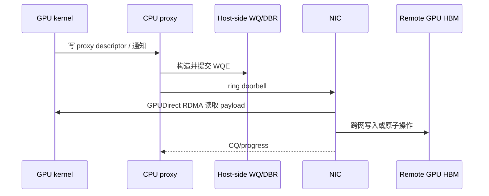

它的优势是平台适配和 CPU 侧资源管理相对直接，也能运行在 NIC doorbell 不能映射给 GPU 的环境；代价是细粒度消息经历 GPU→CPU 通知、proxy 调度和 CPU→NIC 提交，CPU 抖动、NUMA 放置和控制流往返会进入尾延迟。

#### 0.3.2 三种模式不能混为一谈

| 模式 | 谁生成 WR/WQE | 谁敲 NIC doorbell | 是否属于 IBGDA |
|---|---|---|---|
| 普通 proxy transport | CPU proxy | CPU proxy | 否 |
| CPU-assisted IBGDA | GPU | CPU 只辅助异步 post-send/doorbell | **是** |
| traditional IBGDA | GPU | GPU | **是** |

本仓库 [`docs/nvshmem.md`](nvshmem.md#2-enable-nvshmem-ibgda-support) 同时给出 traditional IBGDA 和基于 GDRCopy/`gdrdrv` 的 CPU-assisted asynchronous post-send。NVIDIA 官方把后者定义为 proxy-based networking 与 traditional IBGDA 的中间模式：GPU 仍生成 work request，CPU 只接管 doorbell-ringing。DeepEP 要求 NVSHMEM 选择 IBGDA，但最终 post-send 模式由 NVSHMEM、驱动和部署决定。

无论哪一种 IBGDA，host 都没有“完全消失”。初始化阶段仍需 CPU 完成 communicator bootstrap、QP/CQ 创建、GPU 内存注册、lkey/rkey 与 peer heap base 交换、资源回收；被移出关键路径的是**每条消息的常规控制面**。

#### 0.3.3 DeepEP 在哪里打开 IBGDA

入口是 [`deep_ep/buffers/legacy.py:103-135`](../deep_ep/buffers/legacy.py#L103)：

```python
if self.runtime.get_num_rdma_ranks() > 1 or low_latency_mode:
    os.environ['NVSHMEM_DISABLE_P2P'] = (
        '0' if allow_nvlink_for_low_latency_mode else '1')
    os.environ['NVSHMEM_IB_ENABLE_IBGDA'] = '1'
    os.environ['NVSHMEM_IBGDA_NUM_RC_PER_PE'] = f'{num_qps_per_rank}'
    self.nvshmem_qp_depth = int(
        os.environ.get('NVSHMEM_QP_DEPTH', '1024'))
    os.environ['NVSHMEM_QP_DEPTH'] = str(self.nvshmem_qp_depth)
    os.environ['NVSHMEM_CUMEM_GRANULARITY'] = f'{2 ** 29}'
self.runtime.sync(device_ids, ipc_handles, root_unique_id)
```

- `or low_latency_mode` 说明即使只有一个节点，LL 构造也会建立 NVSHMEM 环境；normal 只有 `num_rdma_ranks>1` 才需要它。
- `NVSHMEM_DISABLE_P2P=0` 允许同节点 peer 取得 P2P 指针；默认允许，但源码警告它与 hook overlap 的资源/顺序条件并不总兼容。
- `NVSHMEM_IB_ENABLE_IBGDA=1` 请求 IBGDA；`NUM_RC_PER_PE` 设置每个 peer 的 RC QP 数，LL 要求它与 local expert 数匹配。
- `QP_DEPTH` 是在途 WQE 容量，不是无限消息队列。
- 当前仓库**没有**设置 `NVSHMEM_IBGDA_NIC_HANDLER=gpu`。traditional 还是 CPU-assisted 应结合 `nvshmem-info`、驱动配置和日志确认。

C++ 同步阶段把 LL 的 NVSHMEM PE 定义为全局 EP rank，并在 symmetric heap 中分配 RDMA buffer（[`csrc/legacy/buffer.hpp:255-285`](../csrc/legacy/buffer.hpp#L255)）：

```cpp
auto nvshmem_rank = low_latency_mode ? rank : rdma_rank;
auto num_nvshmem_ranks = low_latency_mode ? num_ranks : num_rdma_ranks;
nvshmem::init(root_unique_id, nvshmem_rank, num_nvshmem_ranks,
              low_latency_mode ? LEGACY_NUM_MAX_NVL_PEERS : 0);
rdma_buffer_ptr = nvshmem::alloc(
    num_rdma_bytes, LEGACY_NUM_BUFFER_ALIGNMENT_BYTES);
cudaMemset(rdma_buffer_ptr, 0, num_rdma_bytes);
nvshmem::barrier(true);
```

LL 以 `<global rank, world size>` 建 PE；normal 只以跨节点 `rdma_rank` 建同号 GPU 的 PE；`nvshmem::alloc` 返回 NIC 注册的对称地址空间；清零后的 barrier 保证所有 PE 完成初始化。DeepEP 中看不到 `ibv_reg_mr`，因为 registration、QP 和 key table 在 NVSHMEM transport 内部建立；普通 PyTorch tensor 不会因此自动成为 RDMA symmetric buffer。

#### 0.3.4 GPU 如何从 symmetric 地址生成 WQE

真实调用链位于 [`csrc/kernels/legacy/ibgda_device.cuh`](../csrc/kernels/legacy/ibgda_device.cuh)：

```text
low-latency SEND warp
  -> nvshmemi_ibgda_put_nbi_warp
     -> ibgda_get_rc(dst_pe, expert_qp_id)
     -> ibgda_get_lkey_and_rkey
     -> ibgda_reserve_wqe_slots
     -> ibgda_write_rdma_write_wqe
     -> ibgda_submit_requests
        -> ready/prod index -> DBR -> doorbell
```

QP 选择和远端地址翻译的最小源码（[`ibgda_device.cuh:81-86`](../csrc/kernels/legacy/ibgda_device.cuh#L81)、[`205-232`](../csrc/kernels/legacy/ibgda_device.cuh#L205)）：

```cpp
auto qp = &state->globalmem.rcs[
    pe * num_rc_per_pe * state->num_devices_initialized +
    id % (num_rc_per_pe * state->num_devices_initialized)];

uint64_t roffset = raddr - heap_start;
*out_raddr = reinterpret_cast<uint64_t>(
    nvshmemi_device_state_d.peer_heap_base_remote[dst_pe]) + roffset;
*out_rkey = device_key.key;
return min(lchunk_size, rchunk_size);
```

- `pe` 选择目标 rank，LL 的 `id` 是 local expert，从而让一个 expert 的 payload 与 count/flag 落到同一 QP。
- symmetric pointer 先减本 PE heap base 得 offset，再加目标 PE remote heap base；不是把本地原始虚拟地址原样发给远端。
- lkey 授权 NIC 读本地 GPU buffer，rkey 授权写远端注册区。
- 返回两个 registration chunk 剩余长度的较小值；跨 chunk 的一个逻辑 put 会拆成多个 WQE。

warp 共同填 WQE，lane 0 负责预留与提交（[`ibgda_device.cuh:335-380`](../csrc/kernels/legacy/ibgda_device.cuh#L335)）：

```cpp
if (lane_id == 0)
    base_wqe_idx = ibgda_reserve_wqe_slots(qp, num_wqes);
base_wqe_idx = __shfl_sync(0xffffffff, base_wqe_idx, 0);
if (lane_id < num_wqes) {
    auto wqe_idx = base_wqe_idx + lane_id;
    auto wqe_ptr = ibgda_get_wqe_ptr(qp, wqe_idx);
    ibgda_write_rdma_write_wqe(qp, my_laddr, my_lkey,
                               my_raddr, my_rkey, my_chunk_size,
                               wqe_idx, &wqe_ptr);
}
__syncwarp();
if (lane_id == 0)
    ibgda_submit_requests<kAlwaysDoPostSend>(
        qp, base_wqe_idx, num_wqes, message_idx);
```

`ibgda_submit_requests` 先 `__threadfence()`，再用 CAS 等待此前预留的 WQE 形成无空洞 ready 前缀。traditional IBGDA 更新 DBR 并 ring NIC doorbell；CPU-assisted 模式推进 GPU-visible producer index，由 CPU helper 异步 post-send。默认 payload 可按 4 条消息批量 doorbell；随后的 count/flag AMO 使用强制 post。函数返回表示 WQE 已写入并发布给 transport/NIC 可获取，不表示 NIC 已完成远端 DMA。

#### 0.3.5 Low-Latency 怎样使用：payload 后发布 count/flag

Dispatch SEND 的实际分支在 [`internode_ll.cu:253-277`](../csrc/kernels/legacy/internode_ll.cu#L253)：

```cpp
const auto dst_p2p_ptr = nvshmemi_get_p2p_ptr(dst_ptr, rank, dst_rank);
if (dst_p2p_ptr == 0) {
    nvshmemi_ibgda_put_nbi_warp(
        dst_ptr, src_ptr, num_bytes_per_msg, dst_rank,
        dst_expert_local_idx, lane_id, slot_idx);
} else {
    UNROLLED_WARP_COPY(/* peer NVLink/P2P copy */);
}
```

P2P pointer 为 0 才走 IBGDA；否则 GPU warp 直接复制到 peer symmetric heap。payload 都完成本地构造/提交后，负责该 expert 的 warp 在**相同 `dst_expert_local_idx` QP** 上发布计数（[`internode_ll.cu:323-349`](../csrc/kernels/legacy/internode_ll.cu#L323)）：

```cpp
while (ld_acquire_global(atomic_finish_counter_per_expert +
                         responsible_expert_idx)
       != LEGACY_FINISHED_SUM_TAG * 2) { }
nvshmemi_ibgda_amo_nonfetch_add(
    reinterpret_cast<int*>(dst_ptr), -num_tokens_sent - 1,
    dst_rank, dst_expert_local_idx);
```

负编码 `-count-1` 让 `0` 唯一表示“尚未到达”，即使发送 0 token 也会发布 `-1`。Combine 同样先 put expert 输出，再在相同 `local_expert_idx` QP 上对 `recv_flag` 做 AMO；RECV 用 system-scope acquire 轮询后才消费 payload。这里依赖 DeepEP 当前 helper 的 ready 顺序、同一 RC QP 和强制发布，不可推广为任意不同 QP 的 nonblocking put 都天然被随后 flag 排序。

#### 0.3.6 使用与不使用的收益、成本和 0-SM 边界

| 维度 | 无 IBGDA proxy | IBGDA / CPU-assisted IBGDA |
|---|---|---|
| 小消息控制延迟 | CPU 调度与往返进入关键路径 | GPU 路由后生成 WR；CPU-assisted 只辅助 doorbell |
| 消息率与融合 | proxy 容易成为细粒度瓶颈 | warp 可并行填 WQE，并与量化/pack 融合 |
| 计算重叠 | 依赖 proxy 与额外同步 | SEND 返回后 NIC 可继续 DMA，形成 in-flight 窗口 |
| GPU 成本 | 少一些 WQE 管理指令 | SEND/RECV、key lookup、WQE、poll 仍占 SM/HBM/L2 |
| NIC/GPU 资源 | CPU/host WQ 为主 | RC QP、WQ、CQ、registered heap 消耗 GPU/NIC 资源 |
| 部署与正确性 | 兼容面较宽、控制集中 | 依赖驱动/NIC/映射；需严格管理 QP 顺序、quiet、slot 生命周期 |

经典图中的 “without communication SMs” 必须限定为：SEND kernel 已结束、WQE 已发布，而 RECV kernel 尚未启动的那段网络飞行时间。量化、pack、WQE 构造、P2P copy、RECV polling、解包和规约都会执行 GPU 指令；如果 Attention/MoE 与 NIC 同时争用 HBM/L2/PCIe/NVLink，释放 SM 也不代表计算完全无损。

## 1. 与 V1 normal/SM 方案的区别

| 维度 | V1 normal / SM | V1 low-latency |
|---|---|---|
| 主要场景 | 训练、prefill、大 token 批量 | autoregressive decoding、小 batch |
| 数据路径 | 单机 NVLink；多机 RDMA + NVLink 分层 | 所有 rank 统一使用可 RDMA 寻址的低时延路径；可对本地 P2P 做 bypass |
| 接收规模 | 默认 CPU 等待真实 token 数后精确分配 | 固定按最坏容量分配，不做 CPU exact-count sync |
| 输出布局 | token-major，另返回 per-expert list | expert-major 固定槽位 + GPU `recv_count` |
| SM 配置 | `Buffer.set_num_sms()` / `Config` | 没有用户侧 SM 控制 API，按设备 SM 与 expert 映射启动 |
| 缓冲结构 | 多 channel 有界环形队列 | 两套 ping-pong 固定 send/recv/signal buffer |
| overlap | CUDA event/通信流 | `return_recv_hook` 将 send 和 recv phase 拆开，可做双 micro-batch overlap |
| CUDA Graph | normal 默认受 CPU sync 限制 | 固定形状，兼容 CUDA Graph；重放时需维护缓冲状态 |
| combine 权重 | 向量加法规约，权重语义由上层组织 | 内核直接按 `topk_weights` 加权规约 |

low-latency 的设计取舍很明确：用更大的固定缓冲和更受限的形状，换掉运行时 CPU 同步、动态输出形状和多级 queue 控制。

### 1.1 经典图的逐阶段解读


这张图把 V1 的两条执行路径放在同一时间轴上：上半部分是普通/高吞吐 dispatch-combine 路径，下半部分是 Low-Latency 路径。二者都在做 `Attention → Dispatch → MoE → Combine`，根本区别是**谁负责推动跨节点通信前进**：

- 上半部分由 GPU 通信 kernel 持续驻留并推进发送、接收，因此通信阶段会占用通信 SM。
- 下半部分只在 `issue` 和 `receive` 边界运行短 GPU kernel；真正的网络传输由 NVSHMEM IBGDA/RDMA 在后台推进，使中间的 Attention 或 MoE 尽可能拿到更多 SM。
- 图中的 Stream 0/1 更适合看成两个交错的 micro-batch 逻辑泳道，不应机械理解为源码中永远固定的两个 CUDA stream。下半图画成单一 Stream 0，是为了突出“计算串行推进、RDMA 在后台并行”的关键关系。

颜色含义如下：

| 颜色 | 阶段 | 主要职责 |
|---|---|---|
| 绿色 | Attention | 当前或下一 micro-batch 的注意力计算 |
| 蓝色 | Dispatch | 按路由结果把 token 发送到目标 expert rank |
| 黄色 | MoE | expert grouped GEMM 及相关计算 |
| 黄绿色 | Combine | 把 expert 输出返回源 rank，并按 top-k 权重归并 |

#### 下半图的完整时间线

| 图中顺序 | 前台动作 | 后台动作 | 对应含义 |
|---:|---|---|---|
| 1 | `Attention 0` | 无 | micro-batch 0 产生待路由 hidden states 和 top-k 路由结果 |
| 2 | `Dispatch 0 issue` | 开始 RDMA | 发布 micro-batch 0 的 token、scale、源信息和计数 |
| 3 | `Attention 1` | Dispatch 0 RDMA | micro-batch 1 的 Attention 与 micro-batch 0 的网络传输重叠 |
| 4 | `Dispatch 0 receive`，随后 `Dispatch 1 issue` | Dispatch 1 RDMA 开始 | 收取 micro-batch 0 的 dispatch 结果，同时发布 micro-batch 1 |
| 5 | `MoE 0` | Dispatch 1 RDMA | expert 计算 0 与下一批 token 的传输重叠 |
| 6 | `Dispatch 1 receive`，随后 `Combine 0 issue` | Combine 0 RDMA 开始 | micro-batch 1 可进入 MoE；micro-batch 0 的 expert 输出开始返回 |
| 7 | `MoE 1` | Combine 0 RDMA | expert 计算 1 与上一批输出回传重叠 |
| 8 | `Combine 0 receive`，随后 `Combine 1 issue` | Combine 1 RDMA 开始 | 完成 micro-batch 0 的 top-k 加权归并，并发布 micro-batch 1 回传 |
| 9 | 下一轮 `Attention 0` | Combine 1 RDMA | 下一迭代的 Attention 隐藏上一批 combine 网络时间 |
| 10 | 后续 `Combine 1 receive` | — | 在真正消费 micro-batch 1 归并结果前完成接收 |

图中细竖线不是“零成本”的意思，而是把短暂的边界操作压缩表示。`issue` 与 `receive` 都仍然需要 GPU 执行；图要表达的是二者之间较长的网络飞行时间不需要通信 kernel 长驻 SM。

#### `issue` 在代码里做什么

Low-Latency kernel 通过 phase 模板把发送和接收拆成两次 launch。dispatch 的发送阶段可概括为：

```cpp
launcher(LEGACY_LOW_LATENCY_SEND_PHASE);
```

该阶段完成的核心工作包括：

1. 读取 `topk_idx`，确定每个 token 应发往哪些 expert/rank。
2. 按 expert 的固定容量槽位分配位置，形成接收端可直接消费的 packed 布局。
3. 在需要时执行 FP8/UE8M0 量化并生成 scale。
4. 写入 NVSHMEM 对称通信缓冲区中的 token、scale、源 token 信息与元数据。
5. 调用 `nvshmemi_ibgda_put_nbi_warp` 等 IBGDA 操作发布非阻塞 RDMA。
6. 更新计数或 flag，使接收端能够判断数据何时完整可见。

Combine 的发送阶段与之对称：它依据 dispatch 阶段保留下来的 `src_info`、`layout_range` 等信息，把各 expert 的输出发回 token 的源 rank，并发布完成标志。

因此，`issue` 的准确含义不是“已经完成通信”，而是“WQE 已写入并发布给 transport/NIC 可以获取，GPU 可以转去执行别的计算”；此时 NIC 未必已经 fetch WQE，更没有保证远端完成。

#### “with background RDMA”究竟意味着什么

在 issue kernel 返回之后，NIC 根据已发布的 work request 继续跨节点搬运数据。理想状态是：

```text
网络飞行期间通信 SM 占用 ≈ 0
计算 SM 可用于 Attention / MoE
```

这正是图中 “Overlapping without communication SMs” 的含义。但它有三个边界：

- **不是端到端零 SM。** issue、receive、量化、打包、解包、检查 flag 都会执行 GPU 指令。
- **不是完全零资源竞争。** RDMA 仍可能争用 HBM/L2、PCIe 或 NVLink 路径，具体取决于节点拓扑和数据路径。
- **不是 NIC 自动解决依赖。** 程序必须在使用接收数据前显式调用 receive hook；若网络尚未完成，receive kernel 会等待对应计数/flag。

#### `receive` 在代码里做什么

`Buffer::low_latency_dispatch` 在 `return_recv_hook=true` 时不会立即完成接收，而是返回一个 hook。其核心形态是：

```cpp
recv_hook = [=]() {
    launcher(LEGACY_LOW_LATENCY_RECV_PHASE);
};
```

调用 dispatch hook 后，接收阶段会：

1. 等待目标 expert 的到达计数和完成 flag。
2. 读取固定槽位中的 hidden states、scale 与源 token 元数据。
3. 生成/整理 `recv_x`、`recv_count`、`src_info`、`layout_range` 等后续 MoE 和 combine 所需对象。
4. 建立正确的 CUDA stream 依赖，保证 grouped GEMM 不会看到未完成的数据。

Combine hook 则等待回传数据，读取各 top-k expert 的输出，乘以相应的 `topk_weights`，再对同一源 token 做归约，最终形成 `combined_x`。

#### 为什么下半图可能更快

普通路径即使能通过双 micro-batch 把通信和计算叠加，通信 kernel 仍会占用一定数量的 SM。Low-Latency 路径的可见时间近似为：

```text
T_visible ≈ T_issue + max(T_compute, T_RDMA) + T_receive
```

收益来自两部分：

- `T_RDMA` 被 Attention 或 MoE 隐藏；
- 网络传输期间不保留通信 SM，前台计算能使用更多 SM，Attention/MoE 本身也可能更快。

如果 `T_RDMA > T_compute`，receive hook 仍需等待剩余网络时间；如果消息很大或目标偏斜严重，固定槽位和低延迟协议也未必优于普通高吞吐路径。因此这张图表达的是理想流水线机制，不是对所有负载都成立的固定性能结论。

#### Python 调用与图中边界的对应

| 图中标注 | Python/C++ 接口行为 |
|---|---|
| `Dispatch N issue` | 调用 `low_latency_dispatch(..., return_recv_hook=True)`，执行 SEND phase 并返回 hook |
| `Dispatch N receive` | 在 MoE 真正依赖数据前调用 dispatch `recv_hook()` |
| `MoE N` | 使用 `recv_x` 和 `recv_count` 执行 grouped GEMM |
| `Combine N issue` | 调用 `low_latency_combine(..., return_recv_hook=True)`，发布输出回传 |
| `Combine N receive` | 在下一层消费结果前调用 combine `recv_hook()`，完成加权归并 |

实现流水时需要遵守以下约束：

- `return_recv_hook=True` 与 `async_finish=True` 不能同时使用；两者代表不同的完成控制方式。
- hook 必须放在最晚但正确的依赖点：过早调用会损失重叠，过晚调用则会读到尚未完成的输出。
- 当前 low-latency 缓冲区使用双 buffer/ping-pong 思路，不能无限增加在途 micro-batch。
- 与某个 micro-batch 关联的输入 tensor、输出 tensor、handle 和元数据必须存活到对应 receive 完成。
- 生产代码应通过 CUDA event/stream wait 建立依赖，不应把图中的逻辑泳道误写成全局同步。

#### 与上半图的一句话对照

- **V1 普通路径：** GPU-resident progress——通信 kernel 在 SM 上持续推进传输，以吞吐和较大消息效率为目标。
- **V1 Low-Latency：** NIC-resident progress——GPU 只负责发布与收取，网络飞行阶段主要由 IBGDA/RDMA 推进，以低延迟和释放计算 SM 为目标。

V2 的协议和弹性/PP 能力另有设计，不应把这张 V1 图直接当成 V2 的执行时序；尤其 V2 并未原样保留 V1 这种 `0-SM` receive-hook EP 接口。

## 2. 代码地图

| 层次 | 文件 | 关键内容 |
|---|---|---|
| Python API | [`deep_ep/buffers/legacy.py`](../deep_ep/buffers/legacy.py#L538) | size hint、dispatch/combine、hook、zero-copy、mask 与诊断接口 |
| C++ 编排 | [`csrc/legacy/buffer.hpp`](../csrc/legacy/buffer.hpp#L1431) | ping-pong buffer 选择、固定输出分配、phase 拆分、event/hook |
| 内存布局 | [`csrc/legacy/config.hpp`](../csrc/legacy/config.hpp) | `LowLatencyBuffer`、`LowLatencyLayout`、消息大小和两套缓冲 |
| CUDA 内核 | [`csrc/kernels/legacy/internode_ll.cu`](../csrc/kernels/legacy/internode_ll.cu) | 清理、dispatch、combine、mask barrier、超时诊断 |
| 内核 API | [`csrc/kernels/legacy/api.cuh`](../csrc/kernels/legacy/api.cuh#L251) | low-latency launch 参数和 phase 接口 |
| IBGDA | [`csrc/kernels/legacy/ibgda_device.cuh`](../csrc/kernels/legacy/ibgda_device.cuh) | GPU 发起 put/atomic、QP 访问 |
| 测试 | [`tests/legacy/test_low_latency.py`](../tests/legacy/test_low_latency.py) | FP8/BF16、hook、zero-copy、LogFMT、shrink、性能测试 |

调用链：

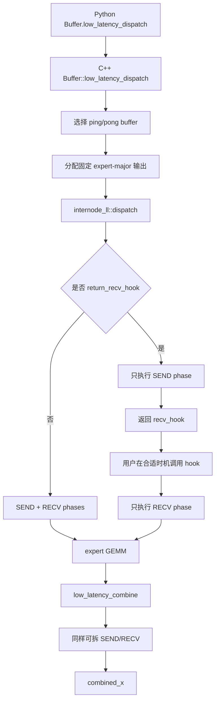

## 3. 初始化要求

### 3.1 创建 low-latency buffer

```python
num_rdma_bytes = deep_ep.Buffer.get_low_latency_rdma_size_hint(
    num_max_dispatch_tokens_per_rank,
    hidden,
    group.size(),
    num_experts,
)

buffer = deep_ep.Buffer(
    group,
    num_nvl_bytes=0,
    num_rdma_bytes=num_rdma_bytes,
    low_latency_mode=True,
    num_qps_per_rank=num_experts // group.size(),
)
```

关键约束：

- `num_experts % num_ranks == 0`；
- 最佳性能下 `num_qps_per_rank == num_local_experts`，即每个 local expert 对应一个 QP；
- 所有 rank 必须能通过 NVSHMEM/IBGDA 路径访问；
- NVSHMEM QP depth 至少为 `(num_max_dispatch_tokens_per_rank + 1) * 2`；
- `num_max_dispatch_tokens_per_rank` 是固定容量，也是输出形状和显存开销的核心参数，解码场景通常应控制在 256 以下。

`Buffer.__init__` 在 low-latency 模式中以全局 rank 作为 NVSHMEM PE，而 normal 跨节点模式只以 `rdma_rank` 作为 PE。这使 low-latency 能直接面向整个 EP group 发起通信。

### 3.2 从对称堆到 NIC 注册内存

**官方资料背景：** NVSHMEM 采用 SPMD PE 模型。所有 PE 必须以相同顺序、相同大小参加对称分配；返回地址在本 PE 上是普通 CUDA 指针，而远端寻址逻辑是“本地对称地址在 heap 中的 offset + 目标 PE 的 heap base”。所以“对称”指跨 PE 可由同一 offset 定位，并不要求不同进程的数值虚拟地址完全相同。

**源码可证：** low-latency 的初始化链路是：

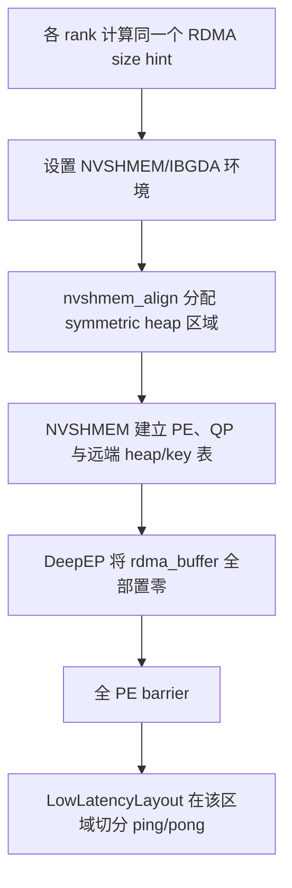

Python 初始化在 NVSHMEM bootstrap 之前设置的关键项包括：

| 配置 | 当前 V1 代码中的作用 |
|---|---|
| `NVSHMEM_IB_ENABLE_IBGDA=1` | 选择 GPU 发起的 IBGDA transport |
| `NVSHMEM_IBGDA_NUM_RC_PER_PE=num_qps_per_rank` | 为每个对端 PE 建立多条 RC QP；推荐值等于 local expert 数 |
| `NVSHMEM_QP_DEPTH` | 设置 legacy 路径期望的 QP 深度；Python 侧检查至少 `(M+1)*2` |
| `NVSHMEM_DISABLE_P2P` | 控制是否允许节点内 P2P bypass |
| `NVSHMEM_DISABLE_NVLS=1` | 禁用当前 legacy 初始化不使用的 NVLS 路径；源码未设置 `NVSHMEM_IBGDA_NIC_HANDLER` |
| `NVSHMEM_CUMEM_GRANULARITY=2^29` | 控制对称堆的 cuMem 分配粒度 |

这里有三个容易混淆的概念：

1. **CUDA 可访问**不等于**NIC 可 RDMA**。NVSHMEM transport 还要把 heap backing memory 注册给 HCA，并向设备侧状态提供 local/remote key。
2. 常规 `torch.empty` 输出并未因此自动成为 DeepEP 的 RDMA 源/目的；真正的网络 send/recv 区是 `rdma_buffer` 中的对称分配。zero-copy combine 之所以成立，正因为它返回的是这块已注册区域上的视图。
3. 节点内存在可用 P2P 指针时，内核可直接做 GPU copy；否则才走 IBGDA。两条路径的性能资源冲突不同，必须按真实拓扑分别测量。

### 3.3 GPU 如何构造 WQE：QP、lkey 与 rkey

**官方资料背景：** IBGDA 把传统 CPU verbs 路径中的“构造 work request、更新队列、敲 doorbell”下沉到 GPU。GPU 线程把 WQE 写进位于 GPU 内存的 QP work queue，更新 doorbell record/doorbell 后，HCA 直接 DMA 读取源 GPU 内存并在远端执行写入或原子操作。

**源码可证：** `legacy/ibgda_device.cuh` 是从 NVSHMEM device transport 派生并修改的实现。一次 `nvshmemi_ibgda_put_nbi_warp` 可展开为：

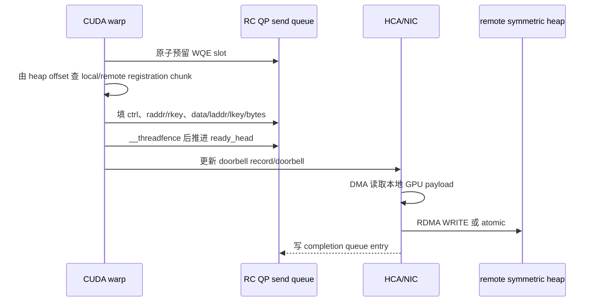

WQE 中两个 key 的职责不同：

- `lkey` 授权 HCA 读取本地 source address；
- `rkey` 授权远端 HCA 写入/原子访问目标地址；
- `raddr` 不是直接照抄本地指针，而是由对称 heap offset 加目标 PE 的 remote base 得到。

NVSHMEM 的 heap 可能按 registration chunk 注册。当前 put helper 同时检查本地与远端 chunk 边界，把跨界的一个逻辑消息拆成若干 WQE，每段各自携带正确的 `lkey/rkey`；源码注释指出理论上通常不超过三段，但实现仍以边界计算结果为准。由此可见，固定 72 字节或任意单一 metadata 大小都不能被当作通用的 WQE/注册粒度保证。

RC QP 由 `ibgda_get_rc(pe, id)` 选择，`id` 会映射到该对端可用的 RC QP 集合。DeepEP dispatch 把目标 `dst_local_expert_idx` 作为 QP id，combine 把发送方 `local_expert_idx` 作为 QP id；这解释了“每个 local expert 一条 QP”的源码意图。QP 太少会增加热点和串行化，QP 太多则增加设备状态、队列内存和 NIC 资源压力，**最佳值是需要在目标 HCA、EP 规模和路由偏斜上验证的调优假设**。

WQE 发布还有两个层次：

- `__threadfence()` 让当前 GPU 写出的 WQE 描述符在推进 ready head/doorbell 前可见；它不是“远端 payload 已完成”的证明。
- `put_nbi` 返回只说明请求已构造/发布到传输路径，不说明远端数据已经到达。CQ producer index/`quiet` 才参与本地执行上下文的完成确认，但 DeepEP 热路径主要用后续 count/flag 协议避免每条消息做 `quiet`。

### 3.4 payload、count/flag 与完成顺序

先给出 NVSHMEM 的**公共语义边界**：

| 操作 | 官方语义的安全表述 |
|---|---|
| 非阻塞 RMA（NBI） | 调用返回时操作可以仍在途；使用前必须通过适当的同步/完成操作建立依赖 |
| `nvshmem_fence` | 排序本 PE 之前与之后发往目标 PE 的更新，但它本身不是所有操作均已完成的等待 |
| `nvshmem_quiet` | 等待调用 PE 当前执行上下文中此前发起的相关 NBI 更新完成 |
| `put-with-signal` | 对同一 API 操作，接收端观察到 signal 完成可作为其关联数据已交付的通知 |
| 独立 signal/另一条 QP | 不能不加证明地推断它替任意先前 transfer 提供排序；跨 QP 操作本来就是独立的 |

DeepEP 热路径**没有简单调用公共 `nvshmem_put_signal`**，而是直接构造 put WQE 与后续 atomic WQE。因此下面的结论属于“源码可证的局部事实 + 协议推导”，不是可移植到任意 NVSHMEM 程序的保证。

Dispatch 的发送完成协议为：

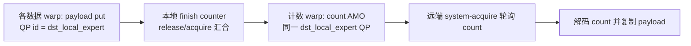

- 本地 `atomic_finish_counter` 只协调同一 kernel 中的 warp，证明负责该 expert 的 payload put 已被构造/提交；它不等于网络完成。
- 随后的 count AMO 使用与 payload 相同的 `dst_local_expert_idx` QP。内部 QP 的 ready-head 串行发布机制和 RC QP 顺序是接收端把 count 当作到达标志的协议基础。
- count 编码为 `-num_tokens_sent-1`：即使发送 0 个 token，也会写 `-1`；初值 `0` 因而唯一表示“尚未收到完成计数”。接收端取反解码后才得到真实数量。

Combine 同理：某个 local expert 的 payload put 全部使用 `local_expert_idx` QP，warp 汇合后再在同一 QP 上用 atomic 写对应 flag；源 rank 以 system-scope acquire load 等待按 global expert 编号的 flag，随后再读取消息并规约。

这套设计要求长期保持以下不变量：

1. 同一逻辑 payload 与其 count/flag 必须留在协议证明覆盖的同一 QP 序列上；
2. 下一轮复用 signal 与 data slot 之前，上一轮消费与清理必须完成；
3. 若未来把 payload 条带化到不同 QP、改成另一类 transport，必须重新引入有官方语义支撑的 fence/quiet/put-with-signal 或等价完成协议，不能只保留一个 atomic flag；
4. 接收端的 acquire load 负责观察通知并约束后续 GPU 读取，但“flag 代表哪些 payload”仍由前述发送顺序定义。

## 4. 固定消息与双缓冲布局

### 4.1 为什么采用固定容量

解码 batch 小，但调用频繁。如果先交换大小、CPU 读取计数、再分配动态输出，固定开销会主导总时延。low-latency 直接按上界：

```text
每个 local expert 最多接收 num_ranks * num_max_dispatch_tokens_per_rank 个槽位
```

真实有效数量由 GPU 张量 `packed_recv_count[local_expert]` 给出。

### 4.2 `LowLatencyLayout` 的真实物理顺序

设：

```text
R = num_ranks
E = num_experts
L = E / R                         # 每 rank local experts
M = num_max_dispatch_tokens_per_rank
H = hidden
A128(x) = x 按 128 B 对齐
```

[`LowLatencyLayout`](../csrc/legacy/config.hpp) 在同一块 NVSHMEM symmetric buffer 中构造两个逻辑 slot，但物理顺序不是“一个完整 ping 后接一个完整 pong”，而是同类区域成对排列：

```text
| signal/count 0 | signal/count 1 |
| send data 0    | send data 1    |
| recv data 0    | recv data 1    |
```

每个 `LowLatencyBuffer` 只是把对应 slot 的三段指针组装起来；同一 data 区又被 dispatch 与 combine 以不同消息类型别名解释。因此，dispatch 与 combine 的容量取二者最大值，而不是各自再分配一整套物理内存。

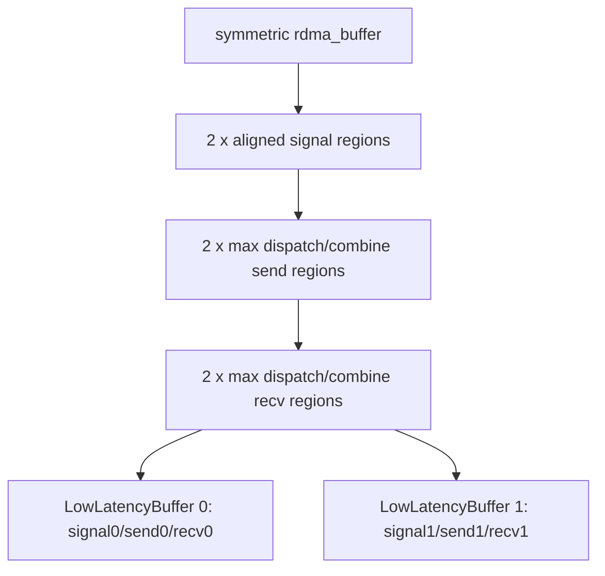

### 4.3 精确消息与容量公式

Dispatch 单条槽位的保守大小为：

```text
Dmsg = sizeof(int4) + max(
    H * sizeof(bfloat16),              # BF16 payload
    H * sizeof(fp8) + (H/128)*4        # FP8 payload + FP32 scale 上界
)
     = 16 + max(2H, H + H/128*4)
```

其中 `int4` 保存 source token index 等控制字段；FP8 scale 的逻辑粒度是每 128 hidden 元素一组。`use_ue8m0` 可压缩实际 scale 表示，但布局 size hint 仍按上述安全上界计算。

Combine 单条槽位容量为：

```text
Cmsg = H * sizeof(bfloat16)
     + (H/128) * sizeof(nv_bfloat162)
     = 2H + (H/128)*4
```

每个 128 元素分组都预留一个 `nv_bfloat162`，保存 LogFMT 判断/解码所需的两个 BF16 元数据。物理 payload 区仍按 BF16 上界分配，启用 LogFMT 时才让部分分组在其中使用 10-bit packed 表示。

该 commit 中每个 slot 的概念容量为：

```text
send_bytes = max(M * Dmsg, E * M * Cmsg)
recv_bytes = max(E * M * Dmsg, E * M * Cmsg)
signal_bytes = A128(E * sizeof(int))
```

总 size hint 再容纳两份 signal、send、recv。源码最终使用 `((num_bytes + 128) / 128) * 128`，它是保守留量而不是标准 `align_up(num_bytes, 128)`：当 `num_bytes` 已整除 128 时仍会多留 128 B。

显存随 `E*M*H` 近似线性增长；因此把 `M` 盲目设成远大于真实 decode batch 的值，会同时扩大 registered heap、QP 在途上界和 cache/HBM 足迹。

### 4.4 ping-pong 是“按 API 调用翻转”，不是任意两轮缓存

每次 `low_latency_dispatch` 或 `low_latency_combine` 进入 C++ 都执行：

```cpp
auto buffer = layout.buffers[low_latency_buffer_idx];
auto next_buffer = layout.buffers[low_latency_buffer_idx ^= 1];
auto next_clean_meta = next_buffer.clean_meta();
```

当前调用使用 `buffer`，同时在其 SEND phase 清理 `next_buffer` 的 signal/count，为下一次 low-latency API 调用做准备。翻转单位是**一次 dispatch/combine API 调用**，不是“一个完整 micro-batch”。典型双 micro-batch 的安全序列如下：

| 顺序 | 动作 | 当前 data slot | SEND 顺带清理 | 必须已满足 |
|---:|---|---:|---:|---|
| 1 | Dispatch A SEND | 0 | signal 1 | 初始两组 signal 为 0 |
| 2 | Dispatch A RECV hook | 0 | — | 消费 slot 0 的 count/payload |
| 3 | Dispatch B SEND | 1 | signal 0 | A 的 RECV 已不再依赖 signal 0 |
| 4 | Dispatch B RECV hook | 1 | — | 消费 slot 1 |
| 5 | Combine A SEND | 0 | signal 1 | A dispatch 数据已搬到独立输出，B 的 RECV 已完成 |
| 6 | Combine A RECV hook | 0 | — | 规约 A 返回值 |
| 7 | Combine B SEND | 1 | signal 0 | A combine RECV 已完成 |
| 8 | Combine B RECV hook | 1 | — | 规约 B 返回值 |

实际经典图会把步骤 2/3、4/5、6/7 各压缩在同一个边界附近，并在边界之间插入 Attention/MoE。表格强调的是依赖顺序，不要求 CPU 阻塞；同一 CUDA stream 的 enqueue 顺序或显式 event 可以建立这些依赖。

需要据此修正一句常见但过宽的说法：**双缓冲并不等价于“任意两个未完成结果都能安全长期持有”。** 正确规则是：下一次调用清理另一 slot 的 signal，某 slot 再次成为当前 slot 前，其旧 RECV 必须完成；hook 捕获的输入、输出、handle 和 layout 也必须存活。普通 `recv_x`/`combined_x` 是另行分配的输出张量，不能一概说成 RDMA buffer 视图；真正明确别名 registered send buffer 的是 zero-copy combine view。

若使用 CUDA Graph，固定形状有利于 capture，但 buffer 指针和 host 侧 ping-pong index 在 capture 时已选定。生产代码应把 capture/replay 当作一个完整协议单元验证，避免与 eager 调用交叉后仅凭“有两个 slot”推断状态仍正确。

## 5. Low-Latency Dispatch 原理

### 5.1 输入输出

输入：

```text
x            : BF16 [T, H]
topk_idx     : topk_idx_t [T, K]
T            <= num_max_dispatch_tokens_per_rank
```

输出：

```text
packed_recv_x:
  BF16 或 FP8
  [num_local_experts, num_ranks * max_tokens, H]

packed_recv_x_scales（FP8 时）:
  逻辑上 [num_local_experts, num_ranks * max_tokens, H/128]
  底层采用适合 TMA/GEMM 的列主序 stride

packed_recv_count:
  int32 [num_local_experts]
```

同时返回：

```text
handle = (
  packed_recv_src_info,
  packed_recv_layout_range,
  num_max_dispatch_tokens_per_rank,
  hidden,
  num_experts
)
```

### 5.2 固定 expert-major 布局

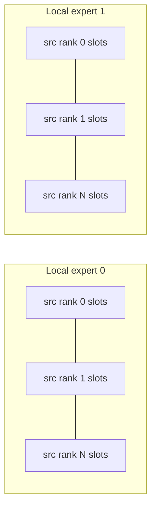

对每个 local expert，每个源 rank 都预留 `max_tokens` 的容量。接收后内核把有效 token 压紧到该 expert 的前部，并生成：

- `src_info[expert, packed_slot]`：原源 token index；
- `layout_range[expert, src_rank]`：该源 rank 在 packed expert 区间中的起点和数量；
- `recv_count[expert]`：expert 总有效 token 数。

这种布局可直接作为 grouped GEMM 的输入，不需要 CPU 根据动态 token 数重新建张量。

### 5.3 CUDA kernel 的 warp-group 映射

[`internode_ll::dispatch`](../csrc/kernels/legacy/internode_ll.cu#L129) 以逻辑 CUDA block 和 warp group 分配 expert；源码变量 `sm_id` 实际等于 `blockIdx.x`，不是硬件物理 SM ID：

```text
num_warp_groups = ceil(num_experts / num_device_sms)
responsible_expert_idx = sm_id * num_warp_groups + warp_group_id
```

一个 warp group 包含多个 warp：

- 数据 warp：读取 BF16 hidden，按需做 FP8 量化，并为 top-k 目标 expert 发起 IBGDA put；
- 计数 warp：扫描 `topk_idx`，统计每个 expert 的实际发送数；
- 接收侧一个 sub-warp 等待远端 count，其他 sub-warps 与等待过程重叠地搬运已到达 token。

### 5.4 SEND phase

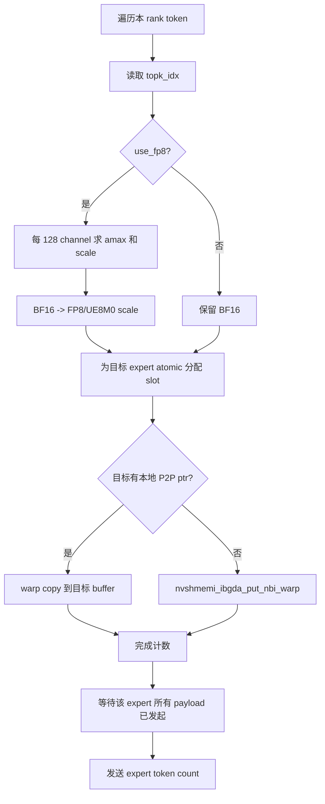

几个关键点：

1. FP8 量化与网络发送融合，避免单独 cast kernel 和额外 HBM 往返。
2. 每个目标 expert 使用原子计数分配唯一 slot。
3. payload 发起完成后才发送 count，count 是接收侧可见性协议的一部分。
4. 本地 rank 若有可直接访问的 P2P 指针，可用 GPU copy bypass NIC；否则发起 IBGDA put。
5. `mask_buffer` 启用时，被 mask 的 rank 不再收发。

### 5.5 RECV phase

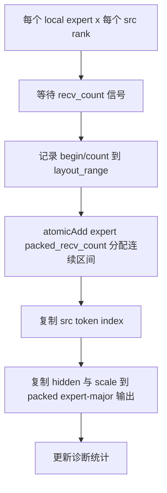

接收阶段不需要 CPU 参与。一个 sub-warp 专门轮询 count，其他 sub-warp 随后复制 payload；超时会记录具体 src rank、expert 和等待周期，并在未启用 shrink 时触发 trap。

### 5.6 FP8 scale 布局

默认 FP8 使用每 128 channel 一组 FP32 scale。为了后续 TMA/GEMM，C++ 先分配：

```text
[local_expert, H/128, num_ranks * max_tokens]
```

再做 transpose 视图，暴露逻辑形状：

```text
[local_expert, num_ranks * max_tokens, H/128]
```

因此它看起来 token-major，实际 stride 是列主序。`use_ue8m0=True` 时每 4 个 scale 打包成一个 `int`，并要求 `round_scale=True`。

## 6. Low-Latency Combine 原理

### 6.1 输入输出

输入 expert 结果：

```text
x: BF16 [num_local_experts, num_ranks * max_tokens, H]
```

还需要原始：

```text
topk_idx     [num_original_tokens, K]
topk_weights [num_original_tokens, K]
dispatch handle 中的 src_info 与 layout_range
```

输出：

```text
combined_x: BF16 [num_original_tokens, H]
```

combine 会对来自不同 expert 的结果乘对应 `topk_weights` 后相加，这是 low-latency 与 normal combine 语义上最重要的差异之一。

### 6.2 SEND phase

combine 根据 `layout_range[local_expert, src_rank]` 找到 dispatch 时由某个源 rank 发来的 token 区间：

1. 读取本地 expert GEMM 输出；
2. 根据 `src_info` 恢复源 token index；
3. 将返回消息写入源 rank 对称 recv buffer；
4. 可用 BF16 直接发送，也可按 **每 128 个 hidden 元素**动态选择内部 10-bit `LogFMT` 或 BF16 fallback；
5. 数据可见后写 flag，通知源 rank 某段结果到达。

### 6.3 RECV phase 与加权规约

源 rank 按本地 token 和 top-k expert 等待返回 flag，读取对应消息并：

```text
combined_x[token] = sum_k(expert_output[token, k] * topk_weights[token, k])
```

无效 `topk_idx == -1` 跳过。内核对 hidden 维做 warp 向量化规约，最后写 BF16 输出；可直接写用户传入的 `out`，避免额外分配。

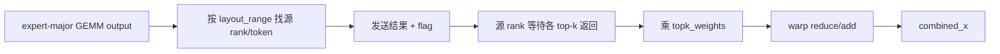

### 6.4 LogFMT：固定容量中的动态混合编码

**源码可证：** 当前 kernel 以 `H/128` 个 division 处理 combine 消息，而不是某些 Python docstring 中写的 per-64。每个 128 元素 division 始终有一个 `nv_bfloat162`（4 B）元数据槽，并根据该组数值的对数范围选择：

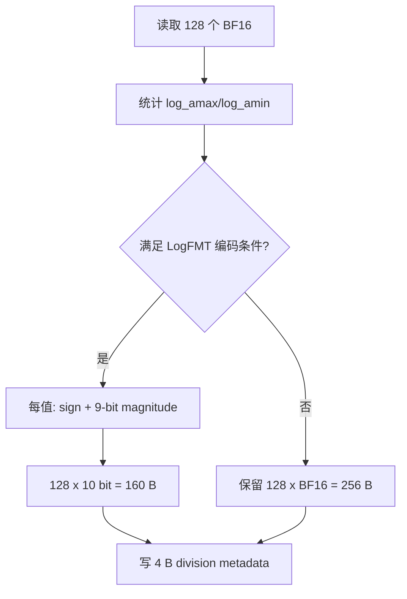

源码分支要求 `log_amax < 0` 且 `log_amin < log_amax`，并把可表示的最小对数范围限制在 32 以内；不满足时该 division 保留 BF16。接收端从 metadata 判断同一 division 应走 10-bit 解码还是 BF16 load。也就是说：

- LogFMT 是 DeepEP 内部 wire format，不是一个可由普通 GEMM 直接产生的标准 dtype；
- 压缩选择是**逐 128 元素组动态发生**，一条消息可混合压缩组与 BF16 fallback 组；
- 理想编码组把 payload 从 256 B 降到 160 B，另加固定 4 B metadata，即仅按元素位宽计算是 BF16 的 `10/16`；
- 固定 buffer 仍按最坏 BF16 容量分配，所以它节省网络实际发送字节，不直接缩小 `LowLatencyLayout` 的显存上界。

测试中的 LogFMT 带宽记账使用近似 `H*10/8 + (H/128)*4`，适用于全部组走压缩分支的构造数据；对真实模型应同时统计 BF16 fallback 比例，否则“有效 GB/s”会高估实际压缩收益。

`zero_copy=True` 与 `use_logfmt=True` 在 C++ 中被显式拒绝。原因不是 API 偏好，而是 zero-copy 要求 NIC 直接读取 GEMM 已写好的 BF16 registered buffer；LogFMT 则必须在 combine SEND kernel 中做分析、编码和重排，两条数据生产方式冲突。

## 7. Send/Recv Phase、完成链与 Hook 生命周期

### 7.1 两个 phase 到底各做什么

底层 `phases` 是 bitmask：

```text
LEGACY_LOW_LATENCY_SEND_PHASE = 1
LEGACY_LOW_LATENCY_RECV_PHASE = 2
```

| API | SEND phase | RECV phase |
|---|---|---|
| dispatch | 路由、量化/打包、payload put、本地 warp 汇合、count AMO、清下一 slot signal | 等 count，解码数量，把固定远端槽压紧到 expert-major 输出，写 `recv_count/src_info/layout_range` |
| combine | 按 `layout_range` 取 expert 输出，BF16 或 LogFMT 编码，payload put、flag AMO、清下一 slot signal | 等各 global expert flag，grid sync，加载/解码，乘 `topk_weights`，FP32 累加并写 BF16 |

非 hook 模式把两个 bit 一起传给同一次 kernel launch，因此调用内部会等待通信完成。hook 模式第一次只传 SEND，返回的 callable 再以相同捕获参数只传 RECV。

### 7.2 五个不能混为一谈的“完成”

一次 hook 调度中的事件顺序是：

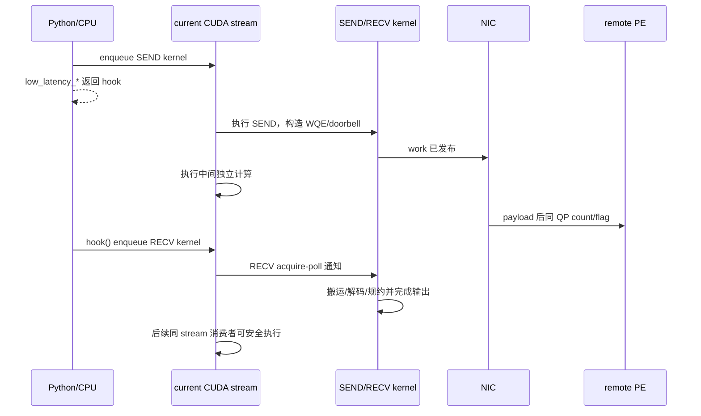

必须区分：

1. **Python API 返回：** 只表示 launch 已入队且 callable 已创建，不代表 SEND kernel 已跑完。
2. **SEND kernel 完成：** WQE 已构造/发布，本地打包工作结束；远端 payload 可以仍在途。
3. **NIC 完成传输：** 由同 QP count/flag 协议向远端接收 kernel 暴露，CUDA stream 本身不会自动感知非本地网络依赖。
4. **调用 `hook()` 返回到 Python：** 通常只表示 RECV kernel 又被 enqueue；它不是隐式 `cudaDeviceSynchronize()`。
5. **RECV kernel 在 CUDA stream 上完成：** 输出才对该 stream 后续 kernel 可消费。CPU 读取需另做同步，其他 CUDA stream 需显式 event/wait。

这也是经典图中细竖线仍有成本的原因：SEND/RECV kernel 会短时使用 SM；所谓“0-SM overlap”只指两者之间的 NIC 飞行窗口没有常驻通信 kernel。

### 7.3 current stream、comm stream 与事件

**源码可证：** 当前实现实际读取 `at::cuda::getCurrentCUDAStream()`。源码旁的 “default stream” 注释容易造成歧义；准确行为是调用当时的 **current compute stream**，它不保证一定是 CUDA legacy default stream。

- `return_recv_hook=True`：SEND 和稍后的 RECV 都 launch 到该 current stream；中间计算也按调用方 enqueue 顺序排在二者之间。
- `return_recv_hook=False, async_finish=False`：专用 `comm_stream` 先等待 compute stream，执行 SEND+RECV，随后 compute stream 等待通信流。
- `return_recv_hook=False, async_finish=True`：不让 compute stream 反向等待，而是返回 `EventOverlap`；Python wrapper 保存相关 tensor 引用以避免异步完成前析构。
- `return_recv_hook=True` 与 `async_finish=True` 被 C++ 显式禁止；hook 路径也不额外返回一个“RECV 已完成”事件。若输出要跨 stream 使用，调用方应在 `hook()` 之后于当前 stream 记录 event，再让消费者 stream wait。

Hook 应视为一次性 continuation。实现返回的是普通 callable，并不替调用方做“只调用一次”的状态检查；重复调用会重复 launch RECV，漏调则会让下一个 buffer 复用周期破坏协议。

### 7.4 经典双 micro-batch 的完整时间线

下表把图中的边界、API、slot 和可重叠计算放到同一张表中。假设初始 `low_latency_buffer_idx=0`：

| 时刻 | 前台 current stream | NIC/远端后台 | slot/依赖 |
|---:|---|---|---|
| t0 | `Attention A` | — | 产生 A 的 `x/topk_idx` |
| t1 | `dispatch(A, hook=True)` 的 SEND | Dispatch A 在途 | 使用 slot 0；返回 `hook_DA` |
| t2 | `Attention B` | Dispatch A 在途 | A 的输入与 hook 捕获对象仍存活 |
| t3 | `hook_DA()` RECV | 等待不足部分后收 A | slot 0 的输出/handle 完成 |
| t4 | `dispatch(B, hook=True)` SEND | Dispatch B 在途 | 使用 slot 1；清 slot 0 signal |
| t5 | `MoE A` | Dispatch B 在途 | 只处理 `recv_count_A[e]` 有效行 |
| t6 | `hook_DB()` RECV | 收 B | slot 1 dispatch 已消费 |
| t7 | `combine(A, hook=True)` SEND | Combine A 在途 | 使用 slot 0；清 slot 1 signal |
| t8 | `MoE B` | Combine A 在途 | B 的 expert 输出计算 |
| t9 | `hook_CA()` RECV | 收 A 返回并加权规约 | A 的 `combined_x` 完成 |
| t10 | `combine(B, hook=True)` SEND | Combine B 在途 | 使用 slot 1；清 slot 0 signal |
| t11 | 下一轮 `Attention A'` | Combine B 在途 | 只安排不依赖 B combined 输出的计算 |
| t12 | `hook_CB()` RECV | 收 B 返回并加权规约 | B 可进入下一依赖层 |

在同一 current stream 上，t3/t4、t6/t7、t9/t10 可以在 CPU 代码中相邻 enqueue；前一 RECV 的 kernel 完成先于后一 SEND 对旧 signal 的清理。若拆到不同 stream，必须用 event 显式恢复这个 happens-before。

理论上的可见时间为：

```text
T_visible = T_send_issue + max(T_independent_compute, T_network_remaining)
          + T_recv_unpack_or_reduce
```

这只是**推导模型**。如果 NIC/HBM 流量拖慢了 Attention/MoE，实际中间计算时间应写成 `T_compute_under_overlap`；若它显著大于独立测得的 `T_compute_alone`，即使通信被隐藏，端到端收益也会收窄。

### 7.5 Hook 捕获对象与可复用边界

Dispatch hook 捕获/依赖：原始 `x/topk_idx`、固定 RDMA slot、预分配的 `packed_recv_x/scales/count/src_info/layout_range`、mask/统计指针和 layout 参数。Combine hook 捕获/依赖：expert 输出 `x`、原始 `topk_idx/topk_weights`、dispatch handle、RDMA slot、`combined_x` 与可选统计/out。

安全检查清单：

- 在对应 RECV 完成前，不释放、resize 或原地改写上述 tensor；
- `layout_range` 是 dispatch RECV 才填好的，不能在 `hook_D` 之前启动依赖它的 combine；
- 下一个使用同一 slot 的 API 前，旧 hook 必须完成；
- zero-copy view 的生产 GEMM 必须先于 combine SEND，NIC 尚在读该 slot 时不能覆盖；
- 所有 rank 维持兼容的 phase 次序，避免某 rank 等待一个从未由对端发出的 count/flag；
- 本地 P2P bypass 可能使用 GPU load/store，与前台计算争用资源；若目标是最纯粹的 NIC-only 重叠，应分别测试禁用与启用 P2P。

## 8. Zero-Copy Combine

[`get_next_low_latency_combine_buffer`](../deep_ep/buffers/legacy.py#L700) 返回**下一次 API 调用将使用的当前 ping-pong slot** 中、已经注册的 combine send 区视图：

```text
shape   = [L, R*M, H]
strides = [R*M*(Cmsg/2), Cmsg/2, 1]     # 以 BF16 元素计
```

由于每条消息还夹有 `H/128 * sizeof(nv_bfloat162)` 的 metadata 空间，第二维 stride 大于 `H`；这不是普通 contiguous `[L,R*M,H]` 张量。上游 GEMM/拷贝必须尊重该 stride，不能把它当成紧密数组做裸 `memcpy`。

当前测试所验证的调用形态是：

```python
rdma_out = buffer.get_next_low_latency_combine_buffer(handle)
rdma_out[:, :, :] = simulated_gemm_x       # 实际集成应让 GEMM 直接写 rdma_out

combined_x, event, hook = buffer.low_latency_combine(
    simulated_gemm_x,                       # 当前 ABI 仍要求一个同形 contiguous x 做检查
    topk_idx,
    topk_weights,
    handle,
    zero_copy=True,
    use_logfmt=False,
    return_recv_hook=True,
)
```

这也修正了一个容易写错的示例：不能直接把 `rdma_out` 作为 `x` 参数传入，因为 C++ 入口当前仍断言 `x.is_contiguous()`；zero-copy 分支真正发送的是 registered `buf_ptr`，常规 `x` 不再作为远端 RDMA payload。未来 API 若改变，应重新以测试为准。

收益与代价：

- 让 grouped GEMM 直接产生网络布局，省去 `x → registered send buffer` 的一次 HBM copy；
- 本地目标存在 P2P pointer 时，kernel 仍可能从 `buf_ptr` copy 到目标，因此“zero-copy”不等于全拓扑绝对零复制；
- view 必须在对应 combine SEND 发布且 NIC 不再读取前保持有效，不能跨越下一次同 slot 复用；
- `use_logfmt=True && zero_copy=True` 被内核硬性拒绝；
- 调优时应把 GEMM 写带 stride 的效率与节省的 copy 时间一起测，不能只看通信 kernel。

## 9. Shrink / Rank Mask

构造 `Buffer(enable_shrink=True)` 后，low-latency 提供：

```python
buffer.low_latency_update_mask_buffer(rank_to_mask, True)
buffer.low_latency_query_mask_buffer(mask_status)
buffer.low_latency_clean_mask_buffer()
```

mask 的作用：

- dispatch/combine 跳过被 mask rank 的收发；
- 自定义 barrier 只等待未 mask rank；
- 某个 rank 超时后可自动写 mask，防止后续一直等待。

底层 `mask_buffer` 和 `sync_buffer` 位于 NVSHMEM 对称内存。有 shrink 时，自定义 barrier 先 quiet 全部 QP，再以 `nvshmemi_ibgda_rma_p` 把本地轮次计数写到远端并 acquire 等待；这是一条 inline RDMA write，不是远端 atomic。未启用 shrink 时使用 `nvshmemx_barrier_all_block()`。

注意：rank shrink 会改变业务语义——被 mask rank 上的 expert 结果缺失。它是容错/降级机制，不是透明的一致性恢复。

## 10. Buffer 清理

signal/count buffer 必须以零为初始状态。以下情况需调用：

```python
buffer.clean_low_latency_buffer(max_tokens, hidden, num_experts)
```

- low-latency buffer 可能被其他路径写脏；
- CUDA Graph replay 或异常中断后信号状态不确定；
- 调试时切换了通信模式或布局参数。

清理内核在写零前、后都做全局 barrier，避免还有未完成的上一轮 chunked EP 访问同一 buffer。

## 11. 诊断张量

### 11.1 Expert 负载统计

`cumulative_local_expert_recv_stats[int32, num_local_experts]` 在 dispatch 接收时累加实际 token 数，用于在线观察 gate 负载均衡。

### 11.2 等待时间统计

```text
dispatch_wait_recv_cost_stats[int64, num_ranks]
combine_wait_recv_cost_stats[int64, num_ranks]
```

内核把等待各来源数据的 `clock64()` 周期累计到对应元素，可用于定位具体慢 rank/NIC。Python 文档中曾以二维全局视角描述，上送到单个 C++ 调用的实际检查是当前 rank 的一维 `[num_ranks]` slice。

## 12. API 详解

### 12.1 `low_latency_dispatch`

| 参数 | 含义 |
|---|---|
| `x` | BF16 `[T, H]` |
| `topk_idx` | `[T, K]`，支持 `-1` |
| `num_max_dispatch_tokens_per_rank` | 固定容量，所有 rank 一致 |
| `num_experts` | 全局 expert 数 |
| `use_fp8` | dispatch 时融合 BF16→FP8 |
| `round_scale` | 将 scale 舍入为 2 的幂 |
| `use_ue8m0` | 使用打包 UE8M0 scale；要求 `round_scale=True` |
| `async_finish` | 返回 event，不让当前 stream 等待通信流 |
| `return_recv_hook` | 只发起 SEND，返回 RECV callable |

### 12.2 `low_latency_combine`

| 参数 | 含义 |
|---|---|
| `x` | BF16 expert-major 输出 |
| `topk_idx/topk_weights` | 原始 token 的路由与权重 |
| `handle` | dispatch 返回的源信息和 layout range |
| `use_logfmt` | 用内部低比特格式压缩 combine 消息 |
| `zero_copy` | 发送源来自 `get_next_low_latency_combine_buffer()` 返回的 registered strided view；当前 ABI 仍要求另传 contiguous `x` 做形状检查，但 RDMA 不读取它 |
| `out` | 可选 in-place BF16 输出 |
| `return_recv_hook` | 拆分 combine SEND/RECV |

### 12.3 完整示例

```python
recv_x, recv_count, handle, event, recv_hook = buffer.low_latency_dispatch(
    hidden_states,
    topk_idx,
    num_max_dispatch_tokens_per_rank=max_tokens,
    num_experts=num_experts,
    use_fp8=True,
    async_finish=False,
    return_recv_hook=True,
)

# 网络正在后台搬运；这里可安排独立计算
recv_hook()

# grouped GEMM 只处理每个 expert 的 recv_count[e] 个有效槽
expert_output = run_grouped_gemm(recv_x, recv_count)

combined_x, event, combine_hook = buffer.low_latency_combine(
    expert_output,
    topk_idx,
    topk_weights,
    handle,
    return_recv_hook=True,
)

# 安排其他独立计算后再真正接收和规约
combine_hook()
```

## 13. 约束与常见错误

### 13.1 形状约束

- `x` 必须 contiguous BF16；
- hidden 必须满足 `int4` 和 128 对齐，实际 JIT/模板只支持若干预实例化 hidden；
- FP8 路径要求 hidden 满足 scale pack 对齐，当前 C++ 检查要求 `hidden % 512 == 0`；
- `num_topk` 受内核模板上限约束；dispatch launch 代码的最大 top-k 常量为 11；
- `num_ranks * max_tokens` 必须满足 TMA token 维对齐要求，当前实现要求能被 4 整除。

### 13.2 生命周期约束

- 两套 slot 要求旧 RECV 在同一 slot 再次复用前完成；普通输出张量独立分配，但 hook 捕获对象仍须存活；
- hook 捕获了当前输入、输出和 layout，调用前不得释放或改写；
- `EventOverlap` 在 async 模式下保存相关 tensor 引用，避免 stream 完成前被析构；
- zero-copy view 只与紧随其后的 combine API 调用配对；中间插入其他 low-latency 调用会改变 slot。

### 13.3 QP 与容量

- QP 数最好等于 local expert 数；
- QP depth 必须覆盖每轮可能在途的 WR；
- `max_tokens` 过大会让 send、recv 和 signal 的双缓冲显存线性增大；
- `max_tokens` 小于真实 batch 会触发断言，不能动态扩容。

### 13.4 所有 rank 的调用顺序

即使数据面是点对点 RDMA，buffer 清理、barrier 和 phase 协议仍要求各 rank 以一致顺序推进。某一 rank 漏调 hook、重复使用错误 buffer 或提前进入下一轮，都可能造成其他 rank 等待错误的 count/flag。

## 14. Timeout、卡死与协议调试

### 14.1 三类 timeout 对应哪一层

当前常量 `LEGACY_NUM_TIMEOUT_CYCLES = 200000000000`，源码注释将 200G cycles 近似为 100 秒。它是防永久自旋的工程阈值，不是稳定的服务 SLA；`clock64()` 周期与设备时钟相关，不能脱离 GPU 时钟直接换算成统一墙钟时间。

| 日志 | 正在等待 | 优先怀疑 |
|---|---|---|
| `timeout for barrier` | 自定义 mask-aware barrier 的远端计数 | 某 rank 未进入相同 collective 顺序、已崩溃、mask 不一致或 transport 未通 |
| `timeout for dispatch receive` | `(local_expert, src_rank)` 的负数 count | 源 rank 未发布 dispatch、QP/WQE 停滞、slot 被提前清理/复用、参数不一致 |
| `timeout for combine receive` | 某 global expert 的返回 flag | 对端 combine 未调用、dispatch handle/phase 错配、expert 计算未完成、slot/QP 协议被破坏 |

正常“某源 rank 给该 expert 发送 0 token”不会留下 0：发送端仍写 `-1`，接收端解码为 0。因此 dispatch 永久看到 count=0 不是正常空路由，而是通知确实没有到达、被 mask，或 signal 被错误清理。

未启用 shrink 时，timeout 分支打印后执行 `trap()`；启用 shrink 时把相关 rank 的 mask 置 1 并继续降级。后者会丢 expert 贡献，应由服务层显式标记请求为降级结果，不能当作精确恢复。

### 14.2 从最小不变量开始排查

建议按以下顺序留证，不要先盲目增大 timeout：

1. **全 rank 配置一致性：** 记录 commit、world/EP rank、`R/E/L/M/H/K`、dtype、FP8/UE8M0/LogFMT/zero-copy/hook/shrink 开关；确认 `E%R=0`、`T<=M`、`R*M%4=0`、FP8 时 `H%512=0`。
2. **初始化与 transport：** 确认环境变量在 NVSHMEM 初始化前设置，所有 PE 完成同序对称分配与 bootstrap；记录 HCA、port、GID、PCIe/NVLink 拓扑及 P2P 开关。
3. **phase 顺序：** 为每个 micro-batch 记录 `dispatch SEND → dispatch RECV → combine SEND → combine RECV` 和 slot 0/1；检查是否漏调/重调 hook，或在旧 RECV 前由下一 SEND 清了 signal。
4. **QP 容量：** 核对 `num_qps_per_rank=L` 的实验配置及 `NVSHMEM_QP_DEPTH >= 2*(M+1)`；观察问题是否只在高偏斜或高 EP 下出现。
5. **定位慢对端：** 提供 `[R]` wait stats slice 和日志中的 `src_rank/local_expert_idx`；同时取所有 rank 的最大延迟，不用平均值掩盖单个慢 rank。
6. **数据/通知路径：** 先用 BF16、关闭 LogFMT/zero-copy/P2P/shrink，最小 `T/K` 复现；再一次只恢复一个变量。若 BF16 仍 timeout，优先查 transport、phase 与 buffer，而非量化误差。
7. **平台差异：** legacy 文档承认使用激进 PTX load/store；在非已验证平台异常时，可用 `DISABLE_AGGRESSIVE_PTX_INSTRS=1` 重新构建做 A/B 诊断。它是定位手段，不应在没有基准的情况下宣称必然修复或无性能代价。

`dispatch_wait_recv_cost_stats` 与 `combine_wait_recv_cost_stats` 累计的是设备 `clock64()` 等待周期。它们适合在同机、同频率策略下比较 rank 热点；要报告绝对微秒，应同步记录 GPU 时钟或用 CUDA event/Profiler 交叉校准。统计值还包含接收 kernel 到达轮询点的调度差异，不能直接等同于纯网络 RTT。

### 14.3 清理与重试边界

`clean_low_latency_buffer()` 前后都有全局 barrier。仅在所有旧 kernel/NIC 请求已完成、所有健康 rank 以一致顺序进入时清理；在未知在途状态下单 rank 强行清零，会把“旧通知”问题变成“对端永远等不到通知”。若进程已部分失败，优先重建通信域/Buffer；shrink 只能在业务允许缺失 expert 时作为显式降级路径。

## 15. 性能机制与科学测量工作流

### 15.1 先定义要回答的问题

low-latency 的收益来自四个可分离机制：

1. 固定输出形状，消除 CPU exact-count round trip；
2. 量化/路由/put 融合，减少 launch 与 HBM 往返；
3. SEND/RECV 拆分，让 NIC 飞行时间与独立计算重叠；
4. expert-major、LogFMT、zero-copy 减少下游重排或网络/HBM 字节。

科学实验不应只报一个 GB/s。至少分别测：

```text
T_issue          SEND kernel 时间
T_wait+recv      RECV kernel（含剩余等待、解包/规约）时间
T_comm_serial    非 hook 的完整通信时间
T_compute_alone  Attention/MoE 单独时间
T_overlap_e2e    按真实流水执行的端到端时间
slowdown_compute = T_compute_under_overlap / T_compute_alone
```

理想节省的上界约为 `min(T_independent_compute, T_network_window)`；实际收益还要减去 issue/recv、流依赖、HBM/L2/PCIe/NVLink 争用和路由偏斜。该式是**推导模型**，最终结论必须来自完整 decode step。

### 15.2 仓库基准工具的精确默认值

**源码可证：** [`deep_ep/utils/testing.py`](../deep_ep/utils/testing.py) 中：

- `bench` 默认 50 次 warmup + 50 次 measurement；每次 measurement 前写一个 256 MB tensor 冲刷 L2；最终主动丢弃第一个测量值，所以默认统计实际使用 49 个样本，并返回 average/min/max。
- `bench_kineto` 默认 `num_tests=30`，先额外执行一次函数并同步，再做 profiler warmup/active period；hook 模式可用 `num_kernels_per_period=2` 把同名 kernel 的 SEND/RECV 两次 launch 拆开统计。
- profiler 与 Nsight/Compute Sanitizer 同时使用会冲突；`EP_USE_NVIDIA_TOOLS` 启用时 helper 会跳过 Kineto 定时。

复现实验应保留这些默认值作为一组结果，再增加原始样本采集，报告 p50/p95/p99、跨 rank 最大值和至少 3 次独立进程启动。平均值用于吞吐，尾延迟才更接近在线 decode 的风险。

### 15.3 字节口径必须显式写出

测试按本 rank 每个有效 top-k 选择累计“应用 payload 字节”：

```text
Bdispatch_FP8 = Nvalid * (H + (H/128)*4 + 16)
Bdispatch_BF16 = Nvalid * (2H)
Bcombine_BF16 = Nvalid * (2H)
Bcombine_LogFMT_ideal = Nvalid * (H*10/8 + (H/128)*4)
BW_effective = B / latency
```

其中 `Nvalid = count(topk_idx != -1)`。这是测试代码的记账口径：FP8 dispatch 明确计入 16 B control header，而 BF16 dispatch/combine 只计 `2H`、忽略了实际消息中的 16 B control；LogFMT 公式还假设所有 128 元素组都成功压缩，真实 fallback 会改变发送字节。

该口径不含 IB/RC 包头、ACK、WQE/CQ、重试，也可能把本地 P2P/self 路由简化掉；所以它是算法有效带宽，不是统一的 wire bytes 或 NIC 端口 on-wire throughput。出现高于单个 400 Gb/s 端口约 50 GB/s 的表值时，不能据此声称物理链路超速，必须配合 NIC 计数器和实际 remote bytes 解释。

### 15.4 最小可复现实验矩阵

固定软件/硬件后，一次只改变一个因素：

| 维度 | 建议档位 | 要回答的问题 |
|---|---|---|
| phase | 非 hook；hook 无计算；hook + 真实 Attention/MoE | 分离 launch、纯通信与可隐藏窗口 |
| dtype | BF16；FP8；FP8+round；UE8M0 | 量化开销、网络字节与数值误差 |
| combine | BF16；LogFMT；zero-copy | 网络压缩与 HBM copy 的独立贡献 |
| 路由 | 均匀；单 expert 热点；真实 gate trace | 平均性能对偏斜是否稳健 |
| 容量 | `M=T`；轻度余量；远大于 T | 固定布局浪费、cache 和 QP 深度影响 |
| 拓扑 | P2P 开/关；单机/跨机；不同 rail 绑定 | 区分 GPU copy 与纯 RDMA 路径 |
| 规模 | EP8→EP256（硬件允许范围） | QP 状态、扇出和尾 rank 扩展性 |

每次记录：GPU/HCA 型号与固件、CUDA/driver/NVSHMEM/PyTorch、GPU/NIC/NUMA 拓扑、环境变量、功耗/时钟锁定、路由直方图、`M/H/K/E/R`、有效/远端字节、L2 flush、warmup/sample 数、所有 rank 的延迟分布。正确性测试必须先覆盖 `tests/legacy/test_low_latency.py` 中 BF16/FP8、round/UE8M0、hook、LogFMT、zero-copy、out 和 shrink 的合法组合。

### 15.5 官方 H800/CX7 数据及其适用边界

**官方资料背景，硬件/工作负载特定：** DeepEP legacy 文档给出的配置是 H800、每 GPU 连接 CX7 400 Gb/s（约 50 GB/s）、`T=128`、`H=7168`、top-8、dispatch FP8、combine BF16：

| EP | Dispatch latency | 有效 RDMA BW | Combine latency | 有效 RDMA BW |
|---:|---:|---:|---:|---:|
| 8 | 77 μs | 98 GB/s | 114 μs | 127 GB/s |
| 16 | 118 μs | 63 GB/s | 195 μs | 74 GB/s |
| 32 | 155 μs | 48 GB/s | 273 μs | 53 GB/s |
| 64 | 173 μs | 43 GB/s | 314 μs | 46 GB/s |
| 128 | 192 μs | 39 GB/s | 369 μs | 39 GB/s |
| 256 | 194 μs | 39 GB/s | 360 μs | 40 GB/s |

这些数值只能作为该 H800/CX7、特定 token/hidden/top-k 与官方软件栈的参照，不能外推为其他 GPU/HCA/rail 的承诺。尤其“有效 RDMA BW”应按上一节的应用字节口径理解；比较自己的结果时优先对齐 latency、远端比例和路由分布。

### 15.6 何时 low-latency 未必更快

- `T`/消息变大后，高吞吐 normal 路径的批量化可能摊薄协议开销；
- `T_issue + T_recv` 已占主要比例时，几乎没有可隐藏的网络窗口；
- 独立计算短于网络剩余时间时，hook 仍在 RECV 中自旋；
- 路由高度偏斜会让单 expert/QP/NIC 成为尾部瓶颈；
- zero-copy 的 strided GEMM 写入损失可能超过省下的 copy；
- LogFMT fallback 多或数值容差不允许时，压缩收益不足；
- P2P/NIC DMA 与 Attention/MoE 争用 HBM/L2/互连时，释放 SM 不等于计算无减速；
- QP 数/深度过大可增加 NIC 和 GPU queue 状态压力，过小又串行化。

因此最终验收指标应是固定准确率约束下的 decode step p95/p99、每 token latency 与整机吞吐，而不是单 kernel 最小值。

## 16. 建议的源码阅读顺序

1. [`get_low_latency_rdma_size_hint`](../deep_ep/buffers/legacy.py#L176) 和 [`LowLatencyLayout`](../csrc/legacy/config.hpp)：先看固定显存代价。
2. [`Buffer.low_latency_dispatch`](../deep_ep/buffers/legacy.py#L553) 与 [`Buffer::low_latency_dispatch`](../csrc/legacy/buffer.hpp#L1456)：理解输出、ping-pong、stream 和 hook。
3. [`internode_ll::dispatch`](../csrc/kernels/legacy/internode_ll.cu#L129)：追踪 pack、地址、payload put、count 与 RECV。
4. [`ibgda_device.cuh`](../csrc/kernels/legacy/ibgda_device.cuh)：追踪 RC QP、key lookup、WQE、doorbell 和 quiet。
5. [`Buffer::low_latency_combine`](../csrc/legacy/buffer.hpp#L1598) 与 [`internode_ll::combine`](../csrc/kernels/legacy/internode_ll.cu#L715)：追踪 LogFMT、flag 与权重规约。
6. [`tests/legacy/test_low_latency.py`](../tests/legacy/test_low_latency.py) 和 [`deep_ep/utils/testing.py`](../deep_ep/utils/testing.py)：核对合法组合、字节口径和测量方法。

### 16.1 知识点 → 源码符号 → 运行时作用完整索引

下面的索引不是“推荐文件列表”，而是把正文中的每类机制落到可搜索的项目符号。行号用于本基线快速定位；长期引用应同时使用函数/类型名。

| 知识点 | 项目代码位置 / 符号 | 代码在运行时做什么 |
|---|---|---|
| IBGDA 环境 | [`legacy.py:103-135`](../deep_ep/buffers/legacy.py#L103) `Buffer.__init__` | 在 NVSHMEM init 前设置 P2P、IBGDA、RC QP、depth、heap 粒度并交换 unique ID |
| NVSHMEM bootstrap | [`nvshmem.cu:15-57`](../csrc/kernels/backend/nvshmem.cu#L15) `get_unique_id/init/alloc` | 包装 `nvshmemx_init_attr`、`nvshmem_align` 与 barrier |
| 全局 PE 与 symmetric heap | [`buffer.hpp:255-285`](../csrc/legacy/buffer.hpp#L255) `Buffer::sync` | LL 用 global rank/world 建 PE，分配/清零 registered RDMA buffer |
| 双 slot 布局与 size | [`config.hpp:102-187`](../csrc/legacy/config.hpp#L102) `LowLatencyLayout` | 切出 signal0/1、send0/1、recv0/1并给出最坏容量 |
| phase/tag/timeout | [`compiled.cuh:11-18`](../csrc/kernels/legacy/compiled.cuh#L11) | 定义 SEND/RECV bit、finished tag 与 device cycle timeout |
| RC QP/doorbell | [`ibgda_device.cuh:81-166`](../csrc/kernels/legacy/ibgda_device.cuh#L81) | 选择 peer/expert QP，维护 ready/prod，更新 DBR 并 post-send |
| key 与 WQE | [`ibgda_device.cuh:205-380`](../csrc/kernels/legacy/ibgda_device.cuh#L205) | symmetric offset→remote VA，查 lkey/rkey，跨 chunk 拆分并由 warp 填 WQE |
| P2P 与 quiet | [`ibgda_device.cuh:448-493`](../csrc/kernels/legacy/ibgda_device.cuh#L448) | 获取 local peer pointer；quiet 轮询 CQ 到提交前缀 |
| shrink/barrier/clean | [`internode_ll.cu:9-125`](../csrc/kernels/legacy/internode_ll.cu#L9) | mask wait-set、全 QP quiet、轮次 RDMA write、双 slot metadata 清零 |
| dispatch 消息与 warp | [`internode_ll.cu:129-250`](../csrc/kernels/legacy/internode_ll.cu#L129) | 组织 warp group，构造 16 B control + BF16/FP8 + scale |
| dispatch 地址与通知 | [`internode_ll.cu:253-349`](../csrc/kernels/legacy/internode_ll.cu#L253) | `[expert][src rank][slot]` 寻址，P2P/put，随后同 QP 发布负 count |
| dispatch RECV | [`internode_ll.cu:352-459`](../csrc/kernels/legacy/internode_ll.cu#L352) | acquire 等 count，把固定 source slots 压紧并写 range/src/count |
| dispatch launcher | [`internode_ll.cu:464-553`](../csrc/kernels/legacy/internode_ll.cu#L464) | 由 expert 数与 device SM 数推导 block/warp-group 模板 |
| LogFMT | [`internode_ll.cu:557-712`](../csrc/kernels/legacy/internode_ll.cu#L557) | 每 128 hidden 选择 10-bit 编码或 BF16 fallback并解码 |
| combine SEND/flag | [`internode_ll.cu:715-976`](../csrc/kernels/legacy/internode_ll.cu#L715) | 根据 dispatch handle 回源，put payload 后在同 expert QP 发布 flag |
| combine 加权 RECV | [`internode_ll.cu:978-1137`](../csrc/kernels/legacy/internode_ll.cu#L978) | 按 top-k slot 读回结果，乘 weight，以 FP32 累加并写 BF16 |
| C++ dispatch/hook | [`buffer.hpp:1463-1595`](../csrc/legacy/buffer.hpp#L1463) | 检查形状、分配 expert-major 输出、切 SEND/RECV、管理 stream/event |
| C++ combine/zero-copy | [`buffer.hpp:1598-1728`](../csrc/legacy/buffer.hpp#L1598) | 校验 handle/out，返回 registered strided view，执行 combine hook |
| Python API/handle | [`legacy.py:538-713`](../deep_ep/buffers/legacy.py#L538) | 检查 QP depth，封装 5 字段 handle 与 `EventOverlap` 生命周期 |
| 正确性/性能测试 | [`test_low_latency.py:90-230`](../tests/legacy/test_low_latency.py#L90)、[`testing.py:12-180`](../deep_ep/utils/testing.py#L12) | 覆盖模式组合；定义有效字节、L2 flush、warmup、CUDA event/Kineto 计时 |

### 16.2 固定布局与 Dispatch：从公式读到地址

`LowLatencyLayout` 不是抽象的“双缓冲”名称，它把同一块 symmetric allocation 切成固定物理顺序（[`config.hpp:159-180`](../csrc/legacy/config.hpp#L159)）：

```cpp
for (int i = 0; i < 2; ++i) {
    buffers[i] = {
        static_cast<int>(signaling_buffer_bytes / sizeof(int)),
        advance(rdma_buffer, signaling_buffer_bytes_aligned * 2
                             + send_buffer_bytes * i),
        advance(rdma_buffer, signaling_buffer_bytes_aligned * 2
                             + send_buffer_bytes * 2
                             + recv_buffer_bytes * i),
        advance<int*>(rdma_buffer, signaling_buffer_bytes_aligned * i),
        /* dispatch/combine aliases */
    };
}
```

- `i=0/1` 直接选择 ping/pong；两个 signal 区放在最前，随后是两个 send 和两个 recv 区。
- Dispatch 与 combine 复用这些大区但采用不同消息解释，所以 phase/slot 生命周期是正确性的组成部分。
- `auto buffer=layout.buffers[idx]; auto next_buffer=layout.buffers[idx ^= 1];` 先取 current，再翻转成员索引；SEND 清的是 `next_buffer` 的 metadata，旧 RECV 必须先结束。

Dispatch SEND 的远端固定槽地址（[`internode_ll.cu:253-266`](../csrc/kernels/legacy/internode_ll.cu#L253)）：

```cpp
int slot_idx = atomicAdd(atomic_counter_per_expert + dst_expert_idx, 1);
auto dst_ptr = reinterpret_cast<uint64_t>(rdma_recv_x)
    + dst_expert_local_idx * num_ranks
      * num_max_dispatch_tokens_per_rank * num_bytes_per_msg
    + rank * num_max_dispatch_tokens_per_rank * num_bytes_per_msg
    + slot_idx * num_bytes_per_msg;
```

这就是 wire 布局 `[dst local expert][source rank][M]`：`atomicAdd` 只在源 rank 内给全局 expert 分 slot；目标端因此无需 CPU 先知道真实 count。RECV 读到负 count 后再把各 source 段压紧（[`internode_ll.cu:383-429`](../csrc/kernels/legacy/internode_ll.cu#L383)）：

```cpp
int wire_count = ld_acquire_sys_global(
    rdma_recv_count + local_expert_idx * num_ranks + src_rank);
int num_recv_tokens = -wire_count - 1;
int begin = atomicAdd(packed_recv_count + local_expert_idx,
                      num_recv_tokens);
recv_range[src_rank] = pack2<int, int64_t>(num_recv_tokens, begin);
```

`begin` 可能受 source 到达顺序影响，但 `recv_range` 保存了每个 source 的实际区间；grouped GEMM 只处理 `recv_count[expert]` 个有效行。固定 wire slot 与动态 packed 输出是两个不同布局，不能把 registered RDMA buffer 当作最终用户 tensor。

### 16.3 Combine、Hook 与 Zero-Copy：代码中的生命周期

Combine SEND 从 dispatch handle 恢复原 token 位置，并把目标写成 `[global expert][source token]`（[`internode_ll.cu:841-925`](../csrc/kernels/legacy/internode_ll.cu#L841)）：

```cpp
const auto src_idx = __shfl_sync(
    0xffffffff, __ldg(local_src_info + token_idx), 0);
const auto dst_ptr = reinterpret_cast<uint64_t>(rdma_recv_x)
    + (global_expert_idx * num_max_dispatch_tokens_per_rank + src_idx)
      * num_bytes_per_slot;
if (dst_p2p_ptr == 0)
    nvshmemi_ibgda_put_nbi_warp(dst_ptr, buf_ptr, num_send_bytes,
                                dst_rank, local_expert_idx,
                                lane_id, token_idx - offset);
/* warp-group barrier */
nvshmemi_ibgda_amo_nonfetch_add(
    reinterpret_cast<int*>(flag_ptr), 1,
    dst_rank, local_expert_idx);
```

`local_expert_idx` 同时作为 payload 与 flag 的 QP id；barrier 只汇合本地 warp，真正的远端消费仍以同 QP 发布顺序和 acquire flag 为边界。源 rank RECV 再按 `topk_idx` 定位槽、乘 `topk_weights`，以 FP32 accumulator 累加，最后 cast BF16；这与 normal combine 的“hidden 仅做无权加法、weights 独立返回”不同。

Hook 不是后台线程，而是把同一 cooperative kernel 的 phase bit 拆成两次 launch。C++ 的核心形态（[`buffer.hpp:1577-1592`](../csrc/legacy/buffer.hpp#L1577)）是：

```cpp
launcher(LOW_LATENCY_SEND_PHASE);
return [=]() {
    launcher(LOW_LATENCY_RECV_PHASE);
};
```

非 hook 路径传 SEND|RECV，并在 kernel 内以 cooperative grid sync 连接；hook 路径第一次 launch 返回后，NIC 可继续推进，调用 callable 才启动 RECV polling。lambda 的 `[=]` 捕获、返回 tensor/handle 和 `EventOverlap` 共同维持所需对象；用户仍不能在 NIC 读取结束前改写/复用 slot。

Zero-copy view 由 C++ 在 registered send 区上构造（[`buffer.hpp:1717-1728`](../csrc/legacy/buffer.hpp#L1717)）：

```cpp
return torch::from_blob(
    send_buffer_data_start,
    {num_local_experts,
     num_ranks * num_max_dispatch_tokens_per_rank, hidden},
    {num_ranks * num_max_dispatch_tokens_per_rank * num_msg_elems,
     num_msg_elems, 1},
    tensor_options(torch::kBFloat16));
```

`num_msg_elems` 包含每条消息的 metadata hole，因此第二维 stride 大于 `hidden`。上游 grouped GEMM 要直接写这个 view；combine API 仍接收单独 contiguous `x` 做 ABI/shape 检查，但 `zero_copy` 分支 RDMA 读取的是 `send_buffer_data_start`。P2P 目标仍可能发生 GPU copy，且源码显式拒绝 `zero_copy && use_logfmt`。

## 17. 可追溯参考资料

以下网页均于 **2026-08-26** 访问；核心语义优先引用项目、论文与 NVIDIA 官方资料，不以 issue 或社区博客作为事实依据。

| 类型 | 资料 | 本文用途 | 访问日期 |
|---|---|---|---|
| DeepEP 上游代码 | [DeepEP commit `01dc3aaa...`](https://github.com/deepseek-ai/DeepEP/tree/01dc3aaac82068020353dce2c302e38153c0bfaa) | 本文固定上游源码/测试基线；本地教程提交 `f99f068...` 的父提交 | 2026-08-26 |
| DeepEP 官方文档 | [Legacy kernels](https://github.com/deepseek-ai/DeepEP/blob/main/docs/legacy.md) | V1 API、H800/CX7 性能表、hook/zero-copy/环境说明 | 2026-08-26 |
| DeepSeek 论文 | [DeepSeek-V3 Technical Report](https://arxiv.org/abs/2412.19437)（[HTML](https://ar5iv.labs.arxiv.org/html/2412.19437)） | EP320 解码、IBGDA、双 micro-batch 与每 expert 小 batch 背景 | 2026-08-26 |
| NVSHMEM 官方 | [Using NVSHMEM](https://docs.nvidia.com/nvshmem/api/latest/using.html) | PE/对称堆、弱内存序、fence/quiet 基础语义 | 2026-08-26 |
| NVSHMEM 官方 | [Memory Ordering](https://docs.nvidia.com/nvshmem/api/latest/gen/api/ordering.html) | RMA/AMO 排序与完成边界 | 2026-08-26 |
| NVSHMEM 官方 | [Signaling Operations](https://docs.nvidia.com/nvshmem/api/latest/gen/api/signal.html) | put-with-signal 与独立 signal 的语义边界 | 2026-08-26 |
| NVSHMEM 官方 | [Remote Memory Access](https://docs.nvidia.com/nvshmem/api/latest/gen/api/rma.html) | one-sided RMA/NBI 定义 | 2026-08-26 |
| NVSHMEM 官方 | [Queue Pair Management](https://docs.nvidia.com/nvshmem/api/latest/gen/api/qp.html) | 多 QP 独立性与同步注意事项 | 2026-08-26 |
| NVSHMEM 官方 | [Environment Variables](https://docs.nvidia.com/nvshmem/api/latest/gen/env.html) | IBGDA、RC QP、P2P、heap granularity 配置背景 | 2026-08-26 |
| NVSHMEM 官方 | [Performance Best Practices](https://docs.nvidia.com/nvshmem/release-notes-install-guide/best-practice-guide/performance.html) | IBGDA/RC QP 的资源与性能取舍 | 2026-08-26 |
| NVSHMEM 官方 | [CUDA Interactions](https://docs.nvidia.com/nvshmem/api/latest/cuda-interactions.html) | CUDA stream 与非本地依赖的边界 | 2026-08-26 |
| NVIDIA 官方 | [GPUDirect Async / IBGDA 原理](https://developer.nvidia.com/blog/improving-network-performance-of-hpc-systems-using-nvidia-magnum-io-nvshmem-and-gpudirect-async/) | GPU 构造 WQE、doorbell、NIC DMA 数据路径 | 2026-08-26 |
| NVIDIA 官方 | [NVSHMEM 3.0 CPU-assisted IBGDA](https://developer.nvidia.com/blog/?p=88550) | 区分普通 proxy、CPU-assisted IBGDA 与 traditional IBGDA 的控制面职责 | 2026-08-26 |
| NVIDIA 官方 | [GPUDirect RDMA Documentation](https://docs.nvidia.com/cuda/gpudirect-rdma/) | GPU memory registration、拓扑与内存序背景 | 2026-08-26 |
| NVIDIA 官方源码 | [NVSHMEM IBGDA device transport](https://github.com/NVIDIA/nvshmem/blob/devel/src/include/non_abi/device/pt-to-pt/ibgda_device.cuh) | DeepEP legacy helper 的上游实现脉络；具体结论仍以本地副本为准 | 2026-08-26 |

## 18. 跨文档导航

- [V1 normal / SM 通信实现](implementation-v1-sm.md)：适合训练/prefill 和较大批量，解释 channel、warp/thread、NVLink 与 RDMA forwarding。
- [V2 Elastic 通信实现](implementation-v2-elastic.md)：解释 V2 的 elastic、pipeline-parallel 与新协议边界；不要把 V1 的 hook/slot 语义原样套用。

## 19. 一句话总结

V1 low-latency 的本质是：**在 NVSHMEM 对称注册内存中为 expert/source 预留固定 RDMA 槽位，由 GPU warp 构造 IBGDA WQE，以同一 expert QP 上的 payload→count/flag 序列建立内部到达协议，再借助按调用翻转的双 slot 与 SEND/RECV hook，把 NIC 飞行窗口嵌入另一个 micro-batch 的 Attention/MoE；其正确性依赖严格的内存序、phase、slot 和生命周期不变量，性能则必须在真实 decode 流水与尾延迟上验证。**
