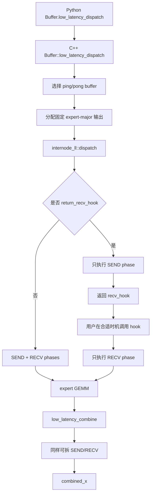
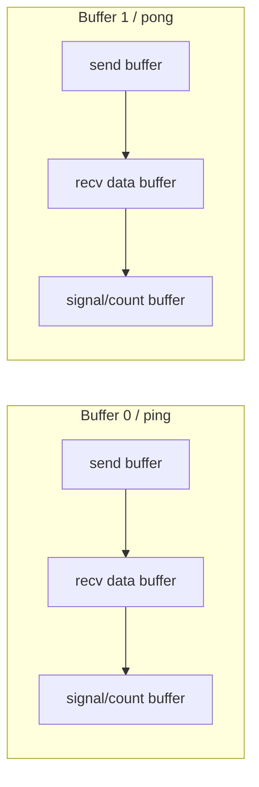
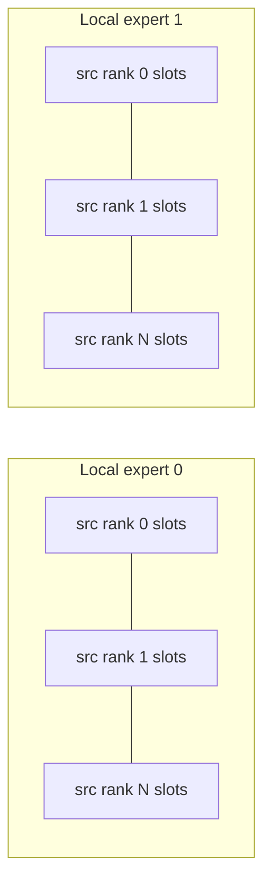
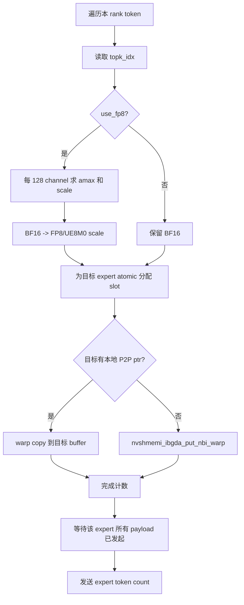
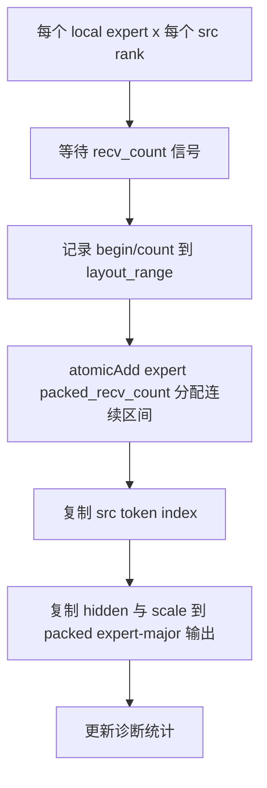
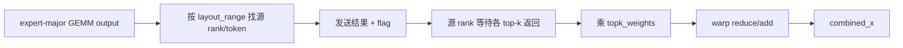

# DeepEP V1 Low-Latency 方案详解

> 本文对应仓库中的 V1 legacy `low_latency_dispatch` / `low_latency_combine` 路径。它面向推理解码阶段的小 batch，使用 NVSHMEM IBGDA、固定上界缓冲、expert-major 输出和可拆分的 send/recv phase，追求端到端微秒级延迟及通信与计算重叠。

## 1. 与 V1 normal/SM 方案的区别

| 维度 | V1 normal / SM | V1 low-latency |
|---|---|---|
| 主要场景 | 训练、prefill、大 token 批量 | autoregressive decoding、小 batch |
| 数据路径 | 单机 NVLink；多机 RDMA + NVLink 分层 | 所有 rank 统一使用可 RDMA 寻址的低时延路径；可对本地 P2P 做 bypass |
| 接收规模 | 默认 CPU 等待真实 token 数后精确分配 | 固定按最坏容量分配，不做 CPU exact-count sync |
| 输出布局 | token-major，另返回 per-expert list | expert-major 固定槽位 + GPU `recv_count` |
| SM 配置 | `Buffer.set_num_sms()` / `Config` | 没有用户侧 SM 控制 API，按设备 SM 与 expert 映射启动 |
| 缓冲结构 | 多 channel 有界环形队列 | 两套 ping-pong 固定 send/recv/signal buffer |
| overlap | CUDA event/通信流 | `return_recv_hook` 将 send 和 recv phase 拆开，可做双 micro-batch overlap |
| CUDA Graph | normal 默认受 CPU sync 限制 | 固定形状，兼容 CUDA Graph；重放时需维护缓冲状态 |
| combine 权重 | 向量加法规约，权重语义由上层组织 | 内核直接按 `topk_weights` 加权规约 |

low-latency 的设计取舍很明确：用更大的固定缓冲和更受限的形状，换掉运行时 CPU 同步、动态输出形状和多级 queue 控制。

### 1.1 经典图的逐阶段解读


这张图把 V1 的两条执行路径放在同一时间轴上：上半部分是普通/高吞吐 dispatch-combine 路径，下半部分是 Low-Latency 路径。二者都在做 `Attention → Dispatch → MoE → Combine`，根本区别是**谁负责推动跨节点通信前进**：

- 上半部分由 GPU 通信 kernel 持续驻留并推进发送、接收，因此通信阶段会占用通信 SM。
- 下半部分只在 `issue` 和 `receive` 边界运行短 GPU kernel；真正的网络传输由 NVSHMEM IBGDA/RDMA 在后台推进，使中间的 Attention 或 MoE 尽可能拿到更多 SM。
- 图中的 Stream 0/1 更适合看成两个交错的 micro-batch 逻辑泳道，不应机械理解为源码中永远固定的两个 CUDA stream。下半图画成单一 Stream 0，是为了突出“计算串行推进、RDMA 在后台并行”的关键关系。

颜色含义如下：

| 颜色 | 阶段 | 主要职责 |
|---|---|---|
| 绿色 | Attention | 当前或下一 micro-batch 的注意力计算 |
| 蓝色 | Dispatch | 按路由结果把 token 发送到目标 expert rank |
| 黄色 | MoE | expert grouped GEMM 及相关计算 |
| 黄绿色 | Combine | 把 expert 输出返回源 rank，并按 top-k 权重归并 |

#### 下半图的完整时间线

| 图中顺序 | 前台动作 | 后台动作 | 对应含义 |
|---:|---|---|---|
| 1 | `Attention 0` | 无 | micro-batch 0 产生待路由 hidden states 和 top-k 路由结果 |
| 2 | `Dispatch 0 issue` | 开始 RDMA | 发布 micro-batch 0 的 token、scale、源信息和计数 |
| 3 | `Attention 1` | Dispatch 0 RDMA | micro-batch 1 的 Attention 与 micro-batch 0 的网络传输重叠 |
| 4 | `Dispatch 0 receive`，随后 `Dispatch 1 issue` | Dispatch 1 RDMA 开始 | 收取 micro-batch 0 的 dispatch 结果，同时发布 micro-batch 1 |
| 5 | `MoE 0` | Dispatch 1 RDMA | expert 计算 0 与下一批 token 的传输重叠 |
| 6 | `Dispatch 1 receive`，随后 `Combine 0 issue` | Combine 0 RDMA 开始 | micro-batch 1 可进入 MoE；micro-batch 0 的 expert 输出开始返回 |
| 7 | `MoE 1` | Combine 0 RDMA | expert 计算 1 与上一批输出回传重叠 |
| 8 | `Combine 0 receive`，随后 `Combine 1 issue` | Combine 1 RDMA 开始 | 完成 micro-batch 0 的 top-k 加权归并，并发布 micro-batch 1 回传 |
| 9 | 下一轮 `Attention 0` | Combine 1 RDMA | 下一迭代的 Attention 隐藏上一批 combine 网络时间 |
| 10 | 后续 `Combine 1 receive` | — | 在真正消费 micro-batch 1 归并结果前完成接收 |

图中细竖线不是“零成本”的意思，而是把短暂的边界操作压缩表示。`issue` 与 `receive` 都仍然需要 GPU 执行；图要表达的是二者之间较长的网络飞行时间不需要通信 kernel 长驻 SM。

#### `issue` 在代码里做什么

Low-Latency kernel 通过 phase 模板把发送和接收拆成两次 launch。dispatch 的发送阶段可概括为：

```cpp
launcher(LEGACY_LOW_LATENCY_SEND_PHASE);
```

该阶段完成的核心工作包括：

1. 读取 `topk_idx`，确定每个 token 应发往哪些 expert/rank。
2. 按 expert 的固定容量槽位分配位置，形成接收端可直接消费的 packed 布局。
3. 在需要时执行 FP8/UE8M0 量化并生成 scale。
4. 写入 NVSHMEM 对称通信缓冲区中的 token、scale、源 token 信息与元数据。
5. 调用 `nvshmemi_ibgda_put_nbi_warp` 等 IBGDA 操作发布非阻塞 RDMA。
6. 更新计数或 flag，使接收端能够判断数据何时完整可见。

Combine 的发送阶段与之对称：它依据 dispatch 阶段保留下来的 `src_info`、`layout_range` 等信息，把各 expert 的输出发回 token 的源 rank，并发布完成标志。

因此，`issue` 的准确含义不是“已经完成通信”，而是“已把通信描述符和数据交给 NIC，可以让 GPU 转去执行别的计算”。

#### “with background RDMA”究竟意味着什么

在 issue kernel 返回之后，NIC 根据已发布的 work request 继续跨节点搬运数据。理想状态是：

```text
网络飞行期间通信 SM 占用 ≈ 0
计算 SM 可用于 Attention / MoE
```

这正是图中 “Overlapping without communication SMs” 的含义。但它有三个边界：

- **不是端到端零 SM。** issue、receive、量化、打包、解包、检查 flag 都会执行 GPU 指令。
- **不是完全零资源竞争。** RDMA 仍可能争用 HBM/L2、PCIe 或 NVLink 路径，具体取决于节点拓扑和数据路径。
- **不是 NIC 自动解决依赖。** 程序必须在使用接收数据前显式调用 receive hook；若网络尚未完成，receive kernel 会等待对应计数/flag。

#### `receive` 在代码里做什么

`Buffer::low_latency_dispatch` 在 `return_recv_hook=true` 时不会立即完成接收，而是返回一个 hook。其核心形态是：

```cpp
recv_hook = [=]() {
    launcher(LEGACY_LOW_LATENCY_RECV_PHASE);
};
```

调用 dispatch hook 后，接收阶段会：

1. 等待目标 expert 的到达计数和完成 flag。
2. 读取固定槽位中的 hidden states、scale 与源 token 元数据。
3. 生成/整理 `recv_x`、`recv_count`、`src_info`、`layout_range` 等后续 MoE 和 combine 所需对象。
4. 建立正确的 CUDA stream 依赖，保证 grouped GEMM 不会看到未完成的数据。

Combine hook 则等待回传数据，读取各 top-k expert 的输出，乘以相应的 `topk_weights`，再对同一源 token 做归约，最终形成 `combined_x`。

#### 为什么下半图可能更快

普通路径即使能通过双 micro-batch 把通信和计算叠加，通信 kernel 仍会占用一定数量的 SM。Low-Latency 路径的可见时间近似为：

```text
T_visible ≈ T_issue + max(T_compute, T_RDMA) + T_receive
```

收益来自两部分：

- `T_RDMA` 被 Attention 或 MoE 隐藏；
- 网络传输期间不保留通信 SM，前台计算能使用更多 SM，Attention/MoE 本身也可能更快。

如果 `T_RDMA > T_compute`，receive hook 仍需等待剩余网络时间；如果消息很大或目标偏斜严重，固定槽位和低延迟协议也未必优于普通高吞吐路径。因此这张图表达的是理想流水线机制，不是对所有负载都成立的固定性能结论。

#### Python 调用与图中边界的对应

| 图中标注 | Python/C++ 接口行为 |
|---|---|
| `Dispatch N issue` | 调用 `low_latency_dispatch(..., return_recv_hook=True)`，执行 SEND phase 并返回 hook |
| `Dispatch N receive` | 在 MoE 真正依赖数据前调用 dispatch `recv_hook()` |
| `MoE N` | 使用 `recv_x` 和 `recv_count` 执行 grouped GEMM |
| `Combine N issue` | 调用 `low_latency_combine(..., return_recv_hook=True)`，发布输出回传 |
| `Combine N receive` | 在下一层消费结果前调用 combine `recv_hook()`，完成加权归并 |

实现流水时需要遵守以下约束：

- `return_recv_hook=True` 与 `async_finish=True` 不能同时使用；两者代表不同的完成控制方式。
- hook 必须放在最晚但正确的依赖点：过早调用会损失重叠，过晚调用则会读到尚未完成的输出。
- 当前 low-latency 缓冲区使用双 buffer/ping-pong 思路，不能无限增加在途 micro-batch。
- 与某个 micro-batch 关联的输入 tensor、输出 tensor、handle 和元数据必须存活到对应 receive 完成。
- 生产代码应通过 CUDA event/stream wait 建立依赖，不应把图中的逻辑泳道误写成全局同步。

#### 与上半图的一句话对照

- **V1 普通路径：** GPU-resident progress——通信 kernel 在 SM 上持续推进传输，以吞吐和较大消息效率为目标。
- **V1 Low-Latency：** NIC-resident progress——GPU 只负责发布与收取，网络飞行阶段主要由 IBGDA/RDMA 推进，以低延迟和释放计算 SM 为目标。

V2 的协议和弹性/PP 能力另有设计，不应把这张 V1 图直接当成 V2 的执行时序；尤其 V2 并未原样保留 V1 这种 `0-SM` receive-hook EP 接口。

## 2. 代码地图

| 层次 | 文件 | 关键内容 |
|---|---|---|
| Python API | [`deep_ep/buffers/legacy.py`](../deep_ep/buffers/legacy.py#L538) | size hint、dispatch/combine、hook、zero-copy、mask 与诊断接口 |
| C++ 编排 | [`csrc/legacy/buffer.hpp`](../csrc/legacy/buffer.hpp#L1431) | ping-pong buffer 选择、固定输出分配、phase 拆分、event/hook |
| 内存布局 | [`csrc/legacy/config.hpp`](../csrc/legacy/config.hpp) | `LowLatencyBuffer`、`LowLatencyLayout`、消息大小和两套缓冲 |
| CUDA 内核 | [`csrc/kernels/legacy/internode_ll.cu`](../csrc/kernels/legacy/internode_ll.cu) | 清理、dispatch、combine、mask barrier、超时诊断 |
| 内核 API | [`csrc/kernels/legacy/api.cuh`](../csrc/kernels/legacy/api.cuh#L251) | low-latency launch 参数和 phase 接口 |
| IBGDA | [`csrc/kernels/legacy/ibgda_device.cuh`](../csrc/kernels/legacy/ibgda_device.cuh) | GPU 发起 put/atomic、QP 访问 |
| 测试 | [`tests/legacy/test_low_latency.py`](../tests/legacy/test_low_latency.py) | FP8/BF16、hook、zero-copy、LogFMT、shrink、性能测试 |

调用链：



## 3. 初始化要求

### 3.1 创建 low-latency buffer

```python
num_rdma_bytes = deep_ep.Buffer.get_low_latency_rdma_size_hint(
    num_max_dispatch_tokens_per_rank,
    hidden,
    group.size(),
    num_experts,
)

buffer = deep_ep.Buffer(
    group,
    num_nvl_bytes=0,
    num_rdma_bytes=num_rdma_bytes,
    low_latency_mode=True,
    num_qps_per_rank=num_experts // group.size(),
)
```

关键约束：

- `num_experts % num_ranks == 0`；
- 最佳性能下 `num_qps_per_rank == num_local_experts`，即每个 local expert 对应一个 QP；
- 所有 rank 必须能通过 NVSHMEM/IBGDA 路径访问；
- NVSHMEM QP depth 至少为 `(num_max_dispatch_tokens_per_rank + 1) * 2`；
- `num_max_dispatch_tokens_per_rank` 是固定容量，也是输出形状和显存开销的核心参数，解码场景通常应控制在 256 以下。

`Buffer.__init__` 在 low-latency 模式中以全局 rank 作为 NVSHMEM PE，而 normal 跨节点模式只以 `rdma_rank` 作为 PE。这使 low-latency 能直接面向整个 EP group 发起通信。

## 4. 固定消息与双缓冲布局

### 4.1 为什么采用固定容量

解码 batch 小，但调用频繁。如果先交换大小、CPU 读取计数、再分配动态输出，固定开销会主导总时延。low-latency 直接按上界：

```text
每个 local expert 最多接收 num_ranks * num_max_dispatch_tokens_per_rank 个槽位
```

真实有效数量由 GPU 张量 `packed_recv_count[local_expert]` 给出。

### 4.2 `LowLatencyLayout`

[`LowLatencyLayout`](../csrc/legacy/config.hpp) 在同一块 NVSHMEM symmetric buffer 中放置两套 buffer：



每次 dispatch/combine 都执行：

```cpp
auto buffer = layout.buffers[low_latency_buffer_idx];
auto next_buffer = layout.buffers[low_latency_buffer_idx ^= 1];
```

当前操作使用一套，下一套的 signal 区在本轮末尾清理。这样相邻调用交替使用，减少全局清零落在关键路径上，但也带来重要限制：**同一时刻最多安全持有两轮 low-latency 返回结果**。

### 4.3 消息大小

dispatch 消息包含：

```text
int4 control/source area
+ max(
    BF16 hidden bytes,
    FP8 hidden bytes + FP32/UE8M0 scales
  )
```

combine 消息包含：

```text
per-128-channel scale/min-max area
+ BF16 hidden bytes
```

两类消息共享 send/recv 物理区域，实际分配取 dispatch 和 combine 需求的最大值。整个布局含：

- 2 个 symmetric send buffer；
- 2 个 symmetric recv data buffer；
- 2 个按 128 字节对齐的 count/flag buffer。

size hint 最终按 legacy buffer alignment 向上对齐。

## 5. Low-Latency Dispatch 原理

### 5.1 输入输出

输入：

```text
x            : BF16 [T, H]
topk_idx     : topk_idx_t [T, K]
T            <= num_max_dispatch_tokens_per_rank
```

输出：

```text
packed_recv_x:
  BF16 或 FP8
  [num_local_experts, num_ranks * max_tokens, H]

packed_recv_x_scales（FP8 时）:
  逻辑上 [num_local_experts, num_ranks * max_tokens, H/128]
  底层采用适合 TMA/GEMM 的列主序 stride

packed_recv_count:
  int32 [num_local_experts]
```

同时返回：

```text
handle = (
  packed_recv_src_info,
  packed_recv_layout_range,
  num_max_dispatch_tokens_per_rank,
  hidden,
  num_experts
)
```

### 5.2 固定 expert-major 布局



对每个 local expert，每个源 rank 都预留 `max_tokens` 的容量。接收后内核把有效 token 压紧到该 expert 的前部，并生成：

- `src_info[expert, packed_slot]`：原源 token index；
- `layout_range[expert, src_rank]`：该源 rank 在 packed expert 区间中的起点和数量；
- `recv_count[expert]`：expert 总有效 token 数。

这种布局可直接作为 grouped GEMM 的输入，不需要 CPU 根据动态 token 数重新建张量。

### 5.3 CUDA kernel 的 warp-group 映射

[`internode_ll::dispatch`](../csrc/kernels/legacy/internode_ll.cu#L129) 以 SM 和 warp group 分配 expert：

```text
num_warp_groups = ceil(num_experts / num_device_sms)
responsible_expert_idx = sm_id * num_warp_groups + warp_group_id
```

一个 warp group 包含多个 warp：

- 数据 warp：读取 BF16 hidden，按需做 FP8 量化，并为 top-k 目标 expert 发起 IBGDA put；
- 计数 warp：扫描 `topk_idx`，统计每个 expert 的实际发送数；
- 接收侧一个 sub-warp 等待远端 count，其他 sub-warps 与等待过程重叠地搬运已到达 token。

### 5.4 SEND phase



几个关键点：

1. FP8 量化与网络发送融合，避免单独 cast kernel 和额外 HBM 往返。
2. 每个目标 expert 使用原子计数分配唯一 slot。
3. payload 发起完成后才发送 count，count 是接收侧可见性协议的一部分。
4. 本地 rank 若有可直接访问的 P2P 指针，可用 GPU copy bypass NIC；否则发起 IBGDA put。
5. `mask_buffer` 启用时，被 mask 的 rank 不再收发。

### 5.5 RECV phase



接收阶段不需要 CPU 参与。一个 sub-warp 专门轮询 count，其他 sub-warp 随后复制 payload；超时会记录具体 src rank、expert 和等待周期，并在未启用 shrink 时触发 trap。

### 5.6 FP8 scale 布局

默认 FP8 使用每 128 channel 一组 FP32 scale。为了后续 TMA/GEMM，C++ 先分配：

```text
[local_expert, H/128, num_ranks * max_tokens]
```

再做 transpose 视图，暴露逻辑形状：

```text
[local_expert, num_ranks * max_tokens, H/128]
```

因此它看起来 token-major，实际 stride 是列主序。`use_ue8m0=True` 时每 4 个 scale 打包成一个 `int`，并要求 `round_scale=True`。

## 6. Low-Latency Combine 原理

### 6.1 输入输出

输入 expert 结果：

```text
x: BF16 [num_local_experts, num_ranks * max_tokens, H]
```

还需要原始：

```text
topk_idx     [num_original_tokens, K]
topk_weights [num_original_tokens, K]
dispatch handle 中的 src_info 与 layout_range
```

输出：

```text
combined_x: BF16 [num_original_tokens, H]
```

combine 会对来自不同 expert 的结果乘对应 `topk_weights` 后相加，这是 low-latency 与 normal combine 语义上最重要的差异之一。

### 6.2 SEND phase

combine 根据 `layout_range[local_expert, src_rank]` 找到 dispatch 时由某个源 rank 发来的 token 区间：

1. 读取本地 expert GEMM 输出；
2. 根据 `src_info` 恢复源 token index；
3. 将返回消息写入源 rank 对称 recv buffer；
4. 可用 BF16 直接发送，也可使用内部 `LogFMT`（动态 per-64-channel cast 的 10-bit 格式）降低 payload；
5. 数据可见后写 flag，通知源 rank 某段结果到达。

### 6.3 RECV phase 与加权规约

源 rank 按本地 token 和 top-k expert 等待返回 flag，读取对应消息并：

```text
combined_x[token] = sum_k(expert_output[token, k] * topk_weights[token, k])
```

无效 `topk_idx == -1` 跳过。内核对 hidden 维做 warp 向量化规约，最后写 BF16 输出；可直接写用户传入的 `out`，避免额外分配。



## 7. Send/Recv Phase 与 Hook

### 7.1 phase 位

底层内核接收 `phases` bitmask：

```text
LEGACY_LOW_LATENCY_SEND_PHASE
LEGACY_LOW_LATENCY_RECV_PHASE
```

普通模式一次 launch 同时包含二者。`return_recv_hook=True` 时：

1. 首次 launch 仅执行 SEND；
2. C++ 返回 Python callable；
3. 用户调用 hook 后，再次 launch 同一内核但只执行 RECV。

### 7.2 为什么 hook 能释放计算 SM

SEND phase 只负责把 RDMA work request 发给 NIC。请求发出后，数据传输由 NIC/DMA 在后台进行；此时不需要持续占用 GPU SM。用户可在网络传输期间启动另一个 micro-batch 的 attention 或 MoE GEMM，直到真正需要结果时调用 RECV hook。

### 7.3 双 micro-batch overlap

```mermaid
gantt
    title 双 batch 低时延流水示意
    dateFormat X
    axisFormat %L
    section Batch A
    Attention A      :a1, 0, 3
    Dispatch SEND A  :a2, 3, 1
    RDMA in background A :a3, 4, 4
    Dispatch RECV A  :a4, 8, 1
    MoE A            :a5, 9, 4
    Combine SEND A   :a6, 13, 1
    Combine RECV A   :a7, 17, 1
    section Batch B
    Attention B      :b1, 4, 3
    Dispatch SEND B  :b2, 7, 1
    Dispatch RECV B  :b3, 11, 1
    MoE B            :b4, 12, 4
```



真实 stage 长度应按模型测量调整。hook 模式的约束：

- `return_recv_hook=True` 与 `async_finish=True` 不能同时使用；
- hook 模式在当前/default compute stream 上启动，调用方负责排好依赖；
- hook 必须调用，否则返回张量尚未真正接收完成；
- 若允许本地 NVLink/P2P bypass，某些本地复制仍可能与计算资源发生竞争，仓库注释提示它与纯 hook overlap 并非完全兼容。

## 8. Zero-Copy Combine

[`get_next_low_latency_combine_buffer`](../deep_ep/buffers/legacy.py#L700) 暴露下一轮 combine 将使用的 RDMA send buffer，形状与 expert-major GEMM 输出一致：

```python
rdma_out = buffer.get_next_low_latency_combine_buffer(handle)
# 让 GEMM 直接写 rdma_out
combined_x, event, hook = buffer.low_latency_combine(
    rdma_out,
    topk_idx,
    topk_weights,
    handle,
    zero_copy=True,
)
```

正常 combine 先把 `x` 复制到 registered send buffer，再由 NIC 读取。zero-copy 要求上游 GEMM 直接写该 buffer，可消除一次 HBM copy。代价是：

- 上层必须严格遵守 buffer 的 shape、dtype 和生命周期；
- 必须与 ping-pong index 对齐；
- 不能覆盖尚未完成的上一轮数据；
- `LogFMT` 路径与 zero-copy 的组合受到测试限制。

## 9. Shrink / Rank Mask

构造 `Buffer(enable_shrink=True)` 后，low-latency 提供：

```python
buffer.low_latency_update_mask_buffer(rank_to_mask, True)
buffer.low_latency_query_mask_buffer(mask_status)
buffer.low_latency_clean_mask_buffer()
```

mask 的作用：

- dispatch/combine 跳过被 mask rank 的收发；
- 自定义 barrier 只等待未 mask rank；
- 某个 rank 超时后可自动写 mask，防止后续一直等待。

底层 `mask_buffer` 和 `sync_buffer` 位于 NVSHMEM 对称内存。自定义 barrier 以远端 atomic 更新计数；未启用 shrink 时则使用 `nvshmemx_barrier_all_block()`。

注意：rank shrink 会改变业务语义——被 mask rank 上的 expert 结果缺失。它是容错/降级机制，不是透明的一致性恢复。

## 10. Buffer 清理

signal/count buffer 必须以零为初始状态。以下情况需调用：

```python
buffer.clean_low_latency_buffer(max_tokens, hidden, num_experts)
```

- low-latency buffer 可能被其他路径写脏；
- CUDA Graph replay 或异常中断后信号状态不确定；
- 调试时切换了通信模式或布局参数。

清理内核在写零前、后都做全局 barrier，避免还有未完成的上一轮 chunked EP 访问同一 buffer。

## 11. 诊断张量

### 11.1 Expert 负载统计

`cumulative_local_expert_recv_stats[int32, num_local_experts]` 在 dispatch 接收时累加实际 token 数，用于在线观察 gate 负载均衡。

### 11.2 等待时间统计

```text
dispatch_wait_recv_cost_stats[int64, num_ranks]
combine_wait_recv_cost_stats[int64, num_ranks]
```

内核把等待各来源数据的 `clock64()` 周期累计到对应元素，可用于定位具体慢 rank/NIC。Python 文档中曾以二维全局视角描述，上送到单个 C++ 调用的实际检查是当前 rank 的一维 `[num_ranks]` slice。

## 12. API 详解

### 12.1 `low_latency_dispatch`

| 参数 | 含义 |
|---|---|
| `x` | BF16 `[T, H]` |
| `topk_idx` | `[T, K]`，支持 `-1` |
| `num_max_dispatch_tokens_per_rank` | 固定容量，所有 rank 一致 |
| `num_experts` | 全局 expert 数 |
| `use_fp8` | dispatch 时融合 BF16→FP8 |
| `round_scale` | 将 scale 舍入为 2 的幂 |
| `use_ue8m0` | 使用打包 UE8M0 scale；要求 `round_scale=True` |
| `async_finish` | 返回 event，不让当前 stream 等待通信流 |
| `return_recv_hook` | 只发起 SEND，返回 RECV callable |

### 12.2 `low_latency_combine`

| 参数 | 含义 |
|---|---|
| `x` | BF16 expert-major 输出 |
| `topk_idx/topk_weights` | 原始 token 的路由与权重 |
| `handle` | dispatch 返回的源信息和 layout range |
| `use_logfmt` | 用内部低比特格式压缩 combine 消息 |
| `zero_copy` | `x` 已位于下一轮 registered RDMA buffer |
| `out` | 可选 in-place BF16 输出 |
| `return_recv_hook` | 拆分 combine SEND/RECV |

### 12.3 完整示例

```python
recv_x, recv_count, handle, event, recv_hook = buffer.low_latency_dispatch(
    hidden_states,
    topk_idx,
    num_max_dispatch_tokens_per_rank=max_tokens,
    num_experts=num_experts,
    use_fp8=True,
    async_finish=False,
    return_recv_hook=True,
)

# 网络正在后台搬运；这里可安排独立计算
recv_hook()

# grouped GEMM 只处理每个 expert 的 recv_count[e] 个有效槽
expert_output = run_grouped_gemm(recv_x, recv_count)

combined_x, event, combine_hook = buffer.low_latency_combine(
    expert_output,
    topk_idx,
    topk_weights,
    handle,
    return_recv_hook=True,
)

# 安排其他独立计算后再真正接收和规约
combine_hook()
```

## 13. 约束与常见错误

### 13.1 形状约束

- `x` 必须 contiguous BF16；
- hidden 必须满足 `int4` 和 128 对齐，实际 JIT/模板只支持若干预实例化 hidden；
- FP8 路径要求 hidden 满足 scale pack 对齐，当前 C++ 检查要求 `hidden % 512 == 0`；
- `num_topk` 受内核模板上限约束；dispatch launch 代码的最大 top-k 常量为 11；
- `num_ranks * max_tokens` 必须满足 TMA token 维对齐要求，当前实现要求能被 4 整除。

### 13.2 生命周期约束

- 两套 buffer 意味着不要长期保留超过两轮的返回 tensor；
- hook 捕获了当前输入、输出和 layout，调用前不得释放或改写；
- `EventOverlap` 在 async 模式下保存相关 tensor 引用，避免 stream 完成前被析构；
- zero-copy buffer 只属于“下一轮” combine。

### 13.3 QP 与容量

- QP 数最好等于 local expert 数；
- QP depth 必须覆盖每轮可能在途的 WR；
- `max_tokens` 过大会让 send、recv 和 signal 的双缓冲显存线性增大；
- `max_tokens` 小于真实 batch 会触发断言，不能动态扩容。

### 13.4 所有 rank 的调用顺序

即使数据面是点对点 RDMA，buffer 清理、barrier 和 phase 协议仍要求各 rank 以一致顺序推进。某一 rank 漏调 hook、重复使用错误 buffer 或提前进入下一轮，都可能造成其他 rank 等待错误的 count/flag。

## 14. 性能机制总结

low-latency 之所以适合 decode：

- 固定输出形状，消除 CPU exact-count round trip；
- 数据量化、路由和 RDMA put 融合在一个 kernel；
- QP 与 local expert 对齐，降低共享/仲裁开销；
- payload 后发 count/flag，协议简单；
- expert-major 输出可直接接 grouped GEMM；
- send/recv phase 可拆，NIC 传输期间不占计算 SM；
- ping-pong buffer 把清零与下一轮准备流水化；
- combine 可融合权重规约、LogFMT 和 in-place 输出；
- zero-copy 可让 GEMM 直接生产网络 send buffer。

## 15. 建议的源码阅读顺序

1. [`get_low_latency_rdma_size_hint`](../deep_ep/buffers/legacy.py#L176) 和 [`LowLatencyLayout`](../csrc/legacy/config.hpp)：先看固定显存代价。
2. [`Buffer.low_latency_dispatch`](../deep_ep/buffers/legacy.py#L553)：理解 Python 输出、handle 与约束。
3. [`Buffer::low_latency_dispatch`](../csrc/legacy/buffer.hpp#L1456)：理解 ping-pong、stream、phase 和 hook。
4. [`internode_ll::dispatch`](../csrc/kernels/legacy/internode_ll.cu#L129)：看融合量化、expert slot、count 协议和 packed receive。
5. [`Buffer.low_latency_combine`](../deep_ep/buffers/legacy.py#L624)：理解权重、zero-copy、out。
6. [`Buffer::low_latency_combine`](../csrc/legacy/buffer.hpp#L1598)：看 combine 的 phase 编排。
7. [`internode_ll::combine`](../csrc/kernels/legacy/internode_ll.cu#L715)：看回传、等待 flag 和加权规约。
8. [`tests/legacy/test_low_latency.py`](../tests/legacy/test_low_latency.py)：把 FP8、hook、LogFMT、zero-copy 和 shrink 组合跑通。

## 16. 一句话总结

V1 low-latency 的本质是：**为每个 expert/来源预留固定 RDMA 槽位，用 GPU 融合量化和 IBGDA 发包，以 count/flag 完成无 CPU 的到达协议，再通过 ping-pong buffer 和可拆 send/recv hook 把 NIC 传输隐藏在其他 micro-batch 计算之后。**
