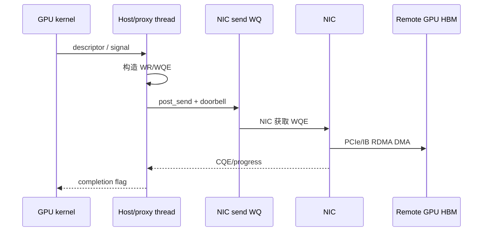
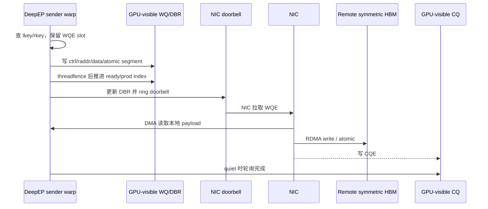
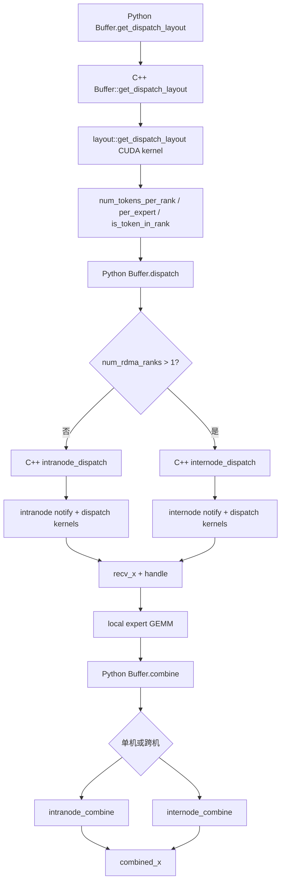
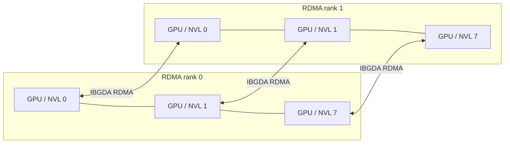
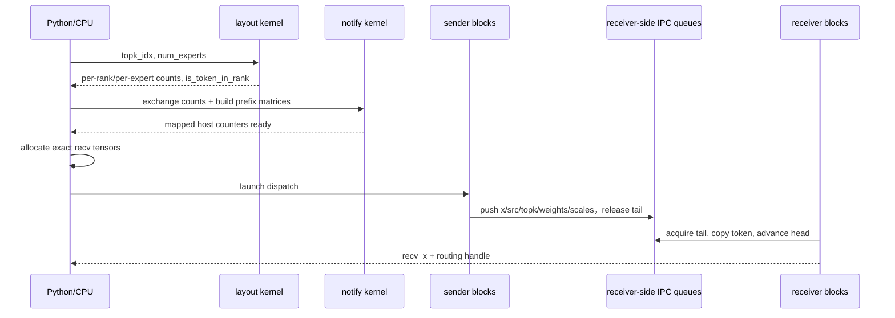
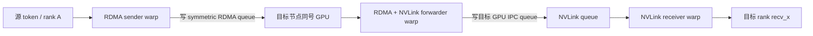
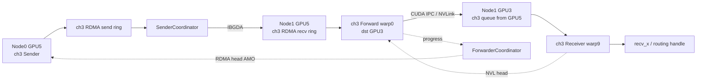
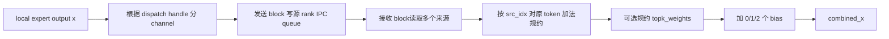
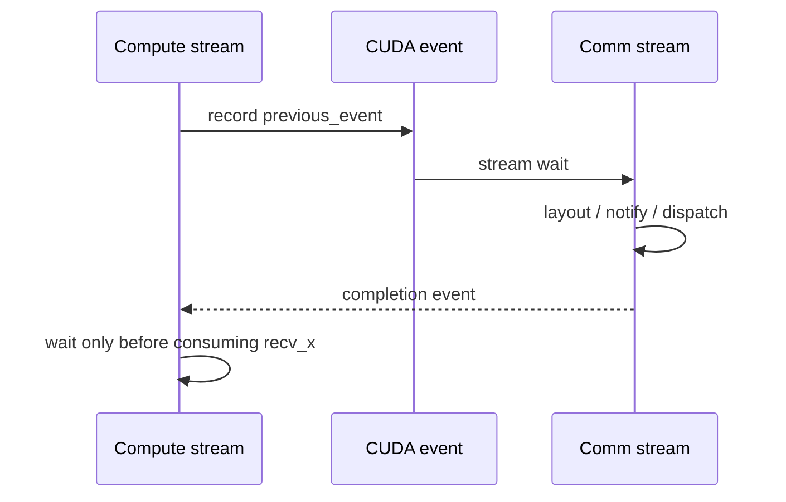

# DeepEP V1 SM 通信方案详解

[六篇学习目录](reading-guide.md) · [IBGDA 原理前置教程](tutorial-ibgda-principles.md) · [CPU-assisted 与部署](tutorial-nvshmem-deployment.md) · [HTML 阅读版](html/implementation-v1-sm.html)

> 本文对应仓库中的 **V1 legacy normal / high-throughput** 路径。这里的“SM 通信方案”指由常驻 CUDA 通信内核占用一定数量的 SM，使用 GPU 线程主动完成队列管理、数据搬运、NVLink 访问和 IBGDA RDMA 发起的方案；它不是 V1 的 `low_latency_dispatch/low_latency_combine` 路径。
> **研究双基线：**本地教程文档基线为 `f99f06868616c6fa96f83ff1caa5f0231f9ee3bc`（2026-08-25），该提交仅新增三篇 implementation 文档；实际 DeepEP 上游源码基线为其父提交 `01dc3aaac82068020353dce2c302e38153c0bfaa`（deepseek-ai `origin/main`，2026-08-04）。本文在 2026-08-26 重新核对了该上游源码、仓库新增的两份专题研究稿、DeepSeek-V3 技术报告以及 NVIDIA CUDA/NVSHMEM 官方文档。仓库 `docs/legacy.md` 明确提示开源实现可能与论文略有不同；二者冲突时，本文描述“上述上游源码 commit 怎么做”，论文只用于解释设计背景。

本文用三个标签区分证据强度：

- **【源码可证】**：能由上述上游源码 commit 的代码、注释、断言或测试直接确认。
- **【官方资料背景】**：来自 DeepEP/DeepSeek 或 NVIDIA 官方文档，用于解释设计动机和硬件语义。
- **【推导/调优假设】**：由源码结构推演出的性能模型、故障假设或实验建议；需要在目标集群上测量，不能当成实现保证。

> **源码摘录约定：**每个机制都给出项目内文件、符号或行号链接。代码块中的 `// ...`、`/* ... */` 只压缩与当前知识点无关的参数、循环或字段，不能脱离链接指向的完整源码直接编译；凡是教学伪代码都会明确标注“伪代码”，未标注者均保持真实控制分支和变量语义。

## 1. 方案定位

V1 SM 方案面向 MoE 训练和推理 prefill 的大批量通信，核心目标是把 dispatch/combine 做成高吞吐的 GPU 侧 All-to-All：

- 单节点：GPU 之间经 CUDA IPC 暴露对端缓冲区，数据走 NVLink。
- 多节点：同一节点内走 NVLink；不同节点中相同本地 GPU 编号的 rank 组成 RDMA 域，跨节点走 NVSHMEM IBGDA，再由节点内 GPU 转发。
- 通信由 CUDA block/warp 执行，因此需要显式配置 `num_sms`。
- 数据和元数据采用分通道的环形队列，使用 `head/tail` 做流量控制。
- dispatch 前先计算路由布局；首次 dispatch 通常需要 CPU 等待 GPU 写回实际接收 token 数量，以便精确分配输出张量。
- dispatch 返回的 handle 保存反向路由信息，combine 沿原路径把 expert 输出送回源 rank 并规约。

典型调用是：

```text
gate/top-k
  -> get_dispatch_layout
  -> dispatch
  -> local expert GEMM
  -> combine
```

### 1.1 先讲清 IBGDA：它解决什么、V1 normal 在哪里使用

#### 1.1.1 IBGDA 把逐消息 RDMA 控制面下沉到 GPU

IBGDA 是 **InfiniBand GPU Direct Async**。GPU Direct RDMA 解决“NIC 能否直接 DMA GPU 显存”，IBGDA 进一步解决“谁来准备并提交网络工作”。即使 NIC 已能 DMA GPU HBM，非 IBGDA 路径仍可能需要 CPU/proxy thread 将 GPU 的通信意图转换成 verbs work request、提交 WQE 并敲 doorbell；IBGDA 让 GPU 直接访问 NIC work queue、doorbell record 和 completion queue。

不使用 IBGDA、由 host/proxy 逐消息推进的典型路径是：



这种路径兼容性和 CPU 端协议灵活性较好，也能服务于不能把 NIC doorbell 映射给 GPU 的平台；代价是小消息会经历 GPU→CPU 通知、proxy 调度和 CPU→NIC 提交，可能引入 CPU 抖动、NUMA/PCIe 控制流往返与同步。

traditional IBGDA 的热路径则是：



IBGDA 省掉的是**逐消息** CPU/proxy 控制，不是所有 host 工作。启动时 host 仍负责 NVSHMEM bootstrap、QP/CQ 创建、显存注册、key/PE 信息交换和资源销毁；GPU 只在这些资源建好后直接发 WQE。好处是 GPU 路由/组包后可立即提交 RDMA，并与 NVLink forwarding 流水化；代价是 warp 要查 key、填 WQE、同步、敲 doorbell和轮询 CQ，QP/WQ/CQ 也占 GPU/NIC 资源。

仓库 [`docs/nvshmem.md:32-56`](nvshmem.md#2-enable-nvshmem-ibgda-support) 还列出两种 **都属于 IBGDA** 的部署：

- traditional IBGDA：通过 NVIDIA driver regkeys 打开能力，GPU 生成 WR 并管理 NIC 控制面；
- CPU-assisted asynchronous post-send IBGDA：安装 GDRCopy 并加载 `gdrdrv`；GPU 仍生成 WR，CPU 只辅助 doorbell-ringing，项目文档注明有小幅性能损失。

第二种不是“完全未使用 IBGDA”的 host/proxy transport。NVIDIA 官方将它描述为 traditional IBGDA 与 proxy-based transport 之间的兼容模式；DeepEP 只显式请求 `NVSHMEM_IB_ENABLE_IBGDA=1`，具体 post-send 方式由部署和 NVSHMEM 决定。

#### 1.1.2 V1 normal 的使用边界和初始化代码

| 场景 | 数据路径 | IBGDA | 通信 SM |
|---|---|---:|---:|
| 单节点，`num_rdma_ranks == 1` | CUDA IPC + NVLink | 标准 normal 构造不初始化/不使用；兼容 LL 的构造可初始化，但本次 normal 调用仍不走 IBGDA | sender/receiver block 仍占用 |
| 跨节点，`num_rdma_ranks > 1` | 同号 GPU 间 IBGDA，再 NVLink fan-out | 使用 | sender/coordinator/forwarder/receiver 均占用 |

Python 分支直接证明这条边界（[`legacy.py:103-135`](../deep_ep/buffers/legacy.py#L103)，以下均为固定上游 commit 的节选）：

```python
root_unique_id = None
if self.runtime.get_num_rdma_ranks() > 1 or low_latency_mode:
    os.environ['NVSHMEM_IB_ENABLE_IBGDA'] = '1'
    os.environ['NVSHMEM_IBGDA_NUM_RC_PER_PE'] = f'{num_qps_per_rank}'
    self.nvshmem_qp_depth = int(os.environ.get('NVSHMEM_QP_DEPTH', '1024'))
    os.environ['NVSHMEM_CUMEM_GRANULARITY'] = f'{2 ** 29}'
    # gather NVSHMEM unique ID ...
self.runtime.sync(device_ids, ipc_handles, root_unique_id)
```

- canonical normal 下 `low_latency_mode=False`，只有 `get_num_rdma_ranks()>1` 才进入分支。若为兼容 LL 以 `low_latency_mode=True` 构造，单节点也会初始化 NVSHMEM/IBGDA；但 Python 仍把该次 normal dispatch/combine 分流到 intranode kernel，数据面不执行 IBGDA。
- `NVSHMEM_IBGDA_NUM_RC_PER_PE` 配置每个目标 PE 的 RC QP 数。
- QP depth 是在途 WR 容量。源码注释说 DeepEP 让它大于在途 WR以省去热路径逐次 slot 检查，但队列并非无限。
- `NVSHMEM_CUMEM_GRANULARITY=2^29` 是 512 MiB allocation/registration 粒度；逻辑 put 跨实际注册 chunk 时仍拆 WQE。
- unique ID 用于 bootstrap，Python 不参与后续逐消息发起。

C++ 将 normal 的 NVSHMEM PE 定义成 `rdma_rank`，而不是全局 rank（[`buffer.hpp:255-285`](../csrc/legacy/buffer.hpp#L255)）：

```cpp
auto nvshmem_rank = low_latency_mode ? rank : rdma_rank;
auto num_nvshmem_ranks = low_latency_mode ? num_ranks : num_rdma_ranks;
nvshmem::init(root_unique_id, nvshmem_rank, num_nvshmem_ranks,
              low_latency_mode ? LEGACY_NUM_MAX_NVL_PEERS : 0);
rdma_buffer_ptr = nvshmem::alloc(num_rdma_bytes,
                                 LEGACY_NUM_BUFFER_ALIGNMENT_BYTES);
nvshmem::barrier(true);
```

normal 中，每个本地 `nvl_rank` 分别形成一个包含各节点 `rdma_rank` 的 NVSHMEM world；`rdma_buffer_ptr` 是各 PE 同规则分配并注册给 NIC 的 symmetric heap。远端访问按“相同 symmetric offset + 目标 PE”翻译，节点内其他 GPU 则由 `buffer_ptrs[]` CUDA IPC 映射访问。

#### 1.1.3 从 symmetric 地址到 NIC DMA：QP、key、WQE、doorbell

[`ibgda_device.cuh`](../csrc/kernels/legacy/ibgda_device.cuh) 的 payload 调用链是：

```text
internode::dispatch/combine
  -> nvshmemi_ibgda_put_nbi_warp
     -> ibgda_get_rc(dst_pe, qp_id)
     -> ibgda_get_lkey_and_rkey
     -> ibgda_reserve_wqe_slots
     -> ibgda_write_rdma_write_wqe
     -> ibgda_submit_requests
        -> ibgda_post_send
           -> ibgda_update_dbr + ibgda_ring_db
```

QP 选择（[`ibgda_device.cuh:81-86`](../csrc/kernels/legacy/ibgda_device.cuh#L81)）：

```cpp
return &state->globalmem.rcs[
    pe * num_rc_per_pe * state->num_devices_initialized +
    id % (num_rc_per_pe * state->num_devices_initialized)];
```

`pe` 是目标 `rdma_rank`；`id` 通常是 `channel_id`，反向 credit 还可用 `channel_id + num_channels`。索引包含 NIC device 数，所以 QP 数、channel 数和 rail 数需一起分析。

key/地址翻译（[`ibgda_device.cuh:205-232`](../csrc/kernels/legacy/ibgda_device.cuh#L205)）：

```cpp
auto idx = ((laddr - heap_start) >> log2_cumem_granularity)
         * state->num_devices_initialized + dev_idx;
*lkey = state->constmem.lkeys[idx].key;
auto roffset = raddr - heap_start;
*out_raddr = reinterpret_cast<uint64_t>(
    nvshmemi_device_state_d.peer_heap_base_remote[dst_pe]) + roffset;
*out_rkey = device_key.key;
return min(lchunk_size, rchunk_size);
```

`lkey` 授权 NIC 读本地 GPU buffer，`rkey` 授权远端写注册区。调用方的 `raddr` 是本 PE symmetric VA，helper 用 offset 加目标 PE remote heap base。返回本地/远端 registration chunk 剩余长度的较小值，所以跨界逻辑 put 会拆成多个 WQE；72 B metadata put也不是硬件原子写。

warp 填 WQE（[`ibgda_device.cuh:335-380`](../csrc/kernels/legacy/ibgda_device.cuh#L335)）：

```cpp
if (lane_id == 0)
    base_wqe_idx = ibgda_reserve_wqe_slots(qp, num_wqes);
if (lane_id < num_wqes)
    ibgda_write_rdma_write_wqe(..., base_wqe_idx + lane_id, ...);
__syncwarp();
if (lane_id == 0)
    ibgda_submit_requests<kAlwaysDoPostSend>(
        qp, base_wqe_idx, num_wqes, message_idx);
```

lane 0 预留连续 slot；每个有效 lane 填一个注册 chunk 的 control、remote address/rkey 和 local data/lkey segment。提交端（[`ibgda_device.cuh:128-166`](../csrc/kernels/legacy/ibgda_device.cuh#L128)）执行：

```cpp
__threadfence();  // WQE 内容先对设备可见
while (atomicCAS(ready_idx, base_wqe_idx, new_wqe_idx)
       != base_wqe_idx) { }
ibgda_update_dbr(qp, new_wqe_idx);
ibgda_ring_db(qp, new_wqe_idx);
```

`ready_idx` 让共享 QP 的提交形成无空洞前缀；DBR 记录下一个空 WQEBB，doorbell 触发 NIC 拉取 WQE。`__threadfence()` 保证 WQE 写先于 doorbell，不代表远端完成。

#### 1.1.4 payload、tail atomic 与 CQ/quiet

internode dispatch coordinator 先 put payload，再在同一 `channel_id` QP 上提交 tail AMO（[`internode.cu:812-845`](../csrc/kernels/legacy/internode.cu#L812)）：

```cpp
nvshmemi_ibgda_put_nbi_warp<true>(
    dst_ptr, src_ptr, num_bytes_per_msg,
    dst_pe, channel_id, lane_id, 0);
__syncwarp();
if (lane_id == dst_rdma_rank)
    nvshmemi_ibgda_amo_nonfetch_add(
        rdma_channel_tail.buffer(rdma_rank), num_tokens_to_issue,
        dst_pe, channel_id, dst_rdma_rank == rdma_rank);
```

远端 Forwarder 观察到 tail 后才消费 ring slot。`quiet` 则按当前提交前缀轮询 CQ（[`ibgda_device.cuh:462-494`](../csrc/kernels/legacy/ibgda_device.cuh#L462)）：

```cpp
uint64_t prod_idx = state->use_async_postsend
    ? ld_na_relaxed(qp->tx_wq.prod_idx)
    : ld_na_relaxed(&qp->mvars.tx_wq.ready_head);
ibgda_poll_cq(qp->tx_wq.cq, prod_idx);
```

V1 normal 不在每个 chunk 后 quiet；`notify_dispatch` 在清理/复用 RDMA buffer 前 quiet 旧 QP，再做 NVSHMEM/NVLink barrier。边界是：

- `put_nbi` 是非阻塞提交，不等于远端已可消费；
- `quiet` 是完成/复用边界，`fence`/`threadfence` 主要排序；
- payload→tail 依赖当前实现将二者排在同一 RC QP；独立 QP 之间不能照搬。

#### 1.1.5 IBGDA 仍然是“SM 通信方案”

normal internode 的 sender warp 组包，sender coordinator 填 WQE/doorbell，forwarder 轮询 RDMA tail 并转发，NVL receiver 轮询并落输出。NIC 飞行阶段不需要逐消息 CPU proxy，但这些常驻 block 仍参与 GPU progress：

```text
IBGDA = GPU 直接驱动网络控制面
     != 不占 GPU SM
     != 整个 dispatch/combine 期间没有 CUDA kernel
```

V1 low-latency 的“网络在途阶段 0 communication SM”来自拆分 SEND/RECV kernel，不是 IBGDA 自动带来的性质。两条 V1 路径在需要网络传输、且未命中本地 P2P bypass 时都会使用 IBGDA，但 GPU progress 的组织不同；单节点 normal 数据面仍只走 CUDA IPC/NVLink。

### 1.2 经典双 micro-batch 重叠图


这张图把 V1 的两种执行策略放在同一条时间轴上：

- 上半部分 **Traditional overlapping with communication SMs** 对应 V1 normal/high-throughput 的传统计算通信重叠。
- 下半部分 **Overlapping without communication SMs** 对应 V1 low-latency 的 send/receive phase 拆分和后台 RDMA。
- `0`、`1` 表示两个交错推进的 micro-batch；末尾再次出现 `Attention 0`，表示流水进入下一层或下一轮，而不是重复执行同一个 attention。
- 图中的 `Stream 0/Stream 1` 首先是“两个 micro-batch 的逻辑执行泳道”。它不是对源码中某两条固定 CUDA stream 的逐周期截图；实际代码还包含当前 compute stream、DeepEP `comm_stream`、CUDA event 和多个 kernel launch。

#### 上半部分如何对应 V1 SM 方案

单个 micro-batch 的依赖链仍然是：

```text
Attention
  -> Dispatch
  -> MoE expert computation
  -> Combine
  -> 下一层 Attention
```

两个 micro-batch 错开后，图中形成三段主要重叠：

| 时间窗口 | Stream 0 | Stream 1 | 资源关系 |
|---|---|---|---|
| 第一段 | `Dispatch 0` | `Attention 1` | 通信 kernel 与 attention 同时占用 GPU |
| 第二段 | `MoE 0` | `Dispatch 1` | expert GEMM 与通信 kernel 同时运行 |
| 第三段 | `Combine 0` | `MoE 1` | combine 通信与另一批 expert GEMM 重叠 |

这类 overlap 能隐藏一部分通信时间，但 **Dispatch/Combine 本身仍是活跃的 CUDA 通信内核**。在 V1 normal 中，用户通过 `Config.num_sms` 或 `Buffer.set_num_sms()` 为它们保留 SM；内核中的 sender、receiver、forwarder 和 coordinator warps 会持续执行：

- 读取/写入 NVLink 或 RDMA queue；
- 轮询 `head/tail`、count 和 signal；
- 使用 TMA 或向量 LD/ST 搬运 token；
- 发起 IBGDA put/atomic；
- 在 combine 中读取多个来源并规约。

因此同一时刻的 SM 资源可近似理解为：

```text
可供 Attention/MoE 的 SM
  ≈ GPU 总 SM
   - 正在占用的通信 SM
   - 其他运行时开销
```

这里的“重叠”只表示时间上并发，不代表通信免费。通信 kernel 还会与 Attention/MoE 竞争 HBM 带宽、L2、NVLink、寄存器和调度槽，所以 `num_sms` 并非越大越好：

- 太少：Dispatch/Combine 时间变长，网络可能打不满；
- 太多：通信更快，但 Attention/MoE 可用 SM 下降，端到端反而变慢；
- 最优值取决于 hidden、token 数、EP 拓扑、NIC 带宽和实际 GEMM。

#### 图中的一个方块在源码中包含什么

图为了突出 pipeline，把多个底层阶段压缩成一个 `Dispatch` 或 `Combine` 方块。以 normal dispatch 为例，实际还包括：

```text
get_dispatch_layout
  -> notify/count exchange
  -> CPU exact-count wait（默认模式）
  -> 输出张量分配
  -> data dispatch kernel
  -> completion event
```

跨节点时，data dispatch 内部又包含：

```text
RDMA sender
  -> IBGDA transfer
  -> RDMA/NVLink forwarder
  -> NVLink receiver
```

所以图中方块宽度代表这一整段端到端时间，而不是单个 CUDA kernel 的持续时间。

#### 与源码 stream/event 的对应关系

典型实现不是把所有操作硬编码到图中的两条 stream，而是：

1. Attention/MoE 在调用方当前 compute stream 上执行；
2. `previous_event` 把计算完成依赖交给 DeepEP `comm_stream`；
3. Dispatch/Combine 在 `comm_stream` 上运行；
4. `async_finish=True` 返回 `EventOverlap`；
5. 下一段真正消费通信结果前再调用 `event.current_stream_wait()`。

这样可以构造出图中上半部分的交错时序，但上层框架仍需负责两个 micro-batch 的 tensor 生命周期、stream ownership 和依赖顺序。

#### 图的边界

上半部分最准确地表达的是“V1 normal 通过通信 SM 做 overlap 的资源代价”，而不是说 normal 路径只能用两条 stream，或每个彩色块必须串行占满整张 GPU。实际并发程度还受 CUDA block 调度、kernel occupancy、HBM/NVLink/RDMA 瓶颈影响。

下半部分通过拆分 issue/receive 来避免网络在途期间持续占用通信 SM，属于 V1 low-latency 路径；其逐阶段解释见 [V1 Low-Latency 文档](implementation-v1-low-latency.md#11-经典图的逐阶段解读)。

## 2. MoE 语义

设：

- EP rank 数为 `R`；
- 全局 expert 数为 `E`，每个 rank 持有 `E / R` 个 local expert；
- 本 rank 有 `T` 个输入 token；
- 每个 token 选择 `K` 个 expert；
- `topk_idx[t, k]` 是 token `t` 第 `k` 个目标 expert，`-1` 表示无效选择。

### 2.1 Dispatch

dispatch 将源 rank 上的 token 复制到拥有目标 expert 的 rank。一个 token 的多个 expert 若位于同一 rank，通信层只发送一份 token 数据，同时携带该 rank 对应的本地 expert 索引和权重。

输出包括：

- `recv_x`：当前 rank 接收的 token；
- `recv_topk_idx`：已转换为当前 rank 本地 expert 编号的索引，非本 rank expert 置为 `-1`；
- `recv_topk_weights`：与本地有效 expert 对应的权重，无效项置零；
- 每个 local expert 的 token 数；
- combine 所需的反向路由 handle。

### 2.2 Combine

本地 expert 完成计算后，combine 根据 dispatch 保存的源 token 和队列位置，把结果送回原 rank。V1 normal 的 combine API 对 token 向量做加法规约；若传入 `topk_weights`，权重本身也可随路径归并，但向量是否乘权重应由上层计算约定决定。代码注释明确将该接口描述为 “addition without weights”。

训练时有如下对偶关系：

```text
dispatch forward  <-> combine backward
combine forward   <-> dispatch backward（复用 cached handle）
```

## 3. 实现分层与代码地图

| 层次 | 关键文件 | 作用 |
|---|---|---|
| Python API | [`deep_ep/buffers/legacy.py`](../deep_ep/buffers/legacy.py) | `Buffer` 初始化、参数检查、单机/跨机分派、handle 封装、事件接口 |
| Python 导出 | [`deep_ep/__init__.py`](../deep_ep/__init__.py) | 向用户导出 `Buffer`、`Config`、`EventOverlap` |
| PyBind | [`csrc/python_api.cpp`](../csrc/python_api.cpp) | 注册 legacy 与 elastic C++ API |
| C++ 运行时 | [`csrc/legacy/buffer.hpp`](../csrc/legacy/buffer.hpp) | 缓冲区生命周期、IPC/NVSHMEM 初始化、输出分配、CPU/GPU 同步、内核编排 |
| 配置与内存估算 | [`csrc/legacy/config.hpp`](../csrc/legacy/config.hpp) | `Config`、NVLink/RDMA 队列容量和 size hint |
| 路由布局 | [`csrc/kernels/legacy/layout.cu`](../csrc/kernels/legacy/layout.cu) | 统计 rank/expert token 数，生成 `is_token_in_rank` |
| 单节点内核 | [`csrc/kernels/legacy/intranode.cu`](../csrc/kernels/legacy/intranode.cu) | NVLink dispatch/combine、通知、barrier |
| 跨节点内核 | [`csrc/kernels/legacy/internode.cu`](../csrc/kernels/legacy/internode.cu) | RDMA+NVLink 分层 dispatch/combine |
| 队列抽象 | [`csrc/kernels/legacy/buffer.cuh`](../csrc/kernels/legacy/buffer.cuh) | `Buffer`、`AsymBuffer`、`SymBuffer` 指针布局 |
| IBGDA 设备接口 | [`csrc/kernels/legacy/ibgda_device.cuh`](../csrc/kernels/legacy/ibgda_device.cuh) | GPU 侧 RDMA put、atomic、doorbell 相关封装 |
| 测试 | [`tests/legacy/test_intranode.py`](../tests/legacy/test_intranode.py)、[`tests/legacy/test_internode.py`](../tests/legacy/test_internode.py) | 正确性、cached、异步、FP8、自动调优覆盖 |

主调用链：



## 4. Rank 拓扑模型

V1 把每 8 个连续 rank 视为一个 NVLink 域，代码中固定：

```cpp
rdma_rank = rank / 8;
nvl_rank  = rank % 8;
num_rdma_ranks = max(1, num_ranks / 8);
num_nvl_ranks  = min(num_ranks, 8);
```

因此全局 rank 可写为：

```text
global_rank = rdma_rank * 8 + nvl_rank
```

含义如下：

- `nvl_rank`：节点内 GPU 编号；同一 `rdma_rank` 的最多 8 张 GPU 通过 NVLink 互访。
- `rdma_rank`：节点/scale-out 编号；不同节点上相同 `nvl_rank` 的 GPU 组成 NVSHMEM 通信域。
- 单机 `R <= 8` 时 `num_rdma_ranks == 1`，只进入 intranode 路径。
- 多机要求 rank 总数是 8 的整数倍，跨节点数据采用“同号 GPU RDMA + 节点内 NVLink 转发”。



这个拓扑假设是理解 V1 internode 内核的关键：任意源 GPU 不直接对所有远端 GPU 建独立软件路径，而是先沿相同 `nvl_rank` 做 scale-out，再在目标节点沿 NVLink 做 scale-up。

## 5. 初始化与资源建立

### 5.1 Python `Buffer.__init__`

[`Buffer.__init__`](../deep_ep/buffers/legacy.py#L33) 完成：

1. 记录 process group、rank、group size 和缓冲区大小。
2. 创建 `_C.Buffer` C++ 对象。
3. all-gather 每个 rank 的 CUDA device id。
4. all-gather CUDA IPC memory handle，供节点内映射。
5. 需要 RDMA 时设置 NVSHMEM/IBGDA 环境：
   - `NVSHMEM_IB_ENABLE_IBGDA=1`；
   - `NVSHMEM_IBGDA_NUM_RC_PER_PE=num_qps_per_rank`；
   - 调整 QP depth、team 数量、内存粒度；
   - 分发 NVSHMEM unique ID。
6. 调用 C++ `sync()` 打开 IPC handle、初始化 NVSHMEM、分配对称 RDMA buffer，并做全局 barrier。

### 5.2 C++ `Buffer` 的内存

[`csrc/legacy/buffer.hpp`](../csrc/legacy/buffer.hpp) 中主要资源有：

| 资源 | 位置 | 用途 |
|---|---|---|
| `buffer_ptrs[]` | GPU HBM，CUDA IPC 映射 | 节点内 NVLink 队列、元数据和 barrier |
| `rdma_buffer_ptr` | NVSHMEM symmetric HBM | 跨节点环形队列及 RDMA 元数据 |
| `workspace` | GPU HBM，固定 32 MiB | 内核临时计数、原子状态 |
| `moe_recv_counter` | mapped pinned host memory | GPU 向 CPU 报告总接收 token 数 |
| `moe_recv_expert_counter` | mapped pinned host memory | GPU 向 CPU 报告各 local expert 数量 |
| `moe_recv_rdma_counter` | mapped pinned host memory | GPU 向 CPU 报告 RDMA 层接收数量 |
| `comm_stream` | 高优先级 CUDA stream | 通信与计算异步重叠 |

节点内 buffer 尾部还放置 barrier signal、对端 buffer 指针表和 barrier 指针表；初始化后这些指针表被复制到 GPU，内核可以直接寻址对端 IPC 映射。

### 5.3 `Config` 与通道数

`Config` 包含：

```text
num_sms
num_max_nvl_chunked_send_tokens
num_max_nvl_chunked_recv_tokens
num_max_rdma_chunked_send_tokens
num_max_rdma_chunked_recv_tokens
```

normal 内核将两个 CUDA block 配成一个 channel：

```text
num_channels = num_sms / 2
channel c = block 2c + block 2c+1
```

**【源码可证】** 变量 `sm_id` 实际赋值为 `blockIdx.x`，所以它是逻辑 block 编号，不是 CUDA 提供的物理 SM 编号。项目按“一个重型通信 block 通常占据一个物理 SM”的资源模型把 grid 大小命名为 `num_sms`，但调度器并不保证 `blockIdx.x == 6` 就运行在物理 SM 6。

两 block 的具体职责必须按 kernel 区分：

| kernel | `block 2c` | `block 2c+1` |
|---|---|---|
| intranode dispatch/combine | sender | receiver/reducer |
| internode dispatch | RDMA→NVLink Forward block | RDMA Sender + NVLink Receiver block |
| internode combine | NVLink Sender + RDMA Receiver block | NVLink→RDMA Forward/Reduce block |

因此 `Buffer.set_num_sms()` 要求偶数。chunk 参数决定每次推进多少 token 和环形队列容量。RDMA send chunk 不得超过 recv capacity 的一半，这是 lazy head update 能安全运行、避免生产者覆盖未消费数据的必要条件。

## 6. Dispatch 布局阶段

### 6.1 输入与输出

[`get_dispatch_layout`](../deep_ep/buffers/legacy.py#L293) 输入 `topk_idx[T, K]`，输出：

| 张量 | 形状 | 语义 |
|---|---:|---|
| `num_tokens_per_rank` | `[R]` | 本 rank 要发送到每个目标 rank 的去重 token 数 |
| `num_tokens_per_rdma_rank` | `[R/8]` 或 `None` | 本 rank 发往每个 RDMA 域的去重 token 数 |
| `num_tokens_per_expert` | `[E]` | 每个 expert 接收的选择数 |
| `is_token_in_rank` | `[T, R]` | token 是否至少选中了目标 rank 上的一个 expert |

rank 级别必须去重：如果一个 token 的两个 top-k expert 都在同一个 rank，token 数据只发一次；expert 级统计仍分别计数。

### 6.2 为什么 normal 路径单独做 layout

数据搬运内核需要预先知道：

- 每个目标 rank 的 token 数，以计算 rank prefix；
- 每个 channel 的工作范围，以生成 channel prefix；
- 每个 local expert 的 token 数，以便上层准备 grouped GEMM；
- token 到 rank 的布尔关系，以避免重复发送。

V1 把这些统计作为独立 kernel，随后 `notify_dispatch` 再把各 rank 的数量互换并形成 prefix matrix。这样数据面可以按顺序写入目标输出，但增加了一次 layout launch 和元数据同步。

## 7. 单节点 NVLink Dispatch

### 7.1 总流程



### 7.2 `notify_dispatch`

[`intranode::notify_dispatch`](../csrc/kernels/legacy/intranode.cu#L26) 负责：

- 在 rank 之间交换发送数量；
- 计算 rank prefix matrix 和 channel prefix matrix；
- 对 local expert 数量应用 `expert_alignment`；
- 将总接收数和 expert 计数写到 mapped host counter；
- 清理即将使用的队列 head/tail 和 channel offset。

C++ [`intranode_dispatch`](../csrc/legacy/buffer.hpp#L417) 在非 cached、未指定 `num_worst_tokens` 时轮询这些 host counter，然后精确分配 `recv_x` 等输出。这个 CPU busy-wait 是 normal 路径无法天然 CUDA Graph 化的主要原因。

### 7.3 发送 block

[`intranode.cu` 的 `dispatch` kernel](../csrc/kernels/legacy/intranode.cu#L212) 中：

- 偶数 block 是 sender，`responsible_channel = sm_id / 2`。
- 一个 block 内的 warps 按目标 rank 分组。
- sender 向“接收方拥有”的 IPC queue 写数据。
- 写入项包括 hidden、源 token index、转换后的 local top-k、top-k weight、FP8 scale。
- `send_head[token, dst_rank]` 记录该 token 在目标队列中的逻辑位置，供 combine 反向路由。
- 完成一批写入后以 system-scope release store 更新 `tail`。

队列容量不足时 sender 轮询接收方维护的 `head`。因此队列是有界的，chunk 配置过激或 rank 失步可能造成超时。

### 7.4 接收 block

- 奇数 block 是 receiver。
- receiver 读取 `channel_start_offset/end_offset`，确定当前 channel 在最终 `recv_x` 中的连续区间。
- acquire 读取 `tail`，批量消费队列。
- Hopper 路径使用 TMA 在 IPC buffer、shared memory 和输出张量之间搬运 hidden；其他路径使用展开的向量化 LD/ST。
- 元数据分别复制到 `recv_src_idx`、`recv_topk_idx`、`recv_topk_weights`、scale 输出。
- 消费后推进 `head`，释放环形槽位。

### 7.5 单节点 handle

首次 dispatch 返回：

```text
(
  rank_prefix_matrix,
  channel_prefix_matrix,
  recv_channel_prefix_matrix,
  recv_src_idx,
  is_token_in_rank,
  send_head
)
```

用途：

- cached dispatch 复用 `rank_prefix_matrix`、`channel_prefix_matrix`、`is_token_in_rank` 和已有接收规模，跳过 top-k 元数据重建；
- combine 使用 dispatch 接收侧的 prefix、`recv_src_idx` 和 `send_head` 将 expert 结果送回源 token。

## 8. 跨节点 RDMA + NVLink Dispatch

### 8.1 两级数据路径

假设源 rank `(src_node, src_gpu)` 的 token 要到 `(dst_node, dst_gpu)`：

```text
源 GPU
  --IBGDA RDMA--> 目标节点中相同 src_gpu 编号的 GPU
  --NVLink------> 目标节点的 dst_gpu
  --> recv_x
```

这是一条“先 scale-out、再 scale-up”的转发路径。



### 8.2 内核 warp 角色

[`internode.cu` 的 dispatch kernel](../csrc/kernels/legacy/internode.cu#L452) 定义五种角色：

| 角色 | 责任 |
|---|---|
| `kRDMASender` | 遍历本 rank token，构造每个 RDMA 目标的消息并写 send buffer |
| `kRDMASenderCoordinator` | 等待连续事务完成，按 chunk 发起 IBGDA put，更新远端 tail |
| `kRDMAAndNVLForwarder` | 消费本 GPU 的 RDMA recv queue，将目标属于某个本地 GPU 的 token 转发到其 NVLink queue |
| `kForwarderCoordinator` | 汇总 forwarder 消费进度，批量归还 RDMA queue credit/head |
| `kNVLReceivers` | 消费各节点内来源的 NVLink queue，写最终 `recv_x` 和 metadata |

block 仍按偶/奇分工：偶数 block 偏 forward，奇数 block 包含 RDMA sender 和 NVLink receiver；两个 block 组成一个 channel。

#### 8.2.1 Channel、block、warp、lane 的精确映射

**【源码可证】** internode dispatch 的 launch 形状是：

```cpp
constexpr int kNumDispatchRDMASenderWarps = 7;
gridDim.x  = num_channels * 2;
blockDim.x = (7 + 1 + 8) * 32;  // 512 threads, 16 warps
```

kernel 内部再计算：

```cpp
num_channels = gridDim.x / 2;
channel_id   = blockIdx.x / 2;
is_forwarder = blockIdx.x % 2 == 0;
```

若 `num_sms=20`，则得到 10 个 channel：

```text
channel 0 = block  0 Forward + block  1 Sender/Receiver
channel 1 = block  2 Forward + block  3 Sender/Receiver
...
channel 9 = block 18 Forward + block 19 Sender/Receiver
```

**【官方资料背景】** DeepSeek-V3 技术报告使用“20 SM、10 个通信 channel”的描述，并把 dispatch 分成 IB sending、IB→NVLink forwarding、NVLink receiving 三类 warp。当前仓库把这一思想落实为固定的 block/warp 角色；但 20 只是论文集群和常见配置，不是 API 常量。

#### 8.2.2 Channel 如何划 token，而不是划目的地

每张源 GPU 独立把本地 `T` 个 token 按连续区间分给 `C` 个 channel：

```text
per_channel = ceil_div(T, C)
start(c) = min(per_channel * c, T)
end(c)   = min(start(c) + per_channel, T)
```

例如 `T=103, C=10`，channel 0～8 各处理 11 个 token，channel 9 处理最后 4 个。随后，奇数 S/R block 内 7 个 Sender warp 再按 channel 内局部序号分片：

```text
sender_warp(t) = (t - start(channel)) mod 7
```

所以一个 token 即使 top-k 命中多个节点和多个 GPU，也只属于一个 channel。channel 决定“哪段源 token、哪套 ring/QP/block”；top-k 决定“发到哪些节点和 GPU”。

channel id 在整条 dispatch 路径上保持不变：

```text
源 GPU channel c
  -> channel c RDMA send/recv ring
  -> 远端同号 GPU channel c Forward block
  -> 目标 GPU channel c NVLink queue
  -> 目标 GPU channel c Receiver warp
```

它不需要写进每条 token message，因为 `channel_id` 已编码在 block、`SymBuffer/AsymBuffer` 的基址偏移、prefix matrix 和 QP 选择中。

#### 8.2.3 两类 block 的 16-warp 表

设当前 channel 为 `c`：

| block | warp | 角色 | 固定对象/任务 |
|---|---:|---|---|
| 偶数 Forward | 0～7 | `kRDMAAndNVLForwarder` | `dst_nvl_rank=(warp+c)%8`，八个 warp 覆盖目标 GPU 0～7 |
| 偶数 Forward | 8 | 有效 `kForwarderCoordinator` | 汇总八个 Forwarder 的安全消费进度 |
| 偶数 Forward | 9～15 | extra coordinator | 因 `target_rank>0` 直接返回 |
| 奇数 S/R | 0～6 | `kRDMASender` | channel 内 token 按局部序号模 7 分片 |
| 奇数 S/R | 7 | `kRDMASenderCoordinator` | 把连续完成前缀组成 chunk，构造 WQE 并发布 RDMA tail |
| 奇数 S/R | 8～15 | `kNVLReceivers` | `src_nvl_rank=(warp+c-7)%8`，八个 warp 覆盖来源 Forward GPU 0～7 |

这里有两个很容易混淆的维度：

- 一个 Forwarder **warp** 固定一个目标 NVLink GPU；warp 内有效 **lane** 才分别保存不同来源 RDMA rank 的状态。
- 一个 NVLReceiver **warp** 固定一个来源 Forward GPU；warp 内有效 **lane** 仍分别保存 token 原始来源 RDMA rank 的 prefix/offset。

以 channel 3 为例：

```text
Forward block 6:
  warp 0..7 -> dst GPU 3,4,5,6,7,0,1,2
  warp 8    -> active ForwarderCoordinator

S/R block 7:
  warp 0..6 -> Sender
  warp 7    -> SenderCoordinator
  warp 8..15-> src Forward GPU 4,5,6,7,0,1,2,3
```

因此目标 GPU 上负责“channel 3、来源 Forward GPU5”的是 warp 9；可由下式定位：

```text
forward_warp(c, dst_gpu) = (dst_gpu - c) mod 8
receiver_warp(c, src_forward_gpu)
    = 8 + (src_forward_gpu - c - 1) mod 8
```

#### 8.2.4 Lane 不是永久职位：分阶段解释

| warp 角色与阶段 | lane 的含义 |
|---|---|
| Sender 构造 18-int 目录 | lane 0～7 写 GPU start，8～15 写 GPU end，16/17 写节点 start/end |
| Sender 遍历 token | lane `r` 代表目标 RDMA rank `r`，保存 mask、logical tail 和 remote head |
| Sender 搬 payload | 32 lanes 用 `int4`/循环合作搬 hidden、scale、top-k；前若干 lane 写各目标节点的 `SourceMeta` |
| SenderCoordinator 控制 | lane `r` 保存目标 RDMA rank `r` 的剩余量和 `last_issued_tail`；整个 warp 合作填 WQE |
| Forwarder 等 meta/data | 整个 warp 固定目标 GPU；lane `r` 保存来源 RDMA rank `r` 的 count/head/tail |
| Forwarder TMA | elected leader 发起 TMA，其他 lane 参加同步和 per-source 控制 |
| ForwarderCoordinator | lane `r` 汇总来源 RDMA rank `r` 在八个 Forwarder 中的最小安全 head |
| NVLReceiver prefix | 整个 warp 固定来源 Forward GPU；lane `r` 保存原始来源 RDMA rank `r` 的最终输出 offset |
| NVLReceiver 搬运 | leader 处理 TMA，lane `k` 可处理第 `k` 个 top-k 项 |

Sender 的并发生产还需要一个 32-bit completion window。7 个 Sender warp 可能按 `0,2,1,4,3` 的次序完成，Coordinator 只能发布无空洞的连续前缀。每个目标 RDMA rank 都有：

```cpp
rdma_send_channel_lock[dst]
rdma_send_channel_tail[dst]
rdma_send_channel_window[dst]
```

Sender 在锁内设置对应 bit；若 bit 0 开始形成连续 1 串，就用 CTA-scope release store 推进 `rdma_send_channel_tail`。Coordinator 用 CTA-scope acquire load 观察它。这一层是**同一 block 内**的生产者/消费者协议，不是远端 RDMA tail。

#### 8.2.5 三种同步边界

| 范围 | 源码机制 | 不能做什么 |
|---|---|---|
| warp 内 | `__syncwarp`、shuffle、ballot/reduce、elected leader、TMA mbarrier | 不能同步同 block 的其他 warp |
| block 内 | named `barrier.sync`、shared-memory lock/window/head | 不能同步另一个 channel block |
| block/GPU/节点间 | global HBM、CUDA IPC/NVLink、NVSHMEM symmetric heap、system-scope load/store、IBGDA put/AMO | 不能依赖 CUDA shared memory 或 `__syncthreads` |

Forward block 与 S/R block 即使在同一 GPU 上，也不能共享 CUDA shared memory；它们通过全局队列状态交互。跨 GPU 的 head/tail 则必须使用能覆盖 peer GPU 的 system scope 或 RDMA 操作。

### 8.3 RDMA 消息内容

每个 token 消息连续包含：

```text
hidden bytes
FP8 scales（可选）
SourceMeta
topk_idx
topk_weights
```

`SourceMeta` 保存源 RDMA rank，以及该 token 在目标节点哪些 NVLink rank 上有效。这样同一份跨节点 token 到达后，forwarder 可以在节点内按实际目标 GPU 复制，避免源端为同一节点的多个 expert 重复发送 RDMA payload。

### 8.4 环形队列与 credit

RDMA 层和 NVLink 层都使用单调递增逻辑 head/tail，物理槽位为：

```text
slot = logical_index % queue_capacity
```

生产者在写入前确认：

```text
tail - remote_head < capacity
```

消费者按 release/acquire 顺序观察 tail，处理完成后更新 head。coordinator 不对每个 token 都发 atomic，而是按 chunk 批量推进 head/tail，减少 NIC 原子操作和 doorbell 开销。

#### 8.4.1 不要混淆两类 metadata

V1 internode dispatch 同时存在两种不同的 metadata：

| 名称 | 大小/粒度 | 放在哪里 | 作用 |
|---|---:|---|---|
| `rdma_channel_meta` 目录 | 每个 `(channel, source node)` 18 个 `int`，72 B | 独立的对称 send/recv 区 | 告诉 Forwarder 本 channel 的 GPU 级和节点级 prefix 范围 |
| `SourceMeta` | 每个 token 2 个 `int`，8 B | 嵌在 token payload 中 | 保存 `src_rdma_rank` 和目标节点内 8-bit GPU fan-out 位图 |

18-int 目录的布局为：

```text
meta[0..7]   = 目标 GPU0..7 的 channel start prefix
meta[8..15]  = 目标 GPU0..7 的 channel end prefix
meta[16]     = 本 channel 在目标节点的 RDMA start prefix
meta[17]     = 本 channel 在目标节点的 RDMA end prefix
```

某个固定目标 GPU `d` 的 Forwarder warp 只读取：

```text
meta[d], meta[8+d], meta[16], meta[17]
```

目录值用 `encoded=-value-1` 发布。这样合法 prefix 0 编成 -1，而清零后的“尚未到达”仍为 0；Forwarder 观察到四项都小于 0 后再解码。这里的“四 meta”是“一个 Forwarder 从 18 项目录中选择四项”，不是网络只传四个整数。

`SourceMeta` 则是：

```cpp
struct SourceMeta {
    int src_rdma_rank;
    int is_token_in_nvl_rank_bits;
};
```

若一个 token 在目标节点同时命中 GPU3、GPU7，位图同时设置 bit3/bit7；跨节点只发送一份 hidden，目标节点两个 Forwarder warp 分别检查位图并 fan-out。

#### 8.4.2 `SymBuffer` 与 `AsymBuffer` 的地址维度

**【源码可证】** `SymBuffer<T,true>` 按“所有 channel 的 send 段 + 所有 channel 的 recv 段”分配；构造时已经把 `channel_id` 烤进基指针：

```text
send_ptr = base + per_channel_bytes * channel_id
recv_ptr = base + per_channel_bytes * (channel_id + num_channels)
```

随后 `send_buffer(dst)` 或 `recv_buffer(src)` 才选择 peer slot。因此：

```text
source S: send_buffer(D)  = “to D”
target D: recv_buffer(S)  = “from S”
```

二者不是同一物理显存或相同用途的地址。NVSHMEM 的“对称”表示每个 PE 按同一规则拥有对应对象/偏移，远端访问由 `(symmetric address, destination PE)` 定位；不是所有 GPU 共享一页物理 HBM。

`SymBuffer<T,false>` 用于单向语义固定的 head/tail，只保留一段 `buffer(peer)`。`AsymBuffer` 用在 CUDA IPC 映射的节点内 buffer；它使用相同的 channel/peer 偏移公式，但各 GPU 的物理地址由 `buffer_ptrs[]` 选择。

两级 queue 的物理所有权可归纳为：

| 状态 | 物理所在 GPU | 写者 | 读者 |
|---|---|---|---|
| RDMA payload/meta recv | 目标节点同号 GPU | 远端 NIC put | 目标节点 Forwarder |
| RDMA tail | 目标节点同号 GPU，slot=来源节点 | 源 SenderCoordinator 的远端 AMO | Forwarder |
| RDMA head/credit | 源 GPU，slot=目标节点 | 目标 ForwarderCoordinator 的远端 AMO | 源 Sender |
| NVL payload/prefix/tail | 最终目标 GPU，slot=来源 Forward GPU | Forwarder 经 IPC/NVLink 写 | NVLReceiver |
| NVL head/credit | Forward GPU，slot=最终目标 GPU | NVLReceiver 经 IPC/NVLink 写回 | Forwarder |

这张表比“send/recv 地址相同”更接近代码：数据/发布指针尽量放在 consumer 本地，credit 指针尽量放在 producer 本地。

#### 8.4.3 从 payload 写入到 tail 发布的内存顺序

下面严格区分代码事实和可移植性边界。

**【源码可证】RDMA 侧：**

1. Sender warp 先把目录写入本地对称 send 区，并调用自定义 `nvshmemi_ibgda_put_nbi_warp<true>`。
2. Sender 将 token payload 写到本地 send ring；completion window 只把无空洞的连续前缀交给 Coordinator。
3. Coordinator 对一个连续 chunk 调用 `put_nbi_warp`。该 helper 根据本地/远端 registration granularity 查找 lkey/rkey；跨注册 chunk 时会拆成多个 WQE，由不同 lane 填写。
4. `ibgda_submit_requests` 在更新 doorbell 前执行 `__threadfence()`，并按保留的 WQE 索引串行推进 ready head。
5. payload WQE 提交后，Coordinator 在同一 `channel_id` QP 上提交 RDMA atomic add，推进目标 `rdma_channel_tail`。
6. 远端 Forwarder 用 system-scope acquire load 读取 tail 后，才读取相应 payload slot。

**【源码可证】NVLink/IPC 侧：**

1. Forwarder 通过 TMA 把一条完整 message 从 RDMA ring 搬到目标 GPU 的 IPC queue。
2. 它执行 `tma_store_wait<0>()`，再以 system-scope release store 推进目标 GPU 上的 NVL tail。
3. NVLReceiver 用 system-scope acquire load 观察 tail，随后读取 payload。
4. 消费完成后，Receiver 更新位于 Forward GPU 的 NVL head；Forwarder看到 credit 后才能复用槽位。

**【官方资料背景】** CUDA 文档说明 system scope 覆盖 CPU、其他 GPU及相连缓存，release/acquire 用于建立 producer-consumer 顺序；TMA 属于异步代理操作，必须配合 mbarrier、proxy fence 和完成等待。NVSHMEM 文档则明确区分 `fence`（排序）与 `quiet`（完成），并强调不同 QP 之间没有天然顺序。

**【实现边界/推导】** 当前 V1 normal 直接调用 NVSHMEM 的内部 IBGDA 设备实现，而不是只使用公开的高层 put/fence/signal API。代码通过同一 RC QP 的 WQE 预留/提交顺序把 payload put 排在 tail AMO 前，并由接收端 tail acquire 作为可消费边界。这是当前源码协议，不能推广成“所有 NVSHMEM nonblocking put 天然在 flag 前完成”，也不能推广成“跨 QP 全序”。

72 B 目录同样不能称为“72 B 原子到达”：

- 上层只有一次逻辑 put 调用；
- helper 可能因 registration chunk 边界拆成多个 WQE；
- 普通 RDMA write 不为任意 72 B 提供“全旧或全新”的事务原子性保证；
- meta 表示预计范围，真正的 payload 可消费进度仍由 tail 协议决定。

#### 8.4.4 Credit、lazy head update 与端到端 backpressure

RDMA/NVL ring 都使用单调逻辑索引，物理槽位才取模：

```text
physical_slot = logical_index % capacity
used          = tail - head
free          = capacity - used
```

生产者只有在 `free >= next_chunk` 时才能继续。消费者不会每个 token 都立即发远端原子；Coordinator 批量归还 credit，以降低 AMO/WQE/doorbell 开销。

`Config` 强制：

```text
rdma_send_chunk <= rdma_recv_capacity / 2
```

**【源码可证】** 该断言的注释明确关联 RDMA lazy head update：即使 credit 暂未按每个 token回传，也必须保证 Sender 总能找到足够空间推进一个合法 chunk。

ForwarderCoordinator 对某来源节点的 8 个目标 GPU Forwarder head 取最小值。原因不是做负载均衡，而是同一 RDMA slot 可能仍要被多个目标 Forwarder 扫描；只有全部活跃读者越过该 slot 才能复用。

背压链为：

```text
目标 NVLReceiver 变慢
  -> NVL head 不前进
  -> 对应 Forwarder 的 NVL ring 变满
  -> Forwarder 无法继续扫描/转发 RDMA ring
  -> ForwarderCoordinator 的 min RDMA head 不前进
  -> 源 Sender 的 RDMA ring credit 耗尽
  -> 源端停止生产
```

**【推导/调优假设】** 这种安全最小值会产生 head-of-line blocking：一个慢目标 GPU 可能限制同一来源 ring 对其他目标 GPU 的复用进度。它是共享、节省显存的节点级去重 payload 所付出的代价。

#### 8.4.5 一条 token 的完整路径：Node0 GPU5 → Node1 GPU3

假设每节点 8 GPU，源 global rank 5，目标 expert 在 global rank 11：

```text
source: Node0 GPU5 = (rdma_rank=0, nvl_rank=5)
relay : Node1 GPU5 = (rdma_rank=1, nvl_rank=5)
target: Node1 GPU3 = (rdma_rank=1, nvl_rank=3)
```

再假设 token `t` 落入 channel 3：

1. **Layout。** `is_token_in_rank[t,11]=true`；发往目标节点1的 8-bit mask 设置 GPU3 位。若同时命中 Node1 GPU7，也只增加 bit7，不增加第二份节点级 RDMA hidden。
2. **源 Sender。** Node0 GPU5 的 channel3 对应 S/R block7；`(t-start(3)) mod 7` 决定 Sender warp。lane1 代表目标 RDMA rank1，等待 ring credit，整个 warp 写 hidden、scale、`SourceMeta`、top-k。
3. **SenderCoordinator。** block7 warp7 等连续前缀可发，源地址为 Node0 GPU5 的 `ch3 send_buffer(dst_node=1)`；远端地址为 Node1 GPU5 的 `ch3 recv_buffer(src_node=0)`。目标 PE 是“同号 GPU5”，不是最终 GPU3。
4. **RDMA Forward。** Node1 GPU5 的 channel3 Forward block6 中，目标 GPU3 对应 `(3-3) mod 8=warp0`。其 lane0 保存来源节点0状态；warp0 等 meta/tail，读取 token并检查 `SourceMeta.bit3`。
5. **NVLink forward。** warp0 把 token 写入 Node1 GPU3 的“channel3、来源 Forward GPU5”queue，完成 TMA 后 release 发布 NVL tail。
6. **最终 Receiver。** Node1 GPU3 的 channel3 S/R block7 中，来源 GPU5 对应 `8+(5-3-1) mod 8=warp9`。warp9 acquire tail，用 `SourceMeta.src_rdma_rank=0` 选择 lane0 保存的输出 offset，写 `recv_x`、local top-k、weights 和 `recv_src_meta`。
7. **保存反向路由。** 源侧 `send_rdma_head`、中转侧 `send_nvl_head`、目标侧 `recv_src_meta` 与各级 prefix 进入 dispatch handle，供 combine 使用。
8. **反向 credit。** GPU3 Receiver 写回 NVL head；GPU5 Forwarder推进扫描进度；GPU5 Coordinator 取安全最小值并对 Node0 GPU5 的 RDMA head做 AMO；源 Sender 获得槽位复用权。



### 8.5 跨节点 handle

首次 dispatch 返回：

```text
(
  is_token_in_rank,
  rdma_channel_prefix_matrix,
  gbl_channel_prefix_matrix,
  recv_rdma_channel_prefix_matrix,
  recv_rdma_rank_prefix_sum,
  recv_gbl_channel_prefix_matrix,
  recv_gbl_rank_prefix_sum,
  recv_src_meta,
  send_rdma_head,
  send_nvl_head
)
```

其中：

- `recv_src_meta` 标识最终收到的 token 来源和节点内目标关系；
- RDMA/NVL prefix 记录两级转发的连续区间；
- `send_rdma_head`、`send_nvl_head` 记录 forward 时各队列位置，combine 用它们沿相反方向回送。

## 9. Combine 流程

### 9.1 单节点 combine



[`intranode::combine`](../csrc/kernels/legacy/intranode.cu#L706) 复用 dispatch 的 prefix 和 `src_idx`：

- sender 把 local expert 输出写回原 rank 的 queue；
- receiver 的一个 warp 负责维护各来源 queue 的 head/tail；其余 warps读取数据并对相同源 token 累加；
- `send_head` 保证接收方知道每个来源的预期逻辑位置；
- 最终可融合最多两个 BF16 bias。

### 9.2 跨节点 combine

combine 走 dispatch 的逆拓扑：

```text
当前 expert GPU
  --节点内 NVLink 聚合/转发-->
同号 GPU
  --IBGDA RDMA-->
源节点同号 GPU
  --必要的节点内规约-->
源 token rank
```

跨节点 combine 仍区分 sender、forwarder、RDMA receiver 和 coordinator。其关键点不是简单原样回传，而是尽量在层次结构中提前规约，减少跨层传输量；最终根据 `SourceMeta`、prefix 和 head 信息把多个 expert 输出合并到 `combined_x[src_token]`。

### 9.3 为什么 combine 不是 dispatch 的“录像倒放”

语义上 combine 逆着路由回到原 token；实现上却要做 fan-in 与规约，因此重新定义了角色：

```cpp
enum class WarpRole {
    kNVLSender,
    kNVLAndRDMAForwarder,
    kRDMAReceiver,
    kCoordinator
};
const bool is_forwarder_sm = blockIdx.x % 2 == 1;
```

这与 dispatch 的偶数 Forward block 正好相反。不能把 dispatch 的 16-warp 表直接倒序套用。

**【源码可证】** 当前代码设置 `kNumCombineForwarderWarps=24`，但实际每个 block 的 warp 数取决于 RDMA rank 数 `R`：

```text
warps_per_rdma = max(24 / R, 1)
num_forwarders = R * warps_per_rdma
block_warps    = num_forwarders + 1
num_rdma_receivers = num_forwarders - 8
```

角色映射为：

| block | warp 范围 | 角色 |
|---|---|---|
| 偶数 non-forwarder | 0～7 | 8 个 `kNVLSender`，分别面向一个节点内目的 GPU |
| 偶数 non-forwarder | 8～`num_forwarders-1` | `kRDMAReceiver`，最终接收并规约跨节点 partial |
| 偶数 non-forwarder | 最后一个 warp | `kCoordinator`，归还 RDMA credit |
| 奇数 forwarder | 0～`num_forwarders-1` | `kNVLAndRDMAForwarder`，按目标 RDMA rank 分组 |
| 奇数 forwarder | 最后一个 warp | `kCoordinator`，归还 NVLink credit |

完整回程是：

1. **NVL Sender。** expert GPU 根据 dispatch 的 `gbl_channel_prefix_matrix`、`recv_src_meta` 和 `send_nvl_head`，把 expert 输出及可选 top-k weight 写入目标节点内“原来源同号 GPU”的 NVLink queue。
2. **NVL→RDMA Forward/Reduce。** 边界 GPU 按目标 RDMA rank读取最多 8 个本地 GPU queue。`combine_token` 在写 RDMA send ring 前先把同一原 token 的节点内贡献相加；因此发往源节点的是节点级 partial，而不是逐 expert 原样消息。
3. **RDMA Receiver/Reduce。** 原来源同号 GPU 根据 `send_rdma_head` 等待各来源节点 partial，在最终位置上继续相加，并可融合 0、1 或 2 个 BF16 bias。
4. **两级 Coordinator。** 一侧汇总 NVLink consumer head，另一侧汇总 RDMA receiver head，按安全最小进度批量归还 credit。

这种提前规约解释了 combine 的非镜像性：

```text
dispatch: 一份节点级 token -> 目标节点内 fan-out
combine : 节点内多份 expert result -> 节点级 partial -> 跨节点 fan-in
```

### 9.4 “addition without weights”的准确语义

Python docstring 明确写的是 `addition without weights`。因此向量结果可抽象为：

```text
combined_x[t,h]
  = bias_0[t,h] + bias_1[t,h]
  + sum(valid received expert_output[j,h])
```

若传入 `topk_weights`，kernel 会沿相同 queue 传输并**单独加和**：

```text
combined_topk_weights[t,k]
  = sum(valid received topk_weights[j,k])
```

它不会在通信 kernel 内执行：

```text
combined_x += weight * expert_output
```

上层若需要门控加权，必须保证输入 `x` 已符合约定，或在通信前后另行处理。把“combine 返回了 reduced top-k weights”误读成“combine 已用这些 weights 乘过向量”，会产生静默数值错误。

### 9.5 Handle 是反向路由日志，不只是缓存

跨节点 handle 中各字段对应 combine 的具体依赖：

| handle 字段 | dispatch 写入内容 | combine 用途 |
|---|---|---|
| `is_token_in_rank` | token 是否命中最终 rank | 确定哪些原 token 有回程贡献 |
| RDMA/global channel prefix | 两级连续区间 | 为 NVL send、RDMA partial 和最终输出划不重叠范围 |
| `recv_src_meta` | 原始来源节点及 fan-out 位图 | 把 expert 输出映射回正确来源路径 |
| `send_nvl_head` | dispatch 的 NVL queue 逻辑位置，未命中项可负编码 | combine 等待/读取对应 NVL 回程位置 |
| `send_rdma_head` | dispatch 的 RDMA queue 逻辑位置 | combine 等待/读取对应 RDMA 回程位置 |

cached dispatch 复用同一布局时可以省去 top-k 元数据重建，但 handle 的 token 数、路由、tensor 生命周期和所有 rank 的调用顺序必须保持匹配。它不是可任意跨 batch 使用的“通信句柄 ID”。

## 10. Python API 详解

### 10.1 初始化

```python
buffer = deep_ep.Buffer(
    group,
    num_nvl_bytes=num_nvl_bytes,
    num_rdma_bytes=num_rdma_bytes,
    low_latency_mode=False,
    num_qps_per_rank=num_qps_per_rank,
)
```

normal 路径应使用 `low_latency_mode=False`。buffer 大小通常取 dispatch/combine size hint 的最大值：

```python
dispatch_cfg = deep_ep.Buffer.get_dispatch_config(group.size())
combine_cfg = deep_ep.Buffer.get_combine_config(group.size())

num_nvl_bytes = max(
    dispatch_cfg.get_nvl_buffer_size_hint(hidden_bytes, group.size()),
    combine_cfg.get_nvl_buffer_size_hint(hidden_bytes, group.size()),
)
num_rdma_bytes = max(
    dispatch_cfg.get_rdma_buffer_size_hint(hidden_bytes, group.size()),
    combine_cfg.get_rdma_buffer_size_hint(hidden_bytes, group.size()),
)
```

### 10.2 推荐调用

```python
num_tokens_per_rank, num_tokens_per_rdma_rank, num_tokens_per_expert, is_token_in_rank, layout_event = \
    buffer.get_dispatch_layout(
        topk_idx,
        num_experts,
        async_finish=True,
    )

recv_x, recv_topk_idx, recv_topk_weights, per_expert, handle, event = \
    buffer.dispatch(
        x,
        topk_idx=topk_idx,
        topk_weights=topk_weights,
        num_tokens_per_rank=num_tokens_per_rank,
        num_tokens_per_rdma_rank=num_tokens_per_rdma_rank,
        num_tokens_per_expert=num_tokens_per_expert,
        is_token_in_rank=is_token_in_rank,
        previous_event=layout_event,
        async_finish=True,
        allocate_on_comm_stream=True,
    )

event.current_stream_wait()
# local expert computation

combined_x, combined_topk_weights, event = buffer.combine(
    expert_output,
    handle,
    topk_weights=recv_topk_weights,
    async_finish=True,
)
event.current_stream_wait()
```

### 10.3 重要参数

| 参数 | 作用 | 注意事项 |
|---|---|---|
| `expert_alignment` | 每个 local expert token 数向上对齐 | 便于 grouped GEMM，但会引入 padding |
| `num_worst_tokens` | 按最坏规模分配，跳过 CPU exact-count sync | 仅 intranode 支持；输出尾部无效；可用于 CUDA Graph |
| `handle` | cached dispatch 或 combine 的路由上下文 | cached dispatch 时不可再传新的 `topk_idx/topk_weights` |
| `config` | SM 数和 NVL/RDMA chunk 大小 | 默认是固定表；生产环境建议实测调优 |
| `previous_event` | 通信流等待的依赖 | 与计算/量化 kernel 重叠 |
| `async_finish` | 不让当前计算流等待通信完成 | 使用输出前必须等待 `EventOverlap` |
| `allocate_on_comm_stream` | 把新张量的 stream ownership 放到通信流 | 使用 `previous_event` 做重叠时通常应开启 |

## 11. FP8 与元数据布局

dispatch 支持两类 `x`：

```text
BF16: Tensor[T, H]
FP8 : (data[T, H], scales[T, H/128])
```

FP8 仅降低 dispatch payload；combine 输入要求 BF16。V1 normal 会把 FP8 data、scale、top-k 和 source metadata 一起排入队列。接收端仍保持 token-major 的 scale 布局，随后由上层 GEMM 使用或转换。

## 12. 异步、stream 与 CUDA Graph

### 12.1 两条 stream

- compute stream：调用方当前 CUDA stream。
- `comm_stream`：DeepEP 内部高优先级 stream。

典型顺序：



### 12.2 Graph 兼容性

normal dispatch 的输出 token 数依赖远端路由。默认路径由 GPU 写 mapped host counter，CPU busy-wait 后才分配精确输出，因此不兼容 CUDA Graph。

单节点可设置 `num_worst_tokens`：

- 按最坏接收规模预分配；
- 不做 CPU exact-count sync；
- 真实 token 数由 prefix 元数据给出；
- 无效 `recv_topk_idx` 被清为 `-1`。

跨节点 normal 路径在 Python 中明确禁止 `num_worst_tokens > 0`。

## 13. 性能原理与调优

### 13.1 为什么吞吐高

- 通信由 GPU 直接发起，控制面不逐消息经过 CPU。
- token 对目标 rank 去重，减少同 rank 多 expert 时的重复 payload。
- RDMA 与 NVLink 两级流水化，forwarder 可边收边转。
- 环形队列允许长消息流持续推进，不需要为最大容量分配每个 peer 的完整静态槽。
- chunk 合并减少 IBGDA put/atomic 次数。
- Hopper 使用 TMA 降低大 hidden 搬运的指令和寄存器压力。
- channel 并行将 token 范围分摊到多个 SM 对。

### 13.2 主要调优量

| 量 | 过小 | 过大 |
|---|---|---|
| `num_sms` | 无法打满 NVLink/RDMA | 抢占 GEMM SM，降低计算通信重叠收益 |
| send chunk | doorbell/atomic 频繁 | 单次占队列太多，排队和尾延迟上升 |
| recv queue | sender 经常等待 credit | 显存占用增大 |
| QP 数 | 并行度不足 | QP/doorbell 状态开销增大 |

默认 config 是针对已知 EP rank 数的静态表，并非通用最优。仓库测试会遍历 config 并测量 `dispatch`、`notify`、`combine`，实际集群应按 GPU、NIC、拓扑、hidden 和 batch 调优。

### 13.3 分层流量模型：先定义“算了哪些字节”

**【源码可证】** normal dispatch 对同一目标 rank 去重：一个 token 即使命中该 rank 上多个 expert，hidden payload 只发送一次；跨节点又先按目标 RDMA rank（节点）计数，再由节点内 forwarder 送到最终 GPU。因此不能用简单的 `T × K × hidden_bytes` 同时代表 RDMA 与 NVLink 流量。

令 `I_rank(t,r)` 表示 token `t` 是否至少命中 rank `r` 的一个 expert，`I_node(t,n)` 表示它是否至少命中节点 `n` 的一个 expert。只计 hidden/scale 的有效 payload 时，可写成：

```text
P_BF16(H) = 2H bytes
P_FP8(H)  = H + 4(H/128) = H(1 + 1/32) bytes

B_RDMA,dispatch ≈ Σ_t Σ_远端节点n I_node(t,n) · P(H)
B_NVL,dispatch  ≈ Σ_t Σ_目标rank r I_rank(t,r) · P(H)
```

这只是理解数据面的第一阶模型，还需另外记录：

- 每 token 的 `SourceMeta` 是两个 `int`，即 8 B；它与 18 个 `int`（72 B）的 channel 批次 metadata 不是同一个对象；
- 可选 top-k index/weight、队列 padding、对齐和 tail/head 原子更新；
- IB/NVLink 协议、WQE、链路编码等 wire overhead；
- 本地目标、同节点目标和跨节点目标的占比。

**【推导/调优假设】** 两级流水稳定后，数据 kernel 的下界可近似写成：

```text
T_data ≥ max(
    B_RDMA / BW_RDMA,effective,
    B_NVL  / BW_NVL,effective,
    T_GPU_progress
)
```

这里的 `T_GPU_progress` 包括 GPU 线程组装 WQE、轮询、TMA/LD-ST、metadata 解码与 combine 加法。实际端到端还包括 layout/notify、默认路径的 CPU exact-count 等待、张量分配和尾部排空：

```text
T_dispatch,e2e
  = T_layout + T_notify + T_count_wait + T_alloc + T_data + T_drain
```

做计算通信重叠时，更关心可见时间而不是孤立 kernel 时间：

```text
T_visible ≈ T_issue/boundary + max(T_comm,in-flight, T_compute,overlap) + T_wait/consume
```

combine 不能直接复用 dispatch 的字节公式：它在节点内收集多个 expert/rank 的结果并做局部加法，跨 RDMA 域前可以把相同源 token 的贡献规约成较少的向量；最终 RDMA receiver 再完成跨节点累加。收益取决于路由重复度，必须由 handle 和实测 token 分布计算。

### 13.4 官方 V1 数据的适用边界

**【官方资料背景】** `docs/legacy.md` 报告的是一组特定 H800/CX7 实验：H800 节点内 NVLink 标称约 160 GB/s，每 GPU 连接一张 ConnectX-7 400 Gb/s NIC（约 50 GB/s）；工作负载是每 batch 4096 token、hidden 7168、top-4 groups、top-8 experts、FP8 dispatch、BF16 combine。原表将指标明确命名为 **bottleneck bandwidth**：

| 路径 | EP | Dispatch | Combine |
|---|---:|---:|---:|
| Intranode | 8 | 153 GB/s（NVLink） | 158 GB/s（NVLink） |
| Internode | 16 | 43 GB/s（RDMA） | 43 GB/s（RDMA） |
| Internode | 32 | 58 GB/s（RDMA） | 57 GB/s（RDMA） |
| Internode | 64 | 51 GB/s（RDMA） | 50 GB/s（RDMA） |

这些数值不是 DeepEP API 的保证，也不是任何 H800/CX7 集群都会得到的普适值。它们受到路由分布、NIC 绑核/PCIe 拓扑、NVSHMEM/固件版本、`num_sms`、chunk 和频率状态影响。某些“有效 payload GB/s”可以因聚合口径而接近或超过单端口名义值，不能直接解释成原始链路 wire rate。

**【源码可证】** legacy 测试中的带宽分子主要按 hidden 有效载荷计算：

- internode BF16 dispatch 的 RDMA 字节数为“按目标节点去重后的发送 token 数 × hidden × 2”；
- NVLink 字节数以 `recv_x.numel() × 2` 计；
- FP8 使用 `(1 + 4/128) / 2` 乘 BF16 字节数，表示 1 B data 加每 128 元素 4 B scale；
- 该分子没有完整计入 metadata、head/tail、WQE 和链路协议开销。

> **禁止直接做 V1/V2 GB/s 归因。** V1 表名为 bottleneck bandwidth；V2 README 的表名为 logical bandwidth，并明确包含 local traffic。两边字节分子、V1 4096 与 V2 8192 token 配置、SM 数和实现都不同。若不先统一 token 路由、payload 定义、local-traffic 处理和计时边界，仅把两个表格的 GB/s 相减没有科学意义。

### 13.5 可复现的实验工作流

下面把“代码跑通”“微基准更快”和“训练 step 更快”分成三层，避免只调到一个漂亮的 kernel 数字。

1. **冻结研究基线。** 记录 git commit、GPU/NIC/NVSwitch/PCIe 拓扑、CUDA/driver/NVSHMEM/固件、时钟和功耗策略、`NVSHMEM_*`/`EP_*` 环境变量、rank 到 GPU/NIC 的映射。
2. **先验证正确性。** 使用 `tests/legacy/test_intranode.py` 或 `test_internode.py`，固定随机种子；检查 `recv_x`、local expert 计数、`topk_idx` 范围、combine 与 PyTorch 参考值。任何 timeout、NaN 或偶发错序都不能作为性能样本。
3. **固定工作负载。** 报告 `T,H,K,E,R`、节点数、每节点 GPU 数、路由分布/负载不均衡、dtype、是否 cached dispatch、是否 expert alignment。建议同时保留均匀路由和真实门控 trace。
4. **拆计时边界。** 分别测 layout、notify/count、data dispatch、combine；再测包含 CPU exact-count、分配和 event wait 的 API 端到端时间。通信-only 数字不能替代两 micro-batch overlap 的 step 时间。
5. **遵循仓库基准默认值。** `deep_ep/utils/testing.py::bench` 默认 50 次 warmup + 50 次测量，每轮先写约 256 MB 张量冲刷 L2，最后丢弃第一个测量值，返回 average/min/max。`bench_kineto` 默认 `num_tests=30`，先额外调用一次 `fn()`，再用 Kineto 的 1 个 warmup period 和 1 个 active period 做两轮，每个 test 前同样可 flush L2。
6. **一次改变一个因素，再做联合搜索。** 先 sweep 偶数 `num_sms`；再 sweep NVLink/RDMA chunk；随后测试 queue capacity、QP mapping/DCI 数。legacy internode 测试本身会遍历 dispatch 的 NVL chunk 4～44（步长 4）和 RDMA chunk 4～32（步长 4），可作为起点而非固定答案。
7. **同时报告延迟和吞吐。** 至少给 average/min/max、建议增加 p50/p95/p99、有效 payload GB/s、GPU/NIC 利用率和 overlap 时 Attention/MoE 的 slowdown；同时保留 head-tail stall、timeout、HBM 占用和 CPU wait。
8. **重复与交叉验证。** 每个点跨多个 seed/路由 trace 重复；打乱配置测试顺序，控制热状态；用 Nsight Systems 验证实际重叠，用 Nsight Compute 定位 GPU progress 瓶颈，用 NIC counter 区分 payload 指标与 wire traffic。
9. **最终以端到端指标决策。** 在相同模型层、相同两个 micro-batch schedule 下比较 tokens/s 或 step time，并把准确率/数值误差、显存和计算 slowdown 一起纳入结论。

建议每条实验结论使用如下记录模板：

| 字段 | 示例 |
|---|---|
| 假设 | `num_sms=20` 比 16 更能打满 RDMA，但会增加 GEMM slowdown |
| 控制变量 | 相同 commit、路由 trace、chunk、频率、rank/NIC mapping |
| 自变量 | `num_sms ∈ {12,16,20,24}` |
| 观测量 | data latency、API latency、RDMA/NVL payload GB/s、MoE slowdown、p95 |
| 反证条件 | RDMA 利用率未升且 step time 变差，则“缺 SM”假设不成立 |

### 13.6 从参数到现象的因果链

**【推导/调优假设】**

| 参数变化 | 直接机制 | 预期正面信号 | 过量时的反信号 |
|---|---|---|---|
| 增加 `num_sms` | channel 增多，sender/forwarder/receiver 并行度提高 | RDMA/NVL 利用率上升、queue stall 降低 | Attention/MoE 变慢、L2/HBM 竞争上升 |
| 增大 send chunk | 每个 WQE/atomic 摊销更多 token | 消息率下降、有效带宽上升 | head-of-line blocking、尾延迟和 queue pressure 增大 |
| 增大 recv capacity | credit 更宽松 | sender 等 head 的时间下降 | HBM 占用增加，缓存局部性可能下降 |
| 增加/重映射 QP | 减少部分 warp 的提交冲突 | doorbell/WQE stall 下降 | QP/DCI 资源、fence/quiet 成本和状态内存上升 |
| 改路由约束 | 改变 `I_node` 与 `I_rank` | 跨节点去重/局部规约率提高 | expert 负载不均衡或模型质量受影响 |

NVSHMEM 官方也强调：IBGDA 由 GPU 直接提交网络操作，但 GPU 单线程填 WQE 的时延和“每线程独占 QP”的资源/同步成本之间存在权衡。这支持“QP 必须实测”的背景判断，却不能替代对 DeepEP 当前 QP/channel 映射的源码分析。

## 14. 正确性与风险点

### 14.1 有界队列复杂性

V1 使用 queue 节省显存，但依赖所有 rank 一致进入通信、正确推进 head/tail。任一 rank 退出、参数不一致或队列配置不满足约束，都可能让其他 rank 超时。现有内核在主要轮询点检查 `clock64()`，超时后打印 channel/rank/head/tail 并 trap。

### 14.2 调用一致性

所有 rank 必须保持一致的：

- `num_experts`、`expert_alignment`、hidden、top-k；
- buffer 大小和 config；
- collective 调用顺序；
- cached handle 对应的 routing layout。

### 14.3 生命周期

如果设置 `explicitly_destroy=True`，必须显式调用 `buffer.destroy()`；否则 NVSHMEM、IPC 映射和 HBM 可能泄漏。销毁前实现会先设备同步、barrier，再关闭对端 IPC 和 NVSHMEM。

### 14.4 激进 PTX

legacy 内核可使用 `ld.global.nc.L1::no_allocate` 等激进读取方式。仓库说明其在 Hopper 上经过验证，但属于需谨慎对待的 PTX 行为。其他平台异常时可构建时设置 `DISABLE_AGGRESSIVE_PTX_INSTRS=1`。

### 14.5 用 timeout 文案定位停滞边

**【源码可证】** `LEGACY_NUM_TIMEOUT_CYCLES=200000000000`，源码注释约为 100 s。它是 watchdog 阈值而不是 SLA；实际墙钟时间受 GPU 时钟影响。日志中的第一个 timeout 通常比最后一串连锁 timeout 更接近根因。

| 日志前缀 | 等待的边 | 优先检查 |
|---|---|---|
| `dispatch RDMA sender timeout` | sender 等目标 RDMA recv queue credit | 目标节点对应 channel 的 head 是否推进、RDMA chunk/capacity 约束、目标 rank 是否进入同一 collective |
| `RDMA sender coordinator timeout` | coordinator 等 7 个 sender warp 完成 channel 区间 | 哪个 sender 的 completion window 未形成连续前缀、目标节点/QP 是否单独卡住 |
| `dispatch forwarder timeout (RDMA meta)` | forwarder 等源节点发布 72 B channel metadata | 源 sender coordinator、tail atomic、QP 映射和 metadata 地址 |
| `dispatch forwarder timeout (NVL check)` | forwarder 等目标 NVLink queue credit | 目标本地 GPU receiver 是否消费、IPC pointer 和 head/tail 是否一致 |
| `dispatch forwarder timeout (RDMA check)` | forward coordinator 等所有目标 forward warp | 打印的 `src RDMA lane` 与目标 NVL；检查慢分支而非只看 coordinator |
| `dispatch NVL receiver timeout` | receiver 等源节点/本地 GPU 的 NVL token 范围或 tail | `start/end` 与 SourceMeta bits、源 forwarder/sender 是否发布 |
| `combine NVL sender timeout` | combine sender 等 forward queue credit | 目标 forward/reduce block 是否运行、handle 中 reverse prefix 是否一致 |
| `combine forwarder (RDMA check) timeout` | forwarder 等目标 RDMA recv queue credit | 目标源节点 receiver 的 head、partial-reduction token 序列 |
| `combine forwarder (NVL check) timeout` | forwarder 等节点内各 GPU 的贡献 | 哪个 `src NVL` 未发布、该 GPU 的 expert count/handle |
| `combine RDMA receiver timeout` | 最终 receiver 等远端节点的规约结果 | 远端 forwarder、RDMA tail、waiting token/source node |

### 14.6 由外到内的死锁/错序调试流程

1. **全局调用一致性。** 为每次 layout/dispatch/combine 生成单调 collective sequence id，所有 rank 打印 `(seq, op, shape, config, handle-id)`；先确认不是某个 rank 少调用、异常退出或使用了不同 handle。
2. **拓扑和初始化。** 核对 `num_rdma_ranks × num_nvl_ranks = world_size`、同号本地 GPU 是否组成 RDMA 域、IPC handle 是否全部打开、NIC/GPU 亲和性和 NVSHMEM PE/rank 映射。
3. **队列四元组。** 对日志给出的 `(rank, channel, peer)` 同时采集 producer tail、consumer head、capacity：
   - tail 不动：上游未生成/未发布；
   - tail 动而 head 不动：消费者未运行、地址/metadata 错或 acquire 未见；
   - `tail-head≈capacity`：credit/backpressure；
   - head 越过 tail：计数或生命周期被破坏。
4. **按公式还原执行者。** `channel=blockIdx.x/2`；internode dispatch 偶 block 的 forward warp 目标为 `(warp_id+channel)%8`，奇 block 的 receiver 源为 `(warp_id+channel-7)%8`；sender warp 为 `(token-channel_start)%7`。不要凭物理 SM 编号猜线程角色。
5. **缩小到单通道/小形状。** 用最小 `T,H,K`、均匀路由和较大 queue 复现，再逐步恢复真实路由；保留同一 seed。若只在 wrap-around 出现，重点查 absolute head/tail 与 slot modulo。
6. **验证发布协议。** 检查 payload/metadata put 与 tail atomic 是否仍使用预期 channel/QP，release/acquire/fence 是否保留。NVSHMEM 官方区分 `fence` 的顺序保证与 `quiet` 的完成保证；不能把“某次测试可见”当作跨 QP 的规范保证。
7. **工具分层。** 先打开 NVSHMEM 的 INFO/DEBUG 和项目 NVTX；用 Nsight Systems 看 rank/kernel/QP 时间线，用 Compute Sanitizer 查越界/竞态，用 Nsight Compute 看常驻 block 与 memory stall。`EP_USE_NVIDIA_TOOLS=1` 时仓库会跳过 Kineto 路径，避免 profiler 相互冲突。
8. **最小化激进读取变量。** 若只在非 Hopper、特定编译器或 sanitizer 下异常，使用 `DISABLE_AGGRESSIVE_PTX_INSTRS=1` 重编译做 A/B；这只能定位因素，不能自动证明原实现没有内存序问题。
9. **核对异步生命周期。** 使用 `async_finish=True` 时，在首个消费者前等待返回 event；若 `allocate_on_comm_stream=True`，确保 tensor 在 event 完成前没有被回收或在错误 stream 复用。

### 14.7 数值正确但“token 对不上”的排查表

| 症状 | 首查对象 | 原因 |
|---|---|---|
| `recv_topk_idx` 出现越界或本地 expert 数不符 | global→local expert 映射、`-1` 无效项、expert prefix | hidden 可能到达了正确 rank，但 expert slot 错 |
| 仅 FP8 错，BF16 正常 | scale 的 token-major stride、`H/128`、data/scale queue offset | data 与 scale 是并行 payload，任一偏移错误都会造成系统性数值偏差 |
| dispatch 正确、combine 少加/多加 | handle 的 rank/RDMA prefix、SourceMeta、reverse token index | combine 依赖 dispatch 保存的路由日志，不会重新调用 gating |
| `combined_x` 正确但 combined weight 错 | weight buffer/stride 与可选参数路径 | normal combine 分别累加 x 与传入 weight，不在 kernel 内做 `x×weight` |
| cached dispatch 首次正确、复用后错 | token 数/路由是否与 handle 的 cached layout 完全一致 | cached handle 不是任意新 routing 的模板 |
| 只在 overlap 时错 | `previous_event`、返回 event、stream ownership | 多为依赖或 tensor 生命周期，而不是路由算法本身 |

**【推导/调优假设】** 调试时应把“首个错误 token”映射为 `(source rank, source token, channel, sender warp, destination node, destination local GPU, queue absolute index)`。这个唯一轨迹比打印整个 tensor 更容易把数值错定位到某一级 metadata 或队列。

## 15. 关键函数逐段阅读建议

建议按以下顺序读代码：

1. [`Buffer.dispatch`](../deep_ep/buffers/legacy.py#L322)：看单机/跨机分流和 handle 形状。
2. [`Buffer::get_dispatch_layout`](../csrc/legacy/buffer.hpp#L337)：看 stream 控制和布局输出。
3. [`Buffer::intranode_dispatch`](../csrc/legacy/buffer.hpp#L417)：看 notify、CPU counter、输出分配和 launch。
4. [`intranode::dispatch`](../csrc/kernels/legacy/intranode.cu#L212)：看偶/奇 block、环形队列和 TMA。
5. [`Buffer::internode_dispatch`](../csrc/legacy/buffer.hpp#L875)：看两级 prefix 和 mapped host sync。
6. [`internode::dispatch`](../csrc/kernels/legacy/internode.cu#L452)：看五种 warp 角色。
7. [`Buffer.combine`](../deep_ep/buffers/legacy.py#L408)：看 handle 如何反向使用。
8. [`intranode::combine`](../csrc/kernels/legacy/intranode.cu#L706) 与 [`internode::combine`](../csrc/kernels/legacy/internode.cu#L1721)：看回传和规约。
9. [`Config`](../csrc/legacy/config.hpp)：把代码中的所有 buffer offset 与 size hint 对上。

### 15.1 知识点 → 源码符号 → 运行时作用完整索引

| 知识点 | 项目代码位置 / 符号 | 代码在运行时做什么 |
|---|---|---|
| rank 拓扑 | [`buffer.hpp:113-121`](../csrc/legacy/buffer.hpp#L113) `Buffer` constructor | 固定 `rdma_rank=rank/8`、`nvl_rank=rank%8` 与两级域大小 |
| IPC/NVLink 建立 | [`buffer.hpp:227-252`](../csrc/legacy/buffer.hpp#L227) `Buffer::sync` | 只打开本节点 peer handle，并把 8 项 pointer table 复制到 GPU |
| IBGDA 初始化 | [`legacy.py:103-135`](../deep_ep/buffers/legacy.py#L103)、[`buffer.hpp:255-285`](../csrc/legacy/buffer.hpp#L255) | 建跨节点同号 GPU 的 NVSHMEM PE，分配 symmetric heap |
| QP/key/WQE/doorbell | [`ibgda_device.cuh:81-380`](../csrc/kernels/legacy/ibgda_device.cuh#L81) | channel→QP，symmetric offset→remote key/address，warp 填 WQE并提交 |
| layout 去重统计 | [`layout.cu:10-149`](../csrc/kernels/legacy/layout.cu#L10) | top-k→owner rank/expert；同一 token 对同一 rank 布尔去重 |
| normal 路径分流 | [`legacy.py:322-405`](../deep_ep/buffers/legacy.py#L322) `dispatch` | `num_rdma_ranks>1` 选择 internode，否则选择 intranode；封装 cached handle |
| 单节点 notify | [`intranode.cu:26-128`](../csrc/kernels/legacy/intranode.cu#L26) | IPC 写 count，barrier 后对 source 维 prefix，并写 mapped host counter |
| 单节点队列 | [`intranode.cu:212-546`](../csrc/kernels/legacy/intranode.cu#L212) | sender 发布 payload/release tail，receiver acquire tail/消费/归还 head |
| 两 block/channel | [`internode.cu:452-516`](../csrc/kernels/legacy/internode.cu#L452) | `blockIdx.x/2` 得 channel，偶/奇 block 展开五类 warp 角色 |
| token/channel/warp 切分 | [`internode.cu:587-645`](../csrc/kernels/legacy/internode.cu#L587) | channel 切连续 token 区间，7 个 sender warp 再交错分片 |
| 72 B channel directory | [`internode.cu:592-623`](../csrc/kernels/legacy/internode.cu#L592) | 8 对 NVL prefix + 1 对 RDMA prefix，以负数 ready 编码发布 |
| symmetric/asymmetric buffer | [`buffer.cuh:35-130`](../csrc/kernels/legacy/buffer.cuh#L35) | NVSHMEM send/recv 双区与 CUDA IPC peer pointer 的不同地址公式 |
| RDMA ring 与 credit | [`internode.cu:647-845`](../csrc/kernels/legacy/internode.cu#L647) | 等 head credit，chunk put 后同 QP tail AMO；lazy 返回最小安全 head |
| RDMA→NVLink forward | [`internode.cu:859-1133`](../csrc/kernels/legacy/internode.cu#L859) | 解 directory/SourceMeta，只向位图命中的目标本地 GPU 转发 |
| dispatch handle | [`buffer.hpp:1121-1125`](../csrc/legacy/buffer.hpp#L1121)、[`legacy.py:479-502`](../deep_ep/buffers/legacy.py#L479) | 保存 source meta、两级 prefix、RDMA/NVL logical head，供 cached/combine 使用 |
| 单节点 combine | [`intranode.cu:706-1000`](../csrc/kernels/legacy/intranode.cu#L706) | 按 dispatch logical slot 回读贡献，加法规约并按最慢 warp 归还 credit |
| 跨节点 combine | [`internode.cu:1721-2281`](../csrc/kernels/legacy/internode.cu#L1721) | 节点内先规约、跨节点 put、源节点最终规约；不是 dispatch 倒放 |
| stream/event/lifetime | [`buffer.hpp:875-1428`](../csrc/legacy/buffer.hpp#L875) | compute/comm stream wait、event 返回、`record_stream` 保证 allocator 生命周期 |
| 参数与队列不变量 | [`config.hpp:10-89`](../csrc/legacy/config.hpp#L10) | chunk/capacity 对齐、半容量余量、偶数 SM 等 host 断言 |
| benchmark/timeout | [`testing.py:12-60`](../deep_ep/utils/testing.py#L12)、[`test_internode.py`](../tests/legacy/test_internode.py)、[`compiled.cuh:17-18`](../csrc/kernels/legacy/compiled.cuh#L17) | 定义 warmup/L2 flush/有效字节口径，并以 device cycle watchdog 定位队列停滞 |

### 15.2 五段关键源码伴读

#### 15.2.1 拓扑不是推测：商/余数直接定义两级坐标

[`buffer.hpp:113-121`](../csrc/legacy/buffer.hpp#L113)：

```cpp
EP_HOST_ASSERT(num_ranks < 8 || num_ranks % 8 == 0);
rdma_rank = rank / LEGACY_NUM_MAX_NVL_PEERS;
nvl_rank = rank % LEGACY_NUM_MAX_NVL_PEERS;
num_rdma_ranks = std::max(1, num_ranks / 8);
num_nvl_ranks = std::min(num_ranks, 8);
```

第一行只允许小于 8 的单 NVLink 域，或 8 的整数倍；商是节点/跨节点 PE 维，余数是本地 GPU 维。它证明“8 GPU 一组”是该 legacy 实现的地址模型，不是 MoE 算法本身的普适定理。Python 随后用 `get_num_rdma_ranks()>1` 选择 internode 或 intranode kernel。

#### 15.2.2 Layout 为什么对 rank 去重、对 expert 不去重

[`layout.cu:78-120`](../csrc/kernels/legacy/layout.cu#L78) 的 rank 统计核心是：

```cpp
int is_in_rank[kNumRanksPerSM] = {0};
for (int j = 0; j < num_topk; ++j) {
    int expert_idx = shifted_topk_idx[j];
    int rank_idx = expert_idx / num_expert_per_rank - rank_begin_idx;
    is_in_rank[rank_idx]++;
}
shifted_is_token_in_rank[j + rank_begin_idx] = (is_in_rank[j] > 0);
num_tokens_per_rank_per_thread[thread_id][j] += (is_in_rank[j] > 0);
```

一个 token 即使在同一目标 rank 命中多个 expert，hidden 只需向该 rank 发送一次，所以最后布尔化；expert 计数仍逐 top-k selection 累加，用于目标端 grouped GEMM prefix。这就是“rank traffic”和“expert load”两个统计口径不能互换的代码原因。

接收端再把 global expert id 局部化（[`internode.cu:1173-1184`](../csrc/kernels/legacy/internode.cu#L1173)）：

```cpp
idx_value = (idx_value >= local_expert_begin &&
             idx_value < local_expert_end)
          ? idx_value - local_expert_begin : -1;
weight_value = idx_value >= 0 ? weight_value : 0.0f;
recv_topk_idx[recv_idx] = idx_value;
recv_topk_weights[recv_idx] = weight_value;
```

token 可因 rank 去重只到达一次；不属于该 rank 的其他 top-k 槽保留为 `-1/0`，避免错误投给本地 expert。

#### 15.2.3 有界队列的正确性落在 payload→tail→head 三步

单节点与跨节点虽然搬运介质不同，都遵守同一个生产/消费骨架。单节点代码的最小形态（[`intranode.cu:356-411`](../csrc/kernels/legacy/intranode.cu#L356)、[`449-528`](../csrc/kernels/legacy/intranode.cu#L449)）：

```cpp
// producer: 保存反向 logical slot，写 payload 后发布 tail
send_head[token_idx * kNumRanks + dst] = selected ? cached_tail : -1;
/* payload / source / top-k stores */
st_release_sys_global(channel_tail_idx.buffer(), cached_tail);

// consumer: 先 acquire tail，读完再归还 head credit
cached_tail = ld_acquire_sys_global(channel_tail_idx.buffer());
/* copy x / source / top-k / scales */
cached_head += num_recv_tokens;
st_relaxed_sys_global(channel_head_idx.buffer(), cached_head);
```

`head/tail` 是单调 absolute index，实际 slot 才 `% capacity`；release tail 是 payload 的发布点，acquire tail 是消费边界。`send_head` 记录的也是逻辑 slot，combine 才能沿原路读取。若先复用物理 slot、再更新 tail/head，wrap-around 时就会出现“数量对、token 错”的静默错误。

跨节点 coordinator 把 payload put 与 tail AMO 排在同一 `channel_id` QP（[`internode.cu:817-845`](../csrc/kernels/legacy/internode.cu#L817)）：

```cpp
nvshmemi_ibgda_put_nbi_warp<true>(
    dst_ptr, src_ptr, num_bytes_per_msg,
    dst_pe, channel_id, lane_id, 0);
__syncwarp();
if (lane_id == dst_rdma_rank)
    nvshmemi_ibgda_amo_nonfetch_add(
        rdma_channel_tail.buffer(rdma_rank),
        num_tokens_to_issue, dst_pe, channel_id,
        dst_rdma_rank == rdma_rank);
```

远端 forwarder 对 tail 做 system acquire 后才读 ring payload。credit 的反向 AMO 使用 `channel_id + num_channels`，把前向数据 QP 与反向 head 更新分开；这也解释了 QP 数断言为何与 channel/SM 数相关。

#### 15.2.4 Combine 的两级模板调用证明它不是 dispatch 倒放

跨节点 combine 先在目标节点内把最多 8 个 local GPU 的贡献相加，再把部分和跨节点发送，源节点最后对多个 node 的部分和相加：

```cpp
// internode.cu:2091-2105，节点内部分规约
combine_token<LEGACY_NUM_MAX_NVL_PEERS, /* ... */>(/* NVL inputs */);

// internode.cu:2123-2141，部分和跨节点 put + tail
nvshmemi_ibgda_put_nbi_warp<true>(/* ... */, channel_id, /* ... */);
nvshmemi_ibgda_amo_nonfetch_add(/* RDMA tail */, /* ... */);

// internode.cu:2207-2221，源节点最终规约
combine_token<kNumRDMARanks, /* ... */>(/* RDMA partial sums */);
```

模板参数直接对应“节点内 8 路”和“跨节点 N 路”。`combined_x` 的 kernel 只做 addition；可选 `topk_weights` 走独立 buffer/规约输出，没有 `x *= weight`。这就是 normal 与 Low-Latency combine 权重语义不同的源码边界。

#### 15.2.5 Stream 依赖、完成事件和 allocator 生命周期是三件事

C++ host 路径（[`buffer.hpp:1295-1420`](../csrc/legacy/buffer.hpp#L1295)）按下面的顺序组织：

```cpp
auto compute_stream = at::cuda::getCurrentCUDAStream();
if (previous_event.has_value())
    stream_wait(comm_stream, previous_event->event());
else
    stream_wait(comm_stream, compute_stream);

/* launch communication kernels on comm_stream */

if (async_finish) {
    event = EventHandle(comm_stream);
    record_stream(output, comm_stream);
} else {
    stream_wait(compute_stream, comm_stream);
}
```

- 第一段只建立“输入何时可读”的执行依赖；`previous_event` 可把前一异步阶段直接接到通信 stream。
- `EventHandle` 表示“调用者何时可消费结果”，不自动延长所有 tensor 的 allocator 生命周期。
- `record_stream` 防止 caching allocator 在 comm stream 完成前复用 storage；不能用一个 event 概念替代它。

测试代码同样要按源码口径解释。`testing.py` 默认先 warmup 50 次、测试 50 次，每轮可冲刷约 256 MB L2，并对 CUDA event 结果使用 `times[1:]`；`test_internode.py` 的 dispatch RDMA 发送字节按“token 对目标 node 去重”统计，不含 `SourceMeta`、72 B directory、head/tail、WQE/CQ 与 wire header。因此文中的 GB/s 是算法有效流量，不能当作 NIC on-wire 字节率。

## 16. 研究依据与参考资料

本文采用“当前 commit 源码为实现事实、项目/硬件官方资料为语义背景、性能模型必须实验反证”的证据顺序。外部 NVIDIA 文档会随版本更新，解释的是 API/硬件模型；实际 bundled NVSHMEM 与本 commit 的具体行为仍需结合构建版本验证。

### 16.1 本地源码证据索引

| 证据 | 用途/能证明什么 |
|---|---|
| [`internode.cu`](../csrc/kernels/legacy/internode.cu) | 两 block/channel、warp 角色、token 分片、72 B metadata、dispatch/combine 队列与 timeout |
| [`intranode.cu`](../csrc/kernels/legacy/intranode.cu) | 单节点 sender/receiver、TMA 和 combine 规约 |
| [`buffer.cuh`](../csrc/kernels/legacy/buffer.cuh) | `SymBuffer/AsymBuffer` 分区、head/tail/queue 地址计算 |
| [`ibgda_device.cuh`](../csrc/kernels/legacy/ibgda_device.cuh) | GPU 填 WQE、registration chunk 拆分、QP/doorbell/atomic |
| [`utils.cuh`](../csrc/kernels/legacy/utils.cuh) | system-scope release/acquire/fence、激进 PTX 与 TMA helper |
| [`buffer.hpp`](../csrc/legacy/buffer.hpp) 与 [`legacy.py`](../deep_ep/buffers/legacy.py) | Python→C++→kernel 参数、CPU exact-count、handle、stream/event |
| [`testing.py`](../deep_ep/utils/testing.py) 与 [legacy tests](../tests/legacy) | 50/50 benchmark、256 MB L2 flush、Kineto 默认值、正确性与带宽分子 |
| [`legacy.md`](legacy.md) | V1 官方配置、H800/CX7 特定性能表、normal/low-latency 使用边界 |

### 16.2 外部一手资料

以下链接访问日期均为 **2026-08-26**。

| 一手资料 | 用途/能证明什么 | 访问日期 |
|---|---|---|
| [DeepEP V1 legacy 文档（上游源码基线）](https://github.com/deepseek-ai/DeepEP/blob/01dc3aaac82068020353dce2c302e38153c0bfaa/docs/legacy.md) | V1 normal 定位、特定 H800/CX7 测试条件、bottleneck bandwidth 原表、与论文可能有差异的边界 | 2026-08-26 |
| [DeepEP `internode.cu`（上游源码基线）](https://github.com/deepseek-ai/DeepEP/blob/01dc3aaac82068020353dce2c302e38153c0bfaa/csrc/kernels/legacy/internode.cu) | 让文中 block/warp/queue/metadata/combine 结论可从固定版本复核 | 2026-08-26 |
| [DeepEP legacy kernel 目录（上游源码基线）](https://github.com/deepseek-ai/DeepEP/tree/01dc3aaac82068020353dce2c302e38153c0bfaa/csrc/kernels/legacy) | symmetric/asymmetric buffer 布局、其余 legacy kernel 的固定版本入口 | 2026-08-26 |
| [DeepEP 当前官方 README](https://github.com/deepseek-ai/DeepEP/blob/main/README.md) | V1/V2 文档入口及 V2 指标口径背景；不能反向覆盖固定 V1 commit 的源码事实 | 2026-08-26 |
| [DeepSeek-V3 Technical Report](https://arxiv.org/abs/2412.19437) | `3.2.2` 的两级 IB→同号 GPU→NVLink 路径、20 SM/10 channel、warp specialization、custom PTX/chunk autotune；`2.1.2` 的 node-limited routing 背景 | 2026-08-26 |
| [NVSHMEM: Using NVSHMEM](https://docs.nvidia.com/nvshmem/api/latest/using.html) | symmetric heap 是各 PE 的对称分配，以 `<symmetric address, PE>` 定位；IBGDA/GDAKI 可由 GPU 承担网络控制面和数据面 | 2026-08-26 |
| [NVSHMEM API Overview](https://docs.nvidia.com/nvshmem/api/latest/api/overview.html) | `fence`/`quiet`/barrier 的作用范围与完成/可见性边界，CPU/GPU 发出者不能混为一谈 | 2026-08-26 |
| [NVSHMEM IBGDA Performance Guide](https://docs.nvidia.com/nvshmem/release-notes-install-guide/best-practice-guide/performance.html) | QP/DCI 数、资源、GPU WQE 提交和同步开销之间的官方调优背景 | 2026-08-26 |
| [NVIDIA GPUDirect Async / IBGDA 原理](https://developer.nvidia.com/blog/improving-network-performance-of-hpc-systems-using-nvidia-magnum-io-nvshmem-and-gpudirect-async/) | 对照 CPU proxy 与 GPU WQE/DBR/doorbell/NIC DMA 的逐消息控制路径 | 2026-08-26 |
| [NVIDIA NVSHMEM 3.0 CPU-assisted IBGDA](https://developer.nvidia.com/blog/?p=88550) | 证明 GPU 生成 WR、CPU 辅助 doorbell 仍属于 IBGDA 中间模式 | 2026-08-26 |
| [CUDA Programming Guide: Advanced Kernel Programming](https://docs.nvidia.com/cuda/cuda-programming-guide/03-advanced/advanced-kernel-programming.html) | system-scope acquire/release 与 async/TMA proxy synchronization 的官方语义背景 | 2026-08-26 |
| [PTX ISA](https://docs.nvidia.com/cuda/parallel-thread-execution/) | `ld.global.nc`、cache operator 和 scope/semantics 修饰符的规范入口 | 2026-08-26 |

## 17. 本地扩展阅读

- [V1 通信源码深潜（恢复版）](../DeepEP_V1_Communication_DeepDive_Restored_CN.md)：补充 buffer offset、消息协议和逐函数追踪。
- [V1 Normal 的 SM/Warp/Thread 深潜](../DeepEP_V1_Normal_SM_Warp_Thread_DeepDive.md)：集中展开 block、warp、lane 的角色映射。

这两份资料是基于同一 commit 的解释稿，适合交叉阅读和建立心智模型，**不是独立于源码的新证据**；若其中表述与固定 commit 冲突，应回到对应 kernel 和断言。

## 18. 总结与文档导航

V1 SM 方案的本质是：**用若干通信 SM 驱动分通道有界队列，单机直接写 NVLink IPC buffer，多机通过“同号 GPU 的 IBGDA RDMA + 节点内 NVLink 转发”完成层次化 All-to-All，并用 dispatch handle 保存 combine 的逆向路由。** 它以较复杂的队列、显式 SM 配置和部分 CPU 同步换取大批量场景的高带宽。

- 关注 decode、小 batch、纯 RDMA 与 receive hook：继续阅读 [V1 Low-Latency 实现](implementation-v1-low-latency.md)。
- 关注 JIT、ElasticBuffer、新 topology/layout 与 V2 指标口径：继续阅读 [V2 Elastic 实现](implementation-v2-elastic.md)。
- 回看两种 V1 策略在经典双 micro-batch 图中的对应关系：见 [1.2 节](#12-经典双-micro-batch-重叠图)。
