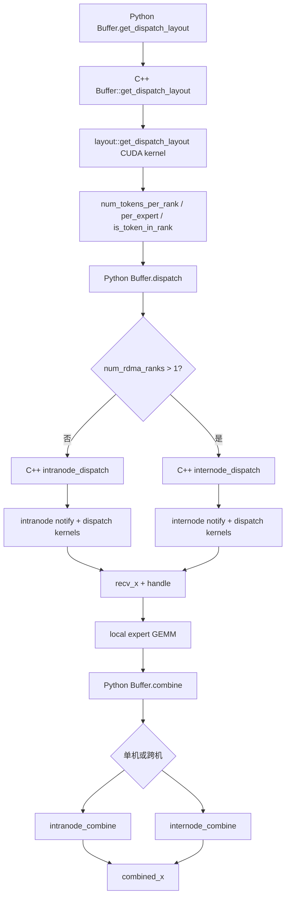
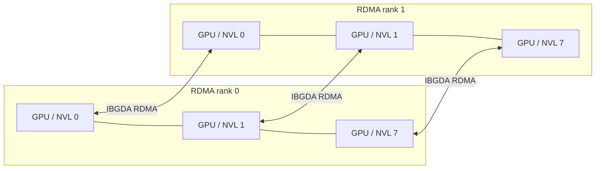
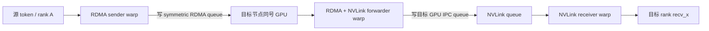
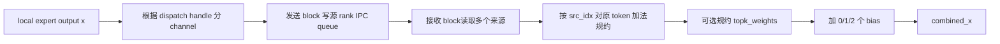
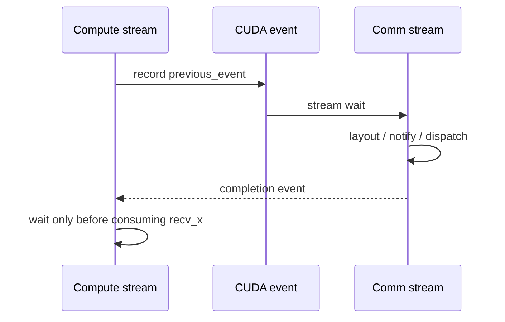

# DeepEP V1 SM 通信方案详解

> 本文对应仓库中的 **V1 legacy normal / high-throughput** 路径。这里的“SM 通信方案”指由常驻 CUDA 通信内核占用一定数量的 SM，使用 GPU 线程主动完成队列管理、数据搬运、NVLink 访问和 IBGDA RDMA 发起的方案；它不是 V1 的 `low_latency_dispatch/low_latency_combine` 路径。

## 1. 方案定位

V1 SM 方案面向 MoE 训练和推理 prefill 的大批量通信，核心目标是把 dispatch/combine 做成高吞吐的 GPU 侧 All-to-All：

- 单节点：GPU 之间经 CUDA IPC 暴露对端缓冲区，数据走 NVLink。
- 多节点：同一节点内走 NVLink；不同节点中相同本地 GPU 编号的 rank 组成 RDMA 域，跨节点走 NVSHMEM IBGDA，再由节点内 GPU 转发。
- 通信由 CUDA block/warp 执行，因此需要显式配置 `num_sms`。
- 数据和元数据采用分通道的环形队列，使用 `head/tail` 做流量控制。
- dispatch 前先计算路由布局；首次 dispatch 通常需要 CPU 等待 GPU 写回实际接收 token 数量，以便精确分配输出张量。
- dispatch 返回的 handle 保存反向路由信息，combine 沿原路径把 expert 输出送回源 rank 并规约。

典型调用是：

```text
gate/top-k
  -> get_dispatch_layout
  -> dispatch
  -> local expert GEMM
  -> combine
```

### 1.1 经典双 micro-batch 重叠图


这张图把 V1 的两种执行策略放在同一条时间轴上：

- 上半部分 **Traditional overlapping with communication SMs** 对应 V1 normal/high-throughput 的传统计算通信重叠。
- 下半部分 **Overlapping without communication SMs** 对应 V1 low-latency 的 send/receive phase 拆分和后台 RDMA。
- `0`、`1` 表示两个交错推进的 micro-batch；末尾再次出现 `Attention 0`，表示流水进入下一层或下一轮，而不是重复执行同一个 attention。
- 图中的 `Stream 0/Stream 1` 首先是“两个 micro-batch 的逻辑执行泳道”。它不是对源码中某两条固定 CUDA stream 的逐周期截图；实际代码还包含当前 compute stream、DeepEP `comm_stream`、CUDA event 和多个 kernel launch。

#### 上半部分如何对应 V1 SM 方案

单个 micro-batch 的依赖链仍然是：

```text
Attention
  -> Dispatch
  -> MoE expert computation
  -> Combine
  -> 下一层 Attention
```

两个 micro-batch 错开后，图中形成三段主要重叠：

| 时间窗口 | Stream 0 | Stream 1 | 资源关系 |
|---|---|---|---|
| 第一段 | `Dispatch 0` | `Attention 1` | 通信 kernel 与 attention 同时占用 GPU |
| 第二段 | `MoE 0` | `Dispatch 1` | expert GEMM 与通信 kernel 同时运行 |
| 第三段 | `Combine 0` | `MoE 1` | combine 通信与另一批 expert GEMM 重叠 |

这类 overlap 能隐藏一部分通信时间，但 **Dispatch/Combine 本身仍是活跃的 CUDA 通信内核**。在 V1 normal 中，用户通过 `Config.num_sms` 或 `Buffer.set_num_sms()` 为它们保留 SM；内核中的 sender、receiver、forwarder 和 coordinator warps 会持续执行：

- 读取/写入 NVLink 或 RDMA queue；
- 轮询 `head/tail`、count 和 signal；
- 使用 TMA 或向量 LD/ST 搬运 token；
- 发起 IBGDA put/atomic；
- 在 combine 中读取多个来源并规约。

因此同一时刻的 SM 资源可近似理解为：

```text
可供 Attention/MoE 的 SM
  ≈ GPU 总 SM
   - 正在占用的通信 SM
   - 其他运行时开销
```

这里的“重叠”只表示时间上并发，不代表通信免费。通信 kernel 还会与 Attention/MoE 竞争 HBM 带宽、L2、NVLink、寄存器和调度槽，所以 `num_sms` 并非越大越好：

- 太少：Dispatch/Combine 时间变长，网络可能打不满；
- 太多：通信更快，但 Attention/MoE 可用 SM 下降，端到端反而变慢；
- 最优值取决于 hidden、token 数、EP 拓扑、NIC 带宽和实际 GEMM。

#### 图中的一个方块在源码中包含什么

图为了突出 pipeline，把多个底层阶段压缩成一个 `Dispatch` 或 `Combine` 方块。以 normal dispatch 为例，实际还包括：

```text
get_dispatch_layout
  -> notify/count exchange
  -> CPU exact-count wait（默认模式）
  -> 输出张量分配
  -> data dispatch kernel
  -> completion event
```

跨节点时，data dispatch 内部又包含：

```text
RDMA sender
  -> IBGDA transfer
  -> RDMA/NVLink forwarder
  -> NVLink receiver
```

所以图中方块宽度代表这一整段端到端时间，而不是单个 CUDA kernel 的持续时间。

#### 与源码 stream/event 的对应关系

典型实现不是把所有操作硬编码到图中的两条 stream，而是：

1. Attention/MoE 在调用方当前 compute stream 上执行；
2. `previous_event` 把计算完成依赖交给 DeepEP `comm_stream`；
3. Dispatch/Combine 在 `comm_stream` 上运行；
4. `async_finish=True` 返回 `EventOverlap`；
5. 下一段真正消费通信结果前再调用 `event.current_stream_wait()`。

这样可以构造出图中上半部分的交错时序，但上层框架仍需负责两个 micro-batch 的 tensor 生命周期、stream ownership 和依赖顺序。

#### 图的边界

上半部分最准确地表达的是“V1 normal 通过通信 SM 做 overlap 的资源代价”，而不是说 normal 路径只能用两条 stream，或每个彩色块必须串行占满整张 GPU。实际并发程度还受 CUDA block 调度、kernel occupancy、HBM/NVLink/RDMA 瓶颈影响。

下半部分通过拆分 issue/receive 来避免网络在途期间持续占用通信 SM，属于 V1 low-latency 路径；其逐阶段解释见 [V1 Low-Latency 文档](implementation-v1-low-latency.md#11-经典图的逐阶段解读)。

## 2. MoE 语义

设：

- EP rank 数为 `R`；
- 全局 expert 数为 `E`，每个 rank 持有 `E / R` 个 local expert；
- 本 rank 有 `T` 个输入 token；
- 每个 token 选择 `K` 个 expert；
- `topk_idx[t, k]` 是 token `t` 第 `k` 个目标 expert，`-1` 表示无效选择。

### 2.1 Dispatch

dispatch 将源 rank 上的 token 复制到拥有目标 expert 的 rank。一个 token 的多个 expert 若位于同一 rank，通信层只发送一份 token 数据，同时携带该 rank 对应的本地 expert 索引和权重。

输出包括：

- `recv_x`：当前 rank 接收的 token；
- `recv_topk_idx`：已转换为当前 rank 本地 expert 编号的索引，非本 rank expert 置为 `-1`；
- `recv_topk_weights`：与本地有效 expert 对应的权重，无效项置零；
- 每个 local expert 的 token 数；
- combine 所需的反向路由 handle。

### 2.2 Combine

本地 expert 完成计算后，combine 根据 dispatch 保存的源 token 和队列位置，把结果送回原 rank。V1 normal 的 combine API 对 token 向量做加法规约；若传入 `topk_weights`，权重本身也可随路径归并，但向量是否乘权重应由上层计算约定决定。代码注释明确将该接口描述为 “addition without weights”。

训练时有如下对偶关系：

```text
dispatch forward  <-> combine backward
combine forward   <-> dispatch backward（复用 cached handle）
```

## 3. 实现分层与代码地图

| 层次 | 关键文件 | 作用 |
|---|---|---|
| Python API | [`deep_ep/buffers/legacy.py`](../deep_ep/buffers/legacy.py) | `Buffer` 初始化、参数检查、单机/跨机分派、handle 封装、事件接口 |
| Python 导出 | [`deep_ep/__init__.py`](../deep_ep/__init__.py) | 向用户导出 `Buffer`、`Config`、`EventOverlap` |
| PyBind | [`csrc/python_api.cpp`](../csrc/python_api.cpp) | 注册 legacy 与 elastic C++ API |
| C++ 运行时 | [`csrc/legacy/buffer.hpp`](../csrc/legacy/buffer.hpp) | 缓冲区生命周期、IPC/NVSHMEM 初始化、输出分配、CPU/GPU 同步、内核编排 |
| 配置与内存估算 | [`csrc/legacy/config.hpp`](../csrc/legacy/config.hpp) | `Config`、NVLink/RDMA 队列容量和 size hint |
| 路由布局 | [`csrc/kernels/legacy/layout.cu`](../csrc/kernels/legacy/layout.cu) | 统计 rank/expert token 数，生成 `is_token_in_rank` |
| 单节点内核 | [`csrc/kernels/legacy/intranode.cu`](../csrc/kernels/legacy/intranode.cu) | NVLink dispatch/combine、通知、barrier |
| 跨节点内核 | [`csrc/kernels/legacy/internode.cu`](../csrc/kernels/legacy/internode.cu) | RDMA+NVLink 分层 dispatch/combine |
| 队列抽象 | [`csrc/kernels/legacy/buffer.cuh`](../csrc/kernels/legacy/buffer.cuh) | `Buffer`、`AsymBuffer`、`SymBuffer` 指针布局 |
| IBGDA 设备接口 | [`csrc/kernels/legacy/ibgda_device.cuh`](../csrc/kernels/legacy/ibgda_device.cuh) | GPU 侧 RDMA put、atomic、doorbell 相关封装 |
| 测试 | [`tests/legacy/test_intranode.py`](../tests/legacy/test_intranode.py)、[`tests/legacy/test_internode.py`](../tests/legacy/test_internode.py) | 正确性、cached、异步、FP8、自动调优覆盖 |

主调用链：



## 4. Rank 拓扑模型

V1 把每 8 个连续 rank 视为一个 NVLink 域，代码中固定：

```cpp
rdma_rank = rank / 8;
nvl_rank  = rank % 8;
num_rdma_ranks = max(1, num_ranks / 8);
num_nvl_ranks  = min(num_ranks, 8);
```

因此全局 rank 可写为：

```text
global_rank = rdma_rank * 8 + nvl_rank
```

含义如下：

- `nvl_rank`：节点内 GPU 编号；同一 `rdma_rank` 的最多 8 张 GPU 通过 NVLink 互访。
- `rdma_rank`：节点/scale-out 编号；不同节点上相同 `nvl_rank` 的 GPU 组成 NVSHMEM 通信域。
- 单机 `R <= 8` 时 `num_rdma_ranks == 1`，只进入 intranode 路径。
- 多机要求 rank 总数是 8 的整数倍，跨节点数据采用“同号 GPU RDMA + 节点内 NVLink 转发”。



这个拓扑假设是理解 V1 internode 内核的关键：任意源 GPU 不直接对所有远端 GPU 建独立软件路径，而是先沿相同 `nvl_rank` 做 scale-out，再在目标节点沿 NVLink 做 scale-up。

## 5. 初始化与资源建立

### 5.1 Python `Buffer.__init__`

[`Buffer.__init__`](../deep_ep/buffers/legacy.py#L33) 完成：

1. 记录 process group、rank、group size 和缓冲区大小。
2. 创建 `_C.Buffer` C++ 对象。
3. all-gather 每个 rank 的 CUDA device id。
4. all-gather CUDA IPC memory handle，供节点内映射。
5. 需要 RDMA 时设置 NVSHMEM/IBGDA 环境：
   - `NVSHMEM_IB_ENABLE_IBGDA=1`；
   - `NVSHMEM_IBGDA_NUM_RC_PER_PE=num_qps_per_rank`；
   - 调整 QP depth、team 数量、内存粒度；
   - 分发 NVSHMEM unique ID。
6. 调用 C++ `sync()` 打开 IPC handle、初始化 NVSHMEM、分配对称 RDMA buffer，并做全局 barrier。

### 5.2 C++ `Buffer` 的内存

[`csrc/legacy/buffer.hpp`](../csrc/legacy/buffer.hpp) 中主要资源有：

| 资源 | 位置 | 用途 |
|---|---|---|
| `buffer_ptrs[]` | GPU HBM，CUDA IPC 映射 | 节点内 NVLink 队列、元数据和 barrier |
| `rdma_buffer_ptr` | NVSHMEM symmetric HBM | 跨节点环形队列及 RDMA 元数据 |
| `workspace` | GPU HBM，固定 32 MiB | 内核临时计数、原子状态 |
| `moe_recv_counter` | mapped pinned host memory | GPU 向 CPU 报告总接收 token 数 |
| `moe_recv_expert_counter` | mapped pinned host memory | GPU 向 CPU 报告各 local expert 数量 |
| `moe_recv_rdma_counter` | mapped pinned host memory | GPU 向 CPU 报告 RDMA 层接收数量 |
| `comm_stream` | 高优先级 CUDA stream | 通信与计算异步重叠 |

节点内 buffer 尾部还放置 barrier signal、对端 buffer 指针表和 barrier 指针表；初始化后这些指针表被复制到 GPU，内核可以直接寻址对端 IPC 映射。

### 5.3 `Config` 与通道数

`Config` 包含：

```text
num_sms
num_max_nvl_chunked_send_tokens
num_max_nvl_chunked_recv_tokens
num_max_rdma_chunked_send_tokens
num_max_rdma_chunked_recv_tokens
```

normal 内核将两个 block/SM 配成一个 channel：

```text
num_channels = num_sms / 2
偶数 block：发送/转发
奇数 block：接收/规约
```

因此 `Buffer.set_num_sms()` 要求偶数。chunk 参数决定每次推进多少 token 和环形队列容量。RDMA send chunk 不得超过 recv capacity 的一半，这是 lazy head update 能安全运行、避免生产者覆盖未消费数据的必要条件。

## 6. Dispatch 布局阶段

### 6.1 输入与输出

[`get_dispatch_layout`](../deep_ep/buffers/legacy.py#L293) 输入 `topk_idx[T, K]`，输出：

| 张量 | 形状 | 语义 |
|---|---:|---|
| `num_tokens_per_rank` | `[R]` | 本 rank 要发送到每个目标 rank 的去重 token 数 |
| `num_tokens_per_rdma_rank` | `[R/8]` 或 `None` | 本 rank 发往每个 RDMA 域的去重 token 数 |
| `num_tokens_per_expert` | `[E]` | 每个 expert 接收的选择数 |
| `is_token_in_rank` | `[T, R]` | token 是否至少选中了目标 rank 上的一个 expert |

rank 级别必须去重：如果一个 token 的两个 top-k expert 都在同一个 rank，token 数据只发一次；expert 级统计仍分别计数。

### 6.2 为什么 normal 路径单独做 layout

数据搬运内核需要预先知道：

- 每个目标 rank 的 token 数，以计算 rank prefix；
- 每个 channel 的工作范围，以生成 channel prefix；
- 每个 local expert 的 token 数，以便上层准备 grouped GEMM；
- token 到 rank 的布尔关系，以避免重复发送。

V1 把这些统计作为独立 kernel，随后 `notify_dispatch` 再把各 rank 的数量互换并形成 prefix matrix。这样数据面可以按顺序写入目标输出，但增加了一次 layout launch 和元数据同步。

## 7. 单节点 NVLink Dispatch

### 7.1 总流程

```mermaid
sequenceDiagram
    participant P as Python/CPU
    participant L as layout kernel
    participant N as notify kernel
    participant S as sender blocks
    participant Q as receiver-side IPC queues
    participant R as receiver blocks

    P->>L: topk_idx, num_experts
    L-->>P: per-rank/per-expert counts, is_token_in_rank
    P->>N: exchange counts + build prefix matrices
    N-->>P: mapped host counters ready
    P->>P: allocate exact recv tensors
    P->>S: launch dispatch
    S->>Q: push x/src/topk/weights/scales; release tail
    R->>Q: acquire tail, copy token, advance head
    R-->>P: recv_x + routing handle
```

### 7.2 `notify_dispatch`

[`intranode::notify_dispatch`](../csrc/kernels/legacy/intranode.cu#L26) 负责：

- 在 rank 之间交换发送数量；
- 计算 rank prefix matrix 和 channel prefix matrix；
- 对 local expert 数量应用 `expert_alignment`；
- 将总接收数和 expert 计数写到 mapped host counter；
- 清理即将使用的队列 head/tail 和 channel offset。

C++ [`intranode_dispatch`](../csrc/legacy/buffer.hpp#L417) 在非 cached、未指定 `num_worst_tokens` 时轮询这些 host counter，然后精确分配 `recv_x` 等输出。这个 CPU busy-wait 是 normal 路径无法天然 CUDA Graph 化的主要原因。

### 7.3 发送 block

[`intranode.cu` 的 `dispatch` kernel](../csrc/kernels/legacy/intranode.cu#L212) 中：

- 偶数 block 是 sender，`responsible_channel = sm_id / 2`。
- 一个 block 内的 warps 按目标 rank 分组。
- sender 向“接收方拥有”的 IPC queue 写数据。
- 写入项包括 hidden、源 token index、转换后的 local top-k、top-k weight、FP8 scale。
- `send_head[token, dst_rank]` 记录该 token 在目标队列中的逻辑位置，供 combine 反向路由。
- 完成一批写入后以 system-scope release store 更新 `tail`。

队列容量不足时 sender 轮询接收方维护的 `head`。因此队列是有界的，chunk 配置过激或 rank 失步可能造成超时。

### 7.4 接收 block

- 奇数 block 是 receiver。
- receiver 读取 `channel_start_offset/end_offset`，确定当前 channel 在最终 `recv_x` 中的连续区间。
- acquire 读取 `tail`，批量消费队列。
- Hopper 路径使用 TMA 在 IPC buffer、shared memory 和输出张量之间搬运 hidden；其他路径使用展开的向量化 LD/ST。
- 元数据分别复制到 `recv_src_idx`、`recv_topk_idx`、`recv_topk_weights`、scale 输出。
- 消费后推进 `head`，释放环形槽位。

### 7.5 单节点 handle

首次 dispatch 返回：

```text
(
  rank_prefix_matrix,
  channel_prefix_matrix,
  recv_channel_prefix_matrix,
  recv_src_idx,
  is_token_in_rank,
  send_head
)
```

用途：

- cached dispatch 复用 `rank_prefix_matrix`、`channel_prefix_matrix`、`is_token_in_rank` 和已有接收规模，跳过 top-k 元数据重建；
- combine 使用 dispatch 接收侧的 prefix、`recv_src_idx` 和 `send_head` 将 expert 结果送回源 token。

## 8. 跨节点 RDMA + NVLink Dispatch

### 8.1 两级数据路径

假设源 rank `(src_node, src_gpu)` 的 token 要到 `(dst_node, dst_gpu)`：

```text
源 GPU
  --IBGDA RDMA--> 目标节点中相同 src_gpu 编号的 GPU
  --NVLink------> 目标节点的 dst_gpu
  --> recv_x
```

这是一条“先 scale-out、再 scale-up”的转发路径。



### 8.2 内核 warp 角色

[`internode.cu` 的 dispatch kernel](../csrc/kernels/legacy/internode.cu#L452) 定义五种角色：

| 角色 | 责任 |
|---|---|
| `kRDMASender` | 遍历本 rank token，构造每个 RDMA 目标的消息并写 send buffer |
| `kRDMASenderCoordinator` | 等待连续事务完成，按 chunk 发起 IBGDA put，更新远端 tail |
| `kRDMAAndNVLForwarder` | 消费本 GPU 的 RDMA recv queue，将目标属于某个本地 GPU 的 token 转发到其 NVLink queue |
| `kForwarderCoordinator` | 汇总 forwarder 消费进度，批量归还 RDMA queue credit/head |
| `kNVLReceivers` | 消费各节点内来源的 NVLink queue，写最终 `recv_x` 和 metadata |

block 仍按偶/奇分工：偶数 block 偏 forward，奇数 block 包含 RDMA sender 和 NVLink receiver；两个 block 组成一个 channel。

### 8.3 RDMA 消息内容

每个 token 消息连续包含：

```text
hidden bytes
FP8 scales（可选）
SourceMeta
topk_idx
topk_weights
```

`SourceMeta` 保存源 RDMA rank，以及该 token 在目标节点哪些 NVLink rank 上有效。这样同一份跨节点 token 到达后，forwarder 可以在节点内按实际目标 GPU 复制，避免源端为同一节点的多个 expert 重复发送 RDMA payload。

### 8.4 环形队列与 credit

RDMA 层和 NVLink 层都使用单调递增逻辑 head/tail，物理槽位为：

```text
slot = logical_index % queue_capacity
```

生产者在写入前确认：

```text
tail - remote_head < capacity
```

消费者按 release/acquire 顺序观察 tail，处理完成后更新 head。coordinator 不对每个 token 都发 atomic，而是按 chunk 批量推进 head/tail，减少 NIC 原子操作和 doorbell 开销。

### 8.5 跨节点 handle

首次 dispatch 返回：

```text
(
  is_token_in_rank,
  rdma_channel_prefix_matrix,
  gbl_channel_prefix_matrix,
  recv_rdma_channel_prefix_matrix,
  recv_rdma_rank_prefix_sum,
  recv_gbl_channel_prefix_matrix,
  recv_gbl_rank_prefix_sum,
  recv_src_meta,
  send_rdma_head,
  send_nvl_head
)
```

其中：

- `recv_src_meta` 标识最终收到的 token 来源和节点内目标关系；
- RDMA/NVL prefix 记录两级转发的连续区间；
- `send_rdma_head`、`send_nvl_head` 记录 forward 时各队列位置，combine 用它们沿相反方向回送。

## 9. Combine 流程

### 9.1 单节点 combine



[`intranode::combine`](../csrc/kernels/legacy/intranode.cu#L706) 复用 dispatch 的 prefix 和 `src_idx`：

- sender 把 local expert 输出写回原 rank 的 queue；
- receiver 的一个 warp 负责维护各来源 queue 的 head/tail；其余 warps读取数据并对相同源 token 累加；
- `send_head` 保证接收方知道每个来源的预期逻辑位置；
- 最终可融合最多两个 BF16 bias。

### 9.2 跨节点 combine

combine 走 dispatch 的逆拓扑：

```text
当前 expert GPU
  --节点内 NVLink 聚合/转发-->
同号 GPU
  --IBGDA RDMA-->
源节点同号 GPU
  --必要的节点内规约-->
源 token rank
```

跨节点 combine 仍区分 sender、forwarder、RDMA receiver 和 coordinator。其关键点不是简单原样回传，而是尽量在层次结构中提前规约，减少跨层传输量；最终根据 `SourceMeta`、prefix 和 head 信息把多个 expert 输出合并到 `combined_x[src_token]`。

## 10. Python API 详解

### 10.1 初始化

```python
buffer = deep_ep.Buffer(
    group,
    num_nvl_bytes=num_nvl_bytes,
    num_rdma_bytes=num_rdma_bytes,
    low_latency_mode=False,
    num_qps_per_rank=num_qps_per_rank,
)
```

normal 路径应使用 `low_latency_mode=False`。buffer 大小通常取 dispatch/combine size hint 的最大值：

```python
dispatch_cfg = deep_ep.Buffer.get_dispatch_config(group.size())
combine_cfg = deep_ep.Buffer.get_combine_config(group.size())

num_nvl_bytes = max(
    dispatch_cfg.get_nvl_buffer_size_hint(hidden_bytes, group.size()),
    combine_cfg.get_nvl_buffer_size_hint(hidden_bytes, group.size()),
)
num_rdma_bytes = max(
    dispatch_cfg.get_rdma_buffer_size_hint(hidden_bytes, group.size()),
    combine_cfg.get_rdma_buffer_size_hint(hidden_bytes, group.size()),
)
```

### 10.2 推荐调用

```python
num_tokens_per_rank, num_tokens_per_rdma_rank, num_tokens_per_expert, is_token_in_rank, layout_event = \
    buffer.get_dispatch_layout(
        topk_idx,
        num_experts,
        async_finish=True,
    )

recv_x, recv_topk_idx, recv_topk_weights, per_expert, handle, event = \
    buffer.dispatch(
        x,
        topk_idx=topk_idx,
        topk_weights=topk_weights,
        num_tokens_per_rank=num_tokens_per_rank,
        num_tokens_per_rdma_rank=num_tokens_per_rdma_rank,
        num_tokens_per_expert=num_tokens_per_expert,
        is_token_in_rank=is_token_in_rank,
        previous_event=layout_event,
        async_finish=True,
        allocate_on_comm_stream=True,
    )

event.current_stream_wait()
# local expert computation

combined_x, combined_topk_weights, event = buffer.combine(
    expert_output,
    handle,
    topk_weights=recv_topk_weights,
    async_finish=True,
)
event.current_stream_wait()
```

### 10.3 重要参数

| 参数 | 作用 | 注意事项 |
|---|---|---|
| `expert_alignment` | 每个 local expert token 数向上对齐 | 便于 grouped GEMM，但会引入 padding |
| `num_worst_tokens` | 按最坏规模分配，跳过 CPU exact-count sync | 仅 intranode 支持；输出尾部无效；可用于 CUDA Graph |
| `handle` | cached dispatch 或 combine 的路由上下文 | cached dispatch 时不可再传新的 `topk_idx/topk_weights` |
| `config` | SM 数和 NVL/RDMA chunk 大小 | 默认是固定表；生产环境建议实测调优 |
| `previous_event` | 通信流等待的依赖 | 与计算/量化 kernel 重叠 |
| `async_finish` | 不让当前计算流等待通信完成 | 使用输出前必须等待 `EventOverlap` |
| `allocate_on_comm_stream` | 把新张量的 stream ownership 放到通信流 | 使用 `previous_event` 做重叠时通常应开启 |

## 11. FP8 与元数据布局

dispatch 支持两类 `x`：

```text
BF16: Tensor[T, H]
FP8 : (data[T, H], scales[T, H/128])
```

FP8 仅降低 dispatch payload；combine 输入要求 BF16。V1 normal 会把 FP8 data、scale、top-k 和 source metadata 一起排入队列。接收端仍保持 token-major 的 scale 布局，随后由上层 GEMM 使用或转换。

## 12. 异步、stream 与 CUDA Graph

### 12.1 两条 stream

- compute stream：调用方当前 CUDA stream。
- `comm_stream`：DeepEP 内部高优先级 stream。

典型顺序：



### 12.2 Graph 兼容性

normal dispatch 的输出 token 数依赖远端路由。默认路径由 GPU 写 mapped host counter，CPU busy-wait 后才分配精确输出，因此不兼容 CUDA Graph。

单节点可设置 `num_worst_tokens`：

- 按最坏接收规模预分配；
- 不做 CPU exact-count sync；
- 真实 token 数由 prefix 元数据给出；
- 无效 `recv_topk_idx` 被清为 `-1`。

跨节点 normal 路径在 Python 中明确禁止 `num_worst_tokens > 0`。

## 13. 性能原理与调优

### 13.1 为什么吞吐高

- 通信由 GPU 直接发起，控制面不逐消息经过 CPU。
- token 对目标 rank 去重，减少同 rank 多 expert 时的重复 payload。
- RDMA 与 NVLink 两级流水化，forwarder 可边收边转。
- 环形队列允许长消息流持续推进，不需要为最大容量分配每个 peer 的完整静态槽。
- chunk 合并减少 IBGDA put/atomic 次数。
- Hopper 使用 TMA 降低大 hidden 搬运的指令和寄存器压力。
- channel 并行将 token 范围分摊到多个 SM 对。

### 13.2 主要调优量

| 量 | 过小 | 过大 |
|---|---|---|
| `num_sms` | 无法打满 NVLink/RDMA | 抢占 GEMM SM，降低计算通信重叠收益 |
| send chunk | doorbell/atomic 频繁 | 单次占队列太多，排队和尾延迟上升 |
| recv queue | sender 经常等待 credit | 显存占用增大 |
| QP 数 | 并行度不足 | QP/doorbell 状态开销增大 |

默认 config 是针对已知 EP rank 数的静态表，并非通用最优。仓库测试会遍历 config 并测量 `dispatch`、`notify`、`combine`，实际集群应按 GPU、NIC、拓扑、hidden 和 batch 调优。

## 14. 正确性与风险点

### 14.1 有界队列复杂性

V1 使用 queue 节省显存，但依赖所有 rank 一致进入通信、正确推进 head/tail。任一 rank 退出、参数不一致或队列配置不满足约束，都可能让其他 rank 超时。现有内核在主要轮询点检查 `clock64()`，超时后打印 channel/rank/head/tail 并 trap。

### 14.2 调用一致性

所有 rank 必须保持一致的：

- `num_experts`、`expert_alignment`、hidden、top-k；
- buffer 大小和 config；
- collective 调用顺序；
- cached handle 对应的 routing layout。

### 14.3 生命周期

如果设置 `explicitly_destroy=True`，必须显式调用 `buffer.destroy()`；否则 NVSHMEM、IPC 映射和 HBM 可能泄漏。销毁前实现会先设备同步、barrier，再关闭对端 IPC 和 NVSHMEM。

### 14.4 激进 PTX

legacy 内核可使用 `ld.global.nc.L1::no_allocate` 等激进读取方式。仓库说明其在 Hopper 上经过验证，但属于需谨慎对待的 PTX 行为。其他平台异常时可构建时设置 `DISABLE_AGGRESSIVE_PTX_INSTRS=1`。

## 15. 关键函数逐段阅读建议

建议按以下顺序读代码：

1. [`Buffer.dispatch`](../deep_ep/buffers/legacy.py#L322)：看单机/跨机分流和 handle 形状。
2. [`Buffer::get_dispatch_layout`](../csrc/legacy/buffer.hpp#L337)：看 stream 控制和布局输出。
3. [`Buffer::intranode_dispatch`](../csrc/legacy/buffer.hpp#L417)：看 notify、CPU counter、输出分配和 launch。
4. [`intranode::dispatch`](../csrc/kernels/legacy/intranode.cu#L212)：看偶/奇 block、环形队列和 TMA。
5. [`Buffer::internode_dispatch`](../csrc/legacy/buffer.hpp#L875)：看两级 prefix 和 mapped host sync。
6. [`internode::dispatch`](../csrc/kernels/legacy/internode.cu#L452)：看五种 warp 角色。
7. [`Buffer.combine`](../deep_ep/buffers/legacy.py#L408)：看 handle 如何反向使用。
8. [`intranode::combine`](../csrc/kernels/legacy/intranode.cu#L706) 与 [`internode::combine`](../csrc/kernels/legacy/internode.cu#L1721)：看回传和规约。
9. [`Config`](../csrc/legacy/config.hpp)：把代码中的所有 buffer offset 与 size hint 对上。

## 16. 一句话总结

V1 SM 方案的本质是：**用若干通信 SM 驱动分通道有界队列，单机直接写 NVLink IPC buffer，多机通过“同号 GPU 的 IBGDA RDMA + 节点内 NVLink 转发”完成层次化 All-to-All，并用 dispatch handle 保存 combine 的逆向路由。** 它以较复杂的队列、显式 SM 配置和部分 CPU 同步换取大批量场景的高带宽。
