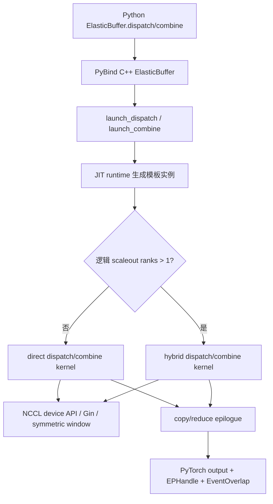
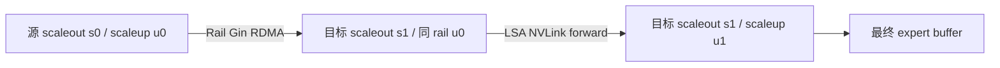
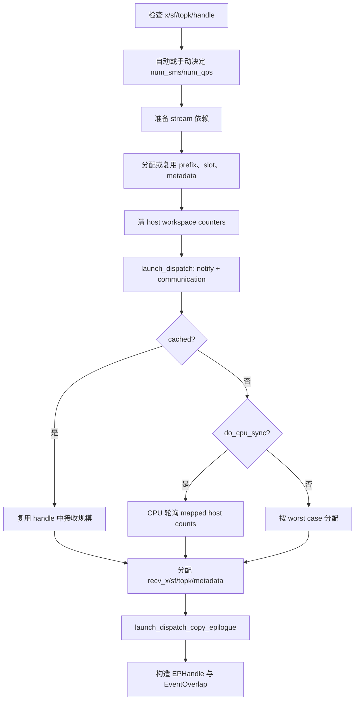
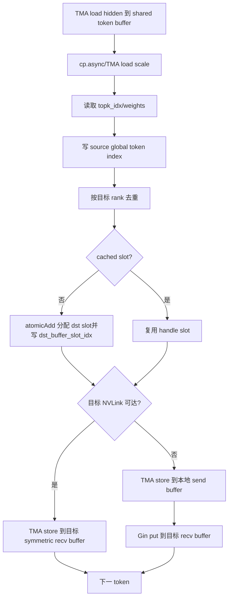
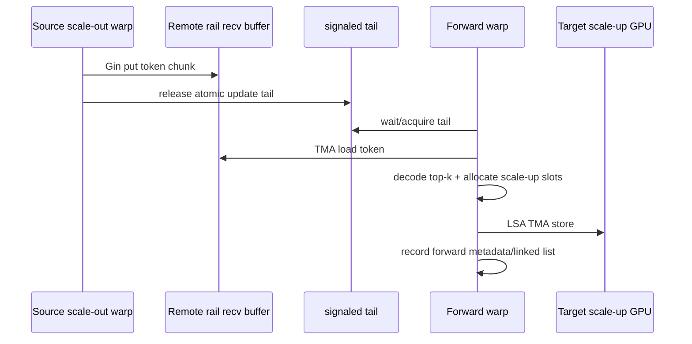
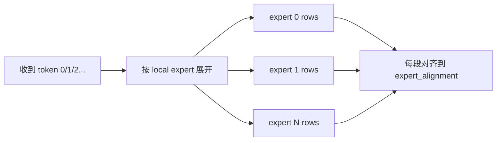
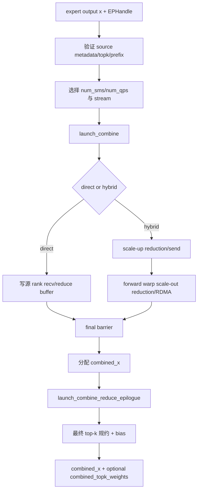
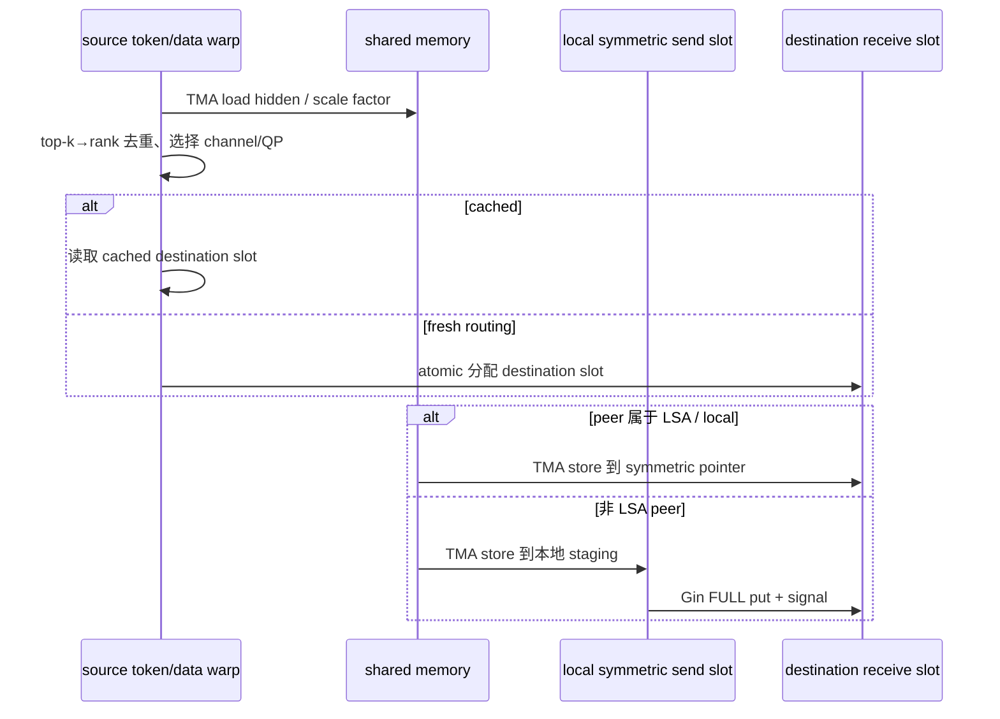
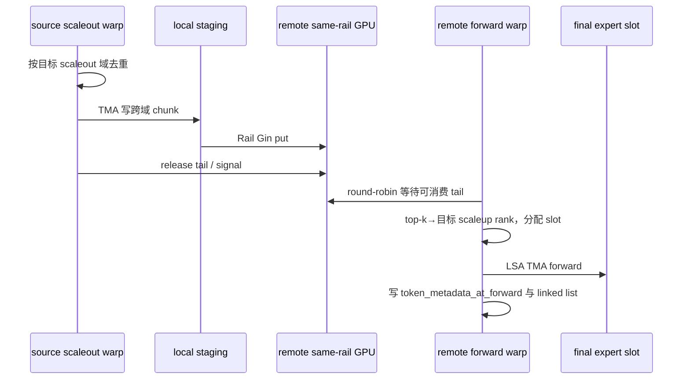

# DeepEP V2 Elastic 实现详解

> 本文对应仓库中的 V2 `ElasticBuffer` / elastic kernels。V2 是一次完整重构：EP 的训练吞吐与推理解码接口被统一，内核改为运行时 JIT 编译，通信后端从 NVSHMEM 切换到 NCCL Gin，并同时支持 direct 与 hybrid 两种拓扑。

> **研究基线**：本地 tutorial/main 的教程文档提交为 `f99f06868616c6fa96f83ff1caa5f0231f9ee3bc`（2026-08-25）；它相对父提交只新增三篇 implementation 文档，未修改 DeepEP 源码。本文分析的实际上游源码基线是其父提交 `01dc3aaac82068020353dce2c302e38153c0bfaa`（`deepseek-ai/DeepEP` 的 `origin/main`，2026-08-04）；固定源码外链时应指向 `deepseek-ai/DeepEP@01dc3aaa`，不能使用 `deepseek-ai/DeepEP@f99f068`。外部资料访问日期为 2026-08-26；代码行号可能随上游演进而漂移，复现时应固定上述上游源码 commit。


## 0. 研究基线与阅读约定

### 0.1 证据分级与文档边界

为避免把接口宣传、硬件背景和代码行为混在一起，本文采用三种标记：

- **[源码事实]**：可由上述上游源码 commit 的 Python/C++/CUDA、测试或构建脚本直接验证；
- **[官方背景]**：来自 DeepEP README、NVIDIA NCCL/CUDA 官方文档或论文，用于解释 API 与硬件语义；
- **[源码推导]**：根据当前实现的数据布局、同步顺序或性能计数推导出的结论，尚不是稳定 API 承诺。

根目录新增的三份深挖稿只覆盖 V1，可帮助理解 NVSHMEM、IBGDA、SM/warp 分工等历史背景，但**不能用来证明 V2 行为**。V2 的结论以 `deep_ep/buffers/elastic.py`、`csrc/elastic`、`deep_ep/include/deep_ep`、`tests/elastic`、仓库 README 以及 NCCL/CUDA 官方资料为准。

### 0.2 “Elastic” 到底指什么

**[源码事实]** `ElasticBuffer` 的注释把 elastic 定义为底层内存形态的灵活性：纯 GPU、CPU 或混合内存。当前 EP 主路径使用 GPU symmetric segment；CPU/mixed segment 已用于 Engram，README 仍把通用 elastic GPU/CPU buffer 列为进行中能力。

这里的 elastic **不是**分布式系统意义上的运行时成员弹性：当前实现没有在线增删 rank、communicator shrink/grow、故障重建或故障转移协议。构造阶段固定 `ProcessGroup`、NCCL communicator、world/LSA/Rail team 和窗口；运行期间所有 rank 仍需以一致顺序参与相应 collective、window registration、barrier 与 EP 调用。

## 1. V2 解决了什么问题

相对 V1，V2 的主要目标是：

- 用更少通信 SM 达到相同或更高吞吐；
- 扩展更大的 scale-up/scale-out 域，README 给出的目标上限为 EP2048；
- 去掉 V1 的静态 config 表和集群 auto-tuning，改为解析估算 SM 与 QP；
- 统一 high-throughput 与 low-latency 的 Python API；
- 用 NCCL Gin 复用 NCCL communicator、symmetric window 和 GPU-initiated networking；
- 使用固定最大容量、cached handle、可选 CPU sync，使同一实现覆盖训练、prefill 和 decode；
- 用新的 expanded/GEMM 布局直接服务 grouped GEMM；
- 以两阶段通信/规约 epilogue 降低主通信内核的 SM 占用。

需要特别说明：**V2 不再提供 V1 那种“0 SM RDMA low-latency + recv hook”路径。** V2 所谓 high-throughput/low-latency API 统一，是用同一 `dispatch/combine` 通过 cached handle、固定上界、较少 SM 等模式覆盖不同工作负载，不是保留了 V1 LL 的纯后台 RDMA hook 协议。

## 2. V1 与 V2 的核心对照

| 维度 | V1 normal | V1 low-latency | V2 Elastic |
|---|---|---|---|
| Python 对象 | `Buffer` | `Buffer(low_latency_mode=True)` | `ElasticBuffer` |
| 后端 | CUDA IPC + NVSHMEM IBGDA | NVSHMEM IBGDA | NCCL device API + NCCL Gin |
| 编译 | legacy CUDA 扩展 | legacy CUDA 扩展 | kernel runtime JIT |
| 路由统计 | 独立 layout + notify | 融合到 LL kernel | notify warps 融合进 dispatch |
| 输出分配 | 默认 CPU exact-count | 固定最大容量 | `do_cpu_sync=True/False` 可选 |
| cached routing | tuple handle | 固定 LL handle | 具名 `EPHandle` |
| 拓扑 | 单机 direct；多机固定 8-GPU 层次 | 全 rank RDMA | direct 或 hybrid，逻辑域来自 NCCL 拓扑 |
| SM/QP | 静态 config + 调优 | 隐式 | 解析估算，可覆盖 |
| GEMM 布局 | token-major | expert-major 固定槽 | normal 或 `do_expand` expert 布局 |
| 附加能力 | EP | EP | EP、Engram、PP、AGRS、barrier |

## 3. 代码分层

| 层次 | 关键文件 | 责任 |
|---|---|---|
| Python API | [`deep_ep/buffers/elastic.py`](../deep_ep/buffers/elastic.py) | `ElasticBuffer`、`EPHandle`、SM/QP 估算、模式参数、确定性排序 |
| C++ 编排 | [`csrc/elastic/buffer.hpp`](../csrc/elastic/buffer.hpp) | symmetric buffer、workspace、stream、输出/handle 分配、dispatch/combine 两阶段 launch |
| JIT 主机 launch | [`csrc/kernels/elastic/dispatch.hpp`](../csrc/kernels/elastic/dispatch.hpp)、[`combine.hpp`](../csrc/kernels/elastic/combine.hpp) | 生成模板实例、编译缓存、kernel launch 参数 |
| Direct kernel | [`deep_ep/include/deep_ep/impls/dispatch.cuh`](../deep_ep/include/deep_ep/impls/dispatch.cuh)、[`combine.cuh`](../deep_ep/include/deep_ep/impls/combine.cuh) | 单逻辑域直接通信 |
| Hybrid kernel | [`hybrid_dispatch.cuh`](../deep_ep/include/deep_ep/impls/hybrid_dispatch.cuh)、[`hybrid_combine.cuh`](../deep_ep/include/deep_ep/impls/hybrid_combine.cuh) | scale-out RDMA + scale-up NVLink 的分层通信 |
| Epilogue | [`dispatch_copy_epilogue.cuh`](../deep_ep/include/deep_ep/impls/dispatch_copy_epilogue.cuh)、[`combine_reduce_epilogue.cuh`](../deep_ep/include/deep_ep/impls/combine_reduce_epilogue.cuh) | buffer→用户输出、expanded layout、最终规约/bias |
| 公共布局 | [`common/layout.cuh`](../deep_ep/include/deep_ep/common/layout.cuh) | `TokenLayout`、`BufferLayout`、`WorkspaceLayout` |
| 通信原语 | [`common/comm.cuh`](../deep_ep/include/deep_ep/common/comm.cuh) | QP 映射、NVLink/Gin barrier、timeout |
| Gin handle | [`common/handle.cuh`](../deep_ep/include/deep_ep/common/handle.cuh) | symmetric ptr、put、reduce、flush 封装 |
| NCCL backend | [`csrc/kernels/backend/nccl.cu`](../csrc/kernels/backend/nccl.cu) | communicator 属性、Gin context/QP、logical/physical topology |
| 对称内存 | [`csrc/kernels/backend/symmetric.hpp`](../csrc/kernels/backend/symmetric.hpp) | GPU/CPU symmetric VA 与 window memory |
| JIT runtime | [`csrc/jit`](../csrc/jit) | 生成模板源码、递归依赖 hash、NVCC 编译、缓存和 launch |
| 测试 | [`tests/elastic/test_ep.py`](../tests/elastic/test_ep.py) | direct/hybrid、expand、cached、no-CPU-sync、确定性和性能 |

总调用链：



## 4. 物理域与逻辑域

V2 不再把“每节点恰好 8 卡”硬编码到 EP 算法。NCCL backend 查询：

- `num_rdma_ranks`：物理 scale-out/RDMA 域大小；
- `num_nvl_ranks`：NCCL LSA team 的 NVLink 域大小。

然后依据 `allow_hybrid_mode` 构造逻辑域：

```text
hybrid=True:
  num_scaleout_ranks = num_rdma_ranks
  num_scaleup_ranks  = num_nvl_ranks
  rank = scaleout_rank * num_scaleup_ranks + scaleup_rank

hybrid=False:
  num_scaleout_ranks = 1
  num_scaleup_ranks  = total_num_ranks
```

### 4.1 Direct 模式

`num_scaleout_ranks == 1`。所有 peer 处于一个逻辑 scale-up 域：

- NVLink 可达 peer：通过 LSA symmetric pointer 和 TMA store 直接写；
- 不可 NVLink 直达 peer：先写 local send buffer，再用 Gin put 发 RDMA；
- 每个 token 直接到最终目标 rank，不使用中间 forwarder。

适合：单节点、较小 EP 域、网络允许全连接 Gin、希望结构简单的场景。

### 4.2 Hybrid 模式

`num_scaleout_ranks > 1`，通信拆成：

```text
Scale-out: NCCL Rail team / Gin RDMA
Scale-up : NCCL LSA team / NVLink symmetric store
```



hybrid 对 multi-rail/multi-plane 网络更友好：每个本地 GPU 沿对应 rail 做跨节点传输，然后节点内再分发。

### 4.3 `is_scaleup_nvlink`

```text
is_scaleup_nvlink = num_scaleup_ranks == num_nvl_ranks
```

它决定 direct kernel 的 `team_t` 和数据写法。如果整个逻辑 scale-up 域就是物理 NVLink 域，可直接使用 LSA pointer；否则 kernel 同时判断 NVLink bypass 和 Gin RDMA。

## 5. NCCL Gin 后端

### 5.1 初始化

[`NCCLSymmetricMemoryContext`](../csrc/kernels/backend/nccl.cu) 使用已有 NCCL communicator 创建 device communicator，并请求：

- `ginContextCount = num_allocated_qps`；
- exclusive Gin contexts；
- 固定 Gin queue depth；
- traffic class/service level；
- barrier 所需 signal；
- hybrid 用 `NCCL_GIN_CONNECTION_RAIL`；
- direct 用 `NCCL_GIN_CONNECTION_FULL`。

若 EP rank 数大于 1 且未设置 `EP_DISABLE_GIN=1`，Gin 不可用会直接报错。`EP_DISABLE_GIN=1` 只对不需要跨节点 Gin 的 LSA-only/单节点路径有明确意义；**[源码推导]** 当前 elastic EP 没有另一套通用跨节点 transport 可自动替代 Gin，不能把它理解成“跨节点自动 fallback”。

### 5.2 对称窗口

C++ 统一布局：

```text
[[[Workspace] GPU buffer] CPU buffer]
```

- workspace 固定在 GPU segment 前部，按 2 MiB 对齐；
- EP buffer 位于 workspace 后；
- 可选 CPU segment 位于尾部，供 Engram 等远端存储；
- NCCL window 注册整个 symmetric address space；
- 每个 rank 在相同 offset 上拥有同构布局，Gin 只需目标 rank + offset 即可寻址。

### 5.3 GPU/CPU 混合对称内存

`HybridElasticSymmetricMemory` 可把：

```text
[local GPU VRAM][local-node CPU rank0 segment][CPU rank1 segment]...
```

连续映射到一个 VA 空间。CPU segment 通过 POSIX FD 交换和 CUDA VMM 导入。当前 EP 主缓冲使用 GPU segment，mixed segment 已实际支撑 Engram；README 所说通用、透明的 GPU+CPU elastic buffer 仍属于 roadmap。

## 6. `ElasticBuffer` 初始化

### 6.1 两种大小指定方式

直接指定：

```python
buffer = deep_ep.ElasticBuffer(group, num_bytes=..., num_cpu_bytes=...)
```

按 MoE 参数计算：

```python
buffer = deep_ep.ElasticBuffer(
    group,
    num_max_tokens_per_rank=max_tokens,
    hidden=hidden,
    num_topk=topk,
    use_fp8_dispatch=True,
)
```

`calculate_elastic_buffer_size()` 同时计算 dispatch 和 combine 的最坏布局，取最大值并按 2 MiB 对齐。V2 buffer 通常比 V1 大，因为它更多采用固定上界布局，减少复杂有界 queue 和运行时流控。

### 6.2 Direct 的 buffer 估算

dispatch：

```text
recv_buffer: R * max_tokens
send_buffer: NVLink-only 时可为 0 rank；否则 1 * max_tokens
```

combine：

```text
recv_buffer token planes:
  allow_multiple_reduction=True  -> min(R, K)
  False                          -> K

send_buffer:
  NVLink-only 可省略；否则按 rank/expanded 最坏规模分配
```

### 6.3 Hybrid 的 buffer 估算

dispatch 需要：

```text
scaleup_recv_buffer
scaleout_send_buffer
scaleout_recv_buffer（按 channel 固定上界）
```

combine 需要对应的 scale-up/scale-out reduce 和 send buffer。所有布局复用 `TokenLayout`，token 内可包含 hidden、scale factor、top-k、source metadata 和同步字段。

## 7. JIT 编译机制

V2 kernel 的模板参数包含：

```text
拓扑大小、SM 数、warp 数、QP 数、hidden bytes、top-k、expert 数、
max tokens、alignment、FP8 scale pack、cached/CPU-sync/expand 模式等
```

提前编译全部组合会产生巨大二进制。V2 的 launch runtime 在第一次遇到某组参数时：

1. 生成只实例化该模板组合的 CUDA 源；
2. 解析所需 include；
3. 调 NVCC 编译；
4. 加载 cubin/module；
5. 以参数 hash 缓存；
6. 后续调用直接复用。

相关环境变量：

- `EP_JIT_CACHE_DIR`：缓存目录；
- `EP_JIT_DEBUG`：调试输出；
- `EP_JIT_PRINT_COMPILER_COMMAND`：打印 NVCC 命令；
- `EP_JIT_PTXAS_VERBOSE/CHECK`：寄存器/本地内存检查；
- `EP_JIT_DUMP_PTX/SASS/ASM`：导出汇编；
- `EP_JIT_WITH_LINEINFO`：profiling 行号。

代价是首轮新 shape/mode 有编译延迟；生产系统应在 warm-up 阶段覆盖实际组合。

## 8. V2 Dispatch 总流程



与 V1 的关键不同：路由统计不再是独立 `get_dispatch_layout` API；notify warps 与数据 warps 在同一个 dispatch kernel 中协作。

## 9. Notify Warps：统计、交换与 prefix

Direct 和 hybrid dispatch 的前若干 warp 是 notify warps，主要工作相同：

1. 在 shared memory 统计本 rank 的 `rank_count` 和 `expert_count`；
2. rank 计数对同一 token 的相同目标 rank 去重，expert 计数不去重；
3. 各 SM 将 `(到达标记, count)` 原子累加到全局 reduction workspace；
4. SM0 等待所有 SM 完成，汇总计数；
5. 把 rank/expert counts 写给 peer；
6. 等待本 rank 应接收的计数到齐；
7. 对 local expert 应用 `expert_alignment`；
8. 生成：
   - `psum_num_recv_tokens_per_scaleup_rank`；
   - `psum_num_recv_tokens_per_expert`；
   - `num_unaligned_recv_tokens_per_expert`；
9. `do_cpu_sync=True` 时把编码后的计数写到 mapped host workspace。

计数使用正数编码协议区分“0 token 已准备”和“尚未写入”。等待处均带 GPU timeout 和 rank/channel 诊断。

## 10. Direct Dispatch 内核

[`dispatch_impl`](../deep_ep/include/deep_ep/impls/dispatch.cuh#L31) 的每个数据 warp 被视为一个 channel。

### 10.1 每个 token 的处理



### 10.2 Source global index

每个 token 写入：

```text
src_token_global_idx = rank_idx * num_max_tokens_per_rank + token_idx
```

它同时编码源 rank 与源 token index，combine 可用除法/取模恢复，不必携带两个独立字段。

### 10.3 Cached slot

首次 dispatch 对每个 `(token, top-k)` 保存目标 buffer slot。cached dispatch 直接读取：

```text
dst_buffer_slot_idx[token, topk]
```

并复用已知接收规模和 source metadata，从而跳过 slot 原子分配与 CPU sync。适合 decode 中 routing 不变或 backward 中沿同一路由传梯度。

### 10.4 完成屏障

所有 payload 发出后调用统一 GPU barrier：

- flush Gin QP；
- NVLink 路径做 system-scope 可见性 fence；
- 向 team peers 发 signal；
- 等待 peer signal；
- 触发 programmatic dependent launch，使 copy epilogue 可及时开始。

## 11. Hybrid Dispatch 内核

[`hybrid_dispatch_impl`](../deep_ep/include/deep_ep/impls/hybrid_dispatch.cuh#L33) 把 warps 分成三类：

| warp 角色 | 作用 |
|---|---|
| notify warps | 全局 rank/expert 统计、跨 scale-out/scale-up 归并、prefix |
| scale-out warps | 将源 token 通过 Rail Gin 发到目标 scale-out 域的同 rail GPU |
| forward warps | 消费 scale-out recv buffer，在目标节点内按 top-k 转发到 scale-up peer |

### 11.1 Scale-out warp

- 一个 warp 是一个 channel；token 按 channel 固定分片。
- token 先 TMA 写 local scaleout send buffer。
- 根据 top-k 目标的 scale-out rank 去重；同一目标节点只发一份 token。
- 通过 `ncclTeamTagRail` Gin put 发送到对端同 rail 的 `scaleout_recv_buffer`。
- 每处理若干 token，以 release atomic 批量更新对端 channel tail；最后附 finish flag。

### 11.2 Forward warp

- 对各 scale-out 来源做 round-robin，等待 `signaled_tail` 推进或 finish。
- 从 scaleout recv buffer TMA load token。
- 读取 top-k，转换为目标 scale-up rank。
- 对目标 scale-up rank 去重并 atomic 分配 slot。
- 用 LSA symmetric pointer + TMA store 写目标 GPU 的 scaleup buffer。
- 记录 `token_metadata_at_forward` 和 `channel_linked_list`，供 cached dispatch 与 combine replay。



### 11.3 Hybrid 元数据

`dst_buffer_slot_idx` 形状为：

```text
[num_channels, num_scaleout_ranks, max_tokens_per_channel, num_topk]
```

`token_metadata_at_forward[channel, forwarded_token, :]` 包含：

```text
0: source global token index（含 source scale-out rank）
1: 是否是 chunk 最后一个 token
2 .. 2+K-1: 目标 scale-up rank
2+K .. 2+2K-1: 对应目标 slot
```

`channel_linked_list` 则按 channel 和 scale-up peer 保存 combine 输入 token 的链式顺序。combine 不必重新推导 dispatch 的到达顺序，可直接 replay。

## 12. CPU Sync、No-CPU-Sync 与输出分配

### 12.1 `do_cpu_sync=True`

dispatch kernel 的 notify warp 把计数写到 mapped host workspace。C++ 轮询：

- 每个 scale-up rank 的 deduplicated 接收数；
- 每个 local expert 的对齐后数量。

随后精确分配输出，`EPHandle.num_recv_tokens` 和 Python per-expert list 准确。适合训练/prefill，需要精确 shape 和 CPU grouped-GEMM metadata 的场景。

### 12.2 `do_cpu_sync=False`

C++ 按最坏情况分配：

```text
normal layout:
  num_recv_tokens = num_ranks * max_tokens

expanded layout:
  num_expanded_tokens ≈ num_ranks * max_tokens * min(topk, local_experts)
                        + alignment padding
```

真实有效 token 数在 GPU prefix 中：

```python
actual = handle.psum_num_recv_tokens_per_scaleup_rank[-1]
```

优点：无 CPU round trip，固定形状，利于 decode 与 CUDA Graph。代价：输出更大、尾部无效，上层必须依据 GPU metadata 截取或屏蔽。

### 12.3 Cached 模式

传 `handle=` 时强制 `do_cpu_sync=False`，复用：

- 接收 token 数和 expanded 数；
- per-expert list；
- rank/expert prefix；
- destination slot；
- source metadata；
- hybrid forward metadata 和 linked list；
- handle 中保存的 `topk_idx`。

cached dispatch 不允许再传新的 `topk_idx`；`topk_weights` 可在部分 backward/expanded 场景更新。

## 13. Dispatch Copy Epilogue

通信 kernel 只保证 token 已进入内部 symmetric buffer，随后 [`dispatch_copy_epilogue_impl`](../deep_ep/include/deep_ep/impls/dispatch_copy_epilogue.cuh#L22) 使用全部可用 SM 把数据整理到 PyTorch 输出：

- 读取 rank prefix、expert prefix、source metadata；
- 写 `recv_x` 和 FP8 scale；
- normal layout 写 `recv_topk_idx/weights`；
- expanded layout 把每个 `(token, local expert)` 展开到独立槽位；
- cached mode 按已有 destination slot 保持稳定布局；
- `do_zero_padding=True` 时清零 expert alignment 产生的 gap；
- hybrid 模式构建/使用 channel linked list。

把通信和 copy 分成两个 kernel 的原因：

- 主通信阶段只占解析得到的少量 SM，便于与计算重叠；
- epilogue 是 HBM/TMA 搬运，可短时间使用全 SM 快速结束；
- programmatic dependent launch 减少两个 kernel 之间的 host launch 间隙。

## 14. Expanded 布局

`do_expand=False`：一个收到的 token 只占一个 row，`recv_topk_idx[row, :]` 指示它属于哪些 local expert。

`do_expand=True`：一个 token 对每个有效 local expert 选择占一个独立 row，并按 expert 分段：



优点：

- grouped GEMM 可直接按连续 expert 段执行；
- `topk_weights` 可变成一维，与 expanded row 一一对应；
- combine 可在本地/分层路径提前规约。

相关字段：

- `psum_num_recv_tokens_per_expert`：expert 段 prefix；
- `num_unaligned_recv_tokens_per_expert`：真实 count；
- `recv_src_metadata[:, 2:]`：每个原接收 token 的 top-k expanded slot。

## 15. `EPHandle` 详解

[`EPHandle`](../deep_ep/buffers/elastic.py#L25) 是 V2 路由上下文：

| 字段 | 用途 |
|---|---|
| `do_expand` | combine 如何解释输入布局 |
| `num_experts` | 路由上下文 |
| `expert_alignment` | expert 段 padding |
| `num_max_tokens_per_rank` | source global index 的编码基数和 buffer 上界 |
| `num_sms` | combine 默认复用 dispatch SM 数 |
| `topk_idx` | 防用户修改的路由副本；combine 的目标和 cached dispatch 的 routing |
| `num_recv_tokens` | normal 实际/估计接收数 |
| `num_expanded_tokens` | expanded 实际/估计大小 |
| `num_recv_tokens_per_expert_list` | CPU grouped GEMM metadata |
| `psum_num_recv_tokens_per_scaleup_rank` | rank prefix，no-CPU-sync 时给出 GPU 真实数 |
| `psum_num_recv_tokens_per_expert` | expert prefix |
| `num_unaligned_recv_tokens_per_expert` | padding 前 count |
| `recv_src_metadata` | source global token、source top-k slot、expanded slot |
| `dst_buffer_slot_idx` | cached dispatch 复用的目标 slot |
| `token_metadata_at_forward` | hybrid forward replay |
| `channel_linked_list` | hybrid combine 的 per-channel/per-peer 顺序 |

不要在 routing 尚未完成的前提下修改 handle 中张量；一个 handle 只能与相同 topology、expert、max-token、alignment 和 layout mode 配套使用。

## 16. V2 Combine 总流程



## 17. Direct Combine 内核

[`combine_impl`](../deep_ep/include/deep_ep/impls/combine.cuh#L28) 对每个收到的 token 从 `src_metadata` 恢复：

```text
src_token_idx
src_rank_idx
src_topk_idx
expanded slots（若有）
```

然后分三类处理：

1. **无需本地规约**：normal layout，或 expanded 只有一个有效 slot。TMA load 一个 row，直接发回源 rank。
2. **允许多级规约**：`allow_multiple_reduction=True` 且同一层有多个 expanded slot。先在 shared memory 做本地向量规约，再发送部分和。
3. **禁止多级规约**：`allow_multiple_reduction=False`。不在中间层相加，把每个 top-k 结果分别发送，留给最终 epilogue 一次性规约。

目标在 NVLink 域内时直接 TMA 写 symmetric recv buffer；否则先写本地 send buffer，再 Gin put。

## 18. Hybrid Combine 内核

hybrid combine 与 dispatch 逆向，但会利用层次做规约：

```text
local expert rows
  -> scale-up peer 间整理/局部规约
  -> forward warp replay dispatch metadata
  -> 写 scale-out send buffer
  -> Rail Gin RDMA 返回源 scale-out 域
  -> final reduce epilogue
```

### 18.1 Scale-up warps

- 按 `channel_linked_list` 读取属于各 scale-up peer 的 token；
- 从 expanded/normal 输入加载结果；
- 可在当前节点内对相同源 token的多个 expert 结果先规约；
- 写 scale-up buffer 并更新 per-channel tail。

### 18.2 Forward warps

- replay `token_metadata_at_forward`，因此顺序与 dispatch 一致；
- 等待所有需要的 scale-up peer tail 到达；
- `allow_multiple_reduction=True` 时先对 scale-up 部分和规约，再只发一个结果到源 scale-out rank；
- `False` 时把所有 top-k 分量分别转发，保留单次最终规约；
- 通过 Rail Gin 发起 RDMA，并用 chunk last flag 控制 request aggregation/flush；
- 最后交换 finish signal 并清 tail。

## 19. `allow_multiple_reduction` 的精度/带宽取舍

浮点加法不满足结合律。

`allow_multiple_reduction=True`：

```text
节点内/层内先规约 -> 跨层发送部分和 -> epilogue 再规约
```

- 优点：传输 token 数少、buffer 小、吞吐高；
- 缺点：节点内/层内 BF16 中间部分和会改变加法分组并增加舍入；最终 epilogue 的一般路径再以 FP32 accumulator 累加并 cast 回 BF16。

`allow_multiple_reduction=False`：

```text
所有 top-k 分量保持独立 -> 最终 epilogue 一次规约
```

- 优点：规约路径更单一，通常精度/可解释性更好；
- 缺点：更多网络和 HBM payload，buffer 更大。

## 20. Combine Reduce Epilogue

[`combine_reduce_epilogue_impl`](../deep_ep/include/deep_ep/impls/combine_reduce_epilogue.cuh#L24) 使用全 SM：

- 按原 token 读取各 top-k plane 或 rank plane；
- 完成最终向量加法；
- 合并/返回 top-k weights；
- 融合最多两个 BF16 bias；
- 写 `combined_x[num_original_tokens, hidden]`。

V2 combine 对 hidden 向量执行的是**不乘 `topk_weights` 的加法规约**；传入的 `topk_weights` 被通信并重建为独立的 `combined_topk_weights` 输出。若模型要求 gate 权重作用于 expert 输出，应在调用 combine 前由上层/GEMM epilogue 完成，不能仅因传入了 `topk_weights` 就假设 DeepEP 会对 hidden 自动加权。

## 21. SM 数解析估算

[`get_theoretical_num_sms`](../deep_ep/buffers/elastic.py#L729) 不遍历 config，而是估算达到 NVLink/RDMA 带宽所需的每 SM HBM 读写量。

步骤概括：

1. 用组合概率估计一个 token 的 top-k 会覆盖多少 rank：

```text
expected_groups = G * (1 - C(E - E/G, K) / C(E, K))
```

2. 分 direct/hybrid 统计：
   - HBM read/write token 份数；
   - NVLink traffic；
   - RDMA traffic；
   - local bypass。
3. 选预计更慢的网络边界。
4. 根据目标网络 GB/s 和每 SM HBM GB/s，估算需要的 SM。
5. 乘 1.25 裕量，至少 4，向上对齐到偶数。
6. `prefer_overlap_with_compute=False` 时倾向至少使用 64 SM 追求峰值，否则使用较少 SM 给 GEMM 留资源。
7. 最终不超过设备 SM 总数。

当前函数假设 balanced gate，且暂不支持 `num_scaleout_topk > 0` 和 group-limited gate 的精确建模；这类模型应实测覆盖 `num_sms`。

## 22. QP 数估算

[`get_theoretical_num_qps`](../deep_ep/buffers/elastic.py#L836)：

```text
allow_hybrid_mode=False: min(num_sms, 9)
allow_hybrid_mode=True : num_sms * 16 + 1
最终 cap 到 num_allocated_qps
```

含义：

- direct 鼓励较少 QP，降低 doorbell ringing 和 context 成本；
- hybrid 每个 SM 有多个 channel，并额外有 notify traffic，需要更多独立 QP；
- `+1` 预留 notify/barrier；
- 设备侧 `get_qp_mode` 会把 channel 映射到 QP，并在 QP 不足时让多个 SM/channel 以 GPU sharing mode 共享。

初始化默认值：

```text
hybrid + fast RDMA atomic : 65
hybrid + slower atomic    : 129
direct                    : 17
```

## 23. Stream 与事件控制

### 23.1 `stream_control_prologue`

- 读取当前 compute stream；
- `previous_event` 存在时让 comm stream 等待；
- `allocate_on_comm_stream=True` 时在 comm stream 上分配输出，保证 allocator stream ownership 正确；
- `previous_event` 与 overlap 模式下禁止不安全的分配顺序。

### 23.2 `previous_event_before_epilogue`

它只阻塞 copy/reduce epilogue，不阻塞主通信 kernel。可用于细粒度 overlap：网络通信先进行，等另一路计算释放 HBM/SM 后再执行高带宽 epilogue。

### 23.3 `async_with_compute_stream`

为 `True` 时 compute stream 不自动等待 comm stream，返回 `EventOverlap`。调用方在真正消费输出前：

```python
event.current_stream_wait()
```

环境变量 `EP_AVOID_RECORD_STREAM=1` 可避免对输出 tensor 调 `record_stream`，但调用方必须自行保证 allocator 生命周期，属于高级选项。

## 24. 确定性模式

网络到达顺序可能变化，默认 dispatch 输出 row 顺序不保证逐次一致。`deterministic=True` 时 Python `EPHandle.deterministic_sort()` 在通信完成后排序：

- normal layout：按 source global token index 排序 `recv_x/sf/topk/metadata`；
- expanded layout：先按 expert，再按源 token 排序有效 row，padding 放后；
- 更新 linked list 或 expanded slot 指针；
- cached mode 使用首次保存的未排序 source metadata 作为稳定 key。

异步调用时，排序注册为 `EventOverlap` wait 后 hook；同步调用则立刻执行。确定性会增加 sort、copy 和临时张量开销。

## 25. 主要 Python API

### 25.1 初始化与 size hint

```python
required = deep_ep.ElasticBuffer.get_buffer_size_hint(
    group,
    max_tokens,
    hidden,
    num_topk=topk,
    use_fp8_dispatch=True,
)

buffer = deep_ep.ElasticBuffer(
    group,
    num_bytes=required,
    num_max_tokens_per_rank=max_tokens,
    allow_hybrid_mode=True,
    allow_multiple_reduction=True,
    prefer_overlap_with_compute=True,
)
```

### 25.2 Dispatch

```python
recv_x, recv_topk_idx, recv_topk_weights, handle, event = buffer.dispatch(
    x,
    topk_idx=topk_idx,
    topk_weights=topk_weights,
    num_experts=num_experts,
    num_max_tokens_per_rank=max_tokens,
    expert_alignment=alignment,
    num_sms=0,  # automatic
    num_qps=0,  # automatic
    do_cpu_sync=True,
    do_expand=False,
    async_with_compute_stream=True,
)
```

### 25.3 Cached decode

```python
cached_recv_x, _, _, _, event = buffer.dispatch(
    next_x,
    handle=handle,
    async_with_compute_stream=True,
)
```

### 25.4 Expanded dispatch

```python
expanded_x, _, expanded_weights, expanded_handle, event = buffer.dispatch(
    x,
    topk_idx=topk_idx,
    topk_weights=topk_weights,
    num_experts=num_experts,
    do_expand=True,
    do_zero_padding=True,
    use_tma_aligned_col_major_sf=True,
)
```

### 25.5 Combine

```python
combined_x, combined_weights, event = buffer.combine(
    expert_output,
    handle=handle,
    topk_weights=recv_topk_weights,
    bias=(bias0, bias1),
    async_with_compute_stream=True,
)
```

## 26. V2 其他主要功能

`ElasticBuffer` 不只包含 EP。

### 26.1 Barrier

[`barrier`](../deep_ep/buffers/elastic.py#L497) 可在 compute/comm stream 上发起 GPU barrier，并可选择 CPU sync、顺序化模式。底层统一使用 NVLink/Gin signal 和 timeout。

### 26.2 Engram

[`engram_write`](../deep_ep/buffers/elastic.py#L569) 把本 rank 的存储写入 symmetric CPU segment；[`engram_fetch`](../deep_ep/buffers/elastic.py#L584) 按 index 发起 mixed-segment Gin get 并返回 wait callable。所谓 0-SM 仅指 issue 与 wait 之间的传输窗口；issue/wait kernel 及 scale-factor 处理仍使用 SM。

### 26.3 Pipeline Parallel Send/Recv

[`pp_set_config/pp_send/pp_recv`](../deep_ep/buffers/elastic.py#L606) 在固定最大 tensor 和 inflight 槽位下提供 ring-neighbor PP 传输。send/recv kernel 用 TMA 在用户 tensor 与 registered-window slot 间 staging，再用 world-team Gin put + signal；“0-SM”只描述请求 issue 后到 wait/recv 前的可隐藏窗口，staging 与同步 kernel 本身仍占 SM。

### 26.4 AGRS

[`agrs_set_config`](../deep_ep/buffers/elastic.py#L670)、`create_agrs_session`、`all_gather` 实现实验性的 AGRS session；当前暴露的 collective 只有 All-Gather，Reduce-Scatter 仍在 roadmap：

- session 预留连续 buffer；
- `agrs_get_inplace_tensor` 让生产者直接写 communication buffer；
- all-gather 返回输出 tensor 和 wait handle；
- 多个 inflight AGRS 通过 slot 管理。

这些能力仍属实验性，使用前应以 `tests/elastic` 对应测试为准。

## 27. 环境变量

常用 V2 变量：

| 变量 | 作用 |
|---|---|
| `EP_BUFFER_DEBUG` | 输出 buffer、SM/QP 和 backend 诊断 |
| `EP_DISABLE_GIN` | 不创建 Gin；适用于不需要跨节点 Gin 的路径，当前没有通用跨节点 EP fallback |
| `EP_NIC_NAME` | 查询 NIC 属性的名称 |
| `EP_OVERRIDE_RDMA_SL` | 覆盖 service level，做流量隔离 |
| `EP_GIN_GDAKI_DEBUG` | Gin GDAKI debug |
| `EP_NUM_TOPK_IDX_BITS` | top-k index 编码位数 |
| `EP_AVOID_RECORD_STREAM` | 禁止 V2 输出 record_stream |
| `EP_DISABLE_BARRIER_PROFILING` | benchmark 时关闭 barrier profiling |
| `NCCL_GIN_CROSS_NIC` | NCCL Gin multi-plane/cross-NIC 行为 |

## 28. 限制与风险

### 28.1 软件/硬件要求

- Hopper/SM90 PTX ISA 支持；
- CUDA 12.3+；
- PyTorch 2.10+；
- NCCL 2.30.4+；
- scale-up 需要 NVLink；
- scale-out 需要 RDMA 和可用 Gin。

### 28.2 模式一致性

所有 rank 必须使用一致的：

- logical topology 与 `allow_hybrid_mode`；
- `num_experts/topk/max_tokens/alignment`；
- `allow_multiple_reduction`；
- `num_sms/num_qps`；
- dispatch/combine 顺序和 cached handle 上下文。

### 28.3 Buffer 显存

V2 为固定最大容量、hybrid channel、expanded layout 和多个 token plane 预留较多空间。`max_tokens`、top-k、rank 数和 `allow_multiple_reduction=False` 都可能显著放大 buffer。

### 28.4 首轮 JIT

新组合第一次调用会编译。不要把首次 JIT 延迟计入在线首 token；应在模型加载或 warm-up 阶段预热。

### 28.5 No-CPU-Sync 的无效尾部

固定 worst-case 输出不能直接把整个 tensor 送入普通 GEMM。必须使用 prefix/count、expanded zero padding 或支持动态有效范围的 grouped GEMM。

### 28.6 数值与确定性

- `allow_multiple_reduction` 会改变浮点加法分组；
- 网络到达顺序默认不确定；
- `deterministic=True` 有额外排序开销；
- FP8 dispatch 的 scale layout必须与 GEMM 消费者一致。

## 29. 推荐阅读与调试顺序

1. [`ElasticBuffer.__init__`](../deep_ep/buffers/elastic.py#L228)：拓扑、buffer、QP、NCCL handle。
2. [`NCCLSymmetricMemoryContext`](../csrc/kernels/backend/nccl.cu)：Gin context、logical domain、window。
3. [`ElasticBuffer.dispatch`](../deep_ep/buffers/elastic.py#L855)：模式参数与 `EPHandle`。
4. [`ElasticBuffer::dispatch`](../csrc/elastic/buffer.hpp#L693)：host workspace、metadata、CPU/no-CPU-sync、两阶段 launch。
5. [`dispatch_impl`](../deep_ep/include/deep_ep/impls/dispatch.cuh#L31)：direct notify/data warp。
6. [`hybrid_dispatch_impl`](../deep_ep/include/deep_ep/impls/hybrid_dispatch.cuh#L33)：scale-out/forward warp 与 tail 协议。
7. [`dispatch_copy_epilogue_impl`](../deep_ep/include/deep_ep/impls/dispatch_copy_epilogue.cuh#L22)：normal/expanded/cached 输出。
8. [`EPHandle`](../deep_ep/buffers/elastic.py#L25)：路由上下文和确定性排序。
9. [`ElasticBuffer::combine`](../csrc/elastic/buffer.hpp#L1179)：combine host orchestration。
10. [`combine_impl`](../deep_ep/include/deep_ep/impls/combine.cuh#L28)、[`hybrid_combine_impl`](../deep_ep/include/deep_ep/impls/hybrid_combine.cuh#L32)：direct/hybrid 回传与分层规约。
11. [`combine_reduce_epilogue_impl`](../deep_ep/include/deep_ep/impls/combine_reduce_epilogue.cuh#L24)：最终规约和 bias。
12. [`tests/elastic/test_ep.py`](../tests/elastic/test_ep.py)：用测试参数逐个对应所有模式。

调试时建议：

```bash
EP_BUFFER_DEBUG=1 EP_JIT_DEBUG=1 python tests/elastic/test_ep.py ...
```

再用 Nsight Systems/Compute 观察：

```text
dispatch_impl / hybrid_dispatch_impl
dispatch_copy_epilogue_impl
combine_impl / hybrid_combine_impl
combine_reduce_epilogue_impl
```

## 30. 研究深化：rank 坐标、路径选择与端到端协议

### 30.1 Physical team 与 logical domain

**[官方背景]** NCCL device API 提供三个关键 team：`World` 是 communicator 全体；`Lsa` 是设备可直接 load/store 访问的局部 team；`Rail` 则收集各 LSA team 中相同局部位置的 rank，二者在规则拓扑上近似正交。

**[源码事实]** [`get_physical_domain_size`](../csrc/kernels/backend/nccl.cu) 读取：

```text
num_nvl_ranks  = ncclTeamLsa(comm).nRanks
num_rdma_ranks = world_size / num_nvl_ranks
```

随后 `allow_hybrid_mode` 只决定**逻辑分解**：

```text
hybrid:
  logical (scaleout, scaleup) = (num_rdma_ranks, num_nvl_ranks)
direct:
  logical (scaleout, scaleup) = (1, world_size)

world_rank = scaleout_rank_idx * num_scaleup_ranks + scaleup_rank_idx
```

例如 4 个 LSA 域、每域 8 卡的 EP32，物理大小为 `(num_rdma_ranks, num_nvl_ranks)=(4,8)`，world rank 19 的逻辑坐标是 `(2,3)`。若关闭 hybrid，逻辑坐标退化为 `(0,19)`；这**不表示** 32 张卡突然都具备物理 NVLink 直连，只表示 direct kernel 对每个 peer 再选择 LSA bypass 或 Gin。

### 30.2 Direct dispatch：一次到最终 rank

**[源码事实]** [`dispatch_impl`](../deep_ep/include/deep_ep/impls/dispatch.cuh) 把 CTA 内 warp 分为 notify 与 data 两类。data warp 的关键路径是：



一个 token 的多个 expert 若落在同一 rank，hidden/SF 只发一份，top-k 元数据仍保留多个选择。source global token index 编码来源 rank 与本地 token index，combine 依赖它把结果送回原顺序。

### 30.3 Hybrid dispatch：一次跨域、域内 fan-out

**[源码事实]** [`hybrid_dispatch_impl`](../deep_ep/include/deep_ep/impls/hybrid_dispatch.cuh) 将 warp 再分为 notify、scale-out 和 forward：



核心优化是“一份 hidden 对每个目标 scale-out 域只跨网络一次，再在目标 LSA 域 fan-out”。代价是多一级 staging、HBM/NVLink 流量、tail 协议和 forward warp。因而 hybrid 并非对任何拓扑都更快：当 EP 域小、路由很稀疏或 FULL Gin 很高效时，direct 可能更简单；当跨域重复目的较多或网络天然 multi-rail 时，hybrid 更可能获益。

**[源码推导]** symmetric address 只统一“rank + offset”的寻址模型，不会消除 NVLink、HBM、PCIe、NIC 的物理差异。性能分析必须把 scale-up 与 scale-out 分开，不能把所有 put 视为相同成本。

### 30.4 Dispatch → expert → combine 的不变量


贯穿往返的不变量是：`EPHandle` 保存 dispatch 时的 rank/expert prefix、destination slot、source metadata，以及 hybrid 的 forward metadata/linked list。combine 不是一次无上下文的新路由；它 replay 这份上下文。因此 cached dispatch 也只适用于路由、拓扑、布局和容量约束均未变化的后续数据。

## 31. NCCL Gin、symmetric window、TMA 与 PDL

### 31.1 Device communicator 与 window 的创建

**[源码事实]** [`NCCLSymmetricMemoryContext`](../csrc/kernels/backend/nccl.cu) 从 host communicator 创建 NCCL device communicator。rank 数大于 1 且 Gin 启用时，它请求：

- `ginContextCount = num_allocated_qps`、exclusive context、固定 queue depth、traffic class/service level 和 signal；
- hybrid 的 `NCCL_GIN_CONNECTION_RAIL`，direct 的 `NCCL_GIN_CONNECTION_FULL`；
- `props.railedGinType != NONE` 或 `props.ginType != NONE`，但**没有要求必须是 GDAKI**；
- 以 `NCCL_WIN_STRICT_ORDERING` 调用 collective 的 `ncclCommWindowRegister`，再取 LSA device pointer。

**[官方背景]** NCCL GIN 是统一 device-side networking 接口，具体 backend 可由 GDAKI 或 Proxy 等实现。只有当实际选择的 backend/平台支持 GPU 直接驱动 NIC 时，才可称为 GPU-direct NIC issue；不能把“调用 GIN”与“必然是 GDAKI”画等号。

**[源码事实/兼容性边界]** backend 初始化目前只检查 `ginType/railedGinType != NONE`；但 [`common/comm.cuh`](../deep_ep/include/deep_ep/common/comm.cuh) 的自定义 Gin barrier timeout polling，以及 [`impls/pp_send_recv.cuh`](../deep_ep/include/deep_ep/impls/pp_send_recv.cuh) 的 signal polling，会直接把 `_ginHandle` 解释为 `ncclGinGdakiGPUContext` 或读取其 `signals_table`，代码中的 TODO 仍在等待官方 timeout-wait API。因此，“初始化检查允许某个 Gin backend”不等于 EP barrier/PP 等每条路径都已对 Proxy 完整兼容；非 GDAKI backend 必须逐路径、逐版本验证。

### 31.2 Pointer、offset 与 one-sided 操作

[`common/handle.cuh`](../deep_ep/include/deep_ep/common/handle.cuh) 把两种访问隐藏在统一 handle 后：

```text
LSA/local: get_sym_ptr(local_ptr, peer) -> remote-load/store-capable pointer
GIN:       get_sym_offset(ptr) = ptr - lsa_base_ptr
           put/get(window, peer, offset, bytes, context)
```

**[源码事实]** 每个 rank 的 window 有相同逻辑布局和 offset 约定；代码并不依赖所有 rank 暴露完全相同的用户态原始虚拟地址。window registration 是 collective，任何 rank 漏调或顺序不一致都会导致初始化阻塞。

### 31.3 put、signal 与 flush 的完成语义

必须区分三种事件：

1. **issue**：设备线程把 put 请求提交到某个 Gin context；
2. **local completion**：源 staging buffer 已可复用；
3. **remote visibility/consumption**：目标可以安全读数据。

**[官方背景]** GIN `flush()` 对 put 的保证是源缓冲可复用，不能仅凭 flush 推导远端数据已经可见。官方从 NCCL 2.30.5 起显式区分 weak/strong signal：weak signal 只关联附着的 put，strong signal 还可排序同 peer/context 上此前的 puts。当前源码仍调用旧的 `ncclGin_SignalInc`/`ncclGin_VASignalAdd`；在 NCCL 2.30.5+ 中，其强弱由 device communicator 的 `ginStrongSignalsRequired` 决定，而本 commit 未显式设置该字段。因此这里的 strong/weak 是官方语义分类，不能据此声称最低支持版本 2.30.4 下当前调用必然是 strong。VA signal 需要 strict-ordering window，当前 DeepEP 正以 `NCCL_WIN_STRICT_ORDERING` 注册。

**[源码事实]** DeepEP 不是靠一个裸 flush 宣告协议完成，而是组合 Gin signal、release/acquire 原子、tail、barrier 与目标侧 wait。阅读 kernel 时应追踪“数据写入 → release signal/tail → acquire wait → 消费”，不能只看到 `put` 就认为下一条指令可读远端数据。

### 31.4 GPU、CPU 与 mixed symmetric memory

纯 GPU 路径通常由 `ncclMemAlloc` 提供注册友好的 segment。CPU/mixed 路径使用 CUDA VMM：

- `cuMemAddressReserve` 预留连续 VA；
- `cuMemCreate/cuMemMap` 映射 GPU 或 `CU_MEM_LOCATION_TYPE_HOST_NUMA` segment；
- host segment 通过 POSIX FD 在本节点 rank 间导入；
- segment 与 workspace 按 2 MiB 对齐，并设置 GPUDirect RDMA 相关属性；
- hybrid CPU memory 将本 LSA 域各 rank 的 NUMA segment 连续映射，供 Engram 根据 owner/offset 寻址。

**[源码事实]** 指定 `num_cpu_bytes > 0` 会要求一条新的 NCCL communicator 路径，而不是无条件复用 PyTorch communicator。混合 segment 出错时还要检查 CUDA VMM、DMA-BUF/FD 交换、NUMA 归属与 window registration，而不只是检查显存大小。

### 31.5 TMA 的作用边界

**[官方背景]** CUDA Tensor Memory Accelerator（TMA）在支持的架构上异步搬运 global↔shared 的多维 tensor，通常由少量线程发起，让其余线程继续计算或同步。它要求 descriptor、shape/stride、地址和对齐满足限制。

**[源码事实]** V2 用 TMA 做 hidden/SF 的 global↔shared 或 symmetric slot 搬运；真正跨节点的传输仍是 Gin，TMA 不是网络协议。FP8 scale factor 可使用 TMA 对齐的 column-major stride，consumer 必须采用一致布局。TMA descriptor/stride 不匹配时，表现可能是 JIT/launch 错误或数值错位，而非普通网络超时。

### 31.6 Programmatic Dependent Launch（PDL）

主 dispatch/combine kernel 与 copy/reduce epilogue 使用 PDL。后继 kernel 可以在同一 stream 上提前进入前导阶段，并在真正读取依赖数据前执行 `cudaGridDependencySynchronize`。

**[官方背景]** PDL 用于隐藏 launch latency/后继 kernel preamble，实际重叠是机会性的，不保证两个 kernel 长时间并发，也不改变数据依赖。故性能报告仍应分别列出 main kernel 和 epilogue，而不能把二者简单视为完全重叠。

## 32. JIT specialization 与 dispatch 模式状态机

### 32.1 编译缓存真正包含什么

**[源码事实]** [`csrc/jit/compiler.hpp`](../csrc/jit/compiler.hpp) 的 signature 由 kernel 名、NVCC major/minor、编译 flags 和生成源码构成；生成源码还加入 `<deep_ep/*>` 递归 include 的内容 hash。NVCC（本项目要求 CUDA 12.3+）编译面向当前实际 GPU architecture 的 CUBIN。cache 同时有进程内层与文件系统层，写入使用临时目录、`fsync` 和原子 rename，多个 rank 竞争时复用胜者结果；加载时会验证 `kernel.cu`、CUBIN 和唯一 kernel symbol。

这里“解析 include”主要是为了依赖 hash；真正的预处理/编译仍由 NVCC 完成。拓扑、SM/QP、hidden bytes、max tokens、top-k、expert 数和多个模式布尔量进入模板；指针与未模板化的计数才保持 runtime dynamic。每增加一种 shape/mode 都可能产生独立 cache 项，因此应记录冷启动编译时间与热 cache kernel 时间。

NCCL 官方文档说明 GIN device kernel 当前不承诺跨 NCCL 版本二进制兼容。DeepEP 还会检查加载的 NCCL 与链接目标；本地版本要求 `NCCL >= 2.30.4`。升级 NCCL 后应重新构建 DeepEP并清理对应 JIT cache 后预热，而不是直接复用旧 CUBIN。

### 32.2 Notify、no-CPU-sync、cached、expanded 不是同一开关

| 模式 | notify warps | CPU 轮询 exact count | 路由输入 | 输出分配 | 典型用途 |
|---|---:|---:|---|---|---|
| fresh + CPU sync | 有 | 有 | 新 `topk_idx` | 精确 shape | 训练/prefill、验证 |
| fresh + no CPU sync | 有 | 无 | 新 `topk_idx` | worst-case | decode/graph-friendly |
| cached | 无 | 无，强制关闭 | 禁止新 `topk_idx` | 复用 handle 规模/slot | 路由不变的重复调用 |
| expanded | 取决于 fresh/cached | 可有或无 | 同上 | 每个本地 expert assignment 一 row | grouped GEMM |

notify warp 对每个 token 的 top-k 做两层计数：每个 expert selection 计入 expert count；同一 token 的多个 expert 若位于同一 rank，rank count 去重。block/global reduce 后交换 counts，计算 alignment 与 prefix；CPU-sync 模式把编码后的正数写到 mapped pinned host workspace，host 带 timeout 轮询。

no-CPU-sync 的 worst-case 分配是：

```text
normal:   world_size * max_tokens_per_rank
expanded: world_size * max_tokens_per_rank * min(topk, local_experts)
          + expert alignment gaps，再按布局要求对齐
```

此时 Python 返回的 `num_recv_tokens`/per-expert list 可能是容量估计，GPU prefix 的末项才携带实际有效规模。allocated rows 不等于 valid rows。

cached 模式重用 slot 与 metadata，正确性前提是 top-k 路由、rank 映射、`do_expand`、alignment、max-token 上界和相应 handle 语义不变。可选的新 `topk_weights` 只更新权重数据，不会重新计算 destination slot。

### 32.3 Expanded 布局的精确语义

normal 布局是一行一个接收 token，并附带本地 top-k 列表。expanded 布局是一行一个“token → local expert” assignment，按 expert 分段并做 `expert_alignment`：

```text
expert 0: valid rows | padding
expert 1: valid rows | padding
...
```

因此 expanded 输出的 `recv_topk_idx` 为 `None`，权重退化为每 row 一个值；`do_zero_padding` 只允许与 expanded 配合，保证会被 grouped GEMM 读到的对齐 gap 为零。它用更多 buffer/HBM 写换取 GEMM 无需再次 scatter。是否更快取决于 expert load、alignment、GEMM 接口和 padding 比例。

## 33. 确定性、未初始化区域与规约精度

### 33.1 Deterministic 的保证范围

**[源码事实]** `deterministic=True` 不是另一个网络协议，而是在通信完成后的 Python hook 中排序：

- normal：按 source global token index 排序有效 row，并同步移动 x/SF/top-k/metadata；
- expanded：stable sort 的主键是 expert，次键是 source token，并更新 expanded slot；
- hybrid：相应 linked-list/forward metadata 也随排序更新。

它保证的是 **dispatch 可见有效 row 的稳定顺序**，不是网络包到达顺序、所有原子操作、expert GEMM 或整个模型的全局 bitwise determinism。异步调用必须先 wait，排序 hook 才完成。

`check_torch_deterministic()` 还会拒绝 PyTorch deterministic algorithms 与 `fill_uninitialized_memory` 的某种组合，因为 `torch.empty` 的填充值 kernel 会干扰通信 stream/未初始化输出约定。对 no-CPU-sync、alignment padding 和 oversized tail，只在 valid prefix 内断言；除非显式 zero padding，尾部内容没有语义。

### 33.2 Combine 的实际数值路径

**[源码事实]** hidden combine 是不乘 `topk_weights` 的加法；权重只被重建为独立输出。模型若要求 gate weighting，必须在 expert output/GEMM epilogue 或 combine 前完成。

[`combine_utils.cuh`](../deep_ep/include/deep_ep/impls/combine_utils.cuh) 对很小的简单情形可走 BF16 vector add；一般路径把 BF16 hidden/bias 转成 FP32 accumulator（向量化 `float2`）累加，再 cast 回 BF16。这里的“FP32 累加”不意味着整个分层协议都无舍入：

- `allow_multiple_reduction=False` 尽量保留各贡献到最终 epilogue，一次完成最终规约，payload 更大；
- `allow_multiple_reduction=True` 允许节点内/层内先形成 BF16 中间部分和，再跨层传输并最终规约，改变加法分组并引入额外 BF16 rounding，但降低流量与 buffer。

测试对与当前分组相匹配的 reference 使用 `torch.equal`，说明该实现路径在测试配置下追求 bitwise 一致；它不是“任意拓扑、任意 reduction tree 都有同一数学位序结果”的公共保证。论文或生产实验还应报告 `max_abs`、`max_rel`、ULP/任务指标，并单独比较 multiple-reduction 两种模式。

## 34. Barrier、PP、Engram 与 AGRS 的精确能力边界

### 34.1 Barrier

barrier 复用 LSA/Gin signal 与 timeout，可选择 GPU-only、CPU sync 和顺序化模式。它既是用户 API，也是 benchmark/protocol 的同步构件。超时通常首先意味着 rank 调用顺序或参数不一致，不应立即归因于网络硬件。

### 34.2 Pipeline Parallel send/recv

**[源码事实]** `pp_set_config` 只配置 ring 邻居（前一 rank/后一 rank）、最大 bytes 与最大 inflight。workspace 为每方向维护多组循环 slot；`send_count % inflight` 选择可复用 slot。

send 顺序为：等远端 release → TMA 将用户 tensor 写到 symmetric send slot → 选出的线程发起 world-team Gin put 并附带 arrival signal。recv 顺序为：等 arrival → TMA 从 slot 拷到用户 tensor → 向 sender 发 release，允许该 slot 再用。

“0 SM PP”只应描述 **Gin/RDMA 已 issue 到 wait 之间的网络 in-flight 窗口**；send/recv 的 staging、signal wait 与拷贝 kernel 仍占 SM。测试通过在 send 与 recv/wait 之间插入 GPU sleep/compute 来验证隐藏窗口。当前接口是固定邻居协议，不是任意 peer 的通用点对点层。

### 34.3 Engram

**[源码事实]** `engram_write` 在 barrier 包围下把本 rank storage 写到 symmetric CPU segment；hybrid 模式按 local scale-up rank 选择 CPU segment。FP8 scale factor 另外保存在所有 rank 可索引的 GPU tensor，测试先 all-gather 使其全局复制。

`engram_fetch` 的 issue kernel 按 global index 算 owner rank 与其 segment offset，以 `ncclGin_SegmentMixed` 发起 `get`，聚合 request 后 `flush_async`；返回 callable 在稍后 launch wait kernel，完成后输出才可使用。NCCL 的 `get/flushAsync/wait` 自 2.30.3 提供，与本地要求 2.30.4+ 一致。

所谓 0-SM fetch 同样指 issue 与 wait 之间的 NIC/proxy 进度窗口；issue/wait 和 scale-factor gather 仍用 SM。返回 tensor 可能 alias 固定 raw buffer，在 wait 之前不得消费，也不能让后续操作提前复用其 slot。

### 34.4 AGRS

名称 AGRS 表示 “all-gather/reduce-scatter session”，但**当前公开 Python/C++ 实现只有 `all_gather`**；README 仍将 reduce-scatter 列为进行中工作，不能把名字当作已实现 API。

当前 all-gather 要求所有 rank 属于同一 LSA/NVLink 域且 world size > 1。session 预留最大 bytes 与 inflight slot；in-place tensor 指向自身 rank slice；`cudaMemcpyBatchAsync(..., cudaMemcpyFlagPreferOverlapWithCompute)` 将数据写入 peers 的 symmetric slices，并用 batched signal/wait 交付。返回输出 alias session buffer；销毁 session 会等待 peers，避免过早复用。该路径仍是实验性功能，应以 [`tests/elastic/test_agrs.py`](../tests/elastic/test_agrs.py) 为准。

## 35. 性能模型与可复现实验工作流

### 35.1 先定义被测量对象

把一次 dispatch 近似分解为：

```text
T_dispatch ≈ T_notify
           + max(B_SO / beta_RDMA,
                 B_SU / beta_LSA,
                 B_HBM_main / beta_HBM_commSM)
           + T_signal/barrier
           + T_copy_epilogue
```

combine 类似，但最后一项是 `T_reduce_epilogue`，并受 reduction plane 数与 `allow_multiple_reduction` 影响。与计算重叠时，用户可见时间近似：

```text
T_visible ≈ max(T_compute, T_comm_main) + T_epilogue_exposed + T_sync
```

这些是**诊断模型而非精确恒等式**：Gin backend、QP sharing、拥塞、HBM 竞争、PDL 调度和 load imbalance 会引入额外项。

### 35.2 四种带宽口径必须分开

| 口径 | 当前测试中的含义 | 不可直接回答的问题 |
|---|---|---|
| logical bandwidth | 按 routed token payload 计算的算法工作量；README 表默认可包含 local-rank traffic | 单 NIC 实际 wire rate |
| scale-out bytes | source 对目标 scale-out 域去重后的跨域发送逻辑 payload | PCIe/NIC header、重传、rail 分布 |
| scale-up bytes | 目标侧经 LSA 接收/forward 的逻辑 payload | 每条 NVLink 的物理流量 |
| copy/reduce GB/s | epilogue 估算读写字节 ÷ 该 kernel 时间 | 网络带宽 |

`tests/elastic/test_ep.py --ignore-local-traffic` 只改变统计公式，不改变 kernel 路由行为。README 的 V2 logical bandwidth、V1 表中的 bottleneck bandwidth，以及测试输出的 SO/SU GB/s 具有不同 token 数、拓扑、路径和本地流量口径，**不得直接横比**。官方“最高约 1.3× 性能、通信 SM 最多约 4× 减少”等表述只能连同 README 的原硬件、shape、版本和统计前提引用，不能外推为所有集群的保证。

#### README 官方性能参照（限定配置）

以下数字完整保留 README 的共同条件：每 batch 8K tokens、hidden 7168、top-8、FP8 dispatch、BF16 combine。

| GPU | 网络 | EP 拓扑 | Dispatch | Combine | 通信 SM | README 场景 |
|---|---|---:|---:|---:|---:|---|
| SM90 | CX7 | EP8×2 | 90 GB/s | 81 GB/s | 12 | 跨节点 |
| SM90 | CX7 | EP8×4 | 61 GB/s | 61 GB/s | 6 | 跨节点 |
| SM100 | CX7 | EP8×2 | 90 GB/s | 91 GB/s | 12 | 跨节点 |
| SM100 | N/A | EP8 | 726 GB/s | 740 GB/s | 64 | 单节点，maximum performance |
| SM100 | N/A | EP8 | 643 GB/s | 675 GB/s | 24 | 单节点，minimum SM usage |

README 表头称这些数值为 **bottleneck bandwidth**，但其注释又将统计口径说明为 **logical bandwidth**，且包含 local traffic；它们不能解释为单 NIC wire rate。README 中“最高约 1.3× 性能”和“最多约 4× 通信 SM 减少”也只适用于其对应硬件、拓扑、shape、dtype、版本和比较基线。

### 35.3 环境冻结清单

每次实验至少记录：

1. DeepEP commit、dirty diff、Python package version；
2. NCCL 编译版本、运行时版本、CUDA toolkit/driver；
3. GPU 型号、SM 数、时钟/功耗锁定、MIG 状态；
4. NIC/HCA 型号、固件、链路速率、GDR/DMA-BUF 状态；
5. `nvidia-smi topo -m`、NCCL LSA/Rail/world mapping、rank→GPU/NIC/NUMA 绑定；
6. 所有 `EP_*`、`NCCL_*` 环境变量、SL/traffic class；
7. `max_tokens/hidden/topk/experts/alignment`、dtype/SF 布局、路由分布；
8. direct/hybrid、SM/QP、CPU-sync/cached/expanded/multiple-reduction/deterministic；
9. 是否冷 JIT、是否 flush L2、是否与真实 compute 重叠。

自动 SM 估算会调用外部工具解析 RDMA/NVLink 带宽；查询失败可能退化为 0。生产实验应查看 `EP_BUFFER_DEBUG=1`，必要时显式提供 `rdma_gbs/nvlink_gbs` 并校准默认每 SM HBM read/write 假设。当前 estimator 的 TODO 明确不精确支持 expanded、multiple reduction 与 group-limited gate，且默认 balanced gate。

### 35.4 Correctness matrix 先于性能矩阵

建议先覆盖：

- direct/hybrid × BF16/FP8；
- normal/expanded × alignment 1/非 1 × zero padding；
- fresh CPU-sync/fresh no-CPU-sync/cached；
- multiple reduction on/off；
- deterministic on/off；
- `-1` masked route、均匀路由、可控热点和极端 imbalance；
- 0 token、边界 max token、超过上界的负向测试；
- async event、`previous_event_before_epilogue` 与 buffer reuse。

断言分三层：valid prefix 的 shape/metadata；dispatch payload/scale/weight；combine 的数值误差或 bitwise 目标。no-CPU-sync 的 oversized tail 与未清 padding 不应参与等值比较。

### 35.5 Benchmark 与 profiler 的推荐用法

[`deep_ep/utils/testing.py`](../deep_ep/utils/testing.py) 提供两个不同工具：

- `bench`：默认 50 次 warm-up + 50 次测量，逐轮可 flush 256 MB L2，返回平均/最小/最大；实现会丢弃第一条测量样本；
- `bench_kineto`：默认每 period 30 次，profiler schedule 为 1 个 warm-up period + 1 个 active period，可在每轮前插入 barrier profiling，并按 kernel 名返回平均时间、可导出 Chrome trace。

对 V2 至少分别报告：

```text
dispatch_impl / hybrid_dispatch_impl
dispatch_copy_epilogue_impl
combine_impl / hybrid_combine_impl
combine_reduce_epilogue_impl
```

冷 JIT 编译延迟单列；热身必须覆盖每个模板组合。repo helper 主要给平均/最小/最大或 profiler 聚合均值；若要 p50/p95/p99，应跨多轮、多进程重启保存原始样本后自行计算，不能从单个平均值反推。

### 35.6 最小消融矩阵

固定模型 shape 与路由 seed，逐项只改变一个变量：

| 实验 | 扫描值 | 观察量 |
|---|---|---|
| SM | 4/6/8/12/24/64/auto | main kernel、GEMM slowdown、visible overlap |
| QP | 小→auto→allocated cap | SO GB/s、tail latency、资源错误 |
| topology | direct/hybrid | SO/SU bytes、staging/forward 成本 |
| allocation | CPU-sync/no-sync/cached | host gap、buffer footprint、valid ratio |
| layout | normal/expanded | copy time、padding、grouped GEMM time |
| reduction | single/multiple | SO/SU bytes、reduce time、数值误差 |
| imbalance | uniform→hot expert | max-rank latency、p95/p99 |
| overlap | isolated/真实 attention-or-GEMM | end-to-end exposed time |

更多 SM/QP 不保证更快：SM 会抢占 compute 资源，QP 会增加 context、doorbell、queue 与 NIC 资源压力。最终配置应以端到端 step time/TPOT 为目标，而不是单独最大化 logical GB/s。

## 36. 故障诊断决策树

### 36.1 初始化或 window registration 卡住

```text
所有 rank 是否进入相同构造调用？
  ├─否：修正进程生命周期/collective 顺序
  └─是：NCCL compile/runtime 版本是否一致？
        ├─否：重建 DeepEP，清 JIT cache
        └─是：检查 LSA/Rail team、FULL/RAIL Gin 能力、SL、NIC、DMA-BUF/VMM
```

常见根因：重复或过早销毁 communicator；direct 请求 FULL 但网络只适合 RAIL；hybrid 的 `railedGinType` 不可用；mixed CPU window 的 FD/NUMA/VMM 映射失败；不同 rank 的 window bytes/调用顺序不同。

### 36.2 JIT 编译或 cache 失败

检查 NVCC >= 12.3、目标架构、NCCL headers、cache 目录权限/共享文件系统原子 rename。升级 NCCL 后删除对应 `kernel.cu/CUBIN` cache 项或清理指定的 `EP_JIT_CACHE_DIR` 再预热。由于 GIN kernel 不保证跨 NCCL 版本兼容，仅“Python import 成功”不足以证明旧 CUBIN 可复用。

### 36.3 Notify/CPU wait 超时

按顺序排查：所有 rank 是否调用同一个 dispatch；`num_experts/topk/max_tokens/alignment/mode/SM/QP` 是否一致；top-k 是否含越界 expert；进程是否在上一次 barrier/epilogue；某 rank 是否异常退出。打开 `EP_BUFFER_DEBUG=1`，将问题缩小到单节点 direct，再扩到多节点 direct/hybrid。

### 36.4 Cached、expanded 或 shape 错误

首先禁用 cached 并打开 CPU sync 建立基线。若基线正确，比较新旧 `topk_idx`、handle 的 expanded 状态、alignment、max-token 上界与 rank mapping。no-CPU-sync 下只消费 GPU prefix 指定的 valid rows；expanded padding 只有在 `do_zero_padding=True` 时可假设为零。

### 36.5 结果错误或不稳定

- hidden 是否错误地期待 DeepEP 自动乘 gate weight；
- FP8 SF 是否使用了与 consumer 一致的 column-major/TMA-aligned stride；
- 是否把 uninitialized tail/padding 纳入比较；
- multiple reduction 是否改变了中间 BF16 rounding；
- deterministic sort 的 wait hook 是否真正执行；
- PP/Engram/AGRS 的 wait/release 是否在 buffer reuse 前完成。

### 36.6 吞吐低或尾延迟高

先用 Kineto 把 main 与 epilogue 分离：main 慢看 SO/SU、QP、barrier、route imbalance；epilogue 慢看 HBM、padding、reduction plane 与 bias；两者都不慢但端到端慢则看 CPU sync、event wait、JIT cold start 和 compute contention。然后做 SM/QP 单变量扫描，不要一开始同时修改 topology、route 和 dtype。

## 37. 研究依据、参考资料与文档导航

### 37.1 关键结论—证据映射

| 结论 | 主要证据 | 类型 |
|---|---|---|
| V2 logical domain 与 rank 坐标 | `csrc/kernels/backend/nccl.cu` | 源码事实 |
| direct/hybrid 数据路径 | `dispatch.cuh`、`hybrid_dispatch.cuh`、combine 对应文件 | 源码事实 |
| window flag 与 Gin connection | `backend/nccl.cu`、`common/handle.cuh` | 源码事实 |
| LSA/Rail/Gin/signal/flush 语义 | NCCL device/Gin 官方文档 | 官方背景 |
| TMA 与 PDL 的硬件/调度语义 | CUDA Programming Guide | 官方背景 |
| no-sync/cached/expanded 分配 | `csrc/elastic/buffer.hpp`、`elastic.py` | 源码事实 |
| 确定性范围 | `EPHandle.deterministic_sort` 与 `test_ep.py` | 源码事实 |
| 性能公式、hybrid 适用性 | 源码流量计数 + 受控实验 | 源码推导 |
| PP/Engram/AGRS 能力边界 | API、kernel 与 `tests/elastic` | 源码事实 |

### 37.2 外部一手资料

| 资料 | 本文用途 | 性质 | 访问日期 |
|---|---|---|---|
| [DeepEP 官方 README](https://github.com/deepseek-ai/DeepEP/blob/main/README.md) | V2 目标、公开性能口径、软件要求、roadmap | 官方项目文档 | 2026-08-26 |
| [NCCL Device-Initiated Communication](https://docs.nvidia.com/deeplearning/nccl/user-guide/docs/usage/deviceapi.html) | device communicator、LSA/Rail team、symmetric memory、GIN 引入版本与兼容性 | NVIDIA 官方文档 | 2026-08-26 |
| [NCCL Device GIN API](https://docs.nvidia.com/deeplearning/nccl/user-guide/docs/api/device_gin.html) | FULL/RAIL、put/get/flush/wait、signal 与 completion 语义 | NVIDIA 官方 API 文档 | 2026-08-26 |
| [NCCL Device API Setup](https://docs.nvidia.com/deeplearning/nccl/user-guide/docs/api/device_setup.html) | device communicator properties/requirements 与 Gin context 配置 | NVIDIA 官方 API 文档 | 2026-08-26 |
| [NCCL Buffer Registration](https://docs.nvidia.com/deeplearning/nccl/user-guide/docs/usage/bufferreg.html) | window registration 与 symmetric memory 背景 | NVIDIA 官方文档 | 2026-08-26 |
| [CUDA Programming Guide: Asynchronous Data Copies / TMA](https://docs.nvidia.com/cuda/cuda-programming-guide/04-special-topics/async-copies.html) | TMA 能力、异步 copy、descriptor/对齐边界 | NVIDIA 官方文档 | 2026-08-26 |
| [CUDA Programming Guide: Programmatic Dependent Launch](https://docs.nvidia.com/cuda/cuda-programming-guide/04-special-topics/programmatic-dependent-launch.html) | PDL 的启动与依赖保证 | NVIDIA 官方文档 | 2026-08-26 |
| [DeepSeek-V3 Technical Report](https://arxiv.org/abs/2412.19437) | MoE 通信-计算重叠、通信 SM 背景 | 官方技术报告/论文 | 2026-08-26 |
| [GIN: GPU-Initiated Networking for NCCL](https://arxiv.org/abs/2511.15076) | GIN 分层设计、GDAKI/Proxy 背景与 DeepEP 集成动机 | 原始论文 | 2026-08-26 |
| [NCCL GIN & Symmetric Memory](https://github.com/NVIDIA/nccl/blob/master/docs/contrib/GIN/NCCL_Gin_and_Symmetric_Memory/NCCL_Gin_and_Symmetric_Memory.md) | 对 GIN/symmetric memory 的补充解释 | NVIDIA NCCL 仓库 contrib；**不是 DeepEP API 规范** | 2026-08-26 |

版本边界汇总：NCCL device GIN 自 2.28.7 提供；`get/flushAsync/wait` 自 2.30.3 提供；本地 DeepEP 要求 NCCL 2.30.4+；strong/weak signal 显式分型自 NCCL 2.30.5。NCCL 官方当前要求升级 NCCL 后重新编译使用 GIN device API 的 kernel，因此这些版本事实不能合并为“任意 2.28.7+ 二进制都可直接运行”。

### 37.3 三篇实现文档导航

1. [V1 Normal / SM 通信实现](implementation-v1-sm.md)：传统通信 kernel 占用通信 SM、双 stream overlap 与图示分析；
2. [V1 Low-Latency 实现](implementation-v1-low-latency.md)：NVSHMEM IBGDA、固定 slot、recv hook 与 RDMA 后台窗口；
3. [V2 Elastic 实现（本文）](implementation-v2-elastic.md)：NCCL Gin、direct/hybrid、JIT、统一 dispatch/combine 与实验性能力。

阅读时不要把 V1 low-latency 的 recv hook 或“EP 通信 0-SM RDMA 窗口”迁移到 V2：V2 的 EP 主路径仍使用少量通信 SM，只有 PP/Engram 等特定异步窗口可在网络 in-flight 期间不持续占用 SM。

## 38. 一句话总结

V2 Elastic 的本质是：**在 NCCL symmetric window 上，用 JIT 专门化的 notify/data warps 和 NCCL Gin 完成 direct 或“Rail RDMA + LSA NVLink”两级路由，再用全 SM epilogue 整理 GEMM 布局或做最终规约；`EPHandle`、固定上界、可选 CPU sync 和解析 SM/QP 估算让同一套 API 同时覆盖训练、prefill 与 decode。**
