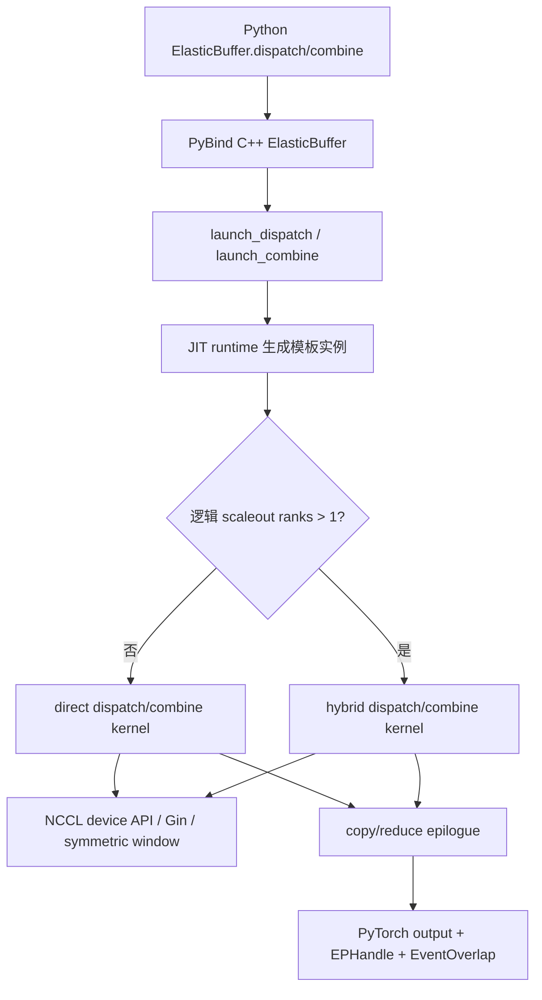
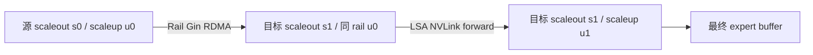
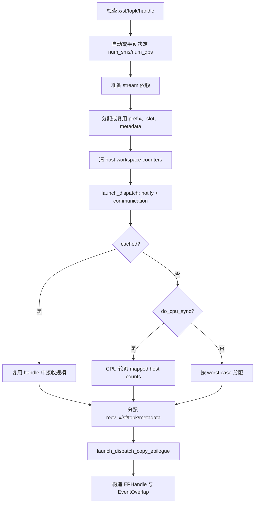
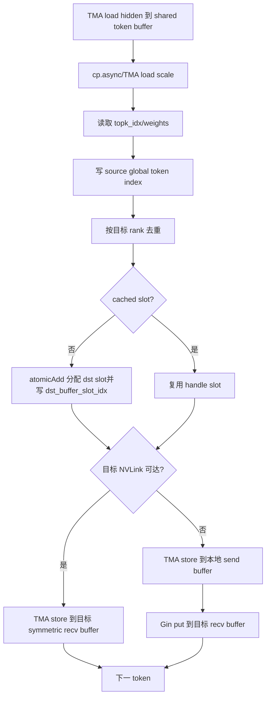
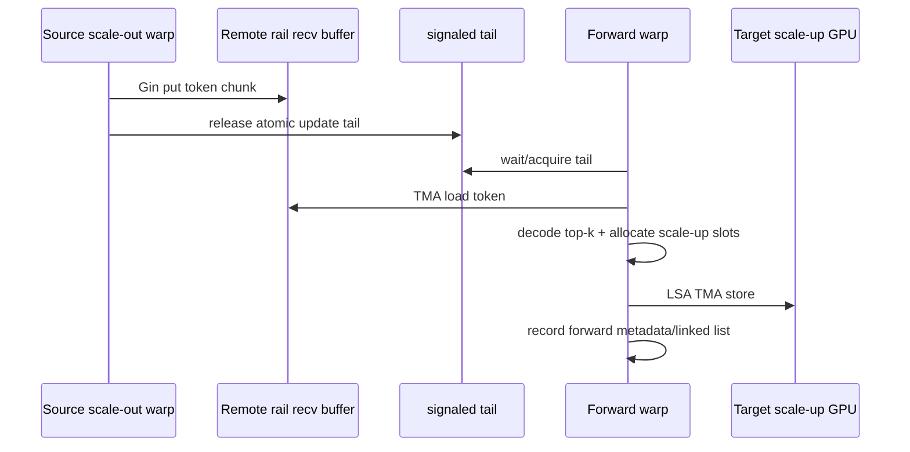
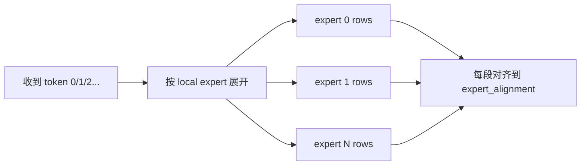
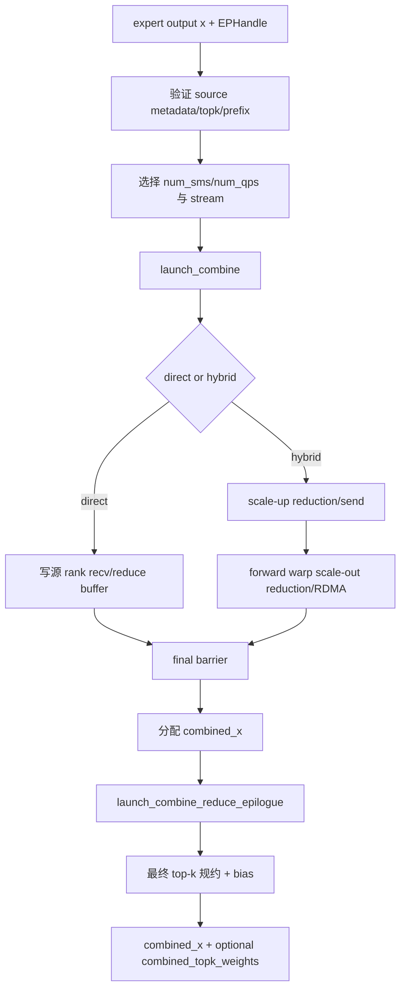

# DeepEP V2 Elastic 实现详解

> 本文对应仓库中的 V2 `ElasticBuffer` / elastic kernels。V2 是一次完整重构：EP 的训练吞吐与推理解码接口被统一，内核改为运行时 JIT 编译，通信后端从 NVSHMEM 切换到 NCCL Gin，并同时支持 direct 与 hybrid 两种拓扑。

## 1. V2 解决了什么问题

相对 V1，V2 的主要目标是：

- 用更少通信 SM 达到相同或更高吞吐；
- 扩展更大的 scale-up/scale-out 域，README 给出的目标上限为 EP2048；
- 去掉 V1 的静态 config 表和集群 auto-tuning，改为解析估算 SM 与 QP；
- 统一 high-throughput 与 low-latency 的 Python API；
- 用 NCCL Gin 复用 NCCL communicator、symmetric window 和 GPU-initiated networking；
- 使用固定最大容量、cached handle、可选 CPU sync，使同一实现覆盖训练、prefill 和 decode；
- 用新的 expanded/GEMM 布局直接服务 grouped GEMM；
- 以两阶段通信/规约 epilogue 降低主通信内核的 SM 占用。

需要特别说明：**V2 不再提供 V1 那种“0 SM RDMA low-latency + recv hook”路径。** V2 所谓 high-throughput/low-latency API 统一，是用同一 `dispatch/combine` 通过 cached handle、固定上界、较少 SM 等模式覆盖不同工作负载，不是保留了 V1 LL 的纯后台 RDMA hook 协议。

## 2. V1 与 V2 的核心对照

| 维度 | V1 normal | V1 low-latency | V2 Elastic |
|---|---|---|---|
| Python 对象 | `Buffer` | `Buffer(low_latency_mode=True)` | `ElasticBuffer` |
| 后端 | CUDA IPC + NVSHMEM IBGDA | NVSHMEM IBGDA | NCCL device API + NCCL Gin |
| 编译 | legacy CUDA 扩展 | legacy CUDA 扩展 | kernel runtime JIT |
| 路由统计 | 独立 layout + notify | 融合到 LL kernel | notify warps 融合进 dispatch |
| 输出分配 | 默认 CPU exact-count | 固定最大容量 | `do_cpu_sync=True/False` 可选 |
| cached routing | tuple handle | 固定 LL handle | 具名 `EPHandle` |
| 拓扑 | 单机 direct；多机固定 8-GPU 层次 | 全 rank RDMA | direct 或 hybrid，逻辑域来自 NCCL 拓扑 |
| SM/QP | 静态 config + 调优 | 隐式 | 解析估算，可覆盖 |
| GEMM 布局 | token-major | expert-major 固定槽 | normal 或 `do_expand` expert 布局 |
| 附加能力 | EP | EP | EP、Engram、PP、AGRS、barrier |

## 3. 代码分层

| 层次 | 关键文件 | 责任 |
|---|---|---|
| Python API | [`deep_ep/buffers/elastic.py`](../deep_ep/buffers/elastic.py) | `ElasticBuffer`、`EPHandle`、SM/QP 估算、模式参数、确定性排序 |
| C++ 编排 | [`csrc/elastic/buffer.hpp`](../csrc/elastic/buffer.hpp) | symmetric buffer、workspace、stream、输出/handle 分配、dispatch/combine 两阶段 launch |
| JIT 主机 launch | [`csrc/kernels/elastic/dispatch.hpp`](../csrc/kernels/elastic/dispatch.hpp)、[`combine.hpp`](../csrc/kernels/elastic/combine.hpp) | 生成模板实例、编译缓存、kernel launch 参数 |
| Direct kernel | [`deep_ep/include/deep_ep/impls/dispatch.cuh`](../deep_ep/include/deep_ep/impls/dispatch.cuh)、[`combine.cuh`](../deep_ep/include/deep_ep/impls/combine.cuh) | 单逻辑域直接通信 |
| Hybrid kernel | [`hybrid_dispatch.cuh`](../deep_ep/include/deep_ep/impls/hybrid_dispatch.cuh)、[`hybrid_combine.cuh`](../deep_ep/include/deep_ep/impls/hybrid_combine.cuh) | scale-out RDMA + scale-up NVLink 的分层通信 |
| Epilogue | [`dispatch_copy_epilogue.cuh`](../deep_ep/include/deep_ep/impls/dispatch_copy_epilogue.cuh)、[`combine_reduce_epilogue.cuh`](../deep_ep/include/deep_ep/impls/combine_reduce_epilogue.cuh) | buffer→用户输出、expanded layout、最终规约/bias |
| 公共布局 | [`common/layout.cuh`](../deep_ep/include/deep_ep/common/layout.cuh) | `TokenLayout`、`BufferLayout`、`WorkspaceLayout` |
| 通信原语 | [`common/comm.cuh`](../deep_ep/include/deep_ep/common/comm.cuh) | QP 映射、NVLink/Gin barrier、timeout |
| Gin handle | [`common/handle.cuh`](../deep_ep/include/deep_ep/common/handle.cuh) | symmetric ptr、put、reduce、flush 封装 |
| NCCL backend | [`csrc/kernels/backend/nccl.cu`](../csrc/kernels/backend/nccl.cu) | communicator 属性、Gin context/QP、logical/physical topology |
| 对称内存 | [`csrc/kernels/backend/symmetric.hpp`](../csrc/kernels/backend/symmetric.hpp) | GPU/CPU symmetric VA 与 window memory |
| JIT runtime | [`csrc/jit`](../csrc/jit) | include 解析、模板生成、NVCC 编译、缓存和 launch |
| 测试 | [`tests/elastic/test_ep.py`](../tests/elastic/test_ep.py) | direct/hybrid、expand、cached、no-CPU-sync、确定性和性能 |

总调用链：



## 4. 物理域与逻辑域

V2 不再把“每节点恰好 8 卡”硬编码到 EP 算法。NCCL backend 查询：

- `num_rdma_ranks`：物理 scale-out/RDMA 域大小；
- `num_nvl_ranks`：NCCL LSA team 的 NVLink 域大小。

然后依据 `allow_hybrid_mode` 构造逻辑域：

```text
hybrid=True:
  num_scaleout_ranks = num_rdma_ranks
  num_scaleup_ranks  = num_nvl_ranks
  rank = scaleout_rank * num_scaleup_ranks + scaleup_rank

hybrid=False:
  num_scaleout_ranks = 1
  num_scaleup_ranks  = total_num_ranks
```

### 4.1 Direct 模式

`num_scaleout_ranks == 1`。所有 peer 处于一个逻辑 scale-up 域：

- NVLink 可达 peer：通过 LSA symmetric pointer 和 TMA store 直接写；
- 不可 NVLink 直达 peer：先写 local send buffer，再用 Gin put 发 RDMA；
- 每个 token 直接到最终目标 rank，不使用中间 forwarder。

适合：单节点、较小 EP 域、网络允许全连接 Gin、希望结构简单的场景。

### 4.2 Hybrid 模式

`num_scaleout_ranks > 1`，通信拆成：

```text
Scale-out: NCCL Rail team / Gin RDMA
Scale-up : NCCL LSA team / NVLink symmetric store
```



hybrid 对 multi-rail/multi-plane 网络更友好：每个本地 GPU 沿对应 rail 做跨节点传输，然后节点内再分发。

### 4.3 `is_scaleup_nvlink`

```text
is_scaleup_nvlink = num_scaleup_ranks == num_nvl_ranks
```

它决定 direct kernel 的 `team_t` 和数据写法。如果整个逻辑 scale-up 域就是物理 NVLink 域，可直接使用 LSA pointer；否则 kernel 同时判断 NVLink bypass 和 Gin RDMA。

## 5. NCCL Gin 后端

### 5.1 初始化

[`NCCLSymmetricMemoryContext`](../csrc/kernels/backend/nccl.cu) 使用已有 NCCL communicator 创建 device communicator，并请求：

- `ginContextCount = num_allocated_qps`；
- exclusive Gin contexts；
- 固定 Gin queue depth；
- traffic class/service level；
- barrier 所需 signal；
- hybrid 用 `NCCL_GIN_CONNECTION_RAIL`；
- direct 用 `NCCL_GIN_CONNECTION_FULL`。

若 EP rank 数大于 1 且未设置 `EP_DISABLE_GIN=1`，Gin 不可用会直接报错，通常意味着网络或连接模式不符合要求。

### 5.2 对称窗口

C++ 统一布局：

```text
[[[Workspace] GPU buffer] CPU buffer]
```

- workspace 固定在 GPU segment 前部，按 2 MiB 对齐；
- EP buffer 位于 workspace 后；
- 可选 CPU segment 位于尾部，供 Engram 等远端存储；
- NCCL window 注册整个 symmetric address space；
- 每个 rank 在相同 offset 上拥有同构布局，Gin 只需目标 rank + offset 即可寻址。

### 5.3 GPU/CPU 混合对称内存

`HybridElasticSymmetricMemory` 可把：

```text
[local GPU VRAM][local-node CPU rank0 segment][CPU rank1 segment]...
```

连续映射到一个 VA 空间。CPU segment 通过 POSIX FD 交换和 CUDA VMM 导入。当前 EP 主缓冲仍主要使用 GPU segment；该机制同时支撑 Engram，并为未来 GPU+CPU elastic buffer 留出基础。

## 6. `ElasticBuffer` 初始化

### 6.1 两种大小指定方式

直接指定：

```python
buffer = deep_ep.ElasticBuffer(group, num_bytes=..., num_cpu_bytes=...)
```

按 MoE 参数计算：

```python
buffer = deep_ep.ElasticBuffer(
    group,
    num_max_tokens_per_rank=max_tokens,
    hidden=hidden,
    num_topk=topk,
    use_fp8_dispatch=True,
)
```

`calculate_elastic_buffer_size()` 同时计算 dispatch 和 combine 的最坏布局，取最大值并按 2 MiB 对齐。V2 buffer 通常比 V1 大，因为它更多采用固定上界布局，减少复杂有界 queue 和运行时流控。

### 6.2 Direct 的 buffer 估算

dispatch：

```text
recv_buffer: R * max_tokens
send_buffer: NVLink-only 时可为 0 rank；否则 1 * max_tokens
```

combine：

```text
recv_buffer token planes:
  allow_multiple_reduction=True  -> min(R, K)
  False                          -> K

send_buffer:
  NVLink-only 可省略；否则按 rank/expanded 最坏规模分配
```

### 6.3 Hybrid 的 buffer 估算

dispatch 需要：

```text
scaleup_recv_buffer
scaleout_send_buffer
scaleout_recv_buffer（按 channel 固定上界）
```

combine 需要对应的 scale-up/scale-out reduce 和 send buffer。所有布局复用 `TokenLayout`，token 内可包含 hidden、scale factor、top-k、source metadata 和同步字段。

## 7. JIT 编译机制

V2 kernel 的模板参数包含：

```text
拓扑大小、SM 数、warp 数、QP 数、hidden bytes、top-k、expert 数、
max tokens、alignment、FP8 scale pack、cached/CPU-sync/expand 模式等
```

提前编译全部组合会产生巨大二进制。V2 的 launch runtime 在第一次遇到某组参数时：

1. 生成只实例化该模板组合的 CUDA 源；
2. 解析所需 include；
3. 调 NVCC 编译；
4. 加载 cubin/module；
5. 以参数 hash 缓存；
6. 后续调用直接复用。

相关环境变量：

- `EP_JIT_CACHE_DIR`：缓存目录；
- `EP_JIT_DEBUG`：调试输出；
- `EP_JIT_PRINT_COMPILER_COMMAND`：打印 NVCC 命令；
- `EP_JIT_PTXAS_VERBOSE/CHECK`：寄存器/本地内存检查；
- `EP_JIT_DUMP_PTX/SASS/ASM`：导出汇编；
- `EP_JIT_WITH_LINEINFO`：profiling 行号。

代价是首轮新 shape/mode 有编译延迟；生产系统应在 warm-up 阶段覆盖实际组合。

## 8. V2 Dispatch 总流程



与 V1 的关键不同：路由统计不再是独立 `get_dispatch_layout` API；notify warps 与数据 warps 在同一个 dispatch kernel 中协作。

## 9. Notify Warps：统计、交换与 prefix

Direct 和 hybrid dispatch 的前若干 warp 是 notify warps，主要工作相同：

1. 在 shared memory 统计本 rank 的 `rank_count` 和 `expert_count`；
2. rank 计数对同一 token 的相同目标 rank 去重，expert 计数不去重；
3. 各 SM 将 `(到达标记, count)` 原子累加到全局 reduction workspace；
4. SM0 等待所有 SM 完成，汇总计数；
5. 把 rank/expert counts 写给 peer；
6. 等待本 rank 应接收的计数到齐；
7. 对 local expert 应用 `expert_alignment`；
8. 生成：
   - `psum_num_recv_tokens_per_scaleup_rank`；
   - `psum_num_recv_tokens_per_expert`；
   - `num_unaligned_recv_tokens_per_expert`；
9. `do_cpu_sync=True` 时把编码后的计数写到 mapped host workspace。

计数使用正数编码协议区分“0 token 已准备”和“尚未写入”。等待处均带 GPU timeout 和 rank/channel 诊断。

## 10. Direct Dispatch 内核

[`dispatch_impl`](../deep_ep/include/deep_ep/impls/dispatch.cuh#L31) 的每个数据 warp 被视为一个 channel。

### 10.1 每个 token 的处理



### 10.2 Source global index

每个 token 写入：

```text
src_token_global_idx = rank_idx * num_max_tokens_per_rank + token_idx
```

它同时编码源 rank 与源 token index，combine 可用除法/取模恢复，不必携带两个独立字段。

### 10.3 Cached slot

首次 dispatch 对每个 `(token, top-k)` 保存目标 buffer slot。cached dispatch 直接读取：

```text
dst_buffer_slot_idx[token, topk]
```

并复用已知接收规模和 source metadata，从而跳过 slot 原子分配与 CPU sync。适合 decode 中 routing 不变或 backward 中沿同一路由传梯度。

### 10.4 完成屏障

所有 payload 发出后调用统一 GPU barrier：

- flush Gin QP；
- NVLink 路径做 system-scope 可见性 fence；
- 向 team peers 发 signal；
- 等待 peer signal；
- 触发 programmatic dependent launch，使 copy epilogue 可及时开始。

## 11. Hybrid Dispatch 内核

[`hybrid_dispatch_impl`](../deep_ep/include/deep_ep/impls/hybrid_dispatch.cuh#L33) 把 warps 分成三类：

| warp 角色 | 作用 |
|---|---|
| notify warps | 全局 rank/expert 统计、跨 scale-out/scale-up 归并、prefix |
| scale-out warps | 将源 token 通过 Rail Gin 发到目标 scale-out 域的同 rail GPU |
| forward warps | 消费 scale-out recv buffer，在目标节点内按 top-k 转发到 scale-up peer |

### 11.1 Scale-out warp

- 一个 warp 是一个 channel；token 按 channel 固定分片。
- token 先 TMA 写 local scaleout send buffer。
- 根据 top-k 目标的 scale-out rank 去重；同一目标节点只发一份 token。
- 通过 `ncclTeamTagRail` Gin put 发送到对端同 rail 的 `scaleout_recv_buffer`。
- 每处理若干 token，以 release atomic 批量更新对端 channel tail；最后附 finish flag。

### 11.2 Forward warp

- 对各 scale-out 来源做 round-robin，等待 `signaled_tail` 推进或 finish。
- 从 scaleout recv buffer TMA load token。
- 读取 top-k，转换为目标 scale-up rank。
- 对目标 scale-up rank 去重并 atomic 分配 slot。
- 用 LSA symmetric pointer + TMA store 写目标 GPU 的 scaleup buffer。
- 记录 `token_metadata_at_forward` 和 `channel_linked_list`，供 cached dispatch 与 combine replay。



### 11.3 Hybrid 元数据

`dst_buffer_slot_idx` 形状为：

```text
[num_channels, num_scaleout_ranks, max_tokens_per_channel, num_topk]
```

`token_metadata_at_forward[channel, forwarded_token, :]` 包含：

```text
0: source global token index（含 source scale-out rank）
1: 是否是 chunk 最后一个 token
2 .. 2+K-1: 目标 scale-up rank
2+K .. 2+2K-1: 对应目标 slot
```

`channel_linked_list` 则按 channel 和 scale-up peer 保存 combine 输入 token 的链式顺序。combine 不必重新推导 dispatch 的到达顺序，可直接 replay。

## 12. CPU Sync、No-CPU-Sync 与输出分配

### 12.1 `do_cpu_sync=True`

dispatch kernel 的 notify warp 把计数写到 mapped host workspace。C++ 轮询：

- 每个 scale-up rank 的 deduplicated 接收数；
- 每个 local expert 的对齐后数量。

随后精确分配输出，`EPHandle.num_recv_tokens` 和 Python per-expert list 准确。适合训练/prefill，需要精确 shape 和 CPU grouped-GEMM metadata 的场景。

### 12.2 `do_cpu_sync=False`

C++ 按最坏情况分配：

```text
normal layout:
  num_recv_tokens = num_ranks * max_tokens

expanded layout:
  num_expanded_tokens ≈ num_ranks * max_tokens * min(topk, local_experts)
                        + alignment padding
```

真实有效 token 数在 GPU prefix 中：

```python
actual = handle.psum_num_recv_tokens_per_scaleup_rank[-1]
```

优点：无 CPU round trip，固定形状，利于 decode 与 CUDA Graph。代价：输出更大、尾部无效，上层必须依据 GPU metadata 截取或屏蔽。

### 12.3 Cached 模式

传 `handle=` 时强制 `do_cpu_sync=False`，复用：

- 接收 token 数和 expanded 数；
- per-expert list；
- rank/expert prefix；
- destination slot；
- source metadata；
- hybrid forward metadata 和 linked list；
- handle 中保存的 `topk_idx`。

cached dispatch 不允许再传新的 `topk_idx`；`topk_weights` 可在部分 backward/expanded 场景更新。

## 13. Dispatch Copy Epilogue

通信 kernel 只保证 token 已进入内部 symmetric buffer，随后 [`dispatch_copy_epilogue_impl`](../deep_ep/include/deep_ep/impls/dispatch_copy_epilogue.cuh#L22) 使用全部可用 SM 把数据整理到 PyTorch 输出：

- 读取 rank prefix、expert prefix、source metadata；
- 写 `recv_x` 和 FP8 scale；
- normal layout 写 `recv_topk_idx/weights`；
- expanded layout 把每个 `(token, local expert)` 展开到独立槽位；
- cached mode 按已有 destination slot 保持稳定布局；
- `do_zero_padding=True` 时清零 expert alignment 产生的 gap；
- hybrid 模式构建/使用 channel linked list。

把通信和 copy 分成两个 kernel 的原因：

- 主通信阶段只占解析得到的少量 SM，便于与计算重叠；
- epilogue 是 HBM/TMA 搬运，可短时间使用全 SM 快速结束；
- programmatic dependent launch 减少两个 kernel 之间的 host launch 间隙。

## 14. Expanded 布局

`do_expand=False`：一个收到的 token 只占一个 row，`recv_topk_idx[row, :]` 指示它属于哪些 local expert。

`do_expand=True`：一个 token 对每个有效 local expert 选择占一个独立 row，并按 expert 分段：



优点：

- grouped GEMM 可直接按连续 expert 段执行；
- `topk_weights` 可变成一维，与 expanded row 一一对应；
- combine 可在本地/分层路径提前规约。

相关字段：

- `psum_num_recv_tokens_per_expert`：expert 段 prefix；
- `num_unaligned_recv_tokens_per_expert`：真实 count；
- `recv_src_metadata[:, 2:]`：每个原接收 token 的 top-k expanded slot。

## 15. `EPHandle` 详解

[`EPHandle`](../deep_ep/buffers/elastic.py#L25) 是 V2 路由上下文：

| 字段 | 用途 |
|---|---|
| `do_expand` | combine 如何解释输入布局 |
| `num_experts` | 路由上下文 |
| `expert_alignment` | expert 段 padding |
| `num_max_tokens_per_rank` | source global index 的编码基数和 buffer 上界 |
| `num_sms` | combine 默认复用 dispatch SM 数 |
| `topk_idx` | 防用户修改的路由副本；combine 的目标和 cached dispatch 的 routing |
| `num_recv_tokens` | normal 实际/估计接收数 |
| `num_expanded_tokens` | expanded 实际/估计大小 |
| `num_recv_tokens_per_expert_list` | CPU grouped GEMM metadata |
| `psum_num_recv_tokens_per_scaleup_rank` | rank prefix，no-CPU-sync 时给出 GPU 真实数 |
| `psum_num_recv_tokens_per_expert` | expert prefix |
| `num_unaligned_recv_tokens_per_expert` | padding 前 count |
| `recv_src_metadata` | source global token、source top-k slot、expanded slot |
| `dst_buffer_slot_idx` | cached dispatch 复用的目标 slot |
| `token_metadata_at_forward` | hybrid forward replay |
| `channel_linked_list` | hybrid combine 的 per-channel/per-peer 顺序 |

不要在 routing 尚未完成的前提下修改 handle 中张量；一个 handle 只能与相同 topology、expert、max-token、alignment 和 layout mode 配套使用。

## 16. V2 Combine 总流程



## 17. Direct Combine 内核

[`combine_impl`](../deep_ep/include/deep_ep/impls/combine.cuh#L28) 对每个收到的 token 从 `src_metadata` 恢复：

```text
src_token_idx
src_rank_idx
src_topk_idx
expanded slots（若有）
```

然后分三类处理：

1. **无需本地规约**：normal layout，或 expanded 只有一个有效 slot。TMA load 一个 row，直接发回源 rank。
2. **允许多级规约**：`allow_multiple_reduction=True` 且同一层有多个 expanded slot。先在 shared memory 做本地向量规约，再发送部分和。
3. **禁止多级规约**：`allow_multiple_reduction=False`。不在中间层相加，把每个 top-k 结果分别发送，留给最终 epilogue 一次性规约。

目标在 NVLink 域内时直接 TMA 写 symmetric recv buffer；否则先写本地 send buffer，再 Gin put。

## 18. Hybrid Combine 内核

hybrid combine 与 dispatch 逆向，但会利用层次做规约：

```text
local expert rows
  -> scale-up peer 间整理/局部规约
  -> forward warp replay dispatch metadata
  -> 写 scale-out send buffer
  -> Rail Gin RDMA 返回源 scale-out 域
  -> final reduce epilogue
```

### 18.1 Scale-up warps

- 按 `channel_linked_list` 读取属于各 scale-up peer 的 token；
- 从 expanded/normal 输入加载结果；
- 可在当前节点内对相同源 token的多个 expert 结果先规约；
- 写 scale-up buffer 并更新 per-channel tail。

### 18.2 Forward warps

- replay `token_metadata_at_forward`，因此顺序与 dispatch 一致；
- 等待所有需要的 scale-up peer tail 到达；
- `allow_multiple_reduction=True` 时先对 scale-up 部分和规约，再只发一个结果到源 scale-out rank；
- `False` 时把所有 top-k 分量分别转发，保留单次最终规约；
- 通过 Rail Gin 发起 RDMA，并用 chunk last flag 控制 request aggregation/flush；
- 最后交换 finish signal 并清 tail。

## 19. `allow_multiple_reduction` 的精度/带宽取舍

浮点加法不满足结合律。

`allow_multiple_reduction=True`：

```text
节点内/层内先规约 -> 跨层发送部分和 -> epilogue 再规约
```

- 优点：传输 token 数少、buffer 小、吞吐高；
- 缺点：同一逻辑 sum 可能经过多次不同顺序的 BF16/向量规约，数值误差略大。

`allow_multiple_reduction=False`：

```text
所有 top-k 分量保持独立 -> 最终 epilogue 一次规约
```

- 优点：规约路径更单一，通常精度/可解释性更好；
- 缺点：更多网络和 HBM payload，buffer 更大。

## 20. Combine Reduce Epilogue

[`combine_reduce_epilogue_impl`](../deep_ep/include/deep_ep/impls/combine_reduce_epilogue.cuh#L24) 使用全 SM：

- 按原 token 读取各 top-k plane 或 rank plane；
- 完成最终向量加法；
- 合并/返回 top-k weights；
- 融合最多两个 BF16 bias；
- 写 `combined_x[num_original_tokens, hidden]`。

V2 combine 对 hidden 向量执行的是**不乘 `topk_weights` 的加法规约**；传入的 `topk_weights` 被通信并重建为独立的 `combined_topk_weights` 输出。若模型要求 gate 权重作用于 expert 输出，应在调用 combine 前由上层/GEMM epilogue 完成，不能仅因传入了 `topk_weights` 就假设 DeepEP 会对 hidden 自动加权。

## 21. SM 数解析估算

[`get_theoretical_num_sms`](../deep_ep/buffers/elastic.py#L729) 不遍历 config，而是估算达到 NVLink/RDMA 带宽所需的每 SM HBM 读写量。

步骤概括：

1. 用组合概率估计一个 token 的 top-k 会覆盖多少 rank：

```text
expected_groups = G * (1 - C(E - E/G, K) / C(E, K))
```

2. 分 direct/hybrid 统计：
   - HBM read/write token 份数；
   - NVLink traffic；
   - RDMA traffic；
   - local bypass。
3. 选预计更慢的网络边界。
4. 根据目标网络 GB/s 和每 SM HBM GB/s，估算需要的 SM。
5. 乘 1.25 裕量，至少 4，向上对齐到偶数。
6. `prefer_overlap_with_compute=False` 时倾向至少使用 64 SM 追求峰值，否则使用较少 SM 给 GEMM 留资源。
7. 最终不超过设备 SM 总数。

当前函数假设 balanced gate，且暂不支持 `num_scaleout_topk > 0` 和 group-limited gate 的精确建模；这类模型应实测覆盖 `num_sms`。

## 22. QP 数估算

[`get_theoretical_num_qps`](../deep_ep/buffers/elastic.py#L836)：

```text
direct: min(num_sms, 9)
hybrid: num_sms * 16 + 1
最终 cap 到 num_allocated_qps
```

含义：

- direct 鼓励较少 QP，降低 doorbell ringing 和 context 成本；
- hybrid 每个 SM 有多个 channel，并额外有 notify traffic，需要更多独立 QP；
- `+1` 预留 notify/barrier；
- 设备侧 `get_qp_mode` 会把 channel 映射到 QP，并在 QP 不足时让多个 SM/channel 以 GPU sharing mode 共享。

初始化默认值：

```text
hybrid + fast RDMA atomic : 65
hybrid + slower atomic    : 129
direct                    : 17
```

## 23. Stream 与事件控制

### 23.1 `stream_control_prologue`

- 读取当前 compute stream；
- `previous_event` 存在时让 comm stream 等待；
- `allocate_on_comm_stream=True` 时在 comm stream 上分配输出，保证 allocator stream ownership 正确；
- `previous_event` 与 overlap 模式下禁止不安全的分配顺序。

### 23.2 `previous_event_before_epilogue`

它只阻塞 copy/reduce epilogue，不阻塞主通信 kernel。可用于细粒度 overlap：网络通信先进行，等另一路计算释放 HBM/SM 后再执行高带宽 epilogue。

### 23.3 `async_with_compute_stream`

为 `True` 时 compute stream 不自动等待 comm stream，返回 `EventOverlap`。调用方在真正消费输出前：

```python
event.current_stream_wait()
```

环境变量 `EP_AVOID_RECORD_STREAM=1` 可避免对输出 tensor 调 `record_stream`，但调用方必须自行保证 allocator 生命周期，属于高级选项。

## 24. 确定性模式

网络到达顺序可能变化，默认 dispatch 输出 row 顺序不保证逐次一致。`deterministic=True` 时 Python `EPHandle.deterministic_sort()` 在通信完成后排序：

- normal layout：按 source global token index 排序 `recv_x/sf/topk/metadata`；
- expanded layout：先按 expert，再按源 token 排序有效 row，padding 放后；
- 更新 linked list 或 expanded slot 指针；
- cached mode 使用首次保存的未排序 source metadata 作为稳定 key。

异步调用时，排序注册为 `EventOverlap` wait 后 hook；同步调用则立刻执行。确定性会增加 sort、copy 和临时张量开销。

## 25. 主要 Python API

### 25.1 初始化与 size hint

```python
required = deep_ep.ElasticBuffer.get_buffer_size_hint(
    group,
    max_tokens,
    hidden,
    num_topk=topk,
    use_fp8_dispatch=True,
)

buffer = deep_ep.ElasticBuffer(
    group,
    num_bytes=required,
    num_max_tokens_per_rank=max_tokens,
    allow_hybrid_mode=True,
    allow_multiple_reduction=True,
    prefer_overlap_with_compute=True,
)
```

### 25.2 Dispatch

```python
recv_x, recv_topk_idx, recv_topk_weights, handle, event = buffer.dispatch(
    x,
    topk_idx=topk_idx,
    topk_weights=topk_weights,
    num_experts=num_experts,
    num_max_tokens_per_rank=max_tokens,
    expert_alignment=alignment,
    num_sms=0,  # automatic
    num_qps=0,  # automatic
    do_cpu_sync=True,
    do_expand=False,
    async_with_compute_stream=True,
)
```

### 25.3 Cached decode

```python
cached_recv_x, _, _, _, event = buffer.dispatch(
    next_x,
    handle=handle,
    async_with_compute_stream=True,
)
```

### 25.4 Expanded dispatch

```python
expanded_x, _, expanded_weights, expanded_handle, event = buffer.dispatch(
    x,
    topk_idx=topk_idx,
    topk_weights=topk_weights,
    num_experts=num_experts,
    do_expand=True,
    do_zero_padding=True,
    use_tma_aligned_col_major_sf=True,
)
```

### 25.5 Combine

```python
combined_x, combined_weights, event = buffer.combine(
    expert_output,
    handle=handle,
    topk_weights=recv_topk_weights,
    bias=(bias0, bias1),
    async_with_compute_stream=True,
)
```

## 26. V2 其他主要功能

`ElasticBuffer` 不只包含 EP。

### 26.1 Barrier

[`barrier`](../deep_ep/buffers/elastic.py#L497) 可在 compute/comm stream 上发起 GPU barrier，并可选择 CPU sync、顺序化模式。底层统一使用 NVLink/Gin signal 和 timeout。

### 26.2 Engram

[`engram_write`](../deep_ep/buffers/elastic.py#L569) 把本 rank 的存储写入 symmetric CPU segment；[`engram_fetch`](../deep_ep/buffers/elastic.py#L584) 按 index 从远端 CPU/GPU memory 发起 Gin RDMA get，并返回 wait callable。目标是远端 embedding/KV 类访问时 0 SM 等待数据搬运。

### 26.3 Pipeline Parallel Send/Recv

[`pp_set_config/pp_send/pp_recv`](../deep_ep/buffers/elastic.py#L606) 在固定最大 tensor 和 inflight 槽位下提供 PP 点对点传输，接口按前后 rank 配置 ring 邻居。send/recv JIT kernel 用 TMA 在用户 tensor 与 registered window slot 之间搬运，再由 NCCL Gin RDMA put 和 signal 完成跨 rank 传输；NIC 搬运本身不持续占用 SM，但前后的 TMA staging 会使用调用参数指定的 SM。

### 26.4 AGRS

[`agrs_set_config`](../deep_ep/buffers/elastic.py#L670)、`create_agrs_session`、`all_gather` 实现实验性的 All-Gather + Reduce-Scatter session：

- session 预留连续 buffer；
- `agrs_get_inplace_tensor` 让生产者直接写 communication buffer；
- all-gather 返回输出 tensor 和 wait handle；
- 多个 inflight AGRS 通过 slot 管理。

这些能力仍属实验性，使用前应以 `tests/elastic` 对应测试为准。

## 27. 环境变量

常用 V2 变量：

| 变量 | 作用 |
|---|---|
| `EP_BUFFER_DEBUG` | 输出 buffer、SM/QP 和 backend 诊断 |
| `EP_DISABLE_GIN` | 禁用 Gin，使用可用的 fallback 路径 |
| `EP_NIC_NAME` | 查询 NIC 属性的名称 |
| `EP_OVERRIDE_RDMA_SL` | 覆盖 service level，做流量隔离 |
| `EP_GIN_GDAKI_DEBUG` | Gin GDAKI debug |
| `EP_NUM_TOPK_IDX_BITS` | top-k index 编码位数 |
| `EP_AVOID_RECORD_STREAM` | 禁止 V2 输出 record_stream |
| `EP_DISABLE_BARRIER_PROFILING` | benchmark 时关闭 barrier profiling |
| `NCCL_GIN_CROSS_NIC` | NCCL Gin multi-plane/cross-NIC 行为 |

## 28. 限制与风险

### 28.1 软件/硬件要求

- Hopper/SM90 PTX ISA 支持；
- CUDA 12.3+；
- PyTorch 2.10+；
- NCCL 2.30.4+；
- scale-up 需要 NVLink；
- scale-out 需要 RDMA 和可用 Gin。

### 28.2 模式一致性

所有 rank 必须使用一致的：

- logical topology 与 `allow_hybrid_mode`；
- `num_experts/topk/max_tokens/alignment`；
- `allow_multiple_reduction`；
- `num_sms/num_qps`；
- dispatch/combine 顺序和 cached handle 上下文。

### 28.3 Buffer 显存

V2 为固定最大容量、hybrid channel、expanded layout 和多个 token plane 预留较多空间。`max_tokens`、top-k、rank 数和 `allow_multiple_reduction=False` 都可能显著放大 buffer。

### 28.4 首轮 JIT

新组合第一次调用会编译。不要把首次 JIT 延迟计入在线首 token；应在模型加载或 warm-up 阶段预热。

### 28.5 No-CPU-Sync 的无效尾部

固定 worst-case 输出不能直接把整个 tensor 送入普通 GEMM。必须使用 prefix/count、expanded zero padding 或支持动态有效范围的 grouped GEMM。

### 28.6 数值与确定性

- `allow_multiple_reduction` 会改变浮点加法分组；
- 网络到达顺序默认不确定；
- `deterministic=True` 有额外排序开销；
- FP8 dispatch 的 scale layout必须与 GEMM 消费者一致。

## 29. 推荐阅读与调试顺序

1. [`ElasticBuffer.__init__`](../deep_ep/buffers/elastic.py#L228)：拓扑、buffer、QP、NCCL handle。
2. [`NCCLSymmetricMemoryContext`](../csrc/kernels/backend/nccl.cu)：Gin context、logical domain、window。
3. [`ElasticBuffer.dispatch`](../deep_ep/buffers/elastic.py#L855)：模式参数与 `EPHandle`。
4. [`ElasticBuffer::dispatch`](../csrc/elastic/buffer.hpp#L693)：host workspace、metadata、CPU/no-CPU-sync、两阶段 launch。
5. [`dispatch_impl`](../deep_ep/include/deep_ep/impls/dispatch.cuh#L31)：direct notify/data warp。
6. [`hybrid_dispatch_impl`](../deep_ep/include/deep_ep/impls/hybrid_dispatch.cuh#L33)：scale-out/forward warp 与 tail 协议。
7. [`dispatch_copy_epilogue_impl`](../deep_ep/include/deep_ep/impls/dispatch_copy_epilogue.cuh#L22)：normal/expanded/cached 输出。
8. [`EPHandle`](../deep_ep/buffers/elastic.py#L25)：路由上下文和确定性排序。
9. [`ElasticBuffer::combine`](../csrc/elastic/buffer.hpp#L1179)：combine host orchestration。
10. [`combine_impl`](../deep_ep/include/deep_ep/impls/combine.cuh#L28)、[`hybrid_combine_impl`](../deep_ep/include/deep_ep/impls/hybrid_combine.cuh#L32)：direct/hybrid 回传与分层规约。
11. [`combine_reduce_epilogue_impl`](../deep_ep/include/deep_ep/impls/combine_reduce_epilogue.cuh#L24)：最终规约和 bias。
12. [`tests/elastic/test_ep.py`](../tests/elastic/test_ep.py)：用测试参数逐个对应所有模式。

调试时建议：

```bash
EP_BUFFER_DEBUG=1 EP_JIT_DEBUG=1 python tests/elastic/test_ep.py ...
```

再用 Nsight Systems/Compute 观察：

```text
dispatch_impl / hybrid_dispatch_impl
dispatch_copy_epilogue_impl
combine_impl / hybrid_combine_impl
combine_reduce_epilogue_impl
```

## 30. 一句话总结

V2 Elastic 的本质是：**在 NCCL symmetric window 上，用 JIT 专门化的 notify/data warps 和 NCCL Gin 完成 direct 或“Rail RDMA + LSA NVLink”两级路由，再用全 SM epilogue 整理 GEMM 布局或做最终规约；`EPHandle`、固定上界、可选 CPU sync 和解析 SM/QP 估算让同一套 API 同时覆盖训练、prefill 与 decode。**
