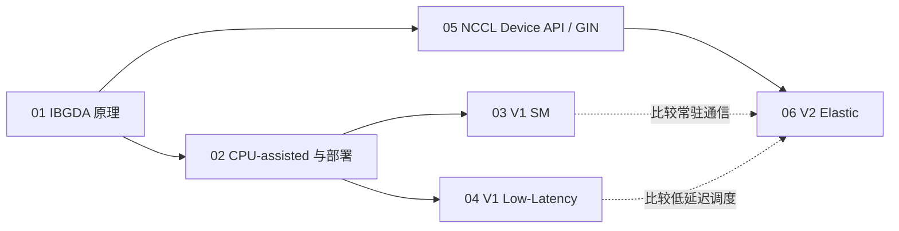

# DeepEP 通信研究学习目录

> 六篇专题 · 从 IBGDA 基础到 V1/V2 内核 · Markdown 与离线 HTML 双版本

本套材料把“网络怎么工作”“如何配置和验证”“项目怎样实现”连接起来。三篇基础教程解释底层概念，三篇实现文档跟读 DeepEP。每篇都有原理、流程/代码框图、源码位置、代码解释和学习建议。

**HTML 阅读入口：[打开学习中心](html/index.html)**。可直接用浏览器打开；页面、全文搜索、流程图和源码浏览均使用本地文件。官方外部资料仍需联网访问。

## 1. 六篇文档与建议顺序

| 顺序 | 文档 | 阅读后应能回答 | HTML |
|---|---|---|---|
| 01 | [GPUDirect Async 与 IBGDA 原理](tutorial-ibgda-principles.md) | 谁构造 WQE？地址怎么翻译？何时才算完成？ | [阅读](html/tutorial-ibgda-principles.html) |
| 02 | [CPU-assisted IBGDA 与 NVSHMEM 部署](tutorial-nvshmem-deployment.md) | 三种控制面有何区别？如何核对实际路径和做实验？ | [阅读](html/tutorial-nvshmem-deployment.html) |
| 03 | [V1 SM / normal 实现](implementation-v1-sm.md) | channel、warp、ring、credit 和两级通信如何协作？ | [阅读](html/implementation-v1-sm.html) |
| 04 | [V1 Low-Latency 实现](implementation-v1-low-latency.md) | 固定槽、count/flag、hook 和后台 RDMA 窗口如何实现？ | [阅读](html/implementation-v1-low-latency.html) |
| 05 | [NCCL Device API 与 GIN](tutorial-nccl-device-gin.md) | window/team/context 和完成语义如何映射到 V2？ | [阅读](html/tutorial-nccl-device-gin.html) |
| 06 | [V2 Elastic 实现](implementation-v2-elastic.md) | direct/hybrid、JIT、TMA、EPHandle、epilogue 如何组织？ | [阅读](html/implementation-v2-elastic.html) |

## 2. 按目标选择路线



**第一次接触 GPU 通信：**01 → 02 → 03 → 04 → 05 → 06。先理解消息、地址和完成，再读大内核的 warp 分工。

**主要研究推理解码：**01 → 02 → 04 → 06。重点跟踪 SEND/RECV hook、固定上界、返回 handle 和真实有效 token 数；比较端到端延迟。

**主要研究训练吞吐：**01 → 03 → 05 → 06。重点看 rank 去重、分层发送、队列 credit、SM/QP 数，以及通信和 GEMM 的资源竞争。

**排查运行环境：**先读 02 的分层检查，再回到 01 确定控制面；若运行 V2，查 05 的 NCCL capability、版本和 window。

## 3. 知识地图

| 问题 | 主文档 | 源码定位 |
|---|---|---|
| WQE、DBR、doorbell、CQ | 01、02 | [ibgda_device.cuh](../csrc/kernels/legacy/ibgda_device.cuh) |
| PE 与初始化配置 | 02、03、04 | [legacy.py](../deep_ep/buffers/legacy.py#L105)、[nvshmem.cu](../csrc/kernels/backend/nvshmem.cu) |
| channel/SM/warp 分工 | 03 | [internode.cu](../csrc/kernels/legacy/internode.cu#L452) |
| 固定槽、负 count、P2P | 04、01 | [internode_ll.cu](../csrc/kernels/legacy/internode_ll.cu#L253) |
| 经典双 micro-batch 图 | 03、04 | [low-latency.png](../figures/low-latency.png) |
| window/team/context | 05 | [nccl.cu](../csrc/kernels/backend/nccl.cu)、[handle.cuh](../deep_ep/include/deep_ep/common/handle.cuh) |
| GIN flush/signal/barrier | 05、06 | [comm.cuh](../deep_ep/include/deep_ep/common/comm.cuh#L129) |
| JIT、direct/hybrid、epilogue | 06 | [compiler.hpp](../csrc/jit/compiler.hpp)、[dispatch.cuh](../deep_ep/include/deep_ep/impls/dispatch.cuh) |
| 测量与实验 | 02、各实现的研究章节 | [testing.py](../deep_ep/utils/testing.py)、[test_ep.py](../tests/elastic/test_ep.py) |

## 4. 每篇都按同一个研究方法学习

1. **提问题。** 例如“为什么 LL 不需要先由 CPU 得到接收数？”
2. **写解释。** 固定上界与 GPU count 能够分离容量和真实 token 数。
3. **定位代码。** 在布局、SEND 通知、RECV pack、API 输出中各找一个证据。
4. **画依赖。** 标记 producer、消费者、数据写入、通知、等待和复用。
5. **设计反例。** 0 token、同 rank 的多个 expert、极不均衡路由、跨 slot 重用。
6. **做实验。** 固定版本、形状和拓扑，先正确性后性能，保存原始结果。

学完的标志是能解释“哪行代码保证了什么，以及还没有保证什么”。

## 5. 统一术语速查

| 术语 | 读法与边界 |
|---|---|
| dispatch | token 发往 expert 所在位置，并建立反向映射 |
| combine | expert 结果回源与规约；权重语义按 API 区分 |
| SM / block | SM 是硬件，block 是调度单元；blockIdx.x 不是物理 SM id |
| rank / PE / team peer | 编号需确认所属通信域 |
| IBGDA | GPU 生成网络 work request，存在 traditional 与 CPU-assisted 模式 |
| GIN | NCCL 设备端网络接口，具体 backend 与版本另行确认 |
| capacity / count | buffer 容量与有效 token 数，不能互换 |
| source reuse / remote visibility | 源槽可重用与远端可读是两个事件 |

## 6. 版本与证据

三篇实现文档保留 2026-08-26 的研究基线；三篇基础教程在 2026-09-23 对照同一本地源码与官方资料撰写。实际上游源码 commit 为 `01dc3aaac82068020353dce2c302e38153c0bfaa`，本地教程提交与上游源码提交不同。

源码事实以代码为准；官方资料解释 API/硬件背景；性能模型与实验设计属于推导。当前 Windows 文档构建环境没有运行 GPU 集群验证。HTML 源码页是构建时快照，更新代码后应重新构建。

外部入口：[IBGDA 原理](https://developer.nvidia.com/blog/improving-network-performance-of-hpc-systems-using-nvidia-magnum-io-nvshmem-and-gpudirect-async/)、[CPU-assisted](https://developer.nvidia.com/blog/?p=88550)、[DeepEP NVSHMEM](https://github.com/deepseek-ai/DeepEP/blob/main/docs/nvshmem.md)、[NCCL Device API](https://docs.nvidia.com/deeplearning/nccl/user-guide/docs/usage/deviceapi.html)。

## 7. HTML 阅读与重建

HTML 包含目录与六篇完整正文，并提供必要的源码/补充材料页。左侧选篇目，右侧跳章节；全文搜索定位章节，代码可复制，流程图可打开大图，字体和明暗主题可切换，浏览器打印可保存 PDF。

修改 Markdown 后在仓库根目录运行：

```bash
node docs/tools/build-docs.cjs
```

工具支持 `DEEPEP_DOCS_NODE_MODULES` 指定依赖目录；安装及验证方式见 [构建说明](tools/README.md)。阅读已生成 HTML 无需 Node。分享时复制整个 `docs/html/`，入口是 `index.html`。
