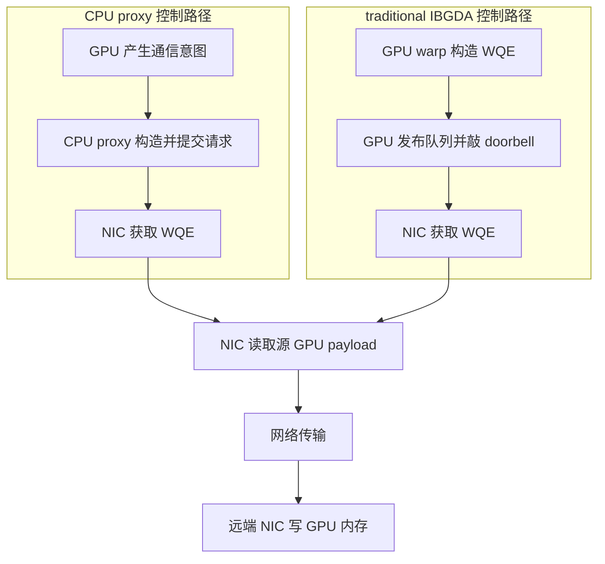
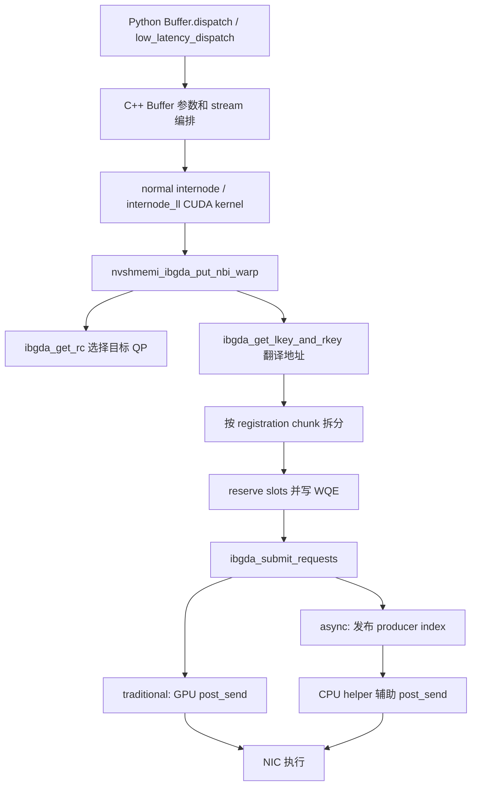
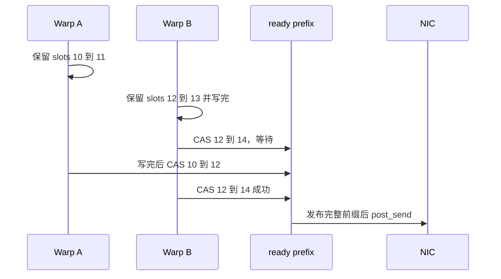

# GPUDirect Async 与 IBGDA：从消息到 NIC 的源码教程

> 基础篇 A · 建议先读 · 目标：能够沿 DeepEP 源码解释一次 RDMA 请求如何产生、提交、完成，以及它为什么仍会消耗 SM。

本文把 NVIDIA 的 IBGDA 原理文章作为概念入口，把本地 DeepEP 的实际实现作为代码证据。研究日期为 **2026-09-23**；源码基线为 `01dc3aaac82068020353dce2c302e38153c0bfaa`，本地 HEAD 为 `1df6d4c2466e1b32b80ef7ae559cff79972d4acc`。代码摘录保留关键语句，省略处明确标出；教学模型单独标注，不是可直接编译的完整程序。

[返回六篇总目录](reading-guide.md) · [下一篇：CPU-assisted 与部署](tutorial-nvshmem-deployment.md) · [对照 V1 SM](implementation-v1-sm.md) · [对照 V1 LL](implementation-v1-low-latency.md)

## 1. 入门先回答三个问题

GPU 算出了 token，需要交给另一张 GPU 的 expert。这里有三个不同任务：决定往哪里发，通知 NIC 执行传输，判断结果什么时候可以使用。路由正确不代表 NIC 已经收到请求；NIC 收到请求也不代表接收 GPU 已经可以消费数据。

学习本篇只需要 CUDA 的 thread/warp/block、指针和基本 producer/consumer 概念。不需要先会写网络驱动。建议先画出下表里的执行者，再读代码。

| 问题 | 执行者与对象 | 项目中的观察入口 |
|---|---|---|
| token 发给谁 | CUDA warp；top-k 到 expert/rank | [`internode_ll.cu`](../csrc/kernels/legacy/internode_ll.cu#L253) |
| NIC 如何获得任务 | WQE、QP、DBR、doorbell | [`ibgda_device.cuh`](../csrc/kernels/legacy/ibgda_device.cuh#L81) |
| 谁搬 payload | 网络路径由 NIC DMA；本地 P2P 可由 GPU copy | [`internode_ll.cu`](../csrc/kernels/legacy/internode_ll.cu#L263) |
| 什么时候消费 | count/tail/flag 协议及 acquire 读取 | [`internode_ll.cu`](../csrc/kernels/legacy/internode_ll.cu#L323) |
| 什么时候回收资源 | CQ/quiet、phase、buffer 生命周期 | [`ibgda_device.cuh`](../csrc/kernels/legacy/ibgda_device.cuh#L462) |

## 2. GPUDirect RDMA 与 IBGDA 分别解决什么

GPUDirect RDMA 关注 NIC 对 GPU 内存的访问；IBGDA 进一步让 GPU 生成和提交网络请求。传统 CPU proxy 可以搭配 GPUDirect RDMA，所以“数据不经过 CPU 内存”并不能证明“控制面不经过 CPU”。NVIDIA 原理文章用两条路径对比这一点，重点是小消息请求提交能力。[官方原理](https://developer.nvidia.com/blog/improving-network-performance-of-hpc-systems-using-nvidia-magnum-io-nvshmem-and-gpudirect-async/)

下面的框图是教学抽象：host 初始化工作在两种模式里都存在，图中只画逐消息热路径。



这也解释了 DeepEP 的选择：expert routing 已经在 GPU 上，直接在 CUDA 内核内提交请求可以减少逐消息协调。收益大小必须结合 token 数、消息大小、QP 竞争与 NIC 能力测量。这里不把官方历史硬件的性能数字当作当前集群承诺。

## 3. 先把术语放回物理对象

| 名称 | 本篇含义 | 容易混淆的地方 |
|---|---|---|
| PE | NVSHMEM 通信进程坐标 | 不一定等于 DeepEP global rank |
| symmetric heap | 各 PE 按一致规则分配的通信地址空间 | 不保证不同 PE 的原始虚拟地址相等 |
| MR / lkey / rkey | NIC 可访问内存及其访问 key | 普通 tensor 指针不会自动成为已注册内存 |
| QP | NIC 的队列对及协议状态 | channel/expert 到 QP 是软件映射，不是硬件一一规定 |
| WQE | 队列里描述一次工作请求的字段 | payload 通常在另一块显存里 |
| DBR | 内存中的 doorbell record | 与 NIC MMIO doorbell 不是同一对象 |
| CQ / CQE | 完成队列及完成记录 | 不等于应用已经完成 unpack 或 reduce |
| ready / prod | 软件发布前缀、提交进度 | 不等于接收端消费进度 |

本地 helper 文件开头声明它改编自 NVSHMEM 的 non-ABI 内部实现。这使它适合研究 WQE，但也意味着不能把结构字段当成稳定公共 API。[源码与许可说明](../csrc/kernels/legacy/ibgda_device.cuh#L1)

## 4. 代码框图：应用层怎样到达设备队列



[`legacy.py`](../deep_ep/buffers/legacy.py#L105) 负责启用 transport；[`buffer.hpp`](../csrc/legacy/buffer.hpp#L255) 建立 PE 与 heap；真正按消息访问 QP 的代码在 [`ibgda_device.cuh`](../csrc/kernels/legacy/ibgda_device.cuh#L335)。Python 函数每次调用的粒度和 CUDA 内部每次 put 的粒度不同，不应从 Python 层耗时直接推导 WQE 速率。

## 5. 源码精读一：PE 与 QP 的坐标

[`Buffer::sync`](../csrc/legacy/buffer.hpp#L255) 使用如下选择：

```cpp
auto nvshmem_rank = low_latency_mode ? rank : rdma_rank;
auto num_nvshmem_ranks = low_latency_mode ? num_ranks : num_rdma_ranks;
```

normal 的跨节点通信把相同本地 GPU 编号组织成一个 RDMA world；LL 用整个 EP world 的 global rank 作为 PE。因此同一个数字 `pe=1` 在两种模式中可能代表不同物理 GPU。调试时必须记录模式和坐标系统。

QP 索引来自 [`ibgda_get_rc`](../csrc/kernels/legacy/ibgda_device.cuh#L81)：

```cpp
const auto num_rc_per_pe = ibgda_get_state()->num_rc_per_pe;
return &state->globalmem
    .rcs[pe * num_rc_per_pe * state->num_devices_initialized
         + id % (num_rc_per_pe * state->num_devices_initialized)];
```

`pe` 选择目标块；取模后的 `id` 选择该目标的连接资源。normal 常传 channel，LL 常传 local expert index。取模意味着多个逻辑执行者可能落在同一个实际 QP 上，它们必须遵守相同发布规则。QP 增多可能减少竞争，也会增加连接状态和内存开销。

## 6. 源码精读二：地址翻译与分块

[`ibgda_get_lkey_and_rkey`](../csrc/kernels/legacy/ibgda_device.cuh#L205) 中真正决定远端地址的是：

```cpp
uint64_t roffset = raddr - heap_start;
// ... 根据 chunk、dst_pe 与 dev_idx 查询 rkey ...
*out_raddr = reinterpret_cast<uint64_t>(
    nvshmemi_device_state_d.peer_heap_base_remote[dst_pe]) + roffset;
*out_rkey = device_key.key;
auto rchunk_size = device_key.next_addr - roffset;
return min(lchunk_size, rchunk_size);
```

设本地 heap 起点为 `0x100000`，逻辑目标指针为 `0x102000`，远端 heap 起点为 `0x800000`。函数计算 offset `0x2000`，最终远端地址为 `0x802000`。这些地址是教学例子，不是实际运行地址。

返回值是本地与远端当前注册块剩余长度的较小者。一个逻辑消息跨越注册边界时，需要拆成多个 WQE；不能用“一个 token 等于一个 WQE”估算所有情况。循环每次推进源、目标地址与 remaining bytes，代码还断言 WQE 数不超过一个 warp 的 lane 数。

## 7. 源码精读三：WQE 里到底写什么

[`ibgda_write_rdma_write_wqe`](../csrc/kernels/legacy/ibgda_device.cuh#L280) 的核心字段：

```cpp
raddr_seg.raddr = HtoBE64(raddr);
raddr_seg.rkey = rkey;
raddr_seg.reserved = 0;
data_seg.byte_count = HtoBE32(bytes);
data_seg.lkey = lkey;
data_seg.addr = HtoBE64(laddr);
ctrl_seg = {0};
ctrl_seg.qpn_ds = HtoBE32((qp->qpn << 8) | 3);
ctrl_seg.fm_ce_se = MLX5_WQE_CTRL_CQ_UPDATE;
ctrl_seg.opmod_idx_opcode =
    HtoBE32((wqe_idx << 8) | MLX5_OPCODE_RDMA_WRITE);
```

| 字段组 | 代码解释 | 若错误会怎样 |
|---|---|---|
| remote address | `raddr/rkey` 指定目标注册区 | 远端访问错误或错位写入 |
| local data | `laddr/lkey/bytes` 指定 NIC 要读的源区 | 数据截断、越界或保护错误 |
| control | QP 编号、队列序号、opcode | 错误请求类型或错误队列位置 |
| CQ update | 请求相应完成记录 | 完成判断依赖对应 CQ 进度 |
| endian | `HtoBE*` 转换硬件字段格式 | 不能把主机整数原样当 wire descriptor |

这里三段结构各有 16 字节断言。不要由此推出整个 WQ slot 恰好 48 字节；slot 布局还由 WQEBB 和 helper 的地址计算决定。inline write 把小值放在 WQE 内；常规 write 只放地址和长度，payload 留在源显存。

## 8. 源码精读四：warp 合作与无空洞发布

[`nvshmemi_ibgda_put_nbi_warp`](../csrc/kernels/legacy/ibgda_device.cuh#L335) 先让 lane 保存各块 key/地址，再执行：

```cpp
uint64_t base_wqe_idx = 0;
if (lane_id == 0)
    base_wqe_idx = ibgda_reserve_wqe_slots(qp, num_wqes);
base_wqe_idx = __shfl_sync(0xffffffff, base_wqe_idx, 0);
if (lane_id < num_wqes) {
    auto wqe_idx = base_wqe_idx + lane_id;
    auto wqe_ptr = ibgda_get_wqe_ptr(qp, wqe_idx);
    ibgda_write_rdma_write_wqe(qp, my_laddr, my_lkey, my_raddr,
                             my_rkey, my_chunk_size, wqe_idx, &wqe_ptr);
}
__syncwarp();
if (lane_id == 0)
    ibgda_submit_requests<kAlwaysDoPostSend>(qp, base_wqe_idx,
                                          num_wqes, message_idx);
```

lane 0 预留连续 slots，然后广播起点。每个参与 lane 填一块 descriptor，warp 汇合后提交。`__shfl_sync` 与 `__syncwarp` 的 full mask 对调用线程集合有要求；不能把整个 helper 放进任意只让单 lane 执行的分支。

`ibgda_submit_requests` 的 CAS 等的是已预留区间的前驱。假设 warp A 预留 `[10,12)`、warp B 预留 `[12,14)`，B 即使先写完，也不能把发布前缀从 10 跳到 14，否则 NIC 可能读到 A 尚未完成的 WQE。



## 9. 发布、完成、消费必须分别证明

[`ibgda_submit_requests`](../csrc/kernels/legacy/ibgda_device.cuh#L142) 的 `__threadfence()` 在 WQE 发布之前排序写入；它本身不等待远端 DMA。traditional 模式随后更新 DBR 并敲 doorbell；async 模式把 producer index 留给 helper 处理，详见下一篇。

[`nvshmemi_ibgda_quiet`](../csrc/kernels/legacy/ibgda_device.cuh#L486) 捕获已发布前缀并等待 CQ：

```cpp
auto qp = ibgda_get_rc(dst_pe, qp_id);
auto state = ibgda_get_state();
uint64_t prod_idx = state->use_async_postsend
    ? ld_na_relaxed(qp->tx_wq.prod_idx)
    : ld_na_relaxed(&qp->mvars.tx_wq.ready_head);
ibgda_poll_cq(qp->tx_wq.cq, prod_idx);
```

这段 simplified CQ poll 的源码注释明确要求同一 QP 不被其他线程并发使用。它不是一个随处插入就安全的全局同步器。NVSHMEM 公共 API 的 fence 与 quiet 也分别承担排序与完成职责，作用范围必须按调用端和 API 定义解释。[NVSHMEM Memory Ordering](https://docs.nvidia.com/nvshmem/api/latest/gen/api/ordering.html)

## 10. DeepEP 的三种实际搬运形式

| 形式 | payload 路径 | 通知方式 | 代码入口 |
|---|---|---|---|
| normal 单节点 | GPU 对 IPC 映射地址 copy | release tail / acquire tail | [`intranode.cu`](../csrc/kernels/legacy/intranode.cu#L212) |
| normal 跨节点 | ring buffer chunk 经 IBGDA，再节点内转发 | 同 channel QP 的 tail AMO，反向 head credit | [`internode.cu`](../csrc/kernels/legacy/internode.cu#L817) |
| LL 网络分支 | 固定 expert/source 槽经 IBGDA | 同 expert QP 的 count/flag | [`internode_ll.cu`](../csrc/kernels/legacy/internode_ll.cu#L253) |
| LL P2P 分支 | peer heap 的 GPU warp copy | 对 peer count 做 release store | [`internode_ll.cu`](../csrc/kernels/legacy/internode_ll.cu#L323) |

LL 的网络 count 为 `-num_tokens_sent-1`。0 表示尚未发布，-1 表示已发布但没有 token；发送 0 条数据仍要发完成信息，否则接收方无法区分空消息与未到达。

**案例练习：**一个源 rank 向某 expert 发 3 个 token，wire count 为 -4。接收方解码出 3 后才复制对应槽。将 count 改为普通 3 不只是改编码，还必须重新设计初始值、零 token 和重用协议。出处是 [`Issue count sends`](../csrc/kernels/legacy/internode_ll.cu#L323)。

## 11. 性能怎样分析才不会只看链路带宽

以下是根据本地调用链建立的教学模型，不是项目测量结果：

```text
一条消息的关键路径 ≈ pack + key 查询/WQE 构造 + 发布 + NIC 排队 + 网络 + 接收处理
吞吐上界 ≈ min(链路字节带宽, 消息提交率 × 每消息字节数, 内存搬运能力)
```

大消息常受带宽限制，小消息更容易暴露请求率限制；更多 QP 可能提升并行，也可能放大状态与 CQ 管理成本。量化减少 wire payload，却增加 pack 和 scale 元数据开销。研究时至少同时观察 token/s、microsecond latency、SM 使用、HBM 流量及消息率。

IBGDA 只改变网络控制面。normal 的队列管理和转发 block 仍常驻；LL 通过 SEND/RECV 拆分，让二者之间的 NIC 在途时间可以与计算重叠。请把这条因果链与 [经典图分析](implementation-v1-low-latency.md#11-经典图的逐阶段解读) 一起阅读。

## 12. 从零开始的四次学习练习

| 阶段 | 阅读与操作 | 完成标准 |
|---|---|---|
| 1：画对象 | 看第 2–4 节，画 GPU、CPU、NIC、WQ、CQ | 能分别指出控制信息与 payload 的路线 |
| 2：算地址 | 看第 5–7 节，手算两个 PE 的 heap offset | 不把原始虚拟地址或 global rank 混用 |
| 3：跟一次发送 | 在 LL 中选择一个 token/expert，跟到 put/count | 写出目标槽、QP id、count 值、接收条件 |
| 4：设计实验 | 用同样 token/top-k 比较 P2P 与网络分支 | 给出假设、控制变量、计时边界和误差，而非只报最快一次 |

建议先用现有 [LL 测试](../tests/legacy/test_low_latency.py#L318) 的小形状做正确性验证，再读 [V1 SM 实现](implementation-v1-sm.md)。运行要求在下一篇展开。当前文档构建没有运行 GPU 通信实验。

## 13. 自测与答案

**问：payload 不经过 CPU，是否已经使用 IBGDA？** 不足以判断。还要看 WQE 谁构造、谁通知 NIC；proxy 路径也可使用 NIC 直接读取 GPU 数据。

**问：ready 到 14，是否表示远端已有 14 个 token？** 不是。ready 是 WQE 发布前缀，token 与 WQE 数也未必一比一。远端消费由应用通知协议决定。

**问：每个 channel 一个 QP，为什么还要 head/tail？** QP 处理网络工作队列；head/tail 处理应用 ring 的容量与消费进度。NIC 完成传输不意味着下游已读完环形槽。

**问：为什么不能只在末尾放一个任意 QP 的 flag？** 本地程序顺序不能自动建立独立 QP 间的远端发布顺序。要按实际 transport/API 保证设计排序链，不能从源码表面相邻两行推出完成保证。

## 14. 源码阅读清单与参考

按顺序打开：[`legacy.py`](../deep_ep/buffers/legacy.py#L105) → [`buffer.hpp`](../csrc/legacy/buffer.hpp#L255) → [`nvshmem.cu`](../csrc/kernels/backend/nvshmem.cu#L46) → [`ibgda_device.cuh`](../csrc/kernels/legacy/ibgda_device.cuh#L81) → [`internode_ll.cu`](../csrc/kernels/legacy/internode_ll.cu#L253)。

外部资料用途：NVIDIA 2022 原理文章用于控制面概念；NVSHMEM ordering 用于公共 API 边界；具体变量、布局和 DeepEP 协议以本地源码为准。继续阅读 [CPU-assisted IBGDA 与部署教程](tutorial-nvshmem-deployment.md)，然后在 [六篇目录](reading-guide.md) 选择 normal 或 LL 路线。
