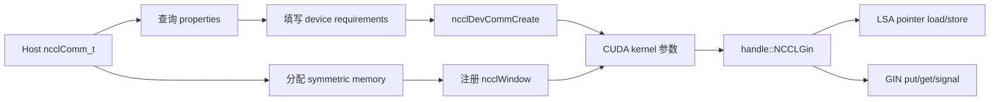
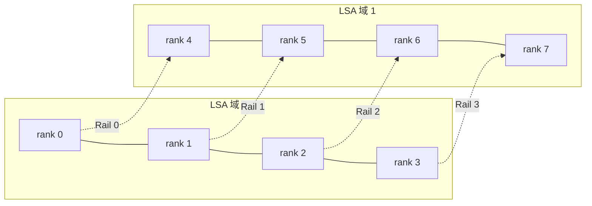
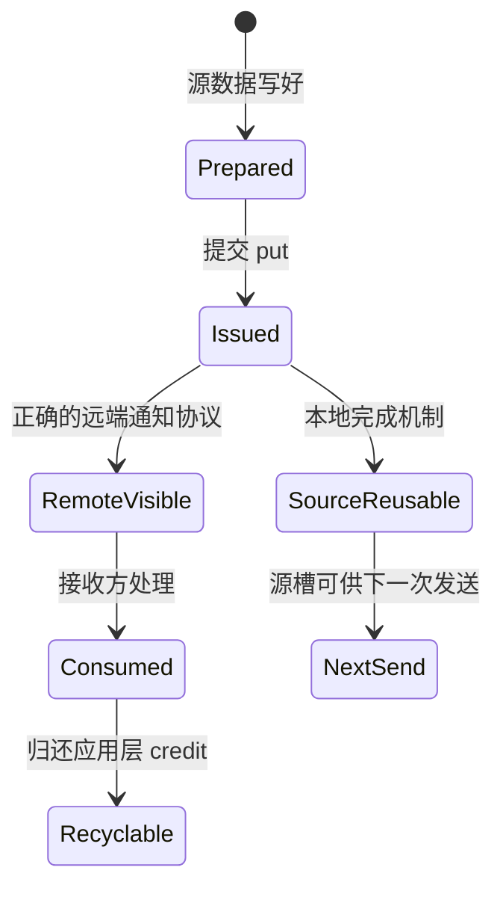
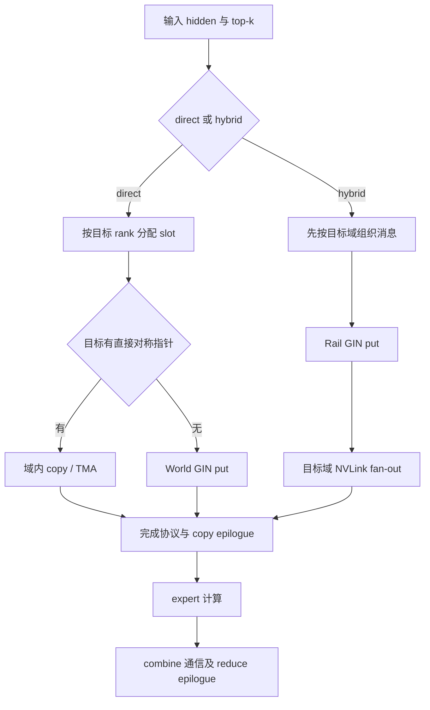

# NCCL Device API 与 GIN：从通信对象到 DeepEP V2

> 基础篇 C · 目标：理解 communicator、window、team、context 和完成语义，沿代码解释 V2 的 direct/hybrid 路径，并知道哪些接口受版本影响。

研究日期：2026-09-23。DeepEP 代码以本地 `01dc3aaac82068020353dce2c302e38153c0bfaa` 源码基线为准；访问时 NCCL 在线文档标识为 **2.31.2**。本篇同时链接 2.30.7 归档，用于核对项目使用的接口。在线最新指南不代表本地二进制已经升级。

[六篇目录](reading-guide.md) · [前置：IBGDA](tutorial-ibgda-principles.md) · [对应实现：V2 Elastic](implementation-v2-elastic.md)

## 1. 从熟悉的 NCCL host collective 出发

常见训练代码在 host 上调用 NCCL collective，由库安排通信 kernel。Device API 则允许自定义 CUDA kernel 使用 NCCL 提供的通信资源。要理解 DeepEP V2，先分清“通信算法由谁组织”和“网络资源由谁提供”：V2 自己编排 token 路由、队列与规约，NCCL 提供 communicator、注册窗口、可访问域及 GIN 接口。[官方入口](https://docs.nvidia.com/deeplearning/nccl/user-guide/docs/usage/deviceapi.html)

这使通信可以和 routing、pack、TMA、reduce 放进同一套设备端执行流程，但不会自动消除所有 SM 成本。V2 的 resource 估算、warp 分工与 epilogue 仍然需要阅读实际代码。

## 2. 三种实现抽象放在同一张表

| 层次 | V1 normal | V1 Low-Latency | V2 Elastic |
|---|---|---|---|
| 应用入口 | `Buffer.dispatch/combine` | `low_latency_dispatch/combine` | `ElasticBuffer.dispatch/combine` |
| 地址模型 | IPC peer pointer + NVSHMEM heap | 全局 PE 的 heap + P2P bypass | NCCL window + offset + team peer |
| 网络接口 | DeepEP IBGDA helper | 同一个 IBGDA helper | `handle::NCCLGin` 封装 |
| 队列粒度 | channel/chunk/ring | expert/source 固定槽 | direct 或 hybrid 的 slot、队列与 context |
| GPU 调度 | 常驻通信 blocks | SEND/RECV 可拆 | 主通信 kernel 与 epilogue |
| 集成方向 | 吞吐优化 | decode overlap | 统一 EP 模式与更灵活拓扑 |

本表依据三篇本地实现解析及对应源码。GIN 不等于 NVSHMEM IBGDA：API 与资源管理不同，底层却可以采用相关的 GPU 驱动 NIC 技术。接口抽象与物理后端应分别研究。

## 3. 核心对象：先看 host，再看 device



| 对象 | 在项目中负责什么 | 阅读位置 |
|---|---|---|
| host communicator | rank/world、bootstrap 和资源生命周期 | [`nccl.cu`](../csrc/kernels/backend/nccl.cu#L26) |
| device communicator | kernel 可用的团队与通信资源 | [`nccl.cu`](../csrc/kernels/backend/nccl.cu#L82) |
| window | 已注册地址范围及设备映射 | [`nccl.cu`](../csrc/kernels/backend/nccl.cu#L129) |
| team | peer 编号的坐标域 | [`handle.cuh`](../deep_ep/include/deep_ep/common/handle.cuh#L11) |
| context | GIN 操作使用的资源上下文 | [`NCCLGin` 构造](../deep_ep/include/deep_ep/common/handle.cuh#L25) |
| signal/counter | 远端通知与本地完成相关状态 | [`comm.cuh`](../deep_ep/include/deep_ep/common/comm.cuh#L129) |

## 4. 源码精读一：能力查询和资源申请

来自 [`NCCLSymmetricMemoryContext`](../csrc/kernels/backend/nccl.cu#L82)，省略失败信息与个别资源字段：

```cpp
ncclCommProperties props = NCCL_COMM_PROPERTIES_INITIALIZER;
NCCL_CHECK(ncclCommQueryProperties(comm, &props));
ncclDevCommRequirements_t reqs = NCCL_DEV_COMM_REQUIREMENTS_INITIALIZER;
if (num_ranks > 1 and get_env("EP_DISABLE_GIN", 0) == 0) {
    // ... 检查 props.ginType 或 props.railedGinType ...
    reqs.ginContextCount = num_allocated_qps;
    reqs.ginExclusiveContexts = true;
    reqs.ginQueueDepth = kGinQPDepth;
    reqs.ginTrafficClass = sl_idx;
    reqs.ginSignalCount = num_ranks + 2 * 2;
    reqs.ginConnectionType = allow_hybrid_mode
        ? NCCL_GIN_CONNECTION_RAIL : NCCL_GIN_CONNECTION_FULL;
}
```

`props` 回答系统提供什么，`reqs` 描述 kernel 要用什么。context count 与信号数量必须覆盖实际 kernel 的使用范围。`ginExclusiveContexts` 表达资源共享要求；不能把增加 context 当作没有成本的调参。

`EP_DISABLE_GIN` 跳过申请，不提供另一套跨节点算法。`allow_hybrid_mode` 会同时影响拓扑、peer 坐标与连接类型；在不支持 FULL 可达性的网络上直接关闭 hybrid，可能初始化失败。

### 4.1 编译版本与运行版本

同一文件中的 `#if NCCL_VERSION_CODE >= NCCL_VERSION(2, 31, 0)` 分支设置 `useRuntimeVersion` 并按运行时尺寸分配 device communicator；旧分支检查编译与运行 NCCL 版本相同。这个分支是项目做的兼容处理，不是所有 device kernel 任意跨版本兼容的证明。[实际代码](../csrc/kernels/backend/nccl.cu#L99)

升级实验至少记录 host 编译头文件、device 编译/JIT 使用头文件、加载的 `libnccl` 和缓存是否重建。GIN 内部结构被直接访问时，尤其要复核这些边界。

## 5. 源码精读二：注册窗口和对称偏移

项目先分配自己的 symmetric memory，再注册窗口，而非直接复制官方示例的分配方式。[源码](../csrc/kernels/backend/nccl.cu#L129)

```cpp
this->symmetric_memory = symmetric::alloc(
    num_bytes - num_cpu_bytes, num_cpu_bytes,
    allow_hybrid_mode, num_scaleup_ranks, scaleout_rank_idx,
    cpu_comm);
raw_window_ptr = this->symmetric_memory->ptr;
NCCL_CHECK(ncclCommWindowRegister(
    comm, raw_window_ptr, this->symmetric_memory->num_bytes,
    &window, NCCL_WIN_STRICT_ORDERING));
NCCL_CHECK(ncclGetLsaDevicePointer(window, 0, nvl_rank_idx,
                                &mapped_window_ptr));
```

第一段区分 GPU 与 CPU 容量；第二段让窗口覆盖实际分配区；第三段获取当前 LSA 视角的映射。项目注释说明 window registration 是 collective，所以必须协调各 rank 的调用顺序。

`NCCL_WIN_STRICT_ORDERING` 与项目使用的 VA signal 有关联，但它不会自动给任意裸指针写提供应用层完成协议。通信正确性还依赖后文的 put、通知和等待。

## 6. World、LSA、Rail 与 FULL/RAIL

DeepEP 从 NCCL 的 LSA 大小计算物理域：`num_rdma_ranks = num_ranks / num_nvl_ranks`。这里的前者表示域的数量，不是 NIC 的数量。[源码](../csrc/kernels/backend/nccl.cu#L49)

以下用 2 个域、每域 4 个 rank 做教学示例，假定连续 rank 排布满足项目断言：



rank 2 的 LSA peer 1 是全局 rank 1；在它的 rail 中，peer 1 则对应全局 rank 6。同一个整数必须带着 team 解读。真实机器是否满足这种排布由初始化查询与断言决定，不能只凭服务器 hostname 推定 LSA。

FULL 允许需要的全互联 peer 路径；RAIL 约束跨域同 rail 通信，域内再 fan-out。V2 direct 将逻辑 scale-up 扩成 world，并按指针可达性选择路径；hybrid 保留两级逻辑域。[逻辑域代码](../csrc/kernels/backend/nccl.cu#L56)

## 7. 源码精读三：一次 GIN put 的参数

[`handle::NCCLGin::put`](../deep_ep/include/deep_ep/common/handle.cuh#L175) 把指针改写成 window offset，主要实参如下：

```cpp
gin.put(TEAM_WORLD_RAIL(),
        dst_rank_idx,
        nccl_window, reinterpret_cast<int64_t>(recv_sym_ptr) - lsa_base_ptr,
        nccl_window, reinterpret_cast<int64_t>(send_sym_ptr) - lsa_base_ptr,
        num_bytes,
        remote_action,
        ncclGin_None(),
        ncclCoopThread(),
        ncclGin_None(),
        cuda::thread_scope_thread,
        cuda::thread_scope_device,
        ncclGinOptFlagsDefault | extra_options);
```

| 参数组 | 代码含义 | 阅读检查点 |
|---|---|---|
| team + peer | 在 world 或 rail 内选择目标 | peer 编号是否属于该 team |
| remote window + offset | 目标在注册区内的位置 | 是否越过 token/slot 边界 |
| local window + offset | NIC 消费的源位置 | source buffer 是否过早复用 |
| bytes | 本次传输长度 | 是否包含 metadata/scale/padding |
| remote action | 数据关联的远端通知 | 默认 `None` 时通知在哪里建立 |
| coop / scope | 参与线程与内存作用域 | 是否真的满足发布前提 |

函数注释提示，通过此 put API 发本地/NVLink 数据也会经过 NIC。V2 为此先尝试 `get_sym_ptr`，对可直接访问的 peer 使用另一条 load/store/TMA 路径。不能认为 `gin.put` 自动等价于最优 NVLink copy。

## 8. 完成语义：用四个问题检查协议

先问：请求是否已提交？再问：源 buffer 是否可复用？随后问：远端 payload 是否可见？最后问：所有参与者是否已到达算法边界？这四件事分别需要证据。

`flush` 对 put 保证本地输入被消费，不承诺远端完成。附着在 put 上的 signal 可用于确认相应数据可见；strong signal 还覆盖同 peer、同 context 的前序 put，weak signal 的覆盖更窄。旧 signal 类型的行为与 communicator 配置有关。[GIN 2.30.7](https://docs.nvidia.com/deeplearning/nccl/archives/nccl_2307/user-guide/docs/api/device_gin.html) · [GIN 当前参考](https://docs.nvidia.com/deeplearning/nccl/user-guide/docs/api/device_gin.html)

下面是教学状态图，不是替代 API 的可编译代码：



两条分支强调源槽与目标槽有独立生命周期。网络完成也不等于接收端的 GEMM 已结束。设计 ring 时必须让消费者显式归还 credit，不能用发送方的 flush 代替。

## 9. 源码精读四：DeepEP 的自定义 barrier

[`gin_barrier_wo_local_sync`](../deep_ep/include/deep_ep/common/comm.cuh#L129) 将完成协议分成若干阶段：各 warp flush 分配给自己的 context；必要时执行 system fence；grid/CTA 汇合；使用 QP 0 发送 barrier signal；接收方等待每个来源的目标值。

```cpp
for (int i = global_warp_idx; i < num_qps; i += kNumSMs * kNumWarps) {
    ncclGin(nccl_dev_comm, i, NCCL_GIN_RESOURCE_SHARING_CTA)
        .flush(ncclCoopWarp());
}
// ... system fence、grid 同步以及 barrier signal 发布 ...
const auto gdaki = static_cast<struct ncclGinGdakiGPUContext*>(
    gin._ginHandle) + gin.contextId;
```

它随后读取 GDAKI 内部 signals table，并用 `timeout_while` 实现超时诊断。由此可以确认：当前源码的这条等待路径耦合 GDAKI 内部布局。即使 host 只检查 GIN 不为 NONE，也不能直接宣称 Proxy 后端可运行整个 V2。

这一段应当按完整协议审查，特别关注多 context 的 flush、signal 类型和版本保证如何组合。单独摘一句 `flush` 然后写成“所有远端已完成”会丢掉核心条件。研究修改时要一起检查 [`gpu_barrier`](../deep_ep/include/deep_ep/common/comm.cuh#L213) 的首尾同步和调用者资源范围。

## 10. 如何对应 V2 direct 与 hybrid



**Direct：**阅读 [`dispatch.cuh`](../deep_ep/include/deep_ep/impls/dispatch.cuh#L277)。一个 token 先获得目标槽，再按地址可达性选择写法。主路径的 put 可以没有附着 signal，最终以末尾 barrier 等协议完成；不能在图里擅自给每个 put 加 signal。

**Hybrid：**阅读 [`hybrid_dispatch.cuh`](../deep_ep/include/deep_ep/impls/hybrid_dispatch.cuh#L444)。跨域消息通过 rail，目标域内再分发。收益来自减少重复跨域数据与配合网络拓扑，代价包括中间缓冲、队列状态和转发工作。

**Combine：**阅读 [`combine.cuh`](../deep_ep/include/deep_ep/impls/combine.cuh#L121) 与 [`combine_reduce_epilogue.cuh`](../deep_ep/include/deep_ep/impls/combine_reduce_epilogue.cuh)。输入布局和 `allow_multiple_reduction` 决定部分和在哪里形成；尾部 epilogue 把通信区结果规约到用户输出。这不是把 dispatch 箭头倒过来就能解释的过程。

## 11. JIT、TMA 与 stream 如何接上

V2 的 host launcher 把 hidden、拓扑、模式、SM/QP 等转成模板实例。编译缓存减少重复编译，第一次调用成本应与稳态通信性能分开。[JIT 编译器](../csrc/jit/compiler.hpp) · [launch runtime](../csrc/jit/launch_runtime.hpp)

TMA 是数据搬运机制，GIN 是网络通信接口，两者在 staging 和 epilogue 中配合。TMA copy 完成需要相应 barrier/proxy 同步；不能把 CUDA stream 上的 launch 顺序当成 kernel 内全部异步 copy 已完成的证明。具体顺序见 [V2 实现正文](implementation-v2-elastic.md)。

`stream_control_prologue/epilogue` 管理调用者 stream 与通信 stream 的依赖、事件以及 tensor 生命周期。通信完成事件和 PyTorch allocator 的 `record_stream` 解决不同问题：一个决定何时能用结果，另一个防止存储过早回收。[C++ 编排](../csrc/elastic/buffer.hpp)

## 12. 从哪里入门：分三个小实验

| 实验 | 只改变什么 | 先检查什么 | 从哪里读 |
|---|---|---|---|
| LSA 基础 | 小规模域内通信 | pointer/offset 与输出正确性 | `handle.cuh` 的 `get_sym_ptr` |
| direct 对 hybrid | `allow_hybrid_mode`，硬件须支持 | 连接能力、rank 坐标、同路由输出 | `nccl.cu` 与两种 dispatch |
| resource 扫描 | 一次只改变 SM 或 QP | 申请资源不少于使用资源，结果不变 | `elastic.py` 估算和测试参数 |

先看 [官方 Device API 学习入口](https://docs.nvidia.com/deeplearning/nccl/user-guide/docs/usage/deviceapi.html) 的 LSA 示例理解 window，再读本篇代码。之后运行项目现有测试，而不是从复杂 MoE pipeline 开始排障。

以下是已配置 Linux 八 GPU 节点上、仓库根目录的正确性检查示例。参数来自 [测试 parser](../tests/elastic/test_ep.py#L565)：

```bash
python tests/elastic/test_ep.py --num-processes 8 --num-tokens 128 --hidden 7168 --num-topk 6 --num-experts 256 --skip-perf-test --test-first-only
```

它只覆盖选定的首个 case，不是完整回归测试。后续去掉 `--test-first-only` 扩大正确性覆盖，再开启性能测量；比较时固定 token、top-k、expert 分布、dtype、cache 模式和输出布局。

## 13. 六个容易读错的细节

1. **LSA 不等于一台传统服务器。** 它是 NCCL 查询出的可直接访问域，项目按域大小构造逻辑坐标。
2. **context 不应直接理解成一块物理 NIC。** 软件资源索引与硬件映射由后端决定。
3. **`do_cpu_sync=False` 不提供真实 host token 数。** 部分输出尺寸是容量，GPU metadata 才描述有效数据。
4. **GIN `put` 默认没有 remote action。** 必须继续追踪完成通知在哪里发生。
5. **V2 的 low-latency 定位不等于保留 V1 recv hook。** 主 kernel 和 epilogue 的调度方式不同。
6. **新版本官方 API 不自动覆盖旧实现。** 强弱 signal、运行时 communicator 尺寸和私有结构访问都要按版本核对。

以上可在 [V2 完整实现文档](implementation-v2-elastic.md) 的 EPHandle、barrier、代码索引与模式对照章节进一步验证。

## 14. 自测与继续研究

**问：什么时候使用 `ncclTeamTagRail`？** 当算法按同 rail 的跨域连接寻址，且资源申请为对应连接类型时。peer 必须用该 team 的坐标。

**问：为什么发送端 flush 后接收端仍要等待？** flush 的本地完成不足以证明接收端数据已经可见；接收方还要遵守远端通知协议。

**问：如何证明 V2 在目标环境使用哪种 backend？** 结合 properties、初始化日志和实际 kernel 路径；还要检查自定义等待对 GDAKI 的依赖。

**问：如何判断一次优化有效？** 在相同正确性语义与形状下，把 JIT、初始化、steady-state 通信及完整 MoE 迭代分别计时，报告资源和误差范围。

建议阅读顺序：[`nccl.cu`](../csrc/kernels/backend/nccl.cu) → [`handle.cuh`](../deep_ep/include/deep_ep/common/handle.cuh) → [`comm.cuh`](../deep_ep/include/deep_ep/common/comm.cuh) → direct/hybrid kernel → epilogue → [`test_ep.py`](../tests/elastic/test_ep.py)。Host setup 的公共契约见 [NCCL 官方参考](https://docs.nvidia.com/deeplearning/nccl/user-guide/docs/api/device_setup.html)。
