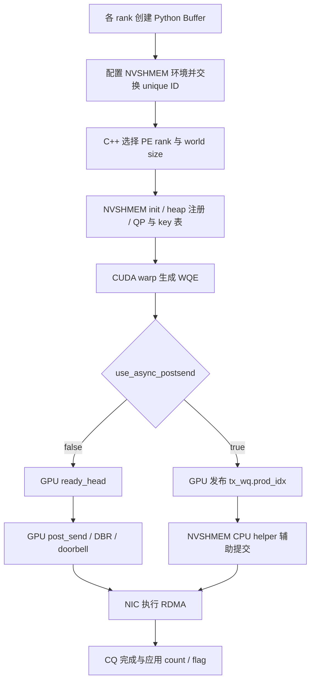
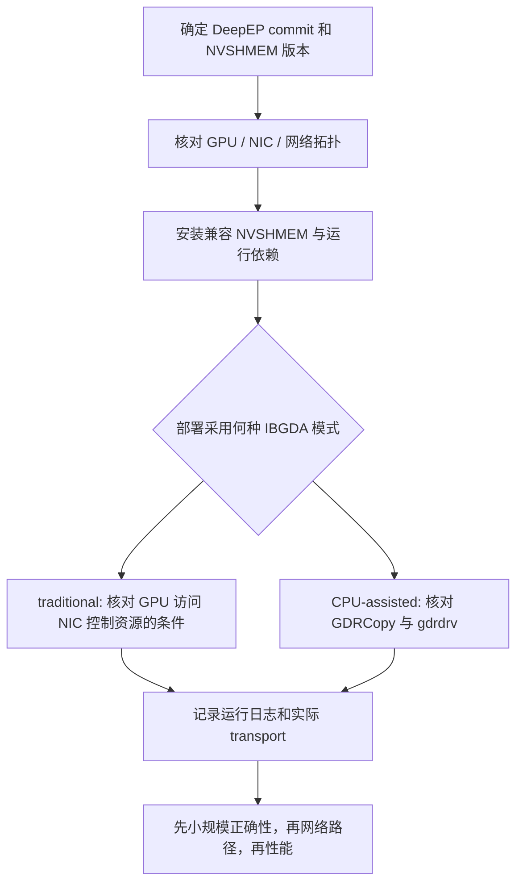

# CPU-assisted IBGDA 与 DeepEP NVSHMEM：原理、部署和实验

> 基础篇 B · 建议在 IBGDA 原理之后阅读 · 目标：理解三种控制面实现，知道 DeepEP 初始化了什么，并能设计有证据的部署检查与对照实验。

研究日期：2026-09-23。项目源码基线：`01dc3aaac82068020353dce2c302e38153c0bfaa`。本篇将 NVIDIA NVSHMEM 3.0 的 CPU-assisted 文章与项目 `docs/nvshmem.md` 合并讲解。配置要求以目标软件版本和机器为准；下文 Linux 命令是供集群执行的教程，编写时没有修改驱动或运行集群测试。

[六篇总目录](reading-guide.md) · [前一篇：IBGDA 原理](tutorial-ibgda-principles.md) · [V1 SM](implementation-v1-sm.md) · [V1 LL](implementation-v1-low-latency.md)

## 1. 为什么还需要 CPU-assisted 模式

traditional IBGDA 需要 GPU 能够访问相应 NIC 控制资源。某些部署无法方便地满足映射或管理配置要求。CPU-assisted 保留 GPU 生成 work request，把 NIC doorbell 辅助交给 CPU，因此可以放宽部分部署限制。这是 NVSHMEM 3.0 引入的中间模式。[NVIDIA 原文](https://developer.nvidia.com/blog/?p=88550)

对 DeepEP 读者最重要的问题是：GPU 是否仍在构造 WQE，以及提交进度由谁推进。只看到 CPU 线程活跃，无法认定系统退回了普通 proxy；同样，设置 `NVSHMEM_IB_ENABLE_IBGDA=1` 也不能单独证明 GPU 正在直接写 doorbell。

## 2. 三种实现的职责对照

| 职责 | 普通 CPU proxy | CPU-assisted IBGDA | traditional IBGDA |
|---|---|---|---|
| GPU 提出通信意图 | 是 | 是 | 是 |
| 生成 NIC work request | CPU transport | GPU | GPU |
| 发布待处理前缀 | proxy 自身队列协议 | GPU 发布 producer index | GPU 发布 ready 前缀 |
| NIC doorbell | CPU | CPU helper | GPU |
| 传输 payload | NIC DMA | NIC DMA | NIC DMA |
| host 初始化 | 仍需要 | 仍需要 | 仍需要 |
| 典型取舍 | 控制面兼容性与 CPU 请求率 | 部署弹性与 helper 延迟 | GPU 直接控制与映射要求 |

此表中 proxy/traditional 的概念来自 [NVIDIA IBGDA 原理](https://developer.nvidia.com/blog/improving-network-performance-of-hpc-systems-using-nvidia-magnum-io-nvshmem-and-gpudirect-async/)，CPU-assisted 职责来自上面的 NVSHMEM 3.0 文章；DeepEP 两分支的代码证据见第 4 节。

## 3. 从初始化到每条消息的代码框图



DeepEP 仓库没有完整 NVSHMEM transport 的 host helper 实现；它提供 GPU helper、NVSHMEM 初始化封装和使用方法。要继续研究 CPU helper 的实际 poll/batch 策略，应下载与目标安装版本一致的 NVSHMEM 源码。不要把 DeepEP 中没出现的 CPU 函数名想象成项目实现。

## 4. 核心代码：分支由状态决定

来自 [`ibgda_submit_requests`](../csrc/kernels/legacy/ibgda_device.cuh#L142)，省略函数签名与局部指针初始化：

```cpp
uint64_t new_wqe_idx = base_wqe_idx + num_wqes;
__threadfence();
unsigned long long int* ready_idx =
    (unsigned long long int*)(state->use_async_postsend
        ? qp->tx_wq.prod_idx : &mvars->tx_wq.ready_head);
while (atomicCAS(ready_idx, base_wqe_idx, new_wqe_idx) != base_wqe_idx)
    ;
if (!state->use_async_postsend) {
    constexpr int kNumRequestInBatch = 4;
    if (kAlwaysDoPostSend or (message_idx + 1) % kNumRequestInBatch == 0)
        ibgda_post_send(qp, new_wqe_idx);
}
```

逐段阅读：`new_wqe_idx` 是本次区间的末尾；`__threadfence` 排序 WQE 写入；CAS 等前驱区间填完。两种模式都需要形成无空洞前缀。区别在于更新哪个位置，以及 GPU 是否调用 `ibgda_post_send`。

`use_async_postsend=true` 时，GPU 仍已写好 WQE，后续由 NVSHMEM 的辅助机制处理 NIC 通知。`false` 时，GPU 在强制提交或消息编号达到批次边界时主动 post。数字 4 来自当前 helper 的批量策略，不是“每个模式固定一次只传 4 个 token”的算法约束。

### 4.1 GPU 直接提交为什么还需要锁

[`ibgda_post_send`](../csrc/kernels/legacy/ibgda_device.cuh#L127) 中有：

```cpp
ibgda_lock_acquire(&mvars->post_send_lock);
old_prod_idx = atomicMax(
    reinterpret_cast<unsigned long long int*>(&mvars->tx_wq.prod_idx),
    new_prod_idx);
if (new_prod_idx > old_prod_idx) {
    ibgda_update_dbr(qp, new_prod_idx);
    ibgda_ring_db(qp, new_prod_idx);
}
ibgda_lock_release(&mvars->post_send_lock);
```

多个执行者共享 QP 时，先保护 doorbell 更新，再通过 `atomicMax` 防止提交位置倒退。CAS 发布解决“WQE 是否填完”，post-send lock 解决“谁更新 NIC 通知”；它们承担不同职责。若性能分析看到这里有竞争，应先检查 QP 映射与并发粒度，再决定是否增加 QP。

## 5. Python 初始化：环境变量不是孤立开关

[`legacy.py:105`](../deep_ep/buffers/legacy.py#L105) 的节选：

```python
if self.runtime.get_num_rdma_ranks() > 1 or low_latency_mode:
    assert num_qps_per_rank > 0
    os.environ['NVSHMEM_DISABLE_P2P'] = '0' if allow_nvlink_for_low_latency_mode else '1'
    os.environ['NVSHMEM_IB_ENABLE_IBGDA'] = '1'
    os.environ['NVSHMEM_IBGDA_NUM_RC_PER_PE'] = f'{num_qps_per_rank}'
    self.nvshmem_qp_depth = int(os.environ.get('NVSHMEM_QP_DEPTH', '1024'))
    os.environ['NVSHMEM_QP_DEPTH'] = str(self.nvshmem_qp_depth)
    # ... 其他环境变量与 unique ID 交换 ...
```

这些赋值发生在 NVSHMEM 初始化之前。代码会覆盖其中一些环境变量，因此 shell 中的设置不一定就是最终值。当前项目没有在这里固定 `NVSHMEM_IBGDA_NIC_HANDLER`，具体 handler 模式需要结合所安装 NVSHMEM 的配置与运行日志确认。[NVSHMEM 环境变量参考](https://docs.nvidia.com/nvshmem/api/latest/gen/env.html)

| 项目设置 | 源码行为 | 研究时要记录什么 |
|---|---|---|
| `NVSHMEM_IB_ENABLE_IBGDA=1` | 请求启用 IBGDA | transport 是否真正启用及其 handler |
| `NVSHMEM_IBGDA_NUM_RC_PER_PE` | 由构造参数写入 | 每 PE 连接资源与 local expert 数 |
| `NVSHMEM_QP_DEPTH` | 从环境读值，缺省 1024 | 消息在途规模与 WQE 拆分 |
| `NVSHMEM_DISABLE_P2P` | 由允许 NVLink 的选项决定 | 是否强制网络，避免错误对比 |
| `NVSHMEM_CUMEM_GRANULARITY` | 固定为 `2**29` | heap 分配/注册粒度及显存容量 |
| `NVSHMEM_DISABLE_NVLS` | 固定为 1 | 此 legacy 初始化路径不用 NVLS |

normal 的纯单节点构造且 `low_latency_mode=False` 不进入该分支；为兼容 LL 而启用此标志的单节点 Buffer 会初始化 NVSHMEM，但一次 normal intranode 调用的数据路径仍是 IPC/NVLink。

## 6. C++ bootstrap 和 symmetric heap

[`nvshmem::init`](../csrc/kernels/backend/nvshmem.cu#L46) 的主干：

```cpp
nvshmemx_uniqueid_t root_unique_id;
nvshmemx_init_attr_t attr;
std::memcpy(&root_unique_id, root_unique_id_val.data(), sizeof(nvshmemx_uniqueid_t));
nvshmemx_set_attr_uniqueid_args(rank, num_ranks, &root_unique_id, &attr);
nvshmemx_init_attr(NVSHMEMX_INIT_WITH_UNIQUEID, &attr);
```

unique ID 让各进程加入同一通信组；它不携带每个 token 的路由。后面的 team split 与 barrier 用于建立通信域并等待就绪。分配封装 [`nvshmem::alloc`](../csrc/kernels/backend/nvshmem.cu#L23) 调用 `nvshmem_align(alignment, size)`。

[`Buffer::sync`](../csrc/legacy/buffer.hpp#L255) 决定 normal 与 LL 的 PE 坐标，分配 RDMA buffer 并清零。调用者必须让组内进程按一致顺序执行初始化和相关 collective。一个 rank 因显存错误提前退出，其他 rank 卡在 barrier 只是后果，最早失败的 rank 才提供原因。

## 7. 官方部署路线怎样阅读

本地 [NVSHMEM 安装说明](nvshmem.md) 指明 legacy 使用 NVSHMEM 3.3.9 或更新兼容版本，并给出 traditional 驱动配置与 GDRCopy CPU-assisted 两条启用方式。版本数字属于这份源码基线的要求；部署时仍应核对目标 DeepEP 与 NVSHMEM 的配套版本。[上游说明](https://github.com/deepseek-ai/DeepEP/blob/main/docs/nvshmem.md)



### 7.1 traditional 路线

项目文档给出的 driver 选项为 `NVreg_EnableStreamMemOPs=1` 和 `PeerMappingOverride=1`，并要求相应系统配置生效。它们属于系统部署，不能在 Python 中通过普通环境变量等价替代。具体写入、initramfs 更新和重启步骤请按 [原安装说明](nvshmem.md#21-configure-nvidia-driver) 及集群维护流程操作。

### 7.2 CPU-assisted 路线

项目指向 GDRCopy 安装和 `gdrdrv` 加载。CPU 辅助的职责是通知 NIC，payload 依然由 NIC 传输。helper 的调度和 CPU 亲和性可能影响小消息延迟；这是待测因素，不应预先假定所有平台都会慢某个固定百分比。[项目对应章节](nvshmem.md#22-install-gdrcopy-and-load-the-gdrdrv-kernel-module)

### 7.3 路径、链接与运行库

在 Linux shell 中，`NVSHMEM_DIR` 指向安装前缀，库和工具目录需要可发现。下面是模板，替换为实际安装目录：

```bash
export NVSHMEM_DIR=/opt/nvshmem
export LD_LIBRARY_PATH="${NVSHMEM_DIR}/lib:${LD_LIBRARY_PATH}"
export PATH="${NVSHMEM_DIR}/bin:${PATH}"
nvshmem-info -a
```

`nvshmem-info -a` 能帮助核对安装信息，但不能独立证明 DeepEP 正在使用哪条数据路径。还要检查 Python 加载的扩展、实际动态库、初始化日志、P2P 设置和真实跨节点测试。

## 8. 分层检查：每一步回答一个问题

下面命令用于已配置的 Linux GPU 节点；工具不存在时记录缺项，不把缺少工具误判成硬件故障。

```bash
nvidia-smi
nvidia-smi topo -m
ibv_devinfo
nvshmem-info -a
lsmod | grep -E 'gdrdrv|nvidia_peermem'
python -c "import torch, deep_ep; print(torch.__version__, torch.version.cuda); print(deep_ep.__file__)"
```

| 检查层 | 看什么 | 不足以证明什么 |
|---|---|---|
| GPU/驱动 | 可见设备与驱动版本 | NIC 能注册和访问 GPU 内存 |
| GPU-NIC 拓扑 | PCIe/NUMA/NVLink 关系 | 实际流量走哪条链路 |
| RDMA 设备 | 端口、设备、链路状态 | 应用正确选择 HCA 与 PE |
| NVSHMEM 安装 | 实际版本和配置 | kernel 的 put 已成功执行 |
| Python 扩展 | 导入位置和 CUDA 版本 | 编译/运行库完全兼容 |
| 最小端到端测试 | 真实 rank、数据校验与日志 | 大规模稳定性与最佳性能 |

缺少 `nvidia_peermem` 不自动意味着所有 GPUDirect RDMA 都不可用：一些环境采用 DMA-BUF；必须结合实际注册方式判断。本节不提供通用的一键驱动修复命令。

## 9. 怎样开始运行项目测试

先读取 [LL 测试参数](../tests/legacy/test_low_latency.py#L318)、[normal internode 参数](../tests/legacy/test_internode.py#L374) 和测试中的进程组初始化方法。以下是仓库根目录、单机八 GPU、已安装所有依赖的示例：

```bash
python tests/legacy/test_low_latency.py --num-processes 8 --num-tokens 128 --hidden 7168 --num-topk 8 --num-experts 288
```

同形状的 `--disable-nvlink` 可用于研究网络路径，但它会改变拓扑路径和负载，不能把变化全部归因于 IBGDA handler。跨节点运行需按项目测试采用的 launcher/环境变量组织各节点；不要只把 `--num-processes` 改成总 GPU 数就当成完整多节点启动命令。

先记录正确性是否通过，再记录吞吐。测试里的 shrink/pressure 分支用于更深入的故障与重用研究，应在基础路径工作后阅读。没有真实 IB 集群时，可以完成源码追踪和地址练习，但不要生成虚构 benchmark 数字。

## 10. 一个可复现的研究工作流

问题示例：**小 batch 的 p99 延迟是否受 CPU-assisted helper 调度影响？** 这不是由源码直接给出的结论，而是可检验的假设。

| 环节 | 具体做法 | 产物 |
|---|---|---|
| 固定版本 | commit、CUDA、NVSHMEM、驱动、NIC 固件、编译参数 | 环境清单 |
| 验证 treatment | 日志确认实际 handler，固定 P2P 设置 | 两组配置证据 |
| 控制变量 | 相同 token/top-k/hidden、rank 数、路由分布 | 实验矩阵 |
| 测量 | warmup 后多次采样，分开 CUDA kernel 与完整迭代 | 原始样本和计时定义 |
| 分析 | p50/p95/p99、均值及离散度；检查 CPU 与 GPU 重叠 | 图表及不确定性 |
| 复核 | 调换实验顺序、复跑不同日期或节点 | 稳定性说明 |

若 traditional 模式在目标环境不可用，应报告无法完成该组实验。不能把“禁用 NVLink”或“减少 QP”替代成 traditional 与 CPU-assisted 的比较。

## 11. 故障现象与源码落点

| 现象 | 优先检查 | 项目代码证据 |
|---|---|---|
| 初始化卡住 | 最早失败 rank、组成员、unique ID、显存分配 | [`nvshmem.cu`](../csrc/kernels/backend/nvshmem.cu#L46) |
| expert QP 断言 | local expert 数与 RC-per-PE | [`internode_ll.cu`](../csrc/kernels/legacy/internode_ll.cu#L285) |
| count 永不到 | payload/通知分支、peer mapping、masked rank | [`internode_ll.cu`](../csrc/kernels/legacy/internode_ll.cu#L323) |
| 第一次正常，重复错误 | ping-pong 清理、recv hook 是否完成、buffer 复用 | [`LowLatencyLayout`](../csrc/legacy/config.hpp#L102) |
| 错误数值但不超时 | 地址 offset、dtype/scale、source token 反向索引 | [`internode_ll.cu`](../csrc/kernels/legacy/internode_ll.cu#L978) |
| 吞吐好但端到端慢 | 常驻 SM、HBM 争用、CPU sync、缺少有效 overlap | [两种 V1 实现对比](implementation-v1-low-latency.md#1-与-v1-normalsm-方案的区别) |

排障时先区分“初始化资源失败”“网络提交失败”“通知协议失败”“后处理语义错误”。调大 timeout 只能改变等待时长，不能修复丢失通知或 rank 分歧。

## 12. 学习顺序与验收题

第一轮只读第 1–4 节，能够指出 CPU-assisted 中 GPU 和 CPU 各自做什么。第二轮读第 5–8 节，从 Python 构造跟到 C++ bootstrap，写出最终环境与 PE 坐标。第三轮按照第 9–10 节设计实验，最后再阅读完整 LL kernel。

**题 1：当前 DeepEP 是否强制 `NVSHMEM_IBGDA_NIC_HANDLER=gpu`？** 没有；代码显式启用 IBGDA，但 handler 需运行证据确认。

**题 2：GPU 发布 producer index 后就能覆盖源 payload 吗？** 不能由这一个动作推出。发布请求与 NIC 消费源 buffer 是不同事件，需要完成机制和上层生命周期约束。

**题 3：CPU-assisted 是否仍能存在 LL 的后台 RDMA 窗口？** 从调度结构看可以：SEND 返回后等待 RECV 的间隔仍存在；实际 overlap 收益需考虑 helper 延迟与资源竞争。

**题 4：为什么配置教程也必须读 CUDA？** 环境决定 transport 是否可用，CUDA 分支决定这一次消息到底走 P2P 还是网络，以及用哪个 QP 发通知。

## 13. 延伸阅读

- [IBGDA 从消息到 NIC](tutorial-ibgda-principles.md)：补全地址、WQE、CQ 的细节。
- [V1 SM 实现](implementation-v1-sm.md)：观察同一 IBGDA 如何服务 ring、credit 与 NVLink forwarding。
- [V1 LL 实现](implementation-v1-low-latency.md)：观察固定 buffer、负 count、hook、zero-copy 与 LogFMT。
- [NCCL Device API 与 GIN](tutorial-nccl-device-gin.md)：比较 V2 的 window/team/context 抽象。

本篇原理证据来自 NVIDIA 文章，部署入口来自项目安装说明，代码解释来自本地固定源码。通过这种分工，可以在升级依赖后明确知道哪一部分需要重新验证。
